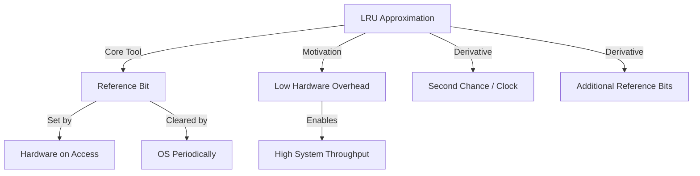

+++
weight = 406
title = "406. LRU 근사 알고리즘 (LRU Approximation)"
+++

## 핵심 인사이트 (3줄 요약)
> 1. **본질**: LRU 근사 알고리즘(LRU Approximation)은 순수 LRU 구현에 필요한 막대한 하드웨어 오버헤드를 줄이기 위해, 참조 비트(Reference Bit)를 활용하여 '최근 사용 여부'만을 간접적으로 확인하는 기법이다.
> 2. **메커니즘**: 각 페이지에 할당된 1비트의 참조 비트를 통해 일정 기간 동안 페이지가 호출되었는지를 기록하고, 교체 시 이 비트가 0인(참조되지 않은) 페이지를 우선 선정한다.
> 3. **가치**: 완벽한 정확도는 포기하되 시스템 전체의 처리 성능을 보장하는 '실용적 타협'의 결과물로, 현대 범용 운영체제의 메모리 관리 핵심 전략으로 자리 잡고 있다.

---

### Ⅰ. 개요 (Context & Background)

- **概念**: **LRU 근사 알고리즘 (LRU Approximation)**은 순수 LRU의 성능적 이점을 유지하면서 구현 비용을 획기적으로 낮춘 알고리즘군을 통칭한다. 정밀한 '시간 기록' 대신 '참조 여부'라는 단순한 정보만 사용한다.

- **💡 비유**: 이것은 **"출입 명부 대신 도장 찍기"**와 같다. 도서관 이용자들의 정확한 입퇴실 시간을 기록하는 대신(Pure LRU), 오늘 하루 동안 이 책을 누군가 빌려갔었는지 표시하는 '도장' 하나만 확인하여(Approximation) 도장이 안 찍힌 책부터 정리하는 것과 같다.

- **등장 배경**:
  1. **하드웨어 제약**: 매 메모리 참조 시마다 카운터를 갱신하는 것은 CPU 사이클 낭비가 너무 심했다.
  2. **실용주의**: "가장 오랫동안" 안 쓴 것을 찾는 것보다, "최근에 안 쓴 것 중 하나"를 찾는 것만으로도 충분히 좋은 성능을 낸다는 사실을 발견했다.

- **📢 섹션 요약 비유**: 완벽한 1등을 가려내기보다, '낙제자 군단'에서 한 명을 골라내는 효율적인 필터링 시스템입니다.

---

### Ⅱ. 아키텍처 및 핵심 원리 (Deep Dive)

#### 참조 비트 기반 LRU 근사 메커니즘 (ASCII Diagram)

```text
  [ Page Table Entry Structure ]
  ┌──────────┬──────────┬───────────────┬──────────┐
  │ Page No. │ Frame No.│ Reference Bit │ Other... │
  └──────────┴──────────┴───────┬───────┴──────────┘
                                │
          ┌─────────────────────┴─────────────────────┐
          ▼                                           ▼
  [ CPU Accesses Page ]                   [ OS/Timer Resets Bit ]
  - Hardware sets bit to 1                - Periodically clears bit to 0
  - Indicates "Recently Used"             - Helps distinguish "New" vs "Old"
```

**[다이어그램 해설]**
1. 처음 모든 페이지의 참조 비트는 0이다.
2. CPU가 페이지를 참조하면 하드웨어가 자동으로 비트를 1로 바꾼다.
3. 일정 시간이 지나면 OS가 다시 0으로 초기화할 수도 있다.
4. 교체가 필요할 때, 비트가 0인 페이지는 "최근에 아무도 안 쓴 페이지"이므로 교체 1순위가 된다.

#### 주요 근사 기법 종류 (표)

| 기법 명칭 | 작동 원리 | 비유 |
|:---|:---|:---|
| **Additional-Reference-Bits** | 8비트 정도의 기록계를 두고 주기적으로 Shift 연산 | 최근 사용 이력을 숫자로 기록 |
| **Second-Chance (Clock)** | 원형 큐를 돌며 비트가 1이면 0으로 바꾸고 기회를 한 번 더 줌 | "한 번은 봐준다"는 자비로운 규칙 |
| **Enhanced Second-Chance** | 참조 비트와 변경 비트(Dirty)를 함께 고려 | "일이 많은 사람(Dirty)"은 더 보호함 |

- **📢 섹션 요약 비유**: 학생들에게 '최근 공부 여부' 스티커를 붙여주고, 스티커가 없는 학생부터 상담실로 부르는 효율적인 관리법입니다.

---

### Ⅲ. 융합 비교 및 다각도 분석

#### 순수 LRU vs LRU 근사

| 비교 항목 | 순수 LRU (Pure) | LRU 근사 (Approximation) |
|:---|:---|:---|
| **정확도** | 완벽함 (순서 보장) | 높음 (군집 보장) |
| **하드웨어 지원** | 특수 카운터/스택 필요 | 표준 참조 비트만 필요 |
| **교체 속도** | 느림 (전체 탐색/정렬 필요) | 매우 빠름 (비트 확인만 수행) |
| **실제 사용** | 거의 없음 | 대부분의 OS에서 채택 |

- **📢 섹션 요약 비유**: 모든 사람의 키를 cm 단위로 재서 줄 세우는 것(순수)과, '키 큰 편', '작은 편'으로만 나누는 것(근사)의 속도 차이입니다.

---

### Ⅳ. 실무 적용 및 기술사적 판단

#### 기술사적 관점: 실용적 타협의 미학
컴퓨터 공학에서 'Approximation(근사)'은 실패가 아니라 '최적화'의 다른 이름이다. 기술사는 순수 LRU의 논리적 완벽함보다, 실제 시스템 환경에서 발생하는 인터럽트와 컨텍스트 스위칭 비용을 고려했을 때 근사 알고리즘이 왜 더 우수한지를 설명할 수 있어야 한다. 특히 현대의 거대한 메모리 공간에서 모든 페이지의 참조 시간을 관리하는 것은 불가능에 가깝기에, 비트 연산 기반의 근사는 필연적인 선택이다.

- **📢 섹션 요약 비유**: 99%의 성능을 위해 100배의 비용을 쓰는 것보다, 90%의 성능을 1%의 비용으로 얻는 것이 훌륭한 엔지니어링입니다.

---

### Ⅴ. 기대효과 및 결론

#### LRU 근사 알고리즘의 효과
1. **오버헤드 최소화**: 페이지 참조 시 발생하는 부하를 거의 0에 가깝게 유지한다.
2. **현실적 성능 확보**: 순수 LRU와 성능 차이가 미미하면서도 안정적인 메모리 관리가 가능하다.
3. **유연한 확장**: 비트 수를 늘리거나 다른 플래그와 조합하여 더 정교한 정책(예: Modified Bit 조합)으로 발전할 수 있다.

- **📢 섹션 요약 비유**: 적은 비용으로 최대의 효과를 내는, 가성비 최고의 스마트한 메모리 정리 전략입니다.

---

### 📌 관련 개념 맵
- **참조 비트 (Reference Bit)**: 근사의 핵심 도구.
- **2차 기회 알고리즘 (Second-Chance)**: 가장 대표적인 근사 구현체.
- **시간 지역성 (Temporal Locality)**: 근사 알고리즘이 여전히 유효한 이유.

---

### 👶 어린이를 위한 3줄 비유 설명
1. LRU 근사는 장난감에 **"오늘 놀았음"**이라는 스티커를 붙여두는 것과 같아요.
2. 상자가 꽉 차면 스티커가 안 붙은 장난감부터 골라서 빼내는 거죠.
3. 언제 놀았는지 시계로 일일이 적는 것보다, 스티커만 확인하는 게 훨씬 빠르고 편하답니다!

---

### 🚀 지식 그래프 (Knowledge Graph)

