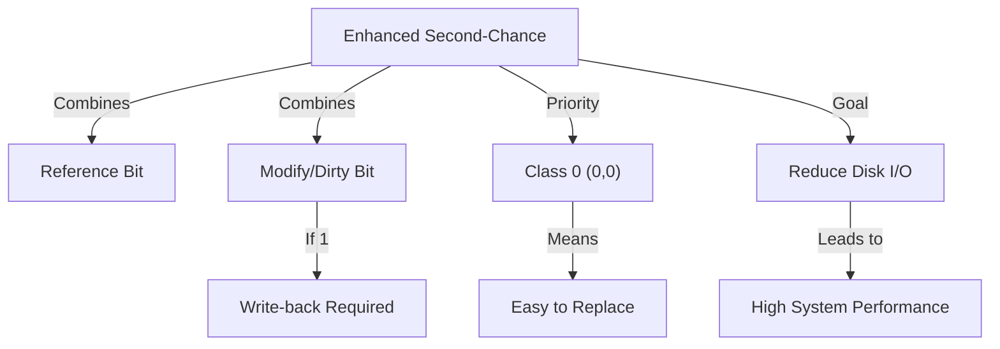

+++
weight = 408
title = "408. 개선된 2차 기회 알고리즘 (Enhanced Second-Chance Algorithm)"
+++

## 핵심 인사이트 (3줄 요약)
> 1. **본질**: 개선된 2차 기회 알고리즘(Enhanced Second-Chance Algorithm)은 참조 비트(Reference Bit)뿐만 아니라 변경 비트(Modify/Dirty Bit)를 함께 고려하여 교체 비용(Disk I/O)을 최소화하는 기법이다.
> 2. **판단 기준**: (참조, 변경)의 4가지 조합을 통해 페이지의 상태를 등급화하며, 최근에 사용되지 않았으면서도 수정되지 않은(즉, 즉시 버릴 수 있는) 페이지를 최우선 교체 대상으로 선정한다.
> 3. **가치**: 데이터 일관성을 유지하면서도 디스크 쓰기 작업(Page-out) 횟수를 줄여 시스템 전체의 I/O 성능과 가상 메모리 효율성을 극대화한다.

---

### Ⅰ. 개요 (Context & Background)

- **概念**: **개선된 2차 기회 알고리즘 (Enhanced Second-Chance)**은 '사용 여부'에 '수정 여부'라는 경제적 관점을 더한 것이다. 페이지를 교체할 때 단순히 오래된 것뿐만 아니라, 내보낼 때 디스크에 다시 써야 하는(Write-back) 수고가 드는지까지 따진다.

- **💡 비유**: 이것은 **"이사 짐 정리"**와 같다. 버릴 물건을 고를 때, 최근에 안 쓴 물건(Ref=0) 중에서도 '먼지만 털면 되는 물건(Dirty=0)'과 '부서져서 수리까지 해서 내놔야 하는 물건(Dirty=1)'이 있다면, 당연히 손이 덜 가는 전자부터 버리는 것이 효율적이다.

- **등장 배경**:
  1. **I/O 비용 절감**: 메모리에서 쫓겨나는 페이지가 수정된 상태라면 디스크에 기록하는 과정이 추가되어 시간이 오래 걸린다.
  2. **성능 최적화**: 쓰기 작업은 읽기 작업보다 비용이 비싸므로, 최대한 '깨끗한(Clean)' 페이지를 찾아내는 것이 유리하다.

- **📢 섹션 요약 비유**: 뒷정리할 일이 없는 사람부터 먼저 퇴장시키는, 철저히 효율 중심의 관리 방식입니다.

---

### Ⅱ. 아키텍처 및 핵심 원리 (Deep Dive)

#### 등급별 교체 우선순위 (ASCII Diagram)

페이지 상태 = (참조 비트, 변경 비트)

```text
  [ Priority Level ]
  ┌──────────┬───────────┬──────────────────────────────────┐
  │ Class    │ (Ref, Mod)│ Description                      │
  ├──────────┼───────────┼──────────────────────────────────┤
  │ Class 0  │   (0, 0)  │ 최근 사용 안 함 & 수정 안 됨 (최고)│
  │ Class 1  │   (0, 1)  │ 최근 사용 안 함 & 수정 됨         │
  │ Class 2  │   (1, 0)  │ 최근 사용 함   & 수정 안 됨       │
  │ Class 3  │   (1, 1)  │ 최근 사용 함   & 수정 됨         │
  └──────────┴───────────┴──────────────────────────────────┘
        ▲                                     ▲
        └────────── [ Scan Sequence ] ─────────┘
```

**[다이어그램 해설]**
1. **Class 0 (0,0)**: 최고의 희생양이다. 나중에 다시 부를 일도 적고, 지금 당장 버려도 디스크에 쓸 필요가 없다.
2. **Class 1 (0,1)**: 조금 아쉽다. 사용은 안 했지만 내용이 바뀌어서 디스크에 쓰는 수고를 해야 한다.
3. **Class 2 (1,0)**: 조만간 또 쓰일 것 같지만, 깨끗한 상태다.
4. **Class 3 (1,1)**: 최악의 희생양이다. 곧 쓰일 것 같기도 하고, 버리려면 디스크 쓰기까지 해야 한다.

#### 작동 프로세스 (표)

| 단계 | 행동 | 비유 |
|:---|:---|:---|
| **1단계 스캔** | (0,0)을 찾는다. 찾으면 교체. | 가장 만만한 상대 찾기 |
| **2단계 스캔** | (0,1)을 찾는다. 비트가 1인 것은 0으로 바꾼다. | 없으면 그나마 나은 상대 찾기 |
| **3단계 스캔** | 다시 1단계부터 반복 (이미 비트가 바뀌어 있음) | 눈높이를 낮춰 재탐색 |

- **📢 섹션 요약 비유**: 청소하기 제일 편한 방부터 순서대로 비우는 영리한 호텔 지배인과 같습니다.

---

### Ⅲ. 융합 비교 및 다각도 분석

#### 기본 2차 기회 vs 개선된 2차 기회

| 구분 | 기본 (Basic) | 개선된 (Enhanced) |
|:---|:---|:---|
| **고려 비트** | 참조 비트 (R) | 참조 비트 (R) + 변경 비트 (M) |
| **핵심 목표** | 최근 사용 페이지 보호 | 교체 비용(Disk I/O) 최소화 |
| **스캔 횟수** | 최대 2회 (한 바퀴) | 최대 4회 (여러 바퀴) |
| **복잡도** | 낮음 | 중간 (다단계 스캔 필요) |

- **📢 섹션 요약 비유**: 단순히 '최근 출석'만 보는 출결 관리와, '출석 + 과제 제출 여부'까지 보는 종합 성적 관리의 차이입니다.

---

### Ⅳ. 실무 적용 및 기술사적 판단

#### 기술사적 관점: I/O 바운드 시스템에서의 강점
현대 컴퓨팅 시스템에서 CPU 속도는 비약적으로 발전했지만 디스크(SSD 포함)의 I/O 속도는 여전히 병목 지점이다. 개선된 2차 기회 알고리즘은 소프트웨어적인 스캔 비용을 조금 더 지불하더라도 하드웨어적인 I/O 횟수를 줄이는 전략을 택한다. 이는 전형적인 **'연산으로 통신(I/O)을 극복'**하는 최적화 기법이다. 대량의 데이터 수정이 빈번한 데이터베이스 시스템이나 대형 서버 OS에서 이 방식이 선호되는 이유이기도 하다.

- **📢 섹션 요약 비유**: 몸을 좀 더 써서(CPU 스캔) 돈을 아끼는(Disk 쓰기 감소) 알뜰한 살림꾼의 선택입니다.

---

### Ⅴ. 기대효과 및 결론

#### 개선된 2차 기회 알고리즘의 성과
1. **페이지 부하 감소**: 수정된 페이지를 메모리에 더 오래 유지함으로써 불필요한 디스크 쓰기 연산을 억제한다.
2. **시스템 처리량(Throughput) 향상**: I/O 대기 시간이 줄어들어 CPU가 더 효율적으로 일할 수 있게 한다.
3. **지능적 우선순위**: 페이지의 '가치'를 다각도로 평가하여 가장 합리적인 희생자를 고른다.

- **📢 섹션 요약 비유**: 단순히 오래된 순서가 아니라, '누구를 보냈을 때 가장 뒷탈이 없을지'를 고민하는 고단수의 자원 관리 전략입니다.

---

### 📌 관련 개념 맵
- **변경 비트 (Modify/Dirty Bit)**: 수정 여부를 나타내는 핵심 플래그.
- **2차 기회 알고리즘 (Clock)**: 이 알고리즘의 근간이 되는 모델.
- **페이지 부재 처리 (Page Fault Handling)**: 교체 시 쓰기 작업이 포함되는 과정.

---

### 👶 어린이를 위한 3줄 비유 설명
1. 개선된 2차 기회 알고리즘은 장난감을 정리할 때, **"방금 놀았는지"**와 **"장난감이 더러워졌는지"** 두 가지를 다 봐요.
2. 안 놀았는데 깨끗하기까지 한 장난감은 그냥 상자에 넣으면 되니까 제일 먼저 정리해요.
3. 더러워진 장난감은 닦아서 넣어야 하니까(디스크 쓰기), 웬만하면 나중에 정리하려고 아껴두는 거랍니다!

---

### 🚀 지식 그래프 (Knowledge Graph)

