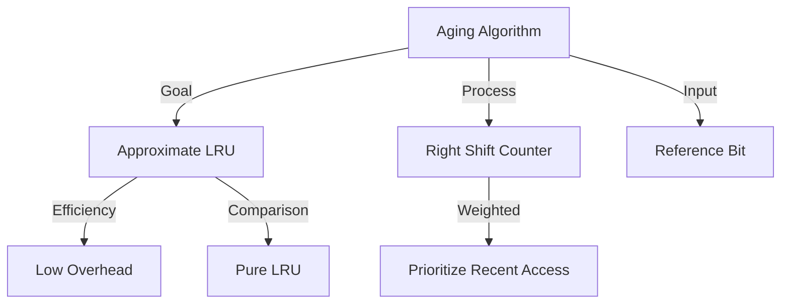

+++
weight = 411
title = "411. 에이징 (Aging) 기반 페이지 교체 로직"
+++

## 핵심 인사이트 (3줄 요약)
> 1. **본질**: Aging 기법은 참조 비트(Reference Bit)를 일정 시간 간격으로 오른쪽으로 시프트(Shift)하여 페이지의 참조 기록을 숫자로 관리함으로써 LRU를 근사하는 알고리즘이다.
> 2. **원리**: 참조 시 카운터의 최상위 비트(MSB)를 1로 설정하고 주기적으로 시프트하여, 시간이 지날수록 과거의 참조 기록이 하위 비트로 밀려나 영향력이 줄어들게(Aging) 만든다.
> 3. **특징**: 순수 LRU 구현에 필요한 하드웨어 오버헤드(스택 등) 없이도 시간 지역성을 효과적으로 반영할 수 있어 실무적인 운영체제 설계에서 널리 활용된다.

---

### Ⅰ. 개요 (Context & Background)

- **概念**: **Aging (에이징)**은 "나이를 먹는다"는 뜻으로, 페이지가 참조된 시점으로부터 시간이 흐름에 따라 그 가중치를 점차 줄여나가는 방식이다. **LRU (Least Recently Used)**를 완벽하게 구현하기 어려운 환경에서 소프트웨어적으로 가장 가깝게 흉내 낸 알고리즘이다.

- **💡 비유**: 이것은 **"신용카드 포인트 소멸제"**와 같다. 최근에 사용한 실적은 포인트가 크게 쌓이지만(MSB 1), 시간이 지나면 포인트 가치가 점점 떨어지다가 결국 소멸되는 것과 비슷하다. 은행은 가장 '최근 실적'이 낮은 고객을 먼저 정리한다.

- **등장 배경**:
  1. **LRU 구현의 한계**: 매 참조마다 스택을 업데이트하거나 타임스탬프를 기록하는 것은 오버헤드가 너무 크다.
  2. **단순 참조 비트의 한계**: Second-Chance 알고리즘은 참조 여부만 알 뿐, "얼마나 최근에" 참조되었는지는 알 수 없다.
  3. **시간 지역성 활용**: 최근에 사용된 페이지가 다시 사용될 확률이 높다는 원칙을 실용적으로 구현하고자 했다.

- **📢 섹션 요약 비유**: 과거의 영광(오래전 참조)은 잊고, 현재의 충실도(최근 참조)를 숫자로 점수화하는 합리적인 평가 시스템입니다.

---

### Ⅱ. 아키텍처 및 핵심 원리 (Deep Dive)

#### Aging 메커니즘 (ASCII Diagram)

```text
  [ Initial State: Counter 8-bit ]
  Page A: 00000000 (Initial)

  [ Step 1: Page A Referenced ]
  Page A: 10000000 (Set MSB to 1)

  [ Step 2: Timer Interrupt (Shift Right) ]
  Page A: 01000000 (Recent reference moves right)

  [ Step 3: Page A Referenced again ]
  Page A: 11000000 (MSB set again)

  [ Step 4: Another Timer Interrupt ]
  Page A: 01100000 (Accumulated history)
```

**[작동 순서]**
1. 각 페이지마다 n-bit(보통 8-bit)의 **참조 카운터**를 할당한다.
2. 페이지가 참조되면 하드웨어가 해당 페이지의 **참조 비트(Reference Bit)**를 1로 만든다.
3. 주기적인 타이머 인터럽트가 발생하면:
   - 카운터를 오른쪽으로 1비트 시프트(Shift Right)한다.
   - 참조 비트 값을 카운터의 **최상위 비트(MSB)**에 삽입한다.
   - 참조 비트를 다시 0으로 초기화한다.
4. 페이지 교체가 필요할 때, **카운터 값이 가장 작은 페이지**를 Victim으로 선정한다.

#### 주요 특징 비교 (표)

| 항목 | Aging (에이징) | Pure LRU |
|:---|:---|:---|
| **구현 방식** | 비트 시프트 + 주기적 업데이트 | 스택 또는 타임스탬프 기록 |
| **정밀도** | 근사치 (시정수 이내 구분 불가) | 완벽함 (순서 100% 보장) |
| **오버헤드** | 낮음 (타이머 시점에만 처리) | 매우 높음 (모든 참조 시 처리) |
| **해상도 문제** | 같은 주기 내 참조 순서 구별 불가 | 무한한 해상도 |

- **📢 섹션 요약 비유**: 매 순간을 기록하는 CCTV 대신, 1시간마다 사진을 찍어 앨범을 정리하는 효율적인 기록 방식입니다.

---

### Ⅲ. 융합 비교 및 다각도 분석

#### Aging의 한계와 극복
1. **해상도 제한**: 만약 8비트 카운터를 쓴다면, 8번의 시프트 주기보다 더 오래전의 기록은 모두 0이 되어 사라진다. 즉, 아주 오래전의 차이는 무시된다.
2. **동률 처리**: 같은 주기 내에 참조된 페이지들은 카운터 값이 같을 수 있다. 이때는 FIFO 등의 보조 수단을 사용한다.
3. **유한한 기억**: 비트 수가 제한되어 있어 "과거의 기억"은 시간이 흐르면 완전히 소멸된다. 하지만 이는 오히려 최신성을 강조하는 LRU 철학에 부합한다.

- **📢 섹션 요약 비유**: 뇌가 모든 것을 기억하지 못하고 중요한 최근 일 위주로 남겨두는 망각의 경제학과 같습니다.

---

### Ⅳ. 실무 적용 및 기술사적 판단

#### 기술사적 관점: Aging의 실무적 가치
현대 운영체제(Linux 등)의 페이지 교체 알고리즘은 Aging의 변형된 형태를 많이 사용한다. 특히 **다중 리스트(Active/Inactive List)**와 결합하여, Aging을 통해 페이지의 '뜨거움(Hotness)'을 측정한다. 기술사는 Aging이 단순히 숫자를 줄이는 것이 아니라, **"참조 빈도(Frequency)와 최근성(Recency)을 하나의 숫자로 융합"**한 지능적인 메커니즘임을 강조해야 한다.

- **📢 섹션 요약 비유**: 이론적인 완벽함보다는 실무적인 가성비를 택한 공학적 지혜의 결정체입니다.

---

### Ⅴ. 기대효과 및 결론

#### Aging 알고리즘의 의의
1. **LRU 실현**: 고비용의 LRU를 저비용으로 안정적으로 구현한다.
2. **성능 균형**: 참조 비트만 쓰는 방식보다 페이지 부재율을 낮추면서도 시스템 부하를 최소화한다.
3. **확장성**: 비트 수를 조절하여 시스템의 메모리 압박 정도에 따라 정밀도를 튜닝할 수 있다.

- **📢 섹션 요약 비유**: 세월의 흐름에 따라 자연스럽게 순위를 매기는, 가장 자연스러운 자원 정리법입니다.

---

### 📌 관련 개념 맵
- **LRU (Least Recently Used)**: Aging의 지향점.
- **참조 비트 (Reference Bit)**: Aging의 원재료.
- **Second-Chance Algorithm**: Aging보다 단순한 근사 기법.

---

### 👶 어린이를 위한 3줄 비유 설명
1. 에이징은 장난감에 **'인기 스티커'**를 붙이는 것과 같아요.
2. 오늘 가지고 놀면 제일 앞에 스티커를 붙이고, 시간이 지나면 스티커를 뒤로 한 칸씩 밀어내요.
3. 스티커가 다 밀려나서 뒤로 떨어져 버린, 가장 오랫동안 안 가지고 논 장난감을 먼저 정리하는 규칙이에요!

---

### 🚀 지식 그래프 (Knowledge Graph)

