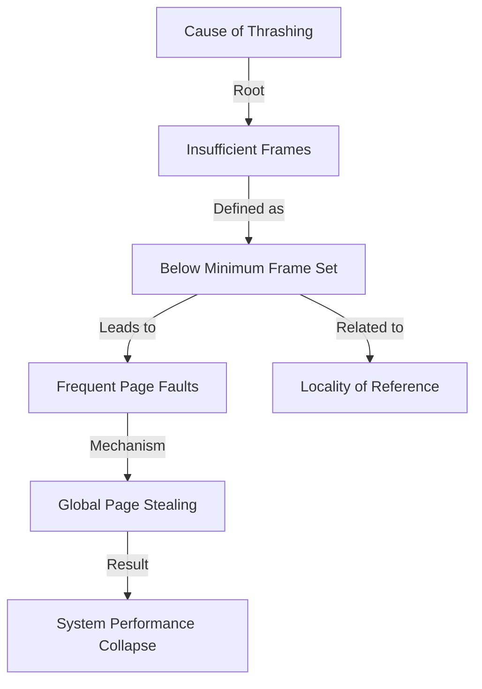

+++
weight = 414
title = "414. 스래싱 원인 - 각 프로세스의 최소 프레임 확보 실패"
+++

## 핵심 인사이트 (3줄 요약)
> 1. **본질**: 스래싱의 근본적 원인은 프로세스가 실행을 위해 참조해야 할 최소한의 페이지 집합(Locality)이 물리 메모리(Frame)에 모두 적재되지 못했기 때문이다.
> 2. **임계치 미달**: 할당된 프레임 수가 프로세스의 현재 작업에 필요한 페이지 수보다 적으면, 매 명령어 실행 시마다 페이지 부재가 발생하여 CPU가 연산보다 I/O 대기에 집중하게 된다.
> 3. **파급 효과**: 한 프로세스의 프레임 부족은 전역 교체 정책과 맞물려 다른 정상적인 프로세스의 자원을 빼앗으며, 결국 시스템 전체의 프레임 부족으로 전이된다.

---

### Ⅰ. 개요 (Context & Background)

- **概念**: **Minimum Frame Set (최소 프레임 세트)**란 특정 명령어 하나를 완벽하게 수행하기 위해 메모리에 동시에 존재해야만 하는 최소한의 페이지 수를 의미한다. 이 선을 지키지 못하면 프로세스는 한 발자국도 앞으로 나아갈 수 없다.

- **💡 비유**: 이것은 **"요리를 위한 최소 재료"**와 같다. 김치찌개를 끓이려면 최소한 김치, 물, 냄비 이 세 가지는 싱크대 위에 있어야 한다. 만약 싱크대가 너무 좁아서 김치를 놓으면 냄비를 치워야 한다면, 영원히 찌개를 완성할 수 없는 것과 같다.

- **발생 배경**:
  1. **과도한 메모리 공유**: 가용 메모리보다 훨씬 많은 프로세스를 수용하려 할 때 발생한다.
  2. **명령어 복잡도**: 간접 참조(Indirect Addressing) 등 하나의 명령어가 여러 페이지를 동시에 건드릴 때 요구량이 증가한다.
  3. **지역성 무시**: 프로그램의 실제 실행 패턴(Locality)을 무시하고 균등하게 프레임을 쪼갤 때 발생한다.

- **📢 섹션 요약 비유**: 생존에 필요한 최소 칼로리도 섭취하지 못한 프로세스가 굶어 죽어가는(마비되는) 상황입니다.

---

### Ⅱ. 아키텍처 및 핵심 원리 (Deep Dive)

#### 최소 프레임 확보 실패의 연쇄 반응 (ASCII Diagram)

```text
  [ Process A ]           [ Physical Memory ]           [ Process B ]
  Req: 5 Pages            Size: 4 Frames                Req: 5 Pages
  (Locality size)                                       (Locality size)
  
       |                       |                             |
       |  (1) Page Fault!      |                             |
       |---------------------->|                             |
       |                       |  (2) Victim Selection       |
       |                       |      (Steal from B)         |
       |                       |<----------------------------|
       |                       |                             |
       |                       |  (3) B also Faults!         |
       |<----------------------|---------------------------->|
       |      [ Constant Paging / Thrashing ]                |
```

**[붕괴 과정]**
1. **수요 > 공급**: 프로세스 A의 지역성(Locality) 크기는 5인데, 할당된 프레임은 2뿐이다.
2. **무한 부재**: A는 페이지 1, 2를 쓰다가 3이 필요해지면 1을 내보낸다. 곧바로 다시 1이 필요해지면 2를 내보낸다.
3. **자원 탈취**: 전역 교체(Global Replacement) 환경에서 A는 자신의 부족분을 채우기 위해 프로세스 B의 페이지를 뺏어온다.
4. **연쇄 붕괴**: B 역시 프레임이 부족해지자 다시 누군가의 것을 뺏는다. 시스템 전체가 '남의 것 뺏기' 전쟁터가 된다.

#### 왜 최소 프레임은 변하는가? (표)

| 요인 | 영향 | 예시 |
|:---|:---|:---|
| **ISA 아키텍처** | 명령어가 참조할 수 있는 최대 페이지 수 결정 | 간접 주소 지정 방식 |
| **지역성 (Locality)** | 실행 시점에 집중적으로 사용되는 데이터 양 | 루프(Loop)문의 크기 |
| **데이터 구조** | 큰 배열이나 리스트 접근 시 요구량 증가 | 2차원 배열 순회 |

- **📢 섹션 요약 비유**: 한 명이라도 배부르게 먹어야 일을 하는데, 모두가 조금씩 굶어서 아무도 일을 못 하는 형국입니다.

---

### Ⅲ. 융합 비교 및 다각도 분석

#### 지역성(Locality) vs 할당 프레임(Allocation)
- **성공 조건**: Σ(Locality_i) < Total Frames
- **실패 조건**: Σ(Locality_i) > Total Frames (스래싱 확정)
- **핵심 통찰**: 단순히 "메모리가 부족하다"가 아니라, "각 프로세스의 핵심 지역성을 담을 그릇이 부족하다"는 것이 문제의 본질이다.

- **📢 섹션 요약 비유**: 컵(메모리)이 작은 게 문제가 아니라, 물(프로세스 요구량)을 너무 많이 부으려 해서 넘치는 것이 문제입니다.

---

### Ⅳ. 실무 적용 및 기술사적 판단

#### 기술사적 관점: 최저 가이드라인 설정
기술사는 스래싱 방지를 위해 다음의 설계 원칙을 제시해야 한다.
1. **아키텍처별 최소 할당량 준수**: 예를 들어 어떤 CPU 명령어는 한 번에 6개의 페이지를 참조할 수 있다면, 최소 6개 이상의 프레임을 강제로 할당해야 한다.
2. **지역성 기반 동적 할당**: 고정 할당보다는 프로세스의 지역성 크기에 맞춘 비례 할당을 수행한다.
3. **Swap-out 결단**: 최소 프레임을 보장할 수 없다면, 아예 실행을 유보시키는 것이 시스템 전체를 살리는 길이다.

- **📢 섹션 요약 비유**: 전력을 다할 수 없는 병사는 후방으로 보내고, 최전방 병사에게 보급을 몰아주는 군대 운용법입니다.

---

### Ⅴ. 기대효과 및 결론

#### 최소 프레임 확보의 의의
1. **실행 보장**: 최소한의 작업 단위가 중단 없이 완료되도록 보장한다.
2. **스래싱 원천 차단**: 지역성 크기를 존중함으로써 시스템의 급격한 성능 저하를 방지한다.
3. **효율적 자원 배분**: 무의미한 프레임 낭비를 줄이고 꼭 필요한 곳에 자원을 집중한다.

- **📢 섹션 요약 비유**: 기초 체력(최소 프레임)이 튼튼해야 마라톤(긴 실행 시간)을 완주할 수 있습니다.

---

### 📌 관련 개념 맵
- **전역 교체 (Global Replacement)**: 스래싱을 전염시키는 통로.
- **지역성 (Locality)**: 프로세스가 요구하는 최소 프레임의 실체.
- **프레임 할당 알고리즘**: 최소 프레임을 분배하는 전략.

---

### 👶 어린이를 위한 3줄 비유 설명
1. 장난감 5개를 다 써야 로봇을 합체할 수 있는데, 상자(메모리)에는 2개만 넣을 수 있어요.
2. 하나를 꺼내면 하나를 다시 넣어야 해서, 합체는 못 하고 하루 종일 장난감을 넣었다 뺐다만 해요.
3. 결국 로봇은 못 만들고 힘만 다 빠지는 상태가 바로 스래싱이랍니다!

---

### 🚀 지식 그래프 (Knowledge Graph)

