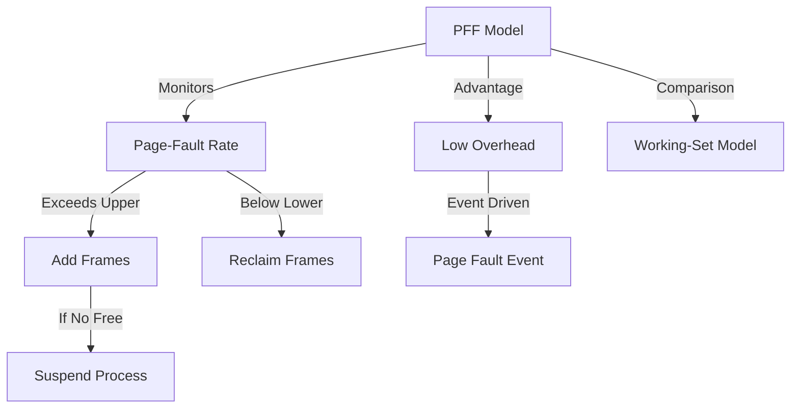

+++
weight = 417
title = "417. 페이지 부재 빈도 (PFF, Page-Fault Frequency) 모델"
+++

## 핵심 인사이트 (3줄 요약)
> 1. **본질**: PFF(Page-Fault Frequency) 모델은 각 프로세스의 페이지 부재율을 직접 모니터링하여, 상한선(Upper Bound)과 하한선(Lower Bound) 사이에서 프레임 할당량을 동적으로 조절하는 기법이다.
> 2. **조절 메커니즘**: 부재율이 상한선을 넘으면 프레임이 부족하다고 판단하여 추가 할당하고, 하한선 아래로 떨어지면 메모리 낭비라고 판단하여 남는 프레임을 회수한다.
> 3. **특징**: 워킹 셋 모델에 비해 구현이 단순하고 직관적이며, 프로세스의 실제 요구량 변화에 즉각적으로 반응하여 스래싱을 효과적으로 억제한다.

---

### Ⅰ. 개요 (Context & Background)

- **概念**: **PFF (Page-Fault Frequency)** 모델은 프로세스가 겪는 페이지 부재의 '속도'에 주목한다. 부재가 너무 자주 일어나면 실행을 못 하고 있는 것이고, 너무 안 일어나면 필요 이상의 자원을 점유하고 있다는 가정에서 출발한다.

- **💡 비유**: 이것은 **"에어컨의 자동 온도 조절(Inverter)"**과 같다. 실내 온도가 설정치보다 높아지면(부재율 상승) 냉방 세기를 키우고(프레임 추가), 너무 차가워지면(부재율 하락) 냉방을 줄여 에너지를 아끼는 것과 같다.

- **장점**:
  1. **직관성**: 페이지 부재라는 명확한 지표를 사용한다.
  2. **오버헤드 감소**: 매 참조마다 계산하는 워킹 셋과 달리, 페이지 부재가 발생했을 때만 할당량을 검토하면 된다.

- **📢 섹션 요약 비유**: 프로세스의 '숨 가쁨' 정도를 체크하여 산소 호흡기(프레임)를 조절하는 응급처치 시스템입니다.

---

### Ⅱ. 아키텍처 및 핵심 원리 (Deep Dive)

#### PFF 제어 로직 (ASCII Diagram)

```text
  Page-Fault Rate
   ^
   | [ Zone A: Too High ]  --> Action: Increase Frames (Allocate more)
   |----------------------- Upper Threshold
   | [ Zone B: Healthy ]   --> Action: Maintain (Keep current)
   |----------------------- Lower Threshold
   | [ Zone C: Too Low ]   --> Action: Decrease Frames (Reclaim unused)
   +------------------------------------------------------------> Time
```

**[작동 순서]**
1. **임계치 설정**: 운영체제는 시스템 성능을 고려하여 상한선(U)과 하한선(L)을 설정한다.
2. **부재 발생**: 프로세스에서 페이지 부재가 발생하면, 이전 부재와의 시간 간격(Inter-fault time)을 측정한다.
3. **상태 판정**:
   - 간격이 너무 짧다(부재율 > U): 프로세스가 고통받고 있으므로 새로운 프레임을 할당해준다. 가용 프레임이 없으면 다른 프로세스를 Swap-out 시킨다.
   - 간격이 너무 길다(부재율 < L): 프로세스가 너무 널널하므로, 마지막 부재 이후 사용되지 않은 페이지들을 회수한다.
4. **최적화**: 이를 통해 모든 프로세스가 '적정한 부재율' 구간에서 실행되도록 유도한다.

#### 주요 정책 비교 (표)

| 정책 | 상태 | 운영체제의 조치 |
|:---|:---|:---|
| **부재율 > 상한선** | 프레임 부족 (Starvation) | 프레임 추가 할당, 부족 시 프로세스 중단 |
| **상한선 > 부재율 > 하한선** | 안정 상태 (Optimal) | 현재 할당량 유지 |
| **부재율 < 하한선** | 프레임 과잉 (Over-allocation) | 안 쓰는 프레임 회수 및 다른 프로세스 지원 |

- **📢 섹션 요약 비유**: 너무 배고프면 밥을 더 주고, 배가 너무 부르면 식단을 조절해주는 건강 관리사입니다.

---

### Ⅲ. 융합 비교 및 다각도 분석

#### 워킹 셋 모델 vs PFF 모델
- **워킹 셋**: 참조 비트와 타이머를 이용해 **'미래에 필요할 것 같은'** 페이지를 미리 유지하려 노력함 (선제적).
- **PFF**: 실제로 발생한 **'페이지 부재의 결과'**를 보고 사후에 대응함 (반응적).
- **실무적 선택**: 구현의 단순함 때문에 PFF 방식이 자원 관리 전략으로 자주 고려된다.

- **📢 섹션 요약 비유**: 일기예보를 보고 우산을 챙기는 것(워킹 셋)과, 비가 오기 시작하면 우산을 펴는 것(PFF)의 차이입니다.

---

### Ⅳ. 실무 적용 및 기술사적 판단

#### 기술사적 관점: 시스템 전체의 관점(Global View)
기술사는 PFF가 개별 프로세스의 최적화에는 뛰어나지만, 시스템 전체 가용 자원이 아예 고갈된 상태에서는 한계가 있음을 지적해야 한다.
1. **Admission Control 연계**: 모든 프로세스가 상한선을 넘겼는데 줄 프레임이 없다면, PFF는 즉시 희생양(Victim Process)을 골라 전체를 Swap-out 시켜야 한다.
2. **임계치 튜닝**: 상/하한선 간격이 너무 좁으면 할당/회수가 빈번해져 오버헤드가 발생하고(Thrashing of allocation), 너무 넓으면 반응 속도가 느려진다.

- **📢 섹션 요약 비유**: 개별 선수의 컨디션 조절도 중요하지만, 팀 전체의 엔트리를 관리하는 감독의 시야가 필요합니다.

---

### Ⅴ. 기대효과 및 결론

#### PFF 모델의 의의
1. **동적 자원 최적화**: 프로그램의 생애 주기(초기화, 연산, 종료)에 따른 메모리 요구량 변화에 유연하게 대응한다.
2. **스래싱의 실질적 억제**: 부재율이라는 명확한 피드백 루프를 통해 시스템 마비를 방지한다.
3. **단순하고 강력함**: 복잡한 계산 없이 타이머와 카운터만으로 구현 가능하여 효율적이다.

- **📢 섹션 요약 비유**: 과하지도 부족하지도 않은 '중용(中庸)'의 미덕을 실천하는 메모리 관리법입니다.

---

### 📌 관련 개념 맵
- **페이지 부재 (Page Fault)**: PFF 모델의 핵심 입력 신호.
- **워킹 셋 (Working Set)**: PFF와 대조되는 동적 할당 모델.
- **스왑 아웃 (Swap-out)**: 자원 고갈 시 PFF가 내리는 최종 결단.

---

### 👶 어린이를 위한 3줄 비유 설명
1. PFF는 친구가 공부하다가 **"모르는 게 너무 자주 생기면"** 도우미 선생님을 한 명 더 보내주는 규칙이에요.
2. 반대로 한 시간 동안 모르는 게 하나도 없으면, 도우미 선생님이 다른 친구를 도와주러 떠나요.
3. 이렇게 하면 모든 친구가 딱 적당하게 도움을 받으며 공부할 수 있답니다!

---

### 🚀 지식 그래프 (Knowledge Graph)

