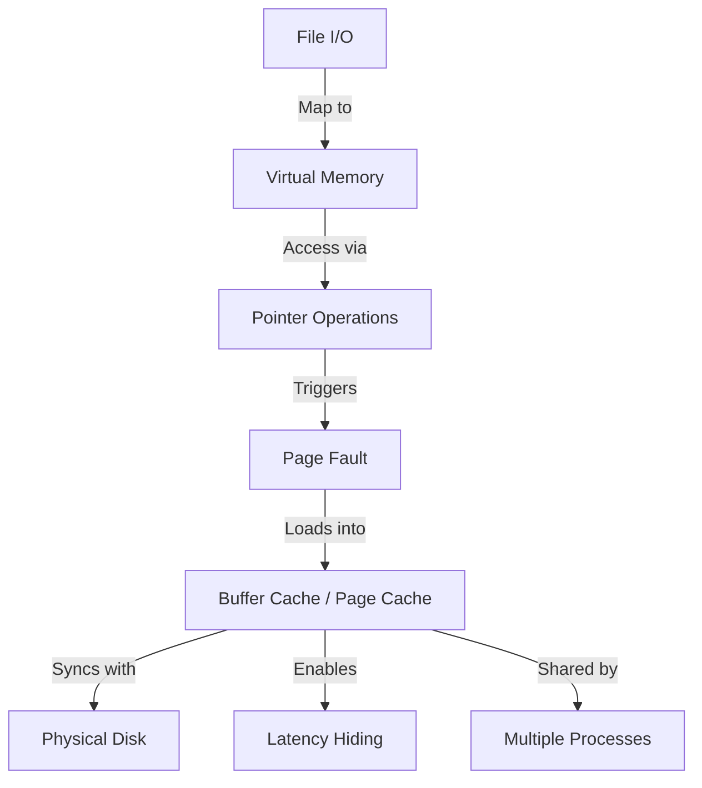

+++
weight = 419
title = "419. 파일 I/O를 메모리 접근으로 변환 및 버퍼 캐시 활용"
+++

## 핵심 인사이트 (3줄 요약)
> 1. **본질**: 파일 I/O를 가상 메모리의 주소 공간에 매핑함으로써, 명시적인 입출력 시스템 콜 없이 메모리 명령어(Load/Store)만으로 데이터를 처리하는 아키텍처적 전환이다.
> 2. **메커니즘**: 매핑된 영역에 대한 접근은 가상 메모리의 페이지 부재(Page Fault) 메커니즘을 유발하며, 운영체제는 이를 디스크 I/O와 버퍼 캐시(Page Cache) 로드 작업으로 자연스럽게 연결한다.
> 3. **효과**: 커널의 버퍼 캐시 시스템을 직접 활용하여 데이터 일관성을 유지하고, 디스크 접근 지연 시간을 가상 메모리 관리 효율성 속에 숨기는(Latency Hiding) 효과를 거둔다.

---

### Ⅰ. 개요 (Context & Background)

- **概念**: **File I/O to Memory Access Conversion**은 전통적인 스트림 기반 I/O(`read`, `write`)를 가상 메모리 기반의 블록/페이지 I/O로 통합하는 기술적 전략이다.

- **💡 비유**: 이것은 **"우물에서 물을 길어다 쓰는 대신 수도꼭지를 설치하는 것"**과 같다. 필요할 때마다 두레박(시스템 콜)을 내리는 번거로움 없이, 수도꼭지(메모리 주소)를 틀기만 하면 배관 시스템(버퍼 캐시)을 통해 물이 자동으로 공급되는 원리다.

- **핵심 요소**:
  1. **가상 메모리 시스템**: 주소 변환과 페이지 부재 처리를 담당.
  2. **버퍼 캐시 (Page Cache)**: 디스크 데이터를 메모리에 유지하는 저장소.
  3. **디스크 I/O 서브시스템**: 실제 물리적 데이터 이동을 처리.

- **📢 섹션 요약 비유**: 복잡한 물류 절차(I/O 시스템 콜)를 자동화된 컨베이어 벨트(메모리 매핑)로 교체한 지능형 공장 아키텍처입니다.

---

### Ⅱ. 아키텍처 및 핵심 원리 (Deep Dive)

#### 파일 I/O 변환 흐름 (ASCII Diagram)

```text
  [ User Application ]
        │ (Pointer Access: *ptr = 'A')
        ▼
  [ Virtual Memory Unit (MMU) ]
        │ (Check Page Table - Invalid!)
        ▼
  [ Page Fault Handler (Kernel) ]
        │ (Identify: This address is mapped to File X, Offset Y)
        ▼
  [ Buffer Cache (Page Cache) ] <─────┐
        │ (Check: Is data in Cache?)  │ (If No: Read from Disk)
        ▼                             │
  [ Physical Memory Page ] ───────────┘
```

**[작동 메커니즘]**
1. **추상화**: 운영체제는 파일의 오프셋을 가상 메모리의 주소 범위로 투영(Projection)한다.
2. **버퍼 캐시 통합**: 현대 OS는 **Unified Buffer Cache**를 사용한다. 파일 데이터가 페이지 캐시에 적재되면, 이는 곧 물리 메모리의 페이지가 된다.
3. **지연 로딩**: `mmap` 시점에는 아무것도 하지 않다가, 실제 데이터 접근이 일어날 때 페이지 부재를 통해 필요한 부분만 캐시에 로드한다.
4. **쓰기 최적화**: 메모리에 쓴 데이터는 'Dirty' 비트가 설정되며, 운영체제는 백그라운드에서(Write-back) 또는 시스템 가용 자원이 부족할 때 디스크에 일괄 기록하여 효율을 높인다.

#### 장점 요약 (표)

| 항목 | 상세 내용 |
|:---|:---|
| **Latency Hiding** | 페이지 부재 처리 중에 다른 작업을 수행하거나, 미리 읽기(Read-ahead)로 지연 시간을 숨김 |
| **Unified Cache** | 파일 데이터와 일반 메모리 페이지를 동일한 알고리즘(LRU 등)으로 통합 관리하여 효율 극대화 |
| **데이터 일관성** | 여러 프로세스가 동일한 버퍼 캐시를 공유하므로 데이터 불일치 문제 해결 |
| **복잡도 감소** | 파일 오프셋 계산, 버퍼 크기 관리 등의 작업을 OS에 위임 |

- **📢 섹션 요약 비유**: 개별적으로 관리하던 창고들을 하나의 거대한 통합 물류 센터로 합쳐 운영 효율을 극대화한 것과 같습니다.

---

### Ⅲ. 융합 비교 및 다각도 분석

#### 버퍼 I/O vs 다이렉트 I/O (mmap 관점)
대부분의 mmap은 버퍼 캐시를 거치는 **Buffered I/O**이다. 이는 OS의 지능적인 캐싱과 스케줄링의 혜택을 입는다. 반면, 데이터베이스 엔진처럼 스스로 캐싱을 관리하려는 시스템은 버퍼 캐시를 우회하는 **Direct I/O**를 선호하기도 한다. mmap은 이 사이에서 범용적인 고성능 대안을 제공한다.

- **📢 섹션 요약 비유**: 대중교통(Buffered I/O)의 정해진 노선과 효율을 이용할 것인지, 자가용(Direct I/O)으로 직접 운전할 것인지의 선택입니다.

---

### Ⅳ. 실무 적용 및 기술사적 판단

#### 기술사적 관점: 커널 내부의 최적화 메커니즘
기술사는 mmap 기반 I/O가 성능을 내는 진정한 이유가 **'커널 내부 최적화'**에 있음을 강조해야 한다.
1. **Read-ahead**: 순차적 접근을 감지하면, 다음에 부재가 발생할 페이지들을 미리 캐시에 올려둔다.
2. **Page-out Daemon**: 메모리가 부족할 때 가장 오래된 페이지 캐시를 디스크로 밀어내어 가용 공간을 확보한다.
3. **Zero-copy Network I/O**: mmap된 파일 데이터를 `sendfile()` 시스템 콜과 연동하면 유저 공간을 전혀 거치지 않고 네트워크 카드로 직접 전송하는 극강의 성능을 낼 수 있다.

- **📢 섹션 요약 비유**: 겉으로 보기엔 단순한 수도꼭지 같지만, 그 뒤에는 거대한 정수장과 펌프 시설(커널 최적화)이 완벽하게 돌아가고 있는 것입니다.

---

### Ⅴ. 기대효과 및 결론

#### 아키텍처 전환의 의의
1. **입출력 패러다임 변화**: 파일은 더 이상 '흐름(Stream)'이 아니라 '주소 공간(Address Space)'의 일부로 인식된다.
2. **자원 관리의 통일**: 메모리 부족 시 프로세스의 Heap을 뺏을지, 파일 캐시를 뺏을지를 OS가 전역적으로 최적 결정할 수 있다.
3. **고성능 애플리케이션 기반**: 데이터베이스, 멀티미디어 편집기, 게임 엔진 등 대량의 파일 접근이 필요한 소프트웨어의 필수 기술이 되었다.

- **📢 섹션 요약 비유**: 수동 변환 기어를 자동 변속기로 바꾼 것처럼, 시스템 전체의 주행 성능과 편의성을 동시에 잡은 혁신입니다.

---

### 📌 관련 개념 맵
- **페이지 캐시 (Page Cache)**: 데이터가 머무는 실제 물리 장소.
- **페이지 부재 (Page Fault)**: I/O를 유발하는 방트리거(Trigger).
- **제로 카피 (Zero-copy)**: 복사를 생략하여 성능을 극대화하는 목표.

---

### 👶 어린이를 위한 3줄 비유 설명
1. 이 기술은 **"책을 한 페이지씩 넘길 때마다 요정이 나타나 읽어주는 것"**과 같아요.
2. 우리가 어떤 페이지를 보려고 손가락을 대면, 요정이 잽싸게 창고에서 그 내용을 가져와 눈앞에 보여주죠.
3. 덕분에 우리는 무거운 책 전체를 들고 다닐 필요 없이, 손가락만 까딱하면 모든 내용을 볼 수 있답니다!

---

### 🚀 지식 그래프 (Knowledge Graph)

