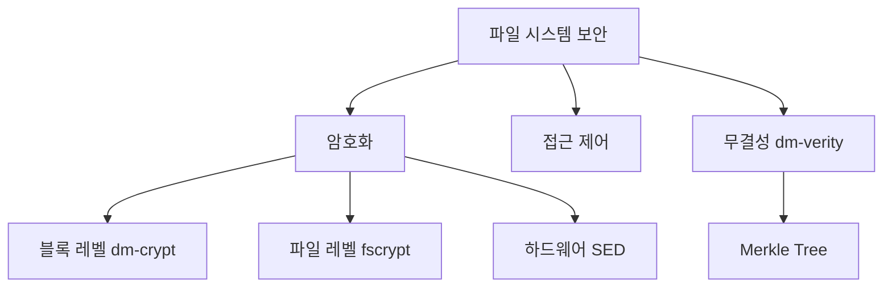

+++
weight = 571
title = "571. 파일 시스템 암호화 및 보안"
+++

## 핵심 인사이트 (3줄 요약)
> 1. **본질**: 파일 시스템 암호화(File System Encryption)는 저장 매체에 기록되는 데이터를 암호화하여 물리적 도난이나 부적절한 접근으로부터 데이터를 보호하는 정적 데이터 보호(Data-at-Rest Protection) 기술이다.
> 2. **가치**: 커널 수준에서 암호화를 수행함으로써 응용 프로그램의 수정 없이 투명성(Transparency)을 보장하며, 다중 사용자 환경에서 사용자별 키 관리를 통해 데이터 격리를 실현한다.
> 3. **추세**: 단순한 암호화를 넘어 하드웨어 가속(AES-NI), 신뢰 실행 환경(TEE), 그리고 암호화된 상태에서도 검색이 가능한 검색 가능 암호화(Searchable Encryption) 기술로 발전하고 있다.

---

## Ⅰ. 파일 시스템 보안의 개요 (Context & Background)

- **정의**: 파일 시스템 보안은 파일의 기밀성(Confidentiality), 무결성(Integrity), 가용성(Availability)을 보장하기 위한 메커니즘으로, 접근 제어(Access Control)와 데이터 암호화(Encryption)를 핵심 축으로 한다.
- **필요성**:
  1. **물리적 보안 한계**: 서버 도난이나 디스크 폐기 시 접근 제어만으로는 데이터 유출을 막을 수 없다.
  2. **클라우드 환경**: 멀티테넌시(Multi-tenancy) 환경에서 인프라 관리자로부터 사용자 데이터를 보호해야 한다.
  3. **규제 준수**: GDPR, ISMS 등 현대 보안 규정은 민감 데이터에 대한 필수적인 암호화를 요구한다.
- **주요 위협**:
  - **Cold Boot Attack**: 메모리에 남아있는 암호화 키를 추출하는 공격.
  - **Side-channel Attack**: 암호화 연산 시의 전력 소모나 시간을 분석하여 키를 유추.

> **📢 섹션 요약 비유**: 파일 시스템 보안은 단순히 "금고의 문을 잠그는 것(접근 제어)"을 넘어, "금고 안의 서류를 해독 불가능한 암호문으로 작성(암호화)"하여 금고가 통째로 도난당해도 내용을 알 수 없게 만드는 것과 같습니다.

---

## Ⅱ. 파일 시스템 암호화 아키텍처 (Technical Structure)

### 1. 암호화 계층 구조 (Encryption Layer)

파일 시스템 암호화는 커널 스택의 어느 지점에서 암호화가 발생하는지에 따라 분류된다.

```text
[ User Space ]       Application / Database
--------------------------------------------------
[ Kernel Space ]     VFS (Virtual File System)
                     -----------------------------
                     FS Level (fscrypt, eCryptfs)  <-- File-based
                     -----------------------------
                     Block Level (dm-crypt/LUKS)   <-- Device-based
--------------------------------------------------
[ Hardware ]         Self-Encrypting Drive (SED)   <-- Hardware-based
```

### 2. 키 관리 메커니즘 (Key Management)

- **MK (Master Key)**: 사용자 패스워드나 HSM(Hardware Security Module)에서 파생.
- **FEK (File Encryption Key)**: 개별 파일이나 디렉터리를 암호화하는 실제 키. MK에 의해 암호화되어 메타데이터에 저장됨.

> **📢 섹션 요약 비유**: 아키텍처는 "암호화 편지"와 같습니다. 하드웨어 암호화는 우체국 자체가 보안 구역인 것이고, 블록 암호화는 편지 봉투 전체를 암호화하는 것이며, 파일 레벨 암호화는 편지 내용만 암호화하여 겉봉투(파일명 등)는 볼 수 있게 하는 차이가 있습니다.

---

## Ⅲ. 주요 암호화 알고리즘 및 모드 (Algorithms & Modes)

- **AES (Advanced Encryption Standard)**: 현대 파일 시스템 암호화의 표준 알고리즘. 128/256 비트 키 사용.
- **XTS Mode (XEX Tweakable Block Cipher with Ciphertext Stealing)**:
  - 디스크 암호화에 최적화된 모드.
  - 동일한 평문 블록이 디스크의 다른 위치에 저장될 때 다른 암호문을 생성하여 패턴 분석을 방지.
- **HMAC (Hash-based Message Authentication Code)**:
  - 데이터의 무결성을 보장하기 위해 사용.
  - 암호화된 데이터가 변조되지 않았음을 확인.

> **📢 섹션 요약 비유**: 암호화 알고리즘은 "복잡한 금고 다이얼 설계도"와 같습니다. AES는 가장 견고한 설계도이고, XTS 모드는 같은 번호라도 위치에 따라 다르게 작동하게 만드는 특수 장치입니다.

---

## Ⅳ. 무결성 보호와 성능 최적화 (Integrity & Performance)

### 1. Merkle Tree 기반 무결성 검증 (dm-verity)
- 파일 시스템 블록들을 해시 트리 구조로 관리.
- 루트 해시(Root Hash)만 확인하면 전체 데이터의 변조 여부를 고속으로 판별 가능.

### 2. 하드웨어 가속 (Acceleration)
- **AES-NI (AES New Instructions)**: CPU 내부에 암호화 전용 명령어를 추가하여 소프트웨어 방식 대비 10배 이상의 성능 향상.
- **Inline Encryption Engine**: 디스크 컨트롤러 내부에 암호화 모듈을 배치하여 CPU 부하를 제로(0)화.

> **📢 섹션 요약 비유**: 무결성 보호는 "책의 페이지마다 찍힌 위조 방지 도장"과 같고, 성능 최적화는 "도장을 찍는 기계를 전용 고속 자동화 장치로 교체"하여 작업 속도를 유지하는 것과 같습니다.

---

## Ⅴ. 파일 시스템 보안 고려사항 및 미래 기술 (Considerations & Future)

- **키 폐기(Key Shredding)**: 암호화 키만 삭제함으로써 데이터를 물리적으로 지우지 않고도 즉각적으로 복구 불가능하게 만드는 기술(Crypto-erase).
- **검색 가능 암호화 (Searchable Encryption)**: 암호화된 상태에서 파일 내용을 검색할 수 있게 하여 보안과 편의성을 동시에 확보.
- **양자 내성 암호 (PQC, Post-Quantum Cryptography)**: 양자 컴퓨터의 공격으로부터 안전한 파일 시스템 암호화 기술 도입 준비.

> **📢 섹션 요약 비유**: 미래 기술은 "금고 번호를 잊어버리는 것만으로 금고 안의 종이를 가루로 만드는 마법"이나 "안의 내용을 보지 않고도 특정 단어가 있는지 알아내는 투시경"을 개발하는 것과 같습니다.

---

## 💡 지식 그래프 (Knowledge Graph)



## 👶 아이들을 위한 비유 (Child Analogy)
> 여러분의 일기장을 상상해 보세요. 엄마나 친구가 못 보게 자물쇠를 채우는 것은 '접근 제어'예요. 하지만 일기장을 훔쳐가서 자물쇠를 부술 수도 있겠죠? 그래서 일기 내용을 여러분만 아는 암호(가=★, 나=♥)로 적는 것이 '파일 시스템 암호화'랍니다. 이렇게 하면 누군가 일기장을 가져가도 내용을 절대로 읽을 수 없어요!
