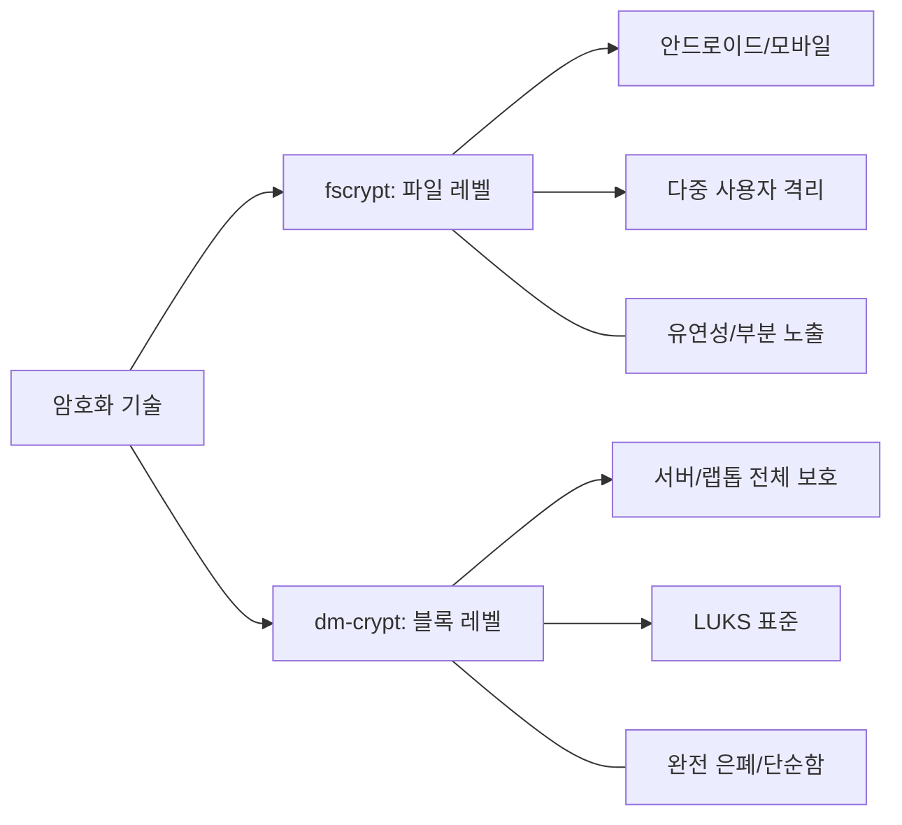

+++
weight = 572
title = "572. 파일 레벨 암호화 (fscrypt) vs 블록 레벨 암호화 (dm-crypt)"
+++

## 핵심 인사이트 (3줄 요약)
> 1. **본질**: fscrypt는 파일 시스템 상단에서 개별 파일/디렉터리 단위로 암호화하는 상위 계층 기술인 반면, dm-crypt는 가상 블록 장치를 통해 디스크 전체를 암호화하는 하위 계층 기술이다.
> 2. **차별점**: fscrypt는 다중 사용자 환경에서 사용자별로 다른 키를 적용하고 메타데이터(파일명 등)를 부분적으로 노출할 수 있는 유연성을 제공하며, dm-crypt는 모든 데이터와 메타데이터를 완벽히 은폐하는 강력한 보안성을 제공한다.
> 3. **선택**: 안드로이드와 같은 멀티테넌트 모바일 환경에서는 fscrypt가 선호되며, 서버나 랩톱의 전체 디스크 보호(FDE)에는 dm-crypt가 업계 표준으로 자리 잡고 있다.

---

## Ⅰ. 암호화 계층의 이해 (Concept & Hierarchy)

- **fscrypt (File-based Encryption, FBE)**:
  - 파일 시스템 내부(Ext4, F2FS 등)에 통합된 암호화 메커니즘.
  - 파일의 데이터와 파일명은 암호화하지만, 파일 크기나 디렉터리 구조는 노출될 수 있음.
- **dm-crypt (Full Disk Encryption, FDE)**:
  - 리눅스 커널의 Device Mapper 프레임워크를 기반으로 함.
  - 파일 시스템 아래의 블록 계층에서 작동하여 파일 시스템 자체를 인식하지 못하도록 전체를 암호화.

> **📢 섹션 요약 비유**: fscrypt는 "중요한 문서들만 각각 다른 암호 상자에 넣어 보관하는 서재"와 같고, dm-crypt는 "서재의 출입문 자체를 두꺼운 철갑으로 봉쇄하고 통째로 암호화하는 것"과 같습니다.

---

## Ⅱ. 기술적 구조 및 동작 원리 (Technical Comparison)

### 1. fscrypt의 스택 구조
```text
[ VFS Layer ]
      |
[ Ext4 / F2FS ]  <-- Encryption happens here (fscrypt)
      |
[ Block Device ] <-- Data is already encrypted
```

### 2. dm-crypt의 스택 구조
```text
[ VFS Layer ]
      |
[ Ext4 / XFS ]   <-- Clear text FS
      |
[ dm-crypt ]     <-- Encryption happens here (LUKS)
      |
[ Physical Disk ]
```

### 3. 상세 비교표
| 구분 | fscrypt (파일 레벨) | dm-crypt (블록 레벨) |
| :--- | :--- | :--- |
| **작동 위치** | 파일 시스템 계층 | 블록 장치 계층 |
| **보안 범위** | 지정된 파일/디렉터리 | 파티션 전체 (메타데이터 포함) |
| **키 관리** | 사용자/세션별 다중 키 가능 | 시스템/볼륨당 단일 키 (주로) |
| **복구 용이성** | 파일 단위 복구 가능 | 전체 볼륨 복구 필요 |

> **📢 섹션 요약 비유**: fscrypt는 "아파트의 각 집마다 다른 디지털 도어락을 다는 것"이고, dm-crypt는 "아파트 단지 정문에 거대한 성벽을 쌓고 단 한 명의 파수꾼을 두는 것"입니다.

---

## Ⅲ. 키 유도 및 관리 체계 (Key Management)

- **fscrypt의 키 구조**:
  - **KDF (Key Derivation Function)**를 통해 사용자 패스워드에서 Master Key를 유도.
  - 각 파일은 고유한 넌스(Nonce)와 Master Key를 조합한 전용 키로 암호화.
- **dm-crypt/LUKS**:
  - **LUKS (Linux Unified Key Setup)** 표준을 사용하여 여러 키 슬롯(Key Slot) 지원.
  - 헤더 영역에 암호화된 Master Key를 저장하며, 패스워드 변경 시에도 전체 데이터 재암호화가 필요 없음.

> **📢 섹션 요약 비유**: fscrypt의 키 관리는 "각 서랍 열쇠를 마스터 키 하나로 열 수 있게 만든 시스템"이고, LUKS는 "금고의 마스터키를 여러 개의 작은 보조 열쇠함에 나누어 담아둔 것"과 같습니다.

---

## Ⅳ. 성능 및 효율성 분석 (Performance & Efficiency)

- **CPU 오버헤드**:
  - 두 방식 모두 AES-NI를 활용하므로 CPU 부하는 비슷하지만, fscrypt는 파일별 오버헤드가 추가될 수 있음.
- **공간 효율성**:
  - dm-crypt는 블록 단위로 작동하므로 정렬(Alignment) 문제로 미세한 낭비가 발생할 수 있음.
  - fscrypt는 Sparse File이나 압축 기능을 암호화와 병행하기에 더 유리함.
- **특수 기능**:
  - fscrypt는 암호화된 상태에서 백업하거나 전송하는 'Direct Access'에 강점이 있음.

> **📢 섹션 요약 비유**: dm-crypt는 "무거운 철갑을 두른 거대한 트럭" 같아서 속도는 일정하지만 관성이 크고, fscrypt는 "각 물건을 방탄 포장지로 싼 오토바이" 같아서 유연하지만 물건마다 포장하는 수고가 듭니다.

---

## Ⅴ. 유즈케이스 및 향후 전망 (Use Cases & Future)

- **안드로이드 FBE (File-Based Encryption)**:
  - 'Direct Boot' 기능을 지원하기 위해 fscrypt 사용. 부팅 직후 전화 수신 등 최소 기능은 작동하되 개인 데이터는 잠금 해제 전까지 암호화 상태 유지.
- **클라우드 및 MSA**:
  - 컨테이너별로 독립된 암호화 영역을 제공하기 위해 fscrypt 기술이 확장 적용 중.
- **하이브리드 모델**:
  - 중요 메타데이터 보호를 위해 dm-crypt를 밑단에 깔고, 사용자 격리를 위해 fscrypt를 그 위에 얹는 계층화 보안(Layered Security)이 증가 추세.

> **📢 섹션 요약 비유**: 미래에는 "성벽(dm-crypt) 안에 살면서도 각자 자기 집의 비밀 금고(fscrypt)를 가지는 것"이 표준이 될 것입니다.

---

## 💡 지식 그래프 (Knowledge Graph)



## 👶 아이들을 위한 비유 (Child Analogy)
> 여러분의 보물 상자를 상상해 보세요. **dm-crypt**는 보물 상자 전체를 커다란 보자기(암호)로 꽁꽁 싸매서 그 안에 뭐가 들었는지, 상자가 얼마나 큰지도 모르게 만드는 거예요. **fscrypt**는 보물 상자 안에 있는 로봇, 인형, 사탕을 각각 작은 암호 주머니에 넣는 거예요. 이렇게 하면 "상자 안에 인형이 있네?"는 알 수 있지만, 그 인형이 어떤 모습인지는 꺼내보기 전까진 알 수 없답니다!
