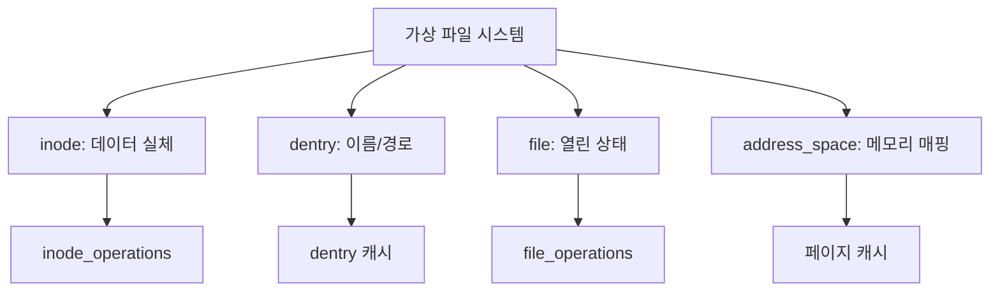

+++
weight = 573
title = "573. 리눅스 가상 파일 시스템 (VFS) 구조 - inode, dentry, file, address_space"
+++

## 핵심 인사이트 (3줄 요약)
> 1. **본질**: 가상 파일 시스템(VFS, Virtual File System)은 커널 내부에서 다양한 물리적 파일 시스템을 추상화하여 공통된 인터페이스를 제공하는 소프트웨어 계층이다.
> 2. **객체 모델**: VFS는 객체 지향 설계를 기반으로 하며, 데이터의 물리적 위치(inode), 경로명 매핑(dentry), 열린 파일의 상태(file), 그리고 메모리와의 연결(address_space)을 4대 핵심 객체로 관리한다.
> 3. **성능 전략**: 디스크 I/O 병목을 극복하기 위해 dentry 캐시(dcache)와 inode 캐시, 그리고 address_space를 통한 페이지 캐시(Page Cache) 메커니즘을 핵심적으로 활용한다.

---

## Ⅰ. VFS의 역할과 아키텍처 (Role & Architecture)

- **추상화 계층**: 응용 프로그램이 `read()`, `write()` 시스템 콜을 호출할 때, 하부 파일 시스템이 Ext4인지, NFS인지 관계없이 동일한 방식으로 동작하게 한다.
- **다형성 (Polymorphism)**: 각 물리 파일 시스템은 VFS가 정의한 함수 포인터 테이블(Operations)을 구현함으로써 커널에 등록된다.

> **📢 섹션 요약 비유**: VFS는 "만능 번역기"와 같습니다. 사용자는 "열어줘"라는 한 마디만 하면, 번역기가 상대방(물리 파일 시스템)의 언어에 맞춰 적절한 명령으로 바꾸어 전달해 줍니다.

---

## Ⅱ. 4대 핵심 객체 구조 (Four Core Objects)

VFS는 파일 시스템의 논리적 구조를 다음의 4가지 객체로 추상화한다.

### 1. VFS 객체 상관관계도
```text
[ Process ]
     |
  [ File ] (Current Offset, Mode)
     |
 [ Dentry ] (Filename, Directory Tree)
     |
 [ Inode ] (Metadata, Block Pointers)
     |
 [ Address Space ] (Page Cache, Mapping to Memory)
```

### 2. 객체별 상세 설명
- **inode (Index Node)**:
  - 파일의 실제 물리적 정보를 담고 있다. (파일 크기, 권한, 생성 시간, 데이터 블록 위치)
  - 파일 이름은 포함하지 않으며, 고유 번호로 식별된다.
- **dentry (Directory Entry)**:
  - 파일 이름과 inode를 연결해 주는 '경로' 정보를 담당한다.
  - 디렉터리 계층 구조를 캐싱하여 파일 탐색 속도를 비약적으로 향상시킨다.
- **file**:
  - 프로세스가 파일을 열었을 때 생성되는 '열린 파일의 인스턴스'다.
  - 파일 포인터(현재 읽는 위치), 접근 모드 등을 저장한다.
- **address_space**:
  - inode와 페이지 캐시 사이의 다리 역할을 한다.
  - 디스크의 블록 데이터를 메모리의 페이지 단위로 매핑하여 관리한다.

> **📢 섹션 요약 비유**: inode는 "주민등록등본(개인 정보)", dentry는 "도로 표지판(이름과 위치 연결)", file은 "도서관 대출증(현재 빌려 읽는 상태)", address_space는 "책을 읽기 위해 펼쳐놓은 책상(메모리 공간)"과 같습니다.

---

## Ⅲ. 주요 운영체제 연산 (Operations & Interfaces)

- **inode_operations**: 파일 생성, 삭제, 이름 변경 등 파일 시스템 제어 관련 함수 집합.
- **file_operations**: read, write, open, release 등 프로세스의 파일 I/O 관련 함수 집합.
- **address_space_operations**: readpage, writepage 등 메모리와 디스크 간의 페이지 전송 함수 집합.

> **📢 섹션 요약 비유**: 연산 인터페이스는 "각 객체가 할 수 있는 행동 매뉴얼"입니다. inode는 집을 짓거나 허물 수 있고, file은 책을 읽거나 쓸 수 있는 능력을 정의합니다.

---

## Ⅳ. 경로 탐색과 캐싱 메커니즘 (Path Lookup & Caching)

- **Pathname Lookup**: `/home/user/test.txt`라는 경로를 찾을 때, VFS는 각 단계마다 dentry를 검색한다.
- **dcache (Dentry Cache)**:
  - 빈번한 경로 탐색 오버헤드를 줄이기 위해 최근 사용한 dentry를 메모리에 유지.
  - 해시 테이블 기반으로 빠르게 검색하며, 사용되지 않는 객체는 LRU(Least Recently Used) 방식으로 교체.

> **📢 섹션 요약 비유**: 경로 탐색 캐싱은 "자주 가는 길의 약도를 머릿속에 외우고 있는 것"과 같습니다. 매번 지도를 펼쳐보지 않아도 금방 길을 찾을 수 있게 해 줍니다.

---

## Ⅴ. address_space와 페이지 캐시의 융합 (Memory Integration)

- **Unified Page Cache**: 리눅스는 모든 파일 I/O가 address_space를 거치게 하여 가상 메모리 관리와 파일 시스템을 통합했다.
- **Dirty Page 관리**: write 작업 시 address_space의 페이지를 'dirty'로 표시하고, 나중에 flusher 스레드가 디스크에 비동기적으로 기록한다.

> **📢 섹션 요약 비유**: address_space 융합은 "도서관 책을 그냥 읽는 게 아니라 복사본을 책상에 가져다 놓고 읽는 것"입니다. 메모리라는 책상 위에서 작업하므로 매우 빠르며, 수정한 내용은 나중에 한꺼번에 서고에 반영합니다.

---

## 💡 지식 그래프 (Knowledge Graph)



## 👶 아이들을 위한 비유 (Child Analogy)
> 커다란 장난감 도서관에 갔다고 생각해 봐요. 
> 1. **inode**는 장난감 상자 그 자체예요. 그 안에 장난감이 들어 있죠.
> 2. **dentry**는 상자에 붙은 '로봇 상자'라는 이름표와 그 상자가 어디 있는지 알려주는 지도예요.
> 3. **file**은 여러분이 지금 장난감을 꺼내서 가지고 놀고 있는 '빌린 상태'를 말해요.
> 4. **address_space**는 장난감을 바닥에 쏟아놓고 노는 넓은 매트예요. 매트 위에서 놀면 상자에서 매번 꺼내는 것보다 훨씬 편하겠죠?
