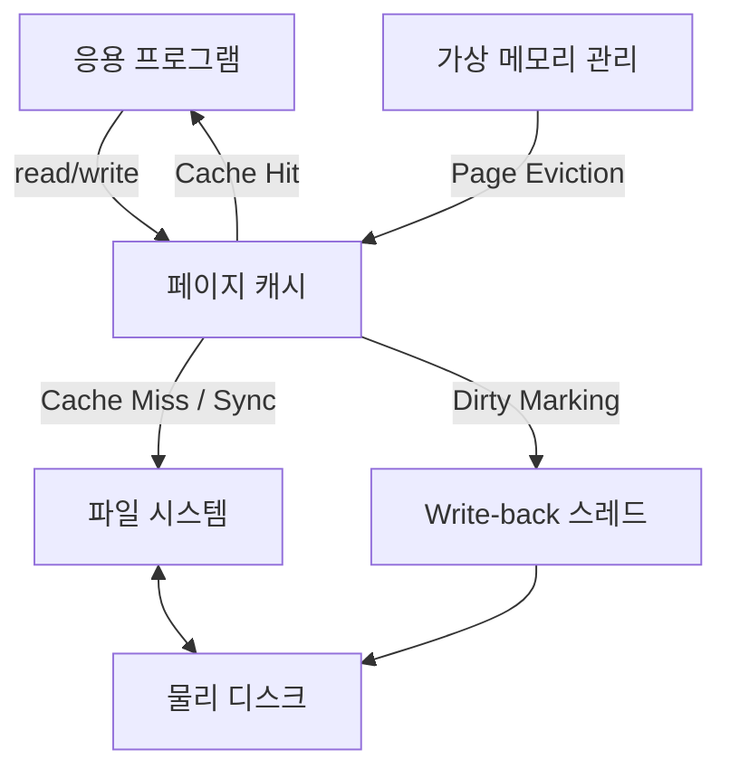

+++
weight = 574
title = "574. 파일 시스템과 페이지 캐시의 상호작용"
+++

## 핵심 인사이트 (3줄 요약)
> 1. **본질**: 페이지 캐시(Page Cache)는 디스크 I/O의 지연을 최소화하기 위해 최근에 접근한 파일 데이터를 메인 메모리에 유지하는 운영체제의 핵심 메커니즘이다.
> 2. **상호작용**: 파일 시스템은 모든 읽기/쓰기 작업을 페이지 캐시와 연동하며, '지연 쓰기(Delayed Write)'와 '미리 읽기(Read-ahead)'를 통해 디스크 접근 횟수를 획기적으로 줄인다.
> 3. **통합 관리**: 현대 OS는 가상 메모리 시스템과 페이지 캐시를 통합하여, 여유 메모리를 유연하게 디스크 캐시로 활용함으로써 시스템 전체의 처리량(Throughput)을 극대화한다.

---

## Ⅰ. 페이지 캐시의 개념과 필요성 (Context & Concept)

- **디스크와 메모리의 속도 차이**: 하드 디스크나 SSD는 DRAM에 비해 수천 배에서 수만 배 느리다. 이를 극복하기 위해 메모리 일부를 버퍼로 사용한다.
- **지역성 (Locality)**: 한 번 읽은 데이터는 다시 읽을 가능성이 높고(시간적 지역성), 인접한 데이터를 읽을 가능성(공간적 지역성)이 크다는 점을 이용한다.

> **📢 섹션 요약 비유**: 페이지 캐시는 "요리사가 냉장고(디스크)까지 매번 가는 대신, 자주 쓰는 재료를 조리대(메모리) 위에 올려두고 쓰는 것"과 같습니다.

---

## Ⅱ. 데이터 흐름과 매커니즘 (Data Flow & Mechanism)

### 1. 읽기 작업 (Read Operation) 흐름
1. 프로세스가 `read()` 호출.
2. 커널이 해당 데이터가 페이지 캐시에 있는지 확인 (**Cache Hit**).
3. 있으면 즉시 반환, 없으면 (**Cache Miss**) 디스크에서 메모리로 로드 후 반환.

### 2. 쓰기 작업 (Write Operation) 흐름
```text
[ Process ] --(write)--> [ Page Cache (Dirty) ] --(sync)--> [ File System/Disk ]
```
- **Dirty Page**: 메모리에서 수정되었으나 아직 디스크에 반영되지 않은 페이지.
- **Write-back**: 일정 시간이 지나거나 메모리가 부족할 때 백그라운드 스레드가 디스크에 기록.

### 3. 미리 읽기 (Read-ahead) ASCII 다이어그램
```text
Disk Blocks:  [1] [2] [3] [4] [5] [6] [7] [8]
               ^   ^   ^
               |   |   +-- (Predicted & Prefetched)
               |   +------ (Next Target)
               +---------- (Current Read)
```

> **📢 섹션 요약 비유**: 읽기 작업은 "조리대 위에 재료가 있는지 확인하는 것"이고, 쓰기 작업은 "조리대 위에서 재료를 손질하고(수정) 나중에 한꺼번에 정리하는 것"입니다.

---

## Ⅲ. 일관성과 동기화 (Consistency & Sync)

- **Write-behind (지연 쓰기)**: 성능은 좋지만 시스템 갑작스러운 종료 시 데이터 손실 위험이 있다.
- **fsync() / fdatasync()**: 페이지 캐시의 데이터를 강제로 디스크에 기록하도록 요구하는 시스템 콜.
- **O_DIRECT**: 페이지 캐시를 우회하여 직접 디스크 I/O를 수행. 데이터베이스 시스템에서 주로 사용.

> **📢 섹션 요약 비유**: 지연 쓰기는 "포스트잇에 메모를 적어두고 나중에 장부에 옮겨 적는 것"입니다. 옮겨 적기 전에 포스트잇을 잃어버리면 안 되니, 중요한 내용은 즉시 장부에 적으라고 명령하는 것이 `fsync()`입니다.

---

## Ⅳ. 메모리 회수와 교체 정책 (Eviction & Replacement)

- **LRU (Least Recently Used)**: 가장 오랫동안 사용되지 않은 페이지를 우선적으로 제거하여 여유 공간 확보.
- **Two-List Strategy**: 활동 리스트(Active)와 비활동 리스트(Inactive)를 두어, 한 번만 읽히고 버려지는 페이지(Scan)로부터 캐시를 보호.

> **📢 섹션 요약 비유**: 메모리 회수는 "조리대가 꽉 찼을 때, 가장 오랫동안 손대지 않은 재료를 다시 냉장고에 넣는 규칙"입니다.

---

## Ⅴ. 파일 시스템과의 고도화된 연동 (Advanced Integration)

- **Unified Buffer Cache**: 예전에는 파일 데이터를 위한 '페이지 캐시'와 블록 메타데이터를 위한 '버퍼 캐시'가 분리되어 있었으나, 현재는 메모리 이중화 방지를 위해 통합 관리된다.
- **Direct I/O와의 병행**: 특정 파일은 캐시를 쓰고, 특정 파일은 우회하는 하이브리드 전략 가능.

> **📢 섹션 요약 비유**: 고도화된 연동은 "재료뿐만 아니라 요리 기구(메타데이터)까지 모두 한 조리대에서 효율적으로 배치하여 관리하는 것"입니다.

---

## 💡 지식 그래프 (Knowledge Graph)



## 👶 아이들을 위한 비유 (Child Analogy)
> 여러분이 커다란 백과사전을 보고 숙제를 한다고 해봐요.
> 1. 백과사전 전체가 든 책장은 **디스크**예요. 너무 무겁고 멀리 있어요.
> 2. 숙제할 때 책상 위에 펴놓은 몇 페이지가 **페이지 캐시**예요.
> 3. 만약 5페이지를 다 읽고 6페이지가 궁금하면, 미리 6페이지를 펴두는 게 **미리 읽기**예요.
> 4. 책상 위에 연필로 내용을 고쳤는데, 나중에 책장에 꽂기 전에 지우지 않고 그대로 두면 **더러운(Dirty) 페이지**가 돼요. 나중에 책장에 넣을 때 수정한 내용을 정식으로 적어 넣어야겠죠?
