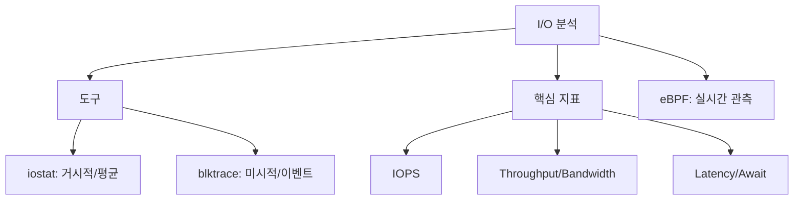

+++
title = "575. 오퍼레이팅 시스템의 통계적 파일 I/O 분석 (iostat, blktrace)"
date = "2026-03-14"
weight = 575
+++

## 핵심 인사이트 (3줄 요약)
> 1. **본질**: 통계적 파일 I/O 분석은 저장 장치의 처리량, 지연 시간, 대기 행렬 길이를 정량적으로 측정하여 시스템 병목 구간을 진단하는 성능 튜닝의 핵심 과정이다.
> 2. **도구 분류**: `iostat`은 커널 통계치를 기반으로 한 거시적 관점의 시스템 현황(Snapshot)을 제공하며, `blktrace`는 블록 계층의 모든 이벤트를 추적하여 미시적 관점의 상세 분석(Trace)을 지원한다.
> 3. **목표**: I/O 대기 시간(Await)과 서비스 시간(Service Time)의 상관관계를 분석하여 장치의 물리적 한계인지, 소프트웨어 스케줄링의 문제인지를 판별하는 데 목적이 있다.

---

## Ⅰ. I/O 성능 분석의 주요 지표 (Performance Metrics)

성능 진단을 위해서는 다음의 4가지 핵심 지표를 이해해야 한다.

- **IOPS (Input/Output Operations Per Second)**: 초당 처리되는 입출력 작업 수. 랜덤 액세스 성능의 척도.
- **Throughput (처리량)**: 초당 전송되는 데이터 양(MB/s). 순차 액세스 성능의 척도.
- **Latency (지연 시간)**: 단일 I/O 요청이 완료될 때까지 걸리는 시간.
- **Queue Depth (대기 행렬)**: 장치에 쌓여 대기 중인 I/O 요청의 개수.

> **📢 섹션 요약 비유**: I/O 분석은 "식당의 성능을 체크하는 것"과 같습니다. IOPS는 손님 수, Throughput은 나가는 요리 양, Latency는 주문 후 요리가 나올 때까지의 시간, Queue Depth는 줄 서 있는 사람의 수입니다.

---

## Ⅱ. 거시적 분석 도구: iostat (System Snapshot)

`iostat`은 `/proc/diskstats` 데이터를 기반으로 평균적인 통계를 보여준다.

### 1. iostat 주요 필드 해석
- **%util**: 장치가 I/O 작업으로 바빴던 시간 비율. 100%에 근접하면 병목 가능성.
- **await**: 요청이 큐에서 대기한 시간 + 실제 서비스 시간의 평균.
- **svctm (Service Time)**: 실제 장치가 I/O를 처리한 시간 (최근 버전에서는 폐기 권고).

### 2. I/O 패턴 시각화 (iostat 관점)
```text
[ CPU ] --(Wait I/O)--> [ I/O Scheduler ] --(Queue)--> [ Device ]
                          | <--- await ---> |
                                              |<-svctm->|
```

> **📢 섹션 요약 비유**: `iostat`은 "식당 전체의 하루 평균 매출과 평균 대기 시간을 요약한 영수증"을 보는 것과 같습니다.

---

## Ⅲ. 미시적 분석 도구: blktrace (Event Tracing)

`blktrace`는 블록 계층(Block Layer)에서 발생하는 이벤트를 실시간으로 가로채어 기록한다.

- **주요 이벤트 단계**:
  - **Q (Queued)**: I/O가 스케줄러 큐에 들어감.
  - **M (Merged)**: 인접한 I/O 요청이 하나로 합쳐짐.
  - **D (Issued)**: 드라이버를 통해 실제 하드웨어로 명령 전달.
  - **C (Complete)**: 하드웨어로부터 작업 완료 응답을 받음.

> **📢 섹션 요약 비유**: `blktrace`는 "손님이 들어와서 메뉴판을 보고, 주문하고, 요리사가 불을 켜고, 서빙되는 모든 과정을 비디오로 찍어 정밀 분석하는 것"과 같습니다.

---

## Ⅳ. 병목 현상 진단 시나리오 (Diagnostic Scenarios)

1. **높은 %util과 낮은 Throughput**:
   - 작은 크기의 I/O가 빈번하게 발생하는 '랜덤 I/O' 병목.
   - 해결책: I/O 병합(Merging) 유도 또는 SSD 도입.
2. **높은 await과 낮은 %util**:
   - 어플리케이션이 I/O를 충분히 던지지 못하거나, 커널 스케줄러 설정 오류.
3. **높은 svctm (Service Time)**:
   - 저장 장치 자체의 물리적 고장 또는 수명 다함.

> **📢 섹션 요약 비유**: 식당 앞에 줄이 긴데(await) 정작 요리사는 놀고 있다면(util), 홀 서빙(커널/앱)이 주문을 제대로 안 받고 있는 것입니다.

---

## Ⅴ. 최신 관측 기술 (Modern Observability)

- **eBPF (biolatency, biosnoop)**: 커널 수정 없이 I/O 지연 시간을 히스토그램 형태로 실시간 시각화.
- **Prometheus/Grafana 연동**: `node_exporter`를 통해 I/O 지표를 시계열 데이터로 수집하여 대시보드 구축.

> **📢 섹션 요약 비유**: 최신 기술은 "식당 주방에 스마트 센서를 달아서 실시간으로 어느 단계가 막히는지 스마트폰으로 보는 것"과 같습니다.

---

## 💡 지식 그래프 (Knowledge Graph)



## 👶 아이들을 위한 비유 (Child Analogy)
> 마트에 물건을 사러 간다고 상상해 봐요.
> 1. **iostat**은 마트 주인이 "오늘 평균적으로 손님 한 명당 10분을 기다렸고, 계산대 3개가 꽉 찼었네"라고 일기에 적는 거예요.
> 2. **blktrace**는 탐정이 돋보기를 들고 "손님이 2시 1분에 들어왔고, 2시 2분에 물건을 집었고, 2시 5분에 줄을 섰고, 2시 10분에 계산을 끝냈네"라고 아주 자세하게 기록하는 거예요.
> 이렇게 기록을 보면 마트 계산대가 부족한지, 아니면 손님이 물건을 너무 천천히 고르는지 알 수 있답니다!