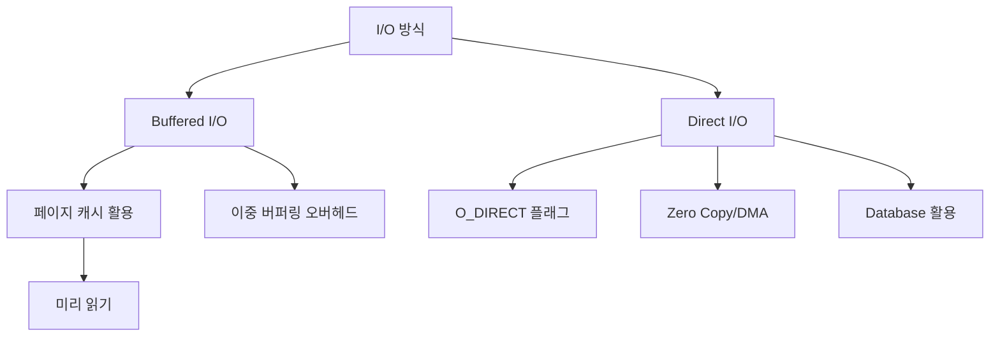

+++
weight = 576
title = "576. Direct I/O vs Buffered I/O"
+++

## 핵심 인사이트 (3줄 요약)
> 1. **본질**: Buffered I/O는 OS의 페이지 캐시(Page Cache)를 거쳐 성능을 최적화하는 기본 방식이며, Direct I/O는 이를 우회하여 응용 프로그램이 저장 장치에 직접 접근하는 방식이다.
> 2. **트레이드오프**: Buffered I/O는 자동화된 캐싱과 I/O 병합을 통해 일반적인 상황에서 높은 성능을 보이나 이중 복사(Double Buffering) 오버헤드가 있고, Direct I/O는 이중 복사를 제거하지만 응용 프로그램이 직접 캐시를 정교하게 관리해야 한다.
> 3. **용도**: 일반 애플리케이션은 Buffered I/O를, 자체적인 고도화된 캐시 엔진을 가진 데이터베이스(RDBMS)나 대용량 데이터 스트리밍 시스템은 Direct I/O를 선호한다.

---

## Ⅰ. Buffered I/O의 매커니즘 (Standard I/O)

리눅스 및 유닉스 계열의 기본 I/O 방식으로, `read()`와 `write()` 시스템 콜이 페이지 캐시와 상호작용한다.

- **동작**:
  1. **Write**: 프로세스 메모리 -> 커널 페이지 캐시 (Dirty Page) -> 실제 디스크.
  2. **Read**: 실제 디스크 -> 커널 페이지 캐시 -> 프로세스 메모리.
- **장점**: 커널이 미리 읽기(Read-ahead)와 쓰기 병합(Write-combining)을 수행하여 효율이 높다.
- **단점**: 커널 공간과 사용자 공간 사이의 데이터 복사 오버헤드가 발생한다.

> **📢 섹션 요약 비유**: Buffered I/O는 "택배를 보낼 때 집 앞 편의점(페이지 캐시)에 맡기는 것"과 같습니다. 편의점이 알아서 모았다가 큰 차에 실어 보내니 편리합니다.

---

## Ⅱ. Direct I/O의 매커니즘 (O_DIRECT)

파일을 열 때 `O_DIRECT` 플래그를 사용하여 커널의 페이지 캐싱을 명시적으로 건너뛴다.

### 1. 데이터 흐름 비교 ASCII 다이어그램
```text
[ Buffered I/O ]                 [ Direct I/O ]
User Space Buffer                User Space Buffer
       |                                |
       v                                |
Kernel Page Cache  <-- (Copy)           | (Direct DMA)
       |                                |
       v                                v
Disk Controller                  Disk Controller
```

### 2. 특징
- **제로 카피 (Zero Copy)**: 커널 공간으로의 복사 과정을 생략한다.
- **정렬 제한 (Alignment)**: 사용자 버퍼와 파일 오프셋이 디스크 섹터 크기(보통 512B나 4KB)의 배수로 정렬되어야 한다.
- **비동기성**: 주로 `AIO` 또는 `io_uring`과 결합하여 비동기 처리에 최적화된다.

> **📢 섹션 요약 비유**: Direct I/O는 "택배를 내가 직접 터미널(디스크)까지 가져가서 싣는 것"입니다. 편의점을 안 거치니 빠르지만, 터미널 규정(정렬)을 까다롭게 지켜야 합니다.

---

## Ⅲ. 기술적 차이점 상세 비교 (Comparison)

| 항목 | Buffered I/O | Direct I/O |
| :--- | :--- | :--- |
| **캐시 사용** | OS 페이지 캐시 강제 사용 | OS 페이지 캐시 우회 |
| **데이터 복사** | 2회 (User<->Kernel, Kernel<->Disk) | 1회 (User<->Disk via DMA) |
| **CPU 부하** | 메모리 복사로 인한 부하 있음 | 부하 낮음 |
| **애플리케이션 난이도** | 낮음 (표준 API) | 높음 (정렬 및 직접 캐싱 필요) |
| **최적 상황** | 소량 다수 I/O, 일반 웹서버 | 대량 I/O, DB, 비디오 스트리밍 |

> **📢 섹션 요약 비유**: Buffered I/O는 "완성된 밀키트를 사는 것(쉽고 편함)"이고, Direct I/O는 "원재료를 사서 직접 요리하는 것(어렵지만 내 입맛에 맞춤)"입니다.

---

## Ⅳ. 주요 사용 사례와 튜닝 포인트 (Use Cases)

- **데이터베이스 (MySQL, PostgreSQL, Oracle)**:
  - OS의 LRU 정책이 DB의 쿼리 패턴과 맞지 않을 수 있으므로, Direct I/O를 쓰고 자체 버퍼 풀(Buffer Pool)을 관리한다.
- **파일 복사 도구 (`dd`)**:
  - 대용량 파일 복사 시 `oflag=direct`를 쓰면 시스템 전체의 페이지 캐시를 오염시키지 않고 빠르게 작업할 수 있다.
- **선택 기준**:
  - 데이터 재사용률이 높다면 Buffered I/O가 유리하고, 데이터가 한 번 읽히고 버려진다면 Direct I/O가 유리하다.

> **📢 섹션 요약 비유**: 전문 셰프(DB)는 자기만의 주방 도구(자체 캐시)를 쓰고 싶어 하므로, 마트(OS)의 미리 준비된 재료를 거부하고 직접 산지(디스크)에서 재료를 공수해 오는 것입니다.

---

## Ⅴ. 미래와 대안 기술 (Future & Alternatives)

- **DAX (Direct Access)**: NVMe나 PMEM(Persistent Memory) 환경에서 VFS 계층조차 건너뛰고 메모리 맵핑으로 직접 접근하는 기술.
- **io_uring**: Direct I/O의 비동기 처리를 시스템 콜 오버헤드 없이 수행할 수 있게 해주는 혁신적 프레임워크.

> **📢 섹션 요약 비유**: DAX는 "내 방 안에 아예 산지가 들어와 있는 것"과 같아서 배달이라는 과정 자체가 필요 없는 미래형 기술입니다.

---

## 💡 지식 그래프 (Knowledge Graph)



## 👶 아이들을 위한 비유 (Child Analogy)
> 숙제를 하려고 도서관에서 책을 빌리는 상황을 생각해 봐요.
> 1. **Buffered I/O**: 선생님(운영체제)이 책을 미리 빌려다가 교실 사물함(페이지 캐시)에 넣어주는 거예요. 여러분은 사물함에서 꺼내기만 하면 되니 편하지만, 선생님이 책을 나르는 수고가 들죠.
> 2. **Direct I/O**: 여러분이 직접 도서관 서고(디스크)까지 가서 책을 꺼내오는 거예요. 선생님을 귀찮게 하지 않아도 되지만, 도서관의 복잡한 규칙을 여러분이 직접 다 지켜야 한답니다!
