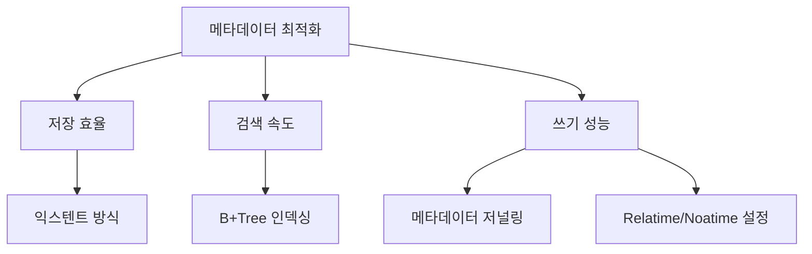

+++
weight = 577
title = "577. 파일 시스템 메타데이터 오버헤드 최적화"
+++

## 핵심 인사이트 (3줄 요약)
> 1. **본질**: 메타데이터 오버헤드는 실제 파일 데이터가 아닌 파일의 속성, 위치, 디렉터리 구조를 관리하는 과정에서 발생하는 컴퓨팅 자원 및 저장 공간의 낭비를 의미한다.
> 2. **최적화 기법**: 익스텐트(Extent) 방식의 블록 할당, B-Tree 기반 디렉터리 인덱싱, 그리고 메타데이터 전용 저널링을 통해 탐색 속도를 높이고 쓰기 증폭(Write Amplification)을 억제한다.
> 3. **가치**: 수백만 개의 소규모 파일(Small Files)이 존재하는 현대 데이터 센터 환경에서 메타데이터 최적화는 파일 시스템의 전체 I/O 성능을 결정짓는 핵심 병목 해결책이다.

---

## Ⅰ. 메타데이터의 구성과 오버헤드 발생 원인 (Overview)

- **구성 요소**: inode(권한, 소유주, 크기), dentry(파일명-inode 매핑), Superblock(전체 레이아웃), 비트맵(빈 공간 관리).
- **발생 원인**:
  1. **작은 파일 문제**: 파일 데이터(1KB)보다 메타데이터(inode 등)가 더 큰 비중을 차지하는 경우.
  2. **디렉터리 탐색**: 수만 개의 파일이 한 디렉터리에 있을 때 선형 탐색(Linear Search)의 비효율.
  3. **잦은 업데이트**: 파일 쓰기마다 inode의 타임스탬프와 크기를 갱신해야 하는 부담.

> **📢 섹션 요약 비유**: 메타데이터 오버헤드는 "사탕 한 알(데이터)을 포장하는 데 커다란 박스와 리본(메타데이터)을 사용하는 것"과 같습니다. 배보다 배꼽이 더 커지는 상황입니다.

---

## Ⅱ. 블록 관리 최적화: Extent vs Block Map (Technical Structure)

### 1. Extent 기반 관리 ASCII 다이어그램
```text
[ Block Map 방식 ]             [ Extent 방식 ]
Index: [1] [2] [3] [4]        Start: [1], Count: [4]
(4개의 포인터 필요)            (1개의 범위 정보만 필요)
```

- **Extent**: 연속된 블록들을 '시작 주소 + 길이' 형태로 관리.
- **효과**: 대용량 파일의 경우 메타데이터 크기를 획기적으로 줄이고 단편화를 방지한다. (Ext4, XFS 적용)

> **📢 섹션 요약 비유**: 블록 맵은 "책의 페이지 번호를 하나하나 다 적는 것"이고, 익스텐트는 "1페이지부터 100페이지까지"라고 한 줄로 요약하는 것과 같습니다.

---

## Ⅲ. 디렉터리 탐색 최적화: B+Tree Indexing (Indexing)

- **전통적 방식**: 파일명을 배열 형태로 나열하여 처음부터 끝까지 검색 (O(n)).
- **최적화 방식 (HTree, B+Tree)**:
  - 파일명의 해시 값을 키로 하여 트리 구조로 관리 (O(log n)).
  - 수백만 개의 파일이 있어도 고속 검색 가능.

> **📢 섹션 요약 비유**: 디렉터리 탐색 최적화는 "도서관 책을 바닥에 그냥 쌓아두는 것(선형 탐색)에서 카테고리별로 인덱스 카드(B+Tree)를 만들어 정리하는 것"으로의 변화입니다.

---

## Ⅳ. 저널링 및 쓰기 최적화 (Write Optimization)

- **Metadata-only Journaling**: 데이터 전체를 저널링하는 대신 메타데이터만 로그에 기록하여 성능 저하 최소화.
- **Lazy Itable Initialization**: 파일 시스템 생성 시 모든 inode 테이블을 즉시 초기화하지 않고 필요할 때 수행하여 포맷 시간을 단축.
- **Noatime / Relatime**: 파일 접근 시마다 타임스탬프를 갱신하지 않도록 설정하여 불필요한 메타데이터 쓰기 제거.

> **📢 섹션 요약 비유**: 저널링 최적화는 "장부 전체를 매번 복사하는 대신, 오늘 바뀐 내용만 메모지에 적어두는 것"과 같습니다.

---

## Ⅴ. 차세대 파일 시스템의 대응 (Modern Trends)

- **LFS (Log-structured File System)**: 메타데이터와 데이터를 묶어서 순차적으로 쓰기 수행 (랜덤 I/O를 순차 I/O로 변환).
- **ZFS/Btrfs의 통합 관리**: 볼륨 관리자와 파일 시스템을 통합하여 메타데이터 일관성 유지 비용 절감.
- **NVMe 최적화**: 지연 시간이 극도로 낮은 NVMe를 위해 락(Lock) 경합을 최소화한 병렬 메타데이터 처리 엔진 도입.

> **📢 섹션 요약 비유**: 차세대 방식은 "가게 장부를 정리할 때마다 장부 위치를 찾는 게 아니라, 포스트잇을 쭉 이어 붙여서 하나의 거대한 롤지로 만드는 것"과 같습니다.

---

## 💡 지식 그래프 (Knowledge Graph)



## 👶 아이들을 위한 비유 (Child Analogy)
> 여러분의 방에 아주 작은 레고 조각이 수천 개 있다고 해봐요.
> 1. **오버헤드**: 레고 조각 하나하나마다 "이건 빨간색 1번 조각, 저건 파란색 2번 조각..."이라고 아주 큰 라벨을 붙이는 거예요. 라벨 때문에 레고를 둘 자리가 없겠죠?
> 2. **최적화**: 비슷한 조각들을 한 상자에 넣고 상자 겉면에 "빨간 조각 100개 들었음"이라고 한 번만 적는 게 **익스텐트** 방식이에요. 
> 3. 그리고 "빨간 조각은 왼쪽 첫 번째 서랍에 있음"이라고 목록을 만드는 게 **B-Tree 인덱스**랍니다. 이렇게 하면 라벨도 적게 쓰고 레고도 금방 찾을 수 있어요!
