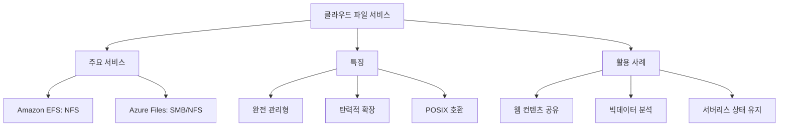

+++
weight = 578
title = "578. 클라우드 환경의 파일 시스템 서비스 (Amazon EFS, Azure Files)"
+++

## 핵심 인사이트 (3줄 요약)
> 1. **본질**: 클라우드 파일 서비스는 물리적 하드웨어 관리 없이 클라우드 환경에서 네트워크 프로토콜(NFS, SMB)을 통해 공유 저장소를 제공하는 완전 관리형(Managed) 서비스이다.
> 2. **기술적 우위**: 수천 개의 컴퓨팅 인스턴스에서 동시 접근이 가능한 확장성(Elasticity)과 다중 가용 영역(Multi-AZ) 복제를 통한 높은 가용성 및 내구성을 핵심 가치로 한다.
> 3. **비즈니스 가치**: 온프레미스(On-premise)의 복잡한 파일 서버 구축 비용을 제거하고, 사용한 만큼만 비용을 지불(Pay-as-you-go)하며, 기존 레거시 애플리케이션의 클라우드 이전을 가속화한다.

---

## Ⅰ. 클라우드 파일 서비스의 등장 배경 (Background)

- **전통적 블록 스토리지 (EBS 등)의 한계**: 단일 인스턴스에만 마운트 가능하거나, 공유를 위해서는 복잡한 클러스터 파일 시스템(GlusterFS 등)을 직접 구축해야 했다.
- **오브젝트 스토리지 (S3 등)와의 차이**: S3는 REST API 기반으로 비정형 데이터를 다루기에 좋지만, 운영체제의 표준 파일 시스템 인터페이스(POSIX)와는 호환되지 않는다.
- **클라우드 파일 서비스**: '공유 가능' + '표준 프로토콜(NFS/SMB)' + '완전 관리형'의 결합.

> **📢 섹션 요약 비유**: 클라우드 파일 서비스는 "직접 서버실에 가서 외장 하드를 꽂는 대신, 공용 클라우드 드라이브를 모든 직원의 컴퓨터에 동시에 연결해 주는 마법의 저장소"와 같습니다.

---

## Ⅱ. 주요 서비스 아키텍처 (Technical Architecture)

### 1. 서비스 비교 구조 ASCII 다이어그램
```text
[ Compute Instances ]    [ Cloud File Service ]    [ Architecture ]
      App 1  <-----------|                     |    Multi-AZ
      App 2  <---| NFS | |   Managed Scale-out |    Replication
      App 3  <-----------|   File Storage      |    POSIX Compliant
```

### 2. 주요 서비스 분석
- **Amazon EFS (Elastic File System)**:
  - Linux 기반 인스턴스를 위한 NFSv4 기반 서비스.
  - 파일 용량에 따라 저장 공간이 자동으로 확장/축소됨.
- **Azure Files**:
  - Windows 및 Linux를 모두 지원하는 SMB 및 NFS 기반 서비스.
  - Azure VM뿐만 아니라 온프레미스 서버에서도 직접 마운트 가능.
- **Google Cloud Filestore**:
  - 고성능 요구 사항을 위한 NFS 기반의 관리형 서비스.

> **📢 섹션 요약 비유**: EFS는 "고무줄처럼 늘어나는 배낭"과 같아서 짐이 많아지면 배낭도 저절로 커지고, Azure Files는 "모든 종류의 기기(윈도우/리눅스)가 연결할 수 있는 거대한 공용 책꽂이"와 같습니다.

---

## Ⅲ. 핵심 기술 메커니즘 (Key Mechanisms)

- **Elasticity (탄력성)**: 미리 용량을 할당할 필요 없이, 데이터를 쓰는 만큼만 공간이 생겨나고 비용이 청구됨.
- **Tiering (계층화)**: 자주 접근하지 않는 파일은 저렴한 저장소(IA: Infrequent Access)로 자동 이동시켜 비용 최적화.
- **Throughput Modes**: 성능 위주의 'Provisioned Throughput'과 용량 비례형 'Bursting Throughput' 모드 제공.

> **📢 섹션 요약 비유**: 핵심 메커니즘은 "전기 요금제"와 같습니다. 전등을 많이 켜면(데이터를 많이 쓰면) 요금이 더 나오지만, 전구를 미리 사둘 필요는 없습니다.

---

## Ⅳ. 성능 및 보안 고려사항 (Performance & Security)

- **네트워크 지연 시간 (Latency)**: 로컬 블록 스토리지(EBS)보다는 지연 시간이 발생하므로, 메타데이터 연산이 많은 작업(컴파일 등)에는 부적합할 수 있음.
- **보안 접근 제어**: VPC(Virtual Private Cloud) 보안 그룹, IAM 정책, 그리고 파일 시스템 수준의 표준 권한(POSIX ACL)을 통한 다중 보안 계층 적용.
- **암호화**: 정적 데이터(At-rest) 및 전송 중 데이터(In-transit) 모두 기본 암호화 지원.

> **📢 섹션 요약 비유**: 보안은 "지정된 터널(VPC)을 통해서만 들어올 수 있는 비밀 창고"와 같고, 성능은 "창고가 멀리 있어서 자잘한 심부름(작은 파일)을 시키기엔 조금 느린 것"과 같습니다.

---

## Ⅴ. 클라우드 전용 파일 시스템의 미래 (Future Trends)

- **서버리스 연동 (Lambda/Fargate)**: 서버리스 함수가 실행될 때 즉시 마운트되어 상태(State)를 공유하는 도구로 진화.
- **글로벌 복제**: 여러 국가(Region)에 걸쳐 데이터를 실시간 동기화하여 글로벌 협업 환경 구축.
- **AI/ML 데이터 로더**: 수백만 개의 학습 데이터를 다수의 GPU 노드에 고속으로 공급하는 고성능 스토리지로 발전.

> **📢 섹션 요약 비유**: 미래에는 "전 세계 어디서든 똑같이 열리는 공용 폴더"가 되어, 서버라는 개념이 없어도 데이터가 항상 살아 숨 쉬는 공간이 될 것입니다.

---

## 💡 지식 그래프 (Knowledge Graph)



## 👶 아이들을 위한 비유 (Child Analogy)
> 친구들과 함께 그림을 그린다고 생각해 봐요. 
> 1. 내 도화지에만 그리면 친구들이 볼 수 없죠? 
> 2. 그래서 **클라우드 파일 서비스**는 하늘 위에 떠 있는 "마법의 커다란 도화지"를 만드는 거예요.
> 3. 이 도화지는 그림을 그릴수록 점점 커지고, 여러분도, 친구도, 멀리 사는 다른 친구도 동시에 붓을 들고 색칠할 수 있어요. 
> 4. 종이를 사러 갈 필요도 없고, 잃어버릴 걱정도 없는 마법의 스케치북이랍니다!
