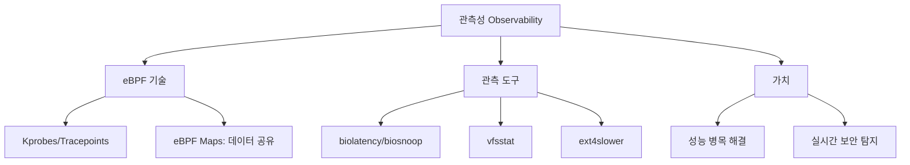

+++
weight = 580
title = "580. 파일 시스템 모니터링 및 eBPF 기반 관측성 (Observability)"
+++

## 핵심 인사이트 (3줄 요약)
> 1. **본질**: 파일 시스템 관측성(Observability)은 커널 내부의 파일 I/O 이벤트를 실시간으로 추적하여 시스템 성능 병목과 보안 위협을 즉각적으로 탐지하는 기술이다.
> 2. **eBPF의 혁신**: 커널 소스 수정이나 모듈 재컴파일 없이, 안전한 샌드박스 프로그램(eBPF)을 커널에 주입하여 I/O 지연 시간, 파일 접근 패턴 등을 극소의 오버헤드로 관측할 수 있게 한다.
> 3. **가치**: 기존의 사후 분석(Post-mortem) 위주 방식에서 벗어나, 실행 중인 시스템의 I/O 경로를 투명하게 시각화함으로써 '가시성(Visibility)'을 획기적으로 향상시킨다.

---

## Ⅰ. 파일 시스템 모니터링의 전통적 방식과 한계 (Context)

- **전통적 도구**: `inotify`, `dnotify`, `auditd`, `strace`.
- **한계**:
  1. **성능 저하**: `strace`는 모든 시스템 콜마다 컨텍스트 스위칭을 유발하여 실운영 환경(Production)에서 사용이 불가능함.
  2. **가시성 부족**: `inotify`는 파일 변경 이벤트는 알 수 있지만, 왜 지연이 발생하는지(Latency Breakdown)는 알 수 없음.
  3. **데이터 폭주**: `auditd`는 너무 많은 로그를 생성하여 시스템 자원을 고갈시킬 수 있음.

> **📢 섹션 요약 비유**: 전통적인 방식은 "식당 손님에게 일일이 '어디가 불편하세요?'라고 묻는 것"과 같습니다. 너무 많이 물어보면 손님이 식사를 못 하고(성능 저하), 대답도 정확하지 않을 수 있습니다.

---

## Ⅱ. eBPF 기반 관측 아키텍처 (Technical Structure)

### 1. eBPF I/O 추적 흐름 ASCII 다이어그램
```text
[ User Space ]       [ Kernel Space (VFS/Block Layer) ]
      |                      |
[ Analytics Tool ] <--- (Maps) --- [ eBPF Program ]
      |                      | (Hook: vfs_read, block_rq_issue)
      v                      v
[ Visualized Stats ]   [ Events / Latency Calculation ]
```

### 2. 작동 원리
- **Kprobes / Uprobes**: 커널 또는 사용자 함수의 시작과 끝에 훅(Hook)을 걸어 실행 정보 수집.
- **Tracepoints**: 커널 개발자가 미리 정의해 둔 정적 트레이싱 지점 활용.
- **eBPF Maps**: 커널 공간에서 수집한 데이터를 사용자 공간으로 전달하기 위한 효율적인 공유 메모리 구조.

> **📢 섹션 요약 비유**: eBPF는 "식당 곳곳에 설치된 고해상도 투명 CCTV"와 같습니다. 손님을 방해하지 않으면서도 주방에서 요리가 나가는 속도, 손님이 숟가락을 드는 횟수까지 정확히 기록합니다.

---

## Ⅲ. 주요 eBPF 기반 파일 시스템 관측 도구 (Tools)

- **biolatency**: 블록 디바이스의 I/O 지연 시간을 히스토그램으로 출력. 어떤 크기의 I/O가 얼마나 느린지 즉시 확인 가능.
- **biosnoop**: 모든 블록 I/O 요청을 상세하게 한 줄씩 출력 (프로세스 ID, 섹터 위치, 지연 시간 포함).
- **vfsstat / vfscount**: VFS 계층에서 발생하는 `read`, `write`, `open`, `fsync` 등의 횟수를 초단위로 집계.
- **ext4slower / xfsslower**: 특정 시간(예: 10ms)보다 느리게 처리된 파일 연산만 골라서 출력.

> **📢 섹션 요약 비유**: `biolatency`는 "요리 시간을 막대그래프로 보여주는 것"이고, `ext4slower`는 "요리가 너무 늦게 나가는 테이블만 골라 벨을 울려주는 시스템"입니다.

---

## Ⅳ. 관측 데이터 기반의 성능 튜닝 (Optimization)

1. **지연 시간 분석**: VFS 계층은 빠른데 블록 계층이 느리다면 하드웨어(SSD/HDD) 문제로 판단.
2. **패턴 인식**: 특정 프로세스가 불필요하게 `fsync()`를 남발하여 시스템 전체의 I/O 성능을 갉아먹는 사례 적발.
3. **캐시 효율 진단**: 페이지 캐시 적중률(Hit Ratio)을 실시간으로 파악하여 메모리 할당량 조정 근거 마련.

> **📢 섹션 요약 비유**: 관측은 "주방장이 요리 도구를 탓할지, 서빙 직원의 동선을 고칠지 결정하기 위한 정확한 데이터 리포트"를 제공하는 것입니다.

---

## Ⅴ. 보안 및 런타임 보안 적용 (Security & Future)

- **파일 무결성 실시간 감시**: 중요 설정 파일(/etc/shadow 등)에 대한 비정상적인 접근 시도를 0.1ms 내에 탐지 및 차단.
- **포렌식 가시성**: 공격자가 로그 파일을 삭제하더라도, eBPF는 이미 커널 레벨에서 해당 행위를 가로채 원격지로 전송 가능.
- **LSM (Linux Security Module) 통합**: eBPF를 사용하여 사용자 정의 보안 정책을 동적으로 적용(KRSI).

> **📢 섹션 요약 비유**: 미래의 보안은 "도둑이 침입한 뒤에 경찰을 부르는 게 아니라, 손을 뻗는 순간 공중에 보이지 않는 투명 장벽이 생겨서 막아버리는 것"과 같습니다.

---

## 💡 지식 그래프 (Knowledge Graph)



## 👶 아이들을 위한 비유 (Child Analogy)
> 여러분의 학교 사물함을 누군가 몰래 열어본다고 생각해 봐요.
> 1. **기존 방식**: 사물함에 먼지를 뿌려두고 나중에 발자국을 확인하는 거예요. (조금 늦게 알게 되죠?)
> 2. **eBPF 방식**: 사물함에 아주 작은 투명 요정을 넣어두는 거예요. 이 요정은 누가 손잡이를 건드리는지, 문을 몇 센티미터 열었는지, 안에 있는 장난감을 만졌는지 실시간으로 여러분의 스마트폰으로 알려준답니다. 심지어 나쁜 마음을 먹은 사람이 오면 요정이 미리 문을 꽉 잠가버릴 수도 있어요!
