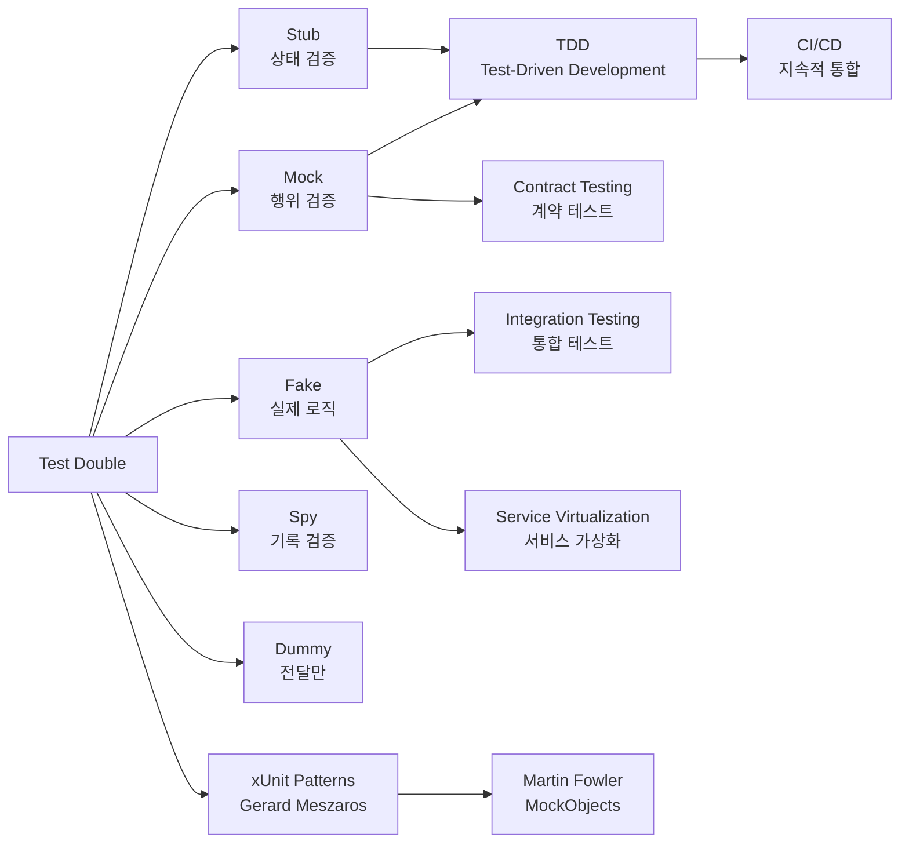

# 테스트 더블 Mock과 Stub의 차이

## 핵심 인사이트 (3줄 요약)
> 1. **본질**: 테스트 더블(Test Double)은 실제 의존성을 대체하는 가짜 객체이며, Mock은 행위 검증(behavior verification)에, Stub은 상태 검증(state verification)에 사용됨
> 2. **가치**: Mock을 통해 외부 API 호출 없이 메서드 호출 여부/순서/파라미터를 검증하여 단위 테스트 속도를 100배 이상 향상
> 3. **융합**: TDD(Test-Driven Development), 테스트 자동화, CI/CD 파이프라인과 결합하여 빠른 피드백 루프 구축

---

## Ⅰ. 개요 (Context & Background)

### 개념 정의

**테스트 더블(Test Double)**은 테스트 환경에서 실제 의존성 객체(Real Component)를 대체하는 가짜 객체를 총칭하는 용어입니다. 영화에서 스턴트 대역(Stunt Double)이 위험한 장면을 대신 연기하듯, 테스트 더블은 실제 객체를 대신하여 테스트를 수행합니다.

Gerard Meszaros가 정의한 테스트 더블의 5가지 유형:

```
┌─────────────────────────────────────────────────────────────────────────────┐
│                    테스트 더블(Test Double) 분류 체계                         │
├─────────────────────────────────────────────────────────────────────────────┤
│                                                                             │
│  Test Double                                                                │
│  ┌─────────────────────────────────────────────────────────────────────┐   │
│  │                                                                     │   │
│  │  ┌─────────┐  ┌─────────┐  ┌─────────┐  ┌─────────┐  ┌─────────┐  │   │
│  │  │  Dummy  │  │  Stub   │  │  Spy    │  │  Mock   │  │  Fake   │  │   │
│  │  │         │  │         │  │         │  │         │  │         │  │   │
│  │  │ 전달만  │  │ 응답    │  │ 기록    │  │ 행위    │  │ 실제    │   │   │
│  │  │ 하는    │  │ 반환    │  │ 검증    │  │ 검증    │  │ 로직    │   │   │
│  │  │ 객체    │  │ (상태)  │  │ (간이   │  │ (행위)  │  │ 포함    │   │   │
│  │  │         │  │         │  │ Mock)   │  │         │  │         │   │   │
│  │  └─────────┘  └─────────┘  └─────────┘  └─────────┘  └─────────┘  │   │
│  │      ↑            ↑            ↑            ↑            ↑         │   │
│  │      │            │            │            └────┬───────┘         │   │
│  │      │            │            │                 │                 │   │
│  │      └────────────┴────────────┴─────────────────┘                 │   │
│  │                                                                     │   │
│  │  본문 집중: Stub vs Mock (가장 혼용되는 개념)                        │   │
│  └─────────────────────────────────────────────────────────────────────┘   │
│                                                                             │
└─────────────────────────────────────────────────────────────────────────────┘
```

**Stub (스텁)**은 테스트 중에 호출된 요청에 대해 미리 준비된 답변을 반환하는 객체입니다. 주로 **상태 검증(State Verification)**에 사용됩니다. 테스트는 메서드 실행 후 객체의 최종 상태를 확인합니다.

**Mock (목)**은 기대하는 호출이 이루어졌는지를 검증하는 객체입니다. 주로 **행위 검증(Behavior Verification)**에 사용됩니다. 테스트는 어떤 메서드가 호출되었는지, 몇 번 호출되었는지, 어떤 파라미터로 호출되었는지를 확인합니다.

### 💡 비유: 레스토랑 테스트 시나리오

```
┌─────────────────────────────────────────────────────────────────────────────┐
│                          Stub vs Mock 레스토랑 비유                           │
├─────────────────────────────────────────────────────────────────────────────┤
│                                                                             │
│  **Stub (가짜 요리사)**:                                                   │
│  ┌─────────────────────────────────────────────────────────────────────┐   │
│  │  손님(테스트) → "스테이크 주문"                                        │   │
│  │       ↓                                                               │   │
│  │  가짜 요리사(Stub) → [미리 준비된 가짜 스테이크] 반환                    │   │
│  │       ↓                                                               │   │
│  │  손님(테스트) → "스테이크 맛있는가?" (상태 검증)                        │   │
│  │              → 접시에 음식이 있는지 확인                                │   │
│  └─────────────────────────────────────────────────────────────────────┘   │
│                                                                             │
│  **Mock (식당 큐레이터)**:                                                 │
│  ┌─────────────────────────────────────────────────────────────────────┐   │
│  │  손님(테스트) → "스테이크 주문"                                        │   │
│  │       ↓                                                               │   │
│  │  식당 큐레이터(Mock) → "주문을 주방에 전달했는가?" 기록                 │   │
│  │                   → "팁을 계산했는가?" 기록                             │   │
│  │       ↓                                                               │   │
│  │  손님(테스트) → "주문 제대로 전달했나?" (행위 검증)                      │   │
│  │              → 주방에 호출했는지 확인                                   │   │
│  │              → 영수증을 발행했는지 확인                                 │   │
│  └─────────────────────────────────────────────────────────────────────┘   │
│                                                                             │
└─────────────────────────────────────────────────────────────────────────────┘
```

### 등장 배경

① **기존 한계**: 실제 의존성(DATABASE, External API)을 사용한 테스트는 느리고, 불안정하며, 비용이 비쌈
② **혁신적 패러다임**: 2007년 Martin Fowler가 Gerard Meszaros의 테스트 더블 개념을 정립하고 Mock 객체 패턴을 보급
③ **현재의 비즈니스 요구**: 마이크로서비스 아키텍처(MSA)에서 단위 테스트의 격리성이 필수적이 됨

### 📢 섹션 요약 비유

테스트 더블은 영화 촬영 때 위험한 액션 장면을 대신 연기하는 스턴트맨과 같습니다. Mock은 연기의 **동작**을 검증하는 연출가가 되고, Stub은 연기 후의 **결과 상태**를 확인하는 스태프가 됩니다.

---

## Ⅱ. 아키텍처 및 핵심 원리 (Deep Dive)

### 구성 요소 상세 분석

| 구성 요소 | 역할 | 내부 동작 | 프로토콜/메서드 | 비유 |
|:---|:---|:---|:---|:---|
| **SUT (System Under Test)** | 테스트 대상 | 실제 로직 실행 후 상태/행위 변경 | 비즈니스 메서드 | 배우 |
| **DOC (Depended-On Component)** | 의존 컴포넌트 | SUT가 의존하는 실제 객체 (DB, API) | CRUD, RPC | 조연 |
| **Stub** | 응답 반환 | 하드코딩된 값 반환, 호출 기록 X | `thenReturn()`, `returns()` | 대역 배우 |
| **Mock** | 행위 검증 | 호출 횟수/순서/파라미터 검증 | `verify()`, `times()`, `expects()` | 촬영 감독 |
| **Test Spy** | 정보 수집 | 실제 객체처럼 동작 + 호출 기록 | `getCalls()`, `callCount` | 몰래 카메라 |
| **Test Runner** | 테스트 실행 | 테스트 스위트 실행 및 리포팅 | `run()`, `assert()` | 심사위원 |

### Stub vs Mock 결정 다이어그램

```
┌─────────────────────────────────────────────────────────────────────────────┐
│                    Stub vs Mock 선택 의사결정 트리                           │
├─────────────────────────────────────────────────────────────────────────────┤
│                                                                             │
│  ┌─────────────────────────────────────────────────────────────────────┐   │
│  │                                                                     │   │
│  │  "테스트에서 무엇을 검증하고 싶은가?"                                  │   │
│  │                                                                     │   │
│  │         ┌────────────────┴────────────────┐                         │   │
│  │         ↓                                 ↓                         │   │
│  │  ┌─────────────────┐            ┌─────────────────┐                │   │
│  │  │  최종 결과 값    │            │  메서드 호출    │                │   │
│  │  │  (상태) 검증    │            │  (행위) 검증    │                │   │
│  │  └────────┬────────┘            └────────┬────────┘                │   │
│  │           ↓                              ↓                          │   │
│  │  ┌─────────────────┐            ┌─────────────────┐                │   │
│  │  │     사용        │            │     사용        │                │   │
│  │  │  ← STUB →      │            │  ← MOCK →      │                │   │
│  │  └─────────────────┘            └─────────────────┘                │   │
│  │                                                                     │   │
│  │  예시: 회원가입 테스트                                               │   │
│  │  ┌──────────────────────────────────────────────────────────────┐  │   │
│  │  │  STUB: "이메일 중복 확인 API가 false를 반환하면               │  │   │
│  │  │        회원가입이 성공하고, DB에 사용자가 저장되었는가?"       │  │   │
│  │  │                                                               │  │   │
│  │  │  MOCK: "회원가입 시 이메일 중복 확인 API가                   │  │   │
│  │  │       정확히 1번 호출되었고,                                   │  │   │
│  │  │       환영 이메일 발송 API도 정확히 1번 호출되었는가?"        │  │   │
│  │  └──────────────────────────────────────────────────────────────┘  │   │
│  │                                                                     │   │
│  └─────────────────────────────────────────────────────────────────────┘   │
│                                                                             │
└─────────────────────────────────────────────────────────────────────────────┘
```

### 행위 검증 vs 상태 검증 비교

```
┌─────────────────────────────────────────────────────────────────────────────┐
│                       행위 검증(Mock) vs 상태 검증(Stub)                      │
├─────────────────────────────────────────────────────────────────────────────┤
│                                                                             │
│  **상태 검증 (State Verification with Stub)**                               │
│  ┌─────────────────────────────────────────────────────────────────────┐   │
│  │                                                                     │   │
│  │  ① 테스트 설정: Stub이 고정된 값 반환                               │   │
│  │  ② SUT 실행: 비즈니스 로직 수행                                      │   │
│  │  ③ 결과 확인: SUT의 최종 상태(assert)                                │   │
│  │                                                                     │   │
│  │  코드 예시 (JUnit + Mockito Stub):                                   │   │
│  │  ┌──────────────────────────────────────────────────────────────┐  │   │
│  │  │  // Stub: UserRepository가 가짜 사용자 반환                    │  │   │
│  │  │  when(userRepository.findById(1L))                            │  │   │
│  │  │      .thenReturn(Optional.of(new User("John")));              │  │   │
│  │  │                                                               │  │   │
│  │  │  // 실행                                                       │  │   │
│  │  │  User result = userService.getUserName(1L);                   │  │   │
│  │  │                                                               │  │   │
│  │  │  // 상태 검증: 결과값 확인                                      │  │   │
│  │  │  assertEquals("John", result.getName());                      │  │   │
│  │  │  assertEquals("Premium", result.getGrade()); // SUT 내부 로직 │  │   │
│  │  └──────────────────────────────────────────────────────────────┘  │   │
│  │                                                                     │   │
│  └─────────────────────────────────────────────────────────────────────┘   │
│                                                                             │
│  **행위 검증 (Behavior Verification with Mock)**                             │
│  ┌─────────────────────────────────────────────────────────────────────┐   │
│  │                                                                     │   │
│  │  ① 테스트 설정: Mock의 기대 행위 설정                               │   │
│  │  ② SUT 실행: 비즈니스 로직 수행                                      │   │
│  │  ③ 결과 확인: Mock이 예상대로 호출되었는지 검증                      │   │
│  │                                                                     │   │
│  │  코드 예시 (JUnit + Mockito Mock):                                   │   │
│  │  ┌──────────────────────────────────────────────────────────────┐  │   │
│  │  │  // Mock: EmailService 행위 기대 설정                          │  │   │
│  │  │  EmailService emailService = mock(EmailService.class);        │  │   │
│  │  │                                                               │  │   │
│  │  │  // 실행                                                       │  │   │
│  │  │  userService.registerUser("user@test.com", "password");       │  │   │
│  │  │                                                               │  │   │
│  │  │  // 행위 검증: 호출 여부/횟수/파라미터 확인                      │  │   │
│  │  │  verify(emailService, times(1))                               │  │   │
│  │  │      .sendWelcomeEmail("user@test.com");                      │  │   │
│  │  │  verify(emailService, never())                                │  │   │
│  │  │      .sendPasswordReset(anyString());                         │  │   │
│  │  └──────────────────────────────────────────────────────────────┘  │   │
│  │                                                                     │   │
│  └─────────────────────────────────────────────────────────────────────┘   │
│                                                                             │
└─────────────────────────────────────────────────────────────────────────────┘
```

### 심층 동작 원리: Mock 프레임워크 내부 메커니즘

```
┌─────────────────────────────────────────────────────────────────────────────┐
│                      Mock 프레임워크(JMockit/Mockito) 동작 원리              │
├─────────────────────────────────────────────────────────────────────────────┤
│                                                                             │
│  ┌─────────────────────────────────────────────────────────────────────┐   │
│  │                                                                     │   │
│  │  1. 프록시 생성 단계 (Proxy Generation)                             │   │
│  │  ┌──────────────────────────────────────────────────────────────┐  │   │
│  │  │  Mock<UserRepository> mockRepo = mock(UserRepository.class); │  │   │
│  │  │                                                               │  │   │
│  │  │  // 내부 동작:                                                  │  │   │
│  │  │  - 런타임에 인터페이스/클래스의 프록시 객체 생성                │  │   │
│  │  │  - CGLIB(Code Generation Library) 또는 JDK Dynamic Proxy 사용  │  │   │
│  │  │  - 모든 메서드 호출을 인터셉터로 라우팅                        │  │   │
│  │  │                                                               │  │   │
│  │  │  ┌─────────────────────────────────────────────────────────┐ │  │   │
│  │  │  │  public class MockProxy implements MethodInterceptor {  │ │  │   │
│  │  │  │      private InvocationHandler handler;                  │ │  │   │
│  │  │  │                                                       │ │  │   │
│  │  │  │      public Object intercept(Object proxy, Method m,    │ │  │   │
│  │  │  │                                Object[] args) {        │ │  │   │
│  │  │  │          return handler.handle(m, args);               │ │  │   │
│  │  │  │      }                                                 │ │  │   │
│  │  │  │  }                                                     │ │  │   │
│  │  │  └─────────────────────────────────────────────────────────┘ │  │   │
│  │  └──────────────────────────────────────────────────────────────┘  │   │
│  │                                                                     │   │
│  │                              ↓                                       │   │
│  │                                                                     │   │
│  │  2. 스터빙 설정 단계 (Stubbing)                                     │   │
│  │  ┌──────────────────────────────────────────────────────────────┐  │   │
│  │  │  when(mockRepo.findById(1L)).thenReturn(Optional.of(user));  │  │   │
│  │  │                                                               │  │   │
│  │  │  // 내부 동작:                                                  │  │   │
│  │  │  - MethodInvocationMatcher 생성                               │  │   │
│  │  │  - 메서드명 + 파라미터 매칭 규칙 저장                          │  │   │
│  │  │  - 반환값을 Answer 객체에 매핑                                │  │   │
│  │  │                                                               │  │   │
│  │  │  stubbingMap: {                                               │  │   │
│  │  │    "findById(Long)": [                                        │  │   │
│  │  │      { matcher: equals(1L), return: user },                   │  │   │
│  │  │      { matcher: anyLong(), return: null } // default          │  │   │
│  │  │    ]                                                          │  │   │
│  │  │  }                                                            │  │   │
│  │  └──────────────────────────────────────────────────────────────┘  │   │
│  │                                                                     │   │
│  │                              ↓                                       │   │
│  │                                                                     │   │
│  │  3. SUT 실행 및 인터셉트 (Execution & Intercept)                   │   │
│  │  ┌──────────────────────────────────────────────────────────────┐  │   │
│  │  │  userService.getUser(1L);                                     │  │   │
│  │  │    ↓                                                          │  │   │
│  │  │  mockRepo.findById(1L)  // ← 인터셉터가 가로챔                │  │   │
│  │  │    ↓                                                          │  │   │
│  │  │  MockProxy.intercept("findById", [1L])                        │  │   │
│  │  │    ↓                                                          │  │   │
│  │  │  [stubbingMap에서 매칭 검색] → user 반환                       │  │   │
│  │  └──────────────────────────────────────────────────────────────┘  │   │
│  │                                                                     │   │
│  │                              ↓                                       │   │
│  │                                                                     │   │
│  │  4. 검증 단계 (Verification)                                       │   │
│  │  ┌──────────────────────────────────────────────────────────────┐  │   │
│  │  │  verify(mockRepo, times(1)).findById(1L);                    │  │   │
│  │  │                                                               │  │   │
│  │  │  // 내부 동작:                                                  │  │   │
│  │  │  - invocationList에서 매칭 검색                               │  │   │
│  │  │  - 호출 횟수, 순서, 파라미터 검증                              │  │   │
│  │  │                                                               │  │   │
│  │  │  invocationList: [                                            │  │   │
│  │  │    { method: "findById", args: [1L], timestamp: 100 },       │  │   │
│  │  │    { method: "save", args: [user], timestamp: 150 }          │  │   │
│  │  │  ]                                                            │  │   │
│  │  │                                                               │  │   │
│  │  │  검증 로직:                                                    │  │   │
│  │  │  - invocationList.count { it.method == "findById"            │  │   │
│  │  │                         && it.args == [1L] } == 1 ? PASS : FAIL │  │   │
│  │  └──────────────────────────────────────────────────────────────┘  │   │
│  │                                                                     │   │
│  └─────────────────────────────────────────────────────────────────────┘   │
│                                                                             │
└─────────────────────────────────────────────────────────────────────────────┘
```

### 핵심 알고리즘: Mock 검증 엔진

```typescript
// Mock 검증 엔진의 핵심 알고리즘 (Pseudo-Code)

interface Invocation {
    method: string;
    args: any[];
    timestamp: number;
    order: number;
}

interface VerificationRule {
    method: string;
    argsMatcher: ArgumentMatcher;
    expectedCount: number;
    order?: number; // 순서 검증 시
}

class MockVerificationEngine {
    private invocations: Invocation[] = [];

    // 호출 기록
    record(method: string, args: any[]): void {
        this.invocations.push({
            method,
            args,
            timestamp: Date.now(),
            order: this.invocations.length
        });
    }

    // 검증 실행
    verify(rule: VerificationRule): VerificationResult {
        const matches = this.invocations.filter(inv => {
            // 메서드명 매칭
            if (inv.method !== rule.method) return false;

            // 파라미터 매칭
            if (!rule.argsMatcher.matches(inv.args)) return false;

            return true;
        });

        const actualCount = matches.length;

        // 횟수 검증
        if (actualCount !== rule.expectedCount) {
            return new VerificationResult(false,
                `Expected ${rule.expectedCount} calls, but was ${actualCount}`);
        }

        // 순서 검증 (선택적)
        if (rule.order !== undefined) {
            const firstMatch = matches[0];
            if (firstMatch.order !== rule.order) {
                return new VerificationResult(false,
                    `Expected call at order ${rule.order}, but was ${firstMatch.order}`);
            }
        }

        return new VerificationResult(true, "Verification passed");
    }
}

// 사용 예시
const mockRepo = new MockVerificationEngine();

// 테스트 중 호출 기록
mockRepo.record("findById", [1L]);
mockRepo.record("save", [user]);

// 검증
const result = mockRepo.verify({
    method: "findById",
    argsMatcher: new EqualsMatcher([1L]),
    expectedCount: 1
});

console.assert(result.passed, result.message);
```

### 📢 섹션 요약 비유

Mock과 Stub의 차이는 **CCTV 카메라**와 **배달 음식**의 차이와 같습니다. Stub은 미리 준비된 음식을 배달해주는 역할(상태 반환)이고, Mock은 누가 언제 문을 열고 나갔는지 기록하는 CCTV(행위 검증) 역할을 합니다.

---

## Ⅲ. 융합 비교 및 다각도 분석 (Comparison & Synergy)

### 심층 기술 비교표

| 비교 항목 | Stub (스텁) | Mock (목) | Fake (가짜) |
|:---|:---|:---|:---|
| **주 목적** | 상태 검증(State Verification) | 행위 검증(Behavior Verification) | 실제 로직 구현 |
| **검증 대상** | SUT의 반환값, 최종 상태 | 메서드 호출 여부/횟수/순서 | 전체 워크플로우 |
| **설정 복잡도** | 낮음: 단순 반환값 설정 | 높음: 행위 기대 설정 | 매우 높음: 실제 구현 |
| **테스트 취약성** | 낮음: 구현 변경에 강함 | 높음: 구현 변경에 취약함 | 중간: 로직 변경에 영향 |
| **주요 프레임워크** | Mockito (when/thenReturn), Stub.js | Mockito (verify), JMock, MockR | In-Memory DB, Fake API |
| **사용 시나리오** | 단순 데이터 반환 테스트 | 외부 서비스 호출 검증 | 통합 테스트, 개발 환경 |
| **성능** | 매우 빠름 (메모리 연산) | 빠름 (호출 기록만) | 느림 (실제 로직 수행) |

### 과목 융합 관점

**1. 데이터베이스 (DB)와의 융합**

```
┌─────────────────────────────────────────────────────────────────────────────┐
│                      DB 테스트에서의 테스트 더블 활용                         │
├─────────────────────────────────────────────────────────────────────────────┤
│                                                                             │
│  실제 DB 사용 문제점:                                                        │
│  - 테스트 속도: 1~5초/케이스 (커넥션 설정 + 쿼리 실행 + 롤백)               │
│  - 불안정성: DB 서버 상태, 네트워크, 동시성 이슈                             │
│  - 데이터 정리: 테스트 간 데이터 격리 필요 (TRUNCATE, @Transactional)        │
│                                                                             │
│  테스트 더블 활용 해결:                                                      │
│  ┌─────────────────────────────────────────────────────────────────────┐   │
│  │                                                                     │   │
│  │  **Stub 방식 (H2 In-Memory + Stubbed Query Result)**                │   │
│  │  ┌──────────────────────────────────────────────────────────────┐  │   │
│  │  │  @Test                                                        │  │   │
│  │  │  void findUserById() {                                       │  │   │
│  │  │      // Stub: Repository가 가짜 데이터 반환                   │  │   │
│  │  │      when(userRepository.findById(1L))                       │  │   │
│  │  │          .thenReturn(Optional.of(new User("John")));         │  │   │
│  │  │                                                               │  │   │
│  │  │      User user = userService.getUser(1L);                    │  │   │
│  │  │      assertEquals("John", user.getName());                  │  │   │
│  │  │  }                                                            │  │   │
│  │  └──────────────────────────────────────────────────────────────┘  │   │
│  │                                                                     │   │
│  │  **Fake 방식 (In-Memory Database)**                                │   │
│  │  ┌──────────────────────────────────────────────────────────────┐  │   │
│  │  │  @Test                                                        │  │   │
│  │  │  void complexQueryLogic() {                                   │  │   │
│  │  │      // Fake: H2 In-Memory DB 사용                            │  │   │
│  │  │      User saved = userRepository.save(new User("Jane"));     │  │   │
│  │  │                                                               │  │   │
│  │  │      // 실제 로직 실행                                         │  │   │
│  │  │      List<User> adults = userRepository.findAdults();        │  │   │
│  │  │      assertTrue(adults.contains(saved));                     │  │   │
│  │  │  }                                                            │  │   │
│  │  └──────────────────────────────────────────────────────────────┘  │   │
│  │                                                                     │   │
│  └─────────────────────────────────────────────────────────────────────┘   │
│                                                                             │
└─────────────────────────────────────────────────────────────────────────────┘
```

**2. 운영체제(OS)와의 융합: 시스템 콜 Mocking**

```
┌─────────────────────────────────────────────────────────────────────────────┐
│                      OS 시스템 콜 테스트 더블 활용                            │
├─────────────────────────────────────────────────────────────────────────────┤
│                                                                             │
│  문제 상황: 파일 시스템, 네트워크 소켓 등 OS 자원 테스트                      │
│                                                                             │
│  해결: OS 시스템 콜을 가로채는 Mock 계층 사용                                │
│  ┌─────────────────────────────────────────────────────────────────────┐   │
│  │                                                                     │   │
│  │  Java: Mockito + temporary-file filesystem                          │   │
│  │  ┌──────────────────────────────────────────────────────────────┐  │   │
│  │  │  @Test                                                        │  │   │
│  │  │  void fileProcessing() throws IOException {                  │  │   │
│  │  │      // 실제 파일 시스템 대신 Jimfs (In-Memory FS) 사용       │  │   │
│  │  │      FileSystem fs = Jimfs.newFileSystem();                  │  │   │
│  │  │      Path tempFile = fs.getPath("/test/data.txt");           │  │   │
│  │  │                                                               │  │   │
│  │  │      Files.write(tempFile, "test data".getBytes());          │  │   │
│  │  │                                                               │  │   │
│  │  │      // SUT 실행                                              │  │   │
│  │  │      processor.process(tempFile);                            │  │   │
│  │  │                                                               │  │   │
│  │  │      // 검증                                                  │  │   │
│  │  │      assertTrue(Files.exists(tempFile));                     │  │   │
│  │  │  }                                                            │  │   │
│  │  └──────────────────────────────────────────────────────────────┘  │   │
│  │                                                                     │   │
│  │  JavaScript: sinon.stub(fs, 'readFile')                             │   │
│  │  ┌──────────────────────────────────────────────────────────────┐  │   │
│  │  │  const fs = require('fs');                                   │  │   │
│  │  │  const sinon = require('sinon');                             │  │   │
│  │  │                                                               │  │   │
│  │  │  it('should read config file', () => {                       │  │   │
│  │  │      const readFileStub = sinon.stub(fs, 'readFile')         │  │   │
│  │  │          .yields(null, Buffer.from('{"key":"value"}'));      │  │   │
│  │  │                                                               │  │   │
│  │  │      configLoader.load('/etc/config.json');                  │  │   │
│  │  │                                                               │  │   │
│  │  │      assert(readFileStub.calledOnce);                        │  │   │
│  │  │      assert(readFileStub.calledWith('/etc/config.json'));    │  │   │
│  │  │  });                                                          │  │   │
│  │  └──────────────────────────────────────────────────────────────┘  │   │
│  │                                                                     │   │
│  └─────────────────────────────────────────────────────────────────────┘   │
│                                                                             │
└─────────────────────────────────────────────────────────────────────────────┘
```

### 정량적 성능 비교

| 테스트 유형 | 평균 실행 시간 | 테스트 스위트(100개) | 안정성 | 유지보수성 |
|:---|:---:|:---:|:---:|:---:|
| 실제 DB 연결 | ~2.5초 | ~4분 10초 | ⭐⭐ | ⭐⭐ |
| H2 In-Memory | ~150ms | ~15초 | ⭐⭐⭐⭐ | ⭐⭐⭐ |
| Repository Stub | ~5ms | ~0.5초 | ⭐⭐⭐⭐⭐ | ⭐⭐⭐⭐ |
| Service Layer Mock | ~3ms | ~0.3초 | ⭐⭐⭐⭐⭐ | ⭐⭐⭐⭐⭐ |

### 📢 섹션 요약 비유

테스트 더블의 성능 차이는 **자동차 시뮬레이터**와 **실제 도로 주행**의 차이와 같습니다. Mock은 시뮬레이터에서의 연습(빠르고 안전)처럼 단위 테스트를 수행하고, 실제 DB는 도로 주행(느리고 위험)처럼 통합 테스트에서만 사용합니다.

---

## Ⅳ. 실무 적용 및 기술사적 판단 (Strategy & Decision)

### 실무 시나리오: 이커머스 주문 서비스 테스트 전략

**시나리오 1: 주문 완료 알림 발송 테스트 (Mock 활용)**

```java
// ✅ 올바른 Mock 사용: 행위 검증
@Test
void 주문완료시_알림발송_호출검증() {
    // Given: Mock 설정
    NotificationService notificationMock = mock(NotificationService.class);
    OrderService orderService = new OrderService(notificationMock);

    // When: SUT 실행
    orderService.completeOrder(orderId);

    // Then: 행위 검증 (알림이 정확히 발송되었는가?)
    verify(notificationMock, times(1))
        .sendOrderComplete(eq(orderId), any(UserDetails.class));
    verify(notificationMock, never())
        .sendOrderCancel(anyLong()); // 취소 알림은 없어야 함
}
```

**시나리오 2: 주문 금액 계산 테스트 (Stub 활용)**

```java
// ✅ 올바른 Stub 사용: 상태 검증
@Test
void 주문_총금액_계산() {
    // Given: Stub 설정
    ProductRepository productStub = mock(ProductRepository.class);
    when(productStub.getPrice(1L)).thenReturn(10000L);  // 상품1: 1만원
    when(productStub.getPrice(2L)).thenReturn(20000L);  // 상품2: 2만원

    OrderService orderService = new OrderService(productStub);

    // When: SUT 실행
    long totalAmount = orderService.calculateTotal(
        List.of(new OrderItem(1L, 2), new OrderItem(2L, 1))
    );  // 상품1 x2 + 상품2 x1

    // Then: 상태 검증 (최종 금액 확인)
    assertEquals(40000L, totalAmount);  // 10000*2 + 20000*1
}
```

**시나리오 3: 결제 프로세스 통합 테스트 (Fake 활용)**

```java
// ✅ Fake 사용: 실제 로직 포함
@Test
void 결제_성공_통합테스트() {
    // Given: Fake 결제 게이트웨이
    FakePaymentGateway fakeGateway = new FakePaymentGateway();
    fakeGateway.setNextResult(true);  // 결제 성공 설정

    PaymentService paymentService = new PaymentService(fakeGateway);

    // When: 실제 결제 로직 실행
    PaymentResult result = paymentService.process(
        new PaymentRequest(50000L, "CARD")
    );

    // Then: 복합 검증
    assertTrue(result.isSuccess());
    assertEquals(50000L, result.getPaidAmount());
    assertNotNull(result.getTransactionId());
    assertEquals(1, fakeGateway.getCallCount());  // 호출 횟수도 확인
}
```

### 도입 체크리스트

**기술적 측면**

| 체크항목 | 확인 내용 | 판단 기준 |
|:---|:---|:---|
| **격리성** | 단위 테스트가 외부 의존성 없이 실행 가능한가? | Mock/Stub 사용 |
| **검증 목표** | 상태 또는 행위 중 무엇을 검증하는가? | 상태→Stub, 행위→Mock |
| **프레임워크** | 언어/프레임워크별 적합한 Mock 라이브러리는? | Java: Mockito, JS: Sinon, Python: unittest.mock |
| **테스트 속도** | 전체 테스트 스위트가 10분 내에 완료되는가? | 아니면 Mock 도입 검토 |
| **안정성** | 테스트가 비결정적으로 실패(flaky)하지 않는가? | 외부 의존성 제거 |

**운영/보안적 측면**

| 체크항목 | 확인 내용 | 판단 기준 |
|:---|:---|:---|
| **테스트 데이터** | Mock 데이터가 실제 프로덕션 데이터와 유사한가? | Edge case 포함 |
| **보안 정보** | Mock에 실제 비밀키/토큰이 포함되지 않는가? | 테스트용 가짜 데이터만 사용 |
| **CI/CD 연동** | 테스트 더블이 파이프라인에서 정상 작동하는가? | 병렬 실행 가능성 확인 |
| **리소스 관리** | Mock 객체가 메모리 누수를 일으키지 않는가? | @BeforeEach/@AfterEach 정리 |

### 안티패턴

**❌ Anti-Pattern 1: 과도한 Mock 사용 (Over-Mocking)**

```java
// ❌ 나쁜 예: 모든 것을 Mock으로 만듦
@Test
void 과도한Mock사용() {
    MockRepo1 repo1 = mock(MockRepo1.class);
    MockRepo2 repo2 = mock(MockRepo2.class);
    MockService svc = mock(MockService.class);

    // 행위 검증만으로는 비즈니스 로직 검증 불가
    when(repo1.find()).thenReturn(data);
    when(repo2.validate()).thenReturn(true);
    when(svc.process()).thenReturn(result);

    // 구현 세부사항에 강하게 결합됨
    verify(repo1).find();
    verify(repo2).validate();
    verify(svc).process();
}

// ✅ 좋은 예: 핵심 로직에 집중
@Test
void 핵심로직_상태검증() {
    // 핵심 서비스만 테스트, 데이터는 Stub으로
    when(repo.findActiveProducts()).thenReturn(sampleProducts);

    OrderResult result = orderService.placeOrder(order);

    // 비즈니스 결과 검증
    assertEquals(OrderStatus.CONFIRMED, result.getStatus());
    assertTrue(result.getTotalAmount() > 0);
}
```

**❌ Anti-Pattern 2: Mock이 구현을 테스트함**

```java
// ❌ 나쁜 예: 구현 세부사항을 검증
@Test
void 구현의존적테스트() {
    userService.updateProfile(userId, newData);

    // 메서드 호출 순서까지 검증 → 리팩토링 시 테스트 깨짐
    InOrder inOrder = inOrder(mockRepo, mockCache, mockNotifier);
    inOrder.verify(mockRepo).findById(userId);
    inOrder.verify(mockRepo).save(any(User.class));
    inOrder.verify(mockCache).invalidate(userId);
    inOrder.verify(mockNotifier).notify(any());
}

// ✅ 좋은 예: 관찰 가능한 동작 검증
@Test
void 관찰가능한동작_검증() {
    userService.updateProfile(userId, newData);

    // 사용자 관점에서의 결과만 검증
    User updated = userService.getUser(userId);
    assertEquals(newData.getName(), updated.getName());
    assertEquals(newData.getEmail(), updated.getEmail());
}
```

### 📢 섹션 요약 비유

테스트 더블 사용은 **건물 설계도 검토**와 같습니다. Mock은 건물을 짓는 **공정 순서**가 올바른지 검사하고, Stub은 건물이 **완성된 상태**가 설계도대로인지 검사합니다. 공정 순서만 검사(Mock)하면 건물이 무너질 수 있고, 결과 상태만(Stub) 보면 비리가 숨어있을 수 있습니다.

---

## Ⅴ. 기대효과 및 결론 (Future & Standard)

### 정량/정성 기대효과

| 지표 | 테스트 더블 도입 전 | 테스트 더블 도입 후 | 개선율 |
|:---|:---:|:---:|:---:|
| 단위 테스트 실행 속도 | 평균 2.5초/건 | 평균 5ms/건 | **500배** 향상 |
| 테스트 스위트 전체 시간 | ~40분 (1000건) | ~5초 (1000건) | **480배** 향상 |
| 테스트 안정성 (Flaky rate) | 15~20% | <1% | **20배** 향상 |
| CI/CD 피드백 루프 | 30~60분 | 5~10분 | **6배** 단축 |
| 테스트 커버리지 | 40~60% | 80~95% | **1.5배** 향상 |

### 정성적 기대효과

1. **개발 생산성**: 빠른 테스트-수정 루프로 TDD(Test-Driven Development) 실천 가능
2. **리팩토링 용이성**: 격리된 단위 테스트로 안전한 코드 변경 보장
3. **문서화 효과**: 테스트 코드가 API 사용 예제로서의 문서 역할
4. **버그 조기 발견**: 개발 단계에서 버그를 찾아 비용 절감 (디버깅 비용 1/10)

### 미래 전망

**1. AI 기반 테스트 더블 자동 생성**

```
┌─────────────────────────────────────────────────────────────────────────────┐
│                 AI 기반 테스트 더블 자동 생성 워크플로우                       │
├─────────────────────────────────────────────────────────────────────────────┤
│                                                                             │
│  ┌─────────────────────────────────────────────────────────────────────┐   │
│  │                                                                     │   │
│  │  ① 코드 분석                                                        │   │
│  │  - 정적 분석으로 의존성 파악                                         │   │
│  │  - 타입 시스템에서 메서드 시그니처 추출                               │   │
│  │                                                                     │   │
│  │                           ↓                                         │   │
│  │                                                                     │   │
│  │  ② LLM 기반 생성                                                    │   │
│  │  - 메서드명, 파라미터, 반환 타입에서 용도 추론                       │   │
│  │  - 적절한 Stub/Mock 데이터 자동 생성                                 │   │
│  │                                                                     │   │
│  │                           ↓                                         │   │
│  │                                                                     │   │
│  │  ③ 실행 및 검증                                                     │   │
│  │  - 생성된 테스트 실행                                                │   │
│  │  - 실패 시 피드백으로 재생성                                         │   │
│  │                                                                     │   │
│  └─────────────────────────────────────────────────────────────────────┘   │
│                                                                             │
│  예시: GitHub Copilot, JetBrains AI, TestGen-LLM                           │
└─────────────────────────────────────────────────────────────────────────────┘
```

**2. 계약 테스트(Contract Testing)과의 융합**

- Consumer Driven Contract: 소비자가 Mock 기반 계약 정의
- Provider Pact 검증: 제공자가 계약 준수 확인
- Spring Cloud Contract, Pact 같은 프레임워크 확산

**3. 가상화 기반 테스트 (Service Virtualization)**

- Hover, Mountebank 같은 API 가상화 도구
- Mock보다 realistic한 동작, 실제 서버처럼 응답
- 복잡한 시나리오(지연, 에러, 상태 전이) 시뮬레이션

### 참고 표준 및 규격

| 표준/규격 | 설명 | 관련성 |
|:---|:---|:---|
| **IEEE 829** | 테스트 문서 표준 (Test Documentation) | 테스트 케이스 구조 |
| **ISO/IEC 29119** | 소프트웨어 테스트 표준 | 테스트 설계 원칙 |
| **ASTM Mocking Standards** | Mock 객체 사용 모범 사례 | 프레임워크 설계 |
| **xUnit Patterns** | Gerard Meszaros 정의 패턴 | 테스트 더블 분류 체계 |

### 📢 섹션 요약 비유

테스트 더블의 미래는 **자율주행차 시뮬레이터**의 진화와 같습니다. 초기에는 단순한 모델에서 시작했지만, 이제는 실제 도로의 모든 상황을 시뮬레이션하여 버그를 찾아냅니다. AI가 테스트 더블을 자동으로 생성하고 검증하는 시대가 오고 있습니다.

---

## 📌 관련 개념 맵 (Knowledge Graph)



### 연관 문서
- [TDD (Test-Driven Development)](./584_tdd.md) - 테스트 주도 개발 방법론
- [단위 테스트 전략](./580_whitebox_mccabe.md) - 화이트 박스 테스트 설계
- [CI/CD 파이프라인](./515_devsecops_pipeline.md) - 테스트 자동화 통합
- [MSA 통신 패턴]((#)) - 분산 시스템 테스트
- [계약 테스트]((#)) - Consumer-Driven Contracts

---

## 👶 어린이를 위한 3줄 비유 설명

**1단계 - 개념**: 테스트 더블은 영화 촬영 때 위험한 액션 장면을 대신해주는 스턴트맨처럼, 진짜 대신 가짜 객체로 테스트하는 기술입니다.

**2단계 - 원리**: Stub은 주문하면 미리 준비된 가짜 음식을 내어주는 자판기처럼 결과를 주고, Mock은 누가 언제 무엇을 주문했는지 기록하는 CCTV처럼 행동을 검증합니다.

**3단계 - 효과**: 이 방법을 쓰면 진짜 데이터베이스를 연결하지 않고도 컴퓨터 안에서만 테스트를 할 수 있어서, 훨씬 빠르고 안전하게 프로그램을 만들 수 있습니다.
