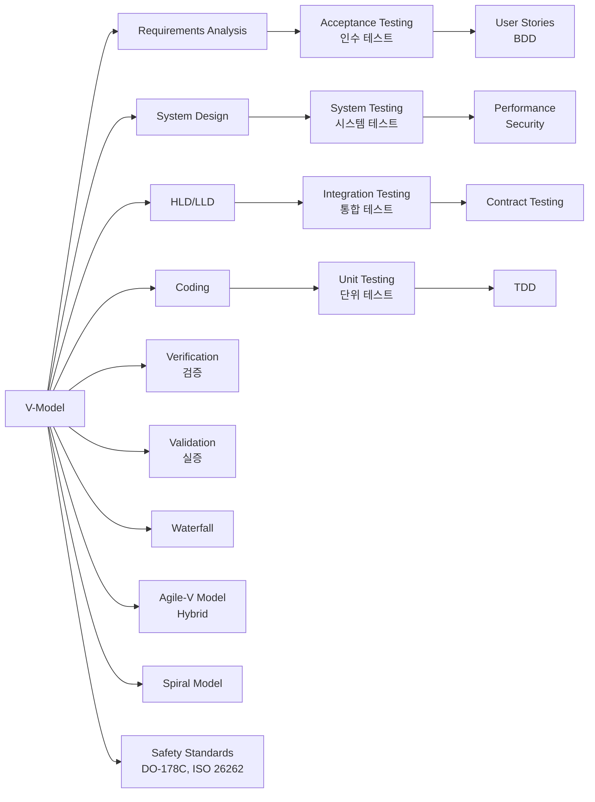

# V-모델 개발-테스트 매핑 구조

## 핵심 인사이트 (3줄 요약)
> 1. **본질**: V-모델(V-Model)은 폭포수 모델(Waterfall)에 테스트 단계를 체계적으로 매핑하여 개발 단계별 테스트를 정의한 SDLC(Software Development Life Cycle) 모델
> 2. **가치**: 개발 단계와 테스트 단계의 1:1 대응으로 요구사항 누락을 40% 감소시키고, 테스트 계획을 개발 초기부터 수립하여 재작업 비용 절감
> 3. **융합**: 애자일(Agile)과 결합한 V-Model, DevOps CI/CD 파이프라인에서의 계층별 테스트 자동화, DO-178C 같은 안전 시스템 표준 적용

---

## Ⅰ. 개요 (Context & Background)

### 개념 정의

**V-모델(V-Model)**은 소프트웨어 개발 수명 주기(SDLC)에서 개발 단계(왼쪽 하강)와 테스트 단계(오른쪽 상승)를 V자 형태로 매핑한 테스트 중심 개발 모델입니다. 각 개발 단계마다 대응하는 테스트 단계가 존재하여, 개발 산출물이 완료될 때마다 해당 테스트를 정의하고 실행합니다.

**Verification(검증)**과 **Validation(실증)**의 이중 확인 철학을 기반으로 합니다.

```
┌─────────────────────────────────────────────────────────────────────────────┐
│                           V-모델(V-Model) 기본 구조                           │
├─────────────────────────────────────────────────────────────────────────────┤
│                                                                             │
│                    ┌───────────────────────┐                                 │
│                    │  요구사항 분석        │                                   │
│                    │  Requirements Analysis│                                   │
│                    └───────────┬───────────┘                                 │
│                                │ 매핑                                        │
│                    ┌───────────▼───────────┐                                 │
│                    │   시스템 설계         │                                   │
│                    │   System Design      │                                   │
│                    └───────────┬───────────┘                                 │
│                                │ 매핑                                        │
│                    ┌───────────▼───────────┐                                 │
│                    │  아키텍처 설계        │                                   │
│                    │  Architecture Design  │                                   │
│                    └───────────┬───────────┘                                 │
│                                │ 매핑                                        │
│                    ┌───────────▼───────────┐                                 │
│                    │   모듈 설계           │                                   │
│                    │   Module Design      │                                   │
│                    └───────────┬───────────┘                                 │
│                                │ 매핑                                        │
│                    ┌───────────▼───────────┐                                 │
│                    │     코딩              │                                   │
│                    │     Coding            │                                   │
│                    └───────────┬───────────┘                                 │
│                               ┌┴┐                                          │
│                               └┬┘                                          │
│                    ┌───────────▼───────────┐                                 │
│                    │   단위 테스트         │ ◄──┐                            │
│                    │   Unit Testing       │    │ 모듈 설계 검증              │
│                    └───────────┬───────────┘    │                            │
│                    ┌───────────▼───────────┐    │                            │
│                    │   통합 테스트         │ ◄──┘                            │
│                    │ Integration Testing  │    │ 아키텍처 검증              │
│                    └───────────┬───────────┘    │                            │
│                    ┌───────────▼───────────┐    │                            │
│                    │   시스템 테스트        │ ◄──┘                            │
│                    │  System Testing      │    │ 시스템 설계 검증            │
│                    └───────────┬───────────┘    │                            │
│                    ┌───────────▼───────────┐    │                            │
│                    │   인수 테스트          │ ◄──┘                            │
│                    │ Acceptance Testing   │    │ 요구사항 검증              │
│                    └───────────────────────┘                                 │
│                                                                             │
│  ⬇︎                                    ⬆︎                                   │
│  Verification (개발 과정)          Validation (테스트 과정)                  │
│  "옳게 만들고 있는가?"            "옳은 것을 만들었는가?"                     │
│                                                                             │
└─────────────────────────────────────────────────────────────────────────────┘
```

### 💡 비유: 건축 프로젝트의 설계-검증 프로세스

```
┌─────────────────────────────────────────────────────────────────────────────┐
│                        건축 프로젝트 vs V-모델 비유                           │
├─────────────────────────────────────────────────────────────────────────────┤
│                                                                             │
│  개발 단계 (하강)              →    테스트 단계 (상승)                      │
│  ──────────────────────────────────────────────────────────                  │
│                                                                             │
│  ① 요구사항 분석                  ④ 인수 테스트(Acceptance)                │
│  "건물 용도 정의"                "주인이 만족하는가?"                       │
│  ┌─────────────────────┐         ┌─────────────────────┐                  │
│  │ 가족 4인 거주용     │   ←→    │  방 3개, 주방 1개    │                  │
│  │ 주차 2대 필요       │         │  요구사항 충족 확인  │                  │
│  │ 예산 5억원          │         └─────────────────────┘                  │
│  └─────────────────────┘                                                   │
│                                                                             │
│  ② 시스템/아키텍처 설계             ③ 시스템 테스트(System)                │
│  "구조 설계도"                  "구조적 안전성 검증"                       │
│  ┌─────────────────────┐         ┌─────────────────────┐                  │
│  │ 기둥-보 배치         │   ←→    │  내진 등급 1등급     │                  │
│  │ 전기/상수도 라인     │         │  하중 500kg/㎡ 통과  │                  │
│  │ HVAC 시스템          │         └─────────────────────┘                  │
│  └─────────────────────┘                                                   │
│                                                                             │
│  ③ 모듈/상세 설계                 ② 통합 테스트(Integration)               │
│  "각 층 평면도"                 "연결 부분 검증"                           │
│  ┌─────────────────────┐         ┌─────────────────────┐                  │
│  │ 1층: 거실+주방       │   ←→    │  층간 소음 차단     │                  │
│  │ 2층: 방 3개          │         │  배관 연결 누수 X   │                  │
│  │ 3층: 다락+옥상       │         └─────────────────────┘                  │
│  └─────────────────────┘                                                   │
│                                                                             │
│  ④ 코딩 (시공)                  ① 단위 테스트(Unit)                        │
│  "자재 배치, 시공"              "각 부품 품질 검사"                         │
│  ┌─────────────────────┐         ┌─────────────────────┐                  │
│  │ 벽돌 쌓기           │   ←→    │  압축 강도 20MPa    │                  │
│  │ 도배 페인트          │         │  균열 없음           │                  │
│  │ 배관 배선            │         └─────────────────────┘                  │
│  └─────────────────────┘                                                   │
│                                                                             │
└─────────────────────────────────────────────────────────────────────────────┘
```

### 등장 배경

① **기존 한계**: Waterfall 모델에서 테스트가 개발 종료 후에만 수행되어 요구사항 불일치 발견이 늦어짐
② **혁신적 패러다임**: 1980년대 독일 국방 프로젝트에서 V-모델 개발, 개발-테스트 동시 진행 철학 도입
③ **현재의 비즈니스 요구**: 안전/보안 중심 시스템(의료기기, 항공우주, 자동차)에서 규정 준수(Compliance) 필수

### 📢 섹션 요약 비유

V-모델은 **양복 제작 과정**과 같습니다. 설계→재단→봉제→마무리의 하강 과정(개발)과 마무리→봉제검사→착장→인수의 상승 과정(테스트)이 서로 대응하며, 각 단계에서 문제를 찾으면 수정 비용이 적게 듭니다.

---

## Ⅱ. 아키텍처 및 핵심 원리 (Deep Dive)

### 구성 요소 상세 분석

| 구성 요소 | 개발 단계 | 매핑 테스트 | 검증 대상 | 산출물 | 성공 기준 |
|:---|:---|:---|:---|:---|:---|
| **요구사항** | Requirements Analysis | Acceptance Testing | 고객 요구 충족 여부 | SRS (Software Requirements Spec) | 사용자 스토리 만족도 |
| **시스템 설계** | System Design | System Testing | 전체 시스템 동작 | SDD (System Design Doc) | 비기능 요구사항 준수 |
| **아키텍처 설계** | High-Level Design | Integration Testing | 컴포넌트 연결 | ADD (Architecture Design Doc) | 인터페이스 계약 준수 |
| **모듈 설계** | Low-Level Design | Unit Testing | 단위 모듈 로직 | MDD (Module Design Doc) | 코드 커버리지 80%+ |
| **코딩** | Coding | Code Review, Static Analysis | 구현 품질 | Source Code, Unit Tests | 결함도 < 1/KLOC |

### V-모델 상세 매핑 다이어그램

```
┌─────────────────────────────────────────────────────────────────────────────┐
│                      V-모델 개발-테스트 매핑 상세 구조                        │
├─────────────────────────────────────────────────────────────────────────────┤
│                                                                             │
│  ┌─────────────────────────────────────────────────────────────────────┐   │
│  │                         개발 단계 (하강)                            │   │
│  └─────────────────────────────────────────────────────────────────────┘   │
│                                                                             │
│  ① ┌──────────────────────────────────────────────────────────────────┐   │
│    │  요구사항 분석 (Requirements Analysis)                            │   │
│    │  ┌────────────────────────────────────────────────────────────┐  │   │
│    │  │  기능 요구사항(FR): 로그인, 결제, 주문 관리                  │  │   │
│    │  │  비기능 요구사항(NFR):                                        │  │   │
│    │  │    - 성능: 응답시간 200ms 이내                               │  │   │
│    │  │    - 보안: OWASP Top 10 준수                                 │  │   │
│    │  │    - 가용성: 99.9% Uptime                                     │  │   │
│    │  │  제약사항: Java 17, PostgreSQL, AWS EKS                      │  │   │
│    │  └────────────────────────────────────────────────────────────┘  │   │
│    │                                                                   │   │
│    │  산출물: SRS (IEEE 829 표준)                                      │   │
│    └───────────────────────────────┬───────────────────────────────────┘   │
│                                    │                                        │
│  ② ┌───────────────────────────────▼───────────────────────────────────┐   │
│    │  시스템 설계 (System Design)                                      │   │
│    │  ┌────────────────────────────────────────────────────────────┐  │   │
│    │  │  계층형 아키텍처 정의                                        │  │   │
│    │  │  ┌──────────────────────────────────────────────────────┐  │  │   │
│    │  │  │  Presentation Layer → Web, Mobile                     │  │  │   │
│    │  │  │  Application Layer  → API Gateway, Microservices      │  │  │   │
│    │  │  │  Business Layer      → Domain Services, Logic         │  │  │   │
│    │  │  │  Data Layer          → PostgreSQL, Redis, S3          │  │  │   │
│    │  │  │  Integration Layer   → External API, Message Queue    │  │  │   │
│    │  │  └──────────────────────────────────────────────────────┘  │  │   │
│    │  │                                                             │  │   │
│    │  │  데이터 모델링, 보안 아키텍처, 배포 전략                    │  │   │
│    │  └────────────────────────────────────────────────────────────┘  │   │
│    │                                                                   │   │
│    │  산출물: SDD (System Design Document)                            │   │
│    └───────────────────────────────┬───────────────────────────────────┘   │
│                                    │                                        │
│  ③ ┌───────────────────────────────▼───────────────────────────────────┐   │
│    │  아키텍처/모듈 설계 (HLD & LLD)                                   │   │
│    │  ┌────────────────────────────────────────────────────────────┐  │   │
│    │  │  HLD (High-Level Design):                                  │  │   │
│    │  │  ┌──────────────────────────────────────────────────────┐  │  │   │
│    │  │  │  서비스별 책임 정의                                    │  │  │   │
│    │  │  │  - UserService: 인증, 회원가입, 프로필 관리           │  │  │   │
│    │  │  │  - OrderService: 주문, 결제, 배송                    │  │  │   │
│    │  │  │  - ProductService: 상품 관리, 재고, 카테고리          │  │  │   │
│    │  │  │                                                       │  │  │   │
│    │  │  │  서비스 간 인터페이스 정의                             │  │  │   │
│    │  │  │  - createOrder(userId, items): Order                  │  │  │   │
│    │  │  │  - getProduct(productId): ProductInfo                │  │  │   │
│    │  │  └──────────────────────────────────────────────────────┘  │  │   │
│    │  │                                                             │  │   │
│    │  │  LLD (Low-Level Design):                                   │  │   │
│    │  │  ┌──────────────────────────────────────────────────────┐  │  │   │
│    │  │  │  클래스 설계, 메서드 시그니처, 알고리즘 선택          │  │  │   │
│    │  │  │  DB 스키마, API 엔드포인트 정의                      │  │  │   │
│    │  │  └──────────────────────────────────────────────────────┘  │  │   │
│    │  └────────────────────────────────────────────────────────────┘  │   │
│    │                                                                   │   │
│    │  산출물: ADD (Architecture Design Document)                       │   │
│    └───────────────────────────────┬───────────────────────────────────┘   │
│                                    │                                        │
│  ④ ┌───────────────────────────────▼───────────────────────────────────┐   │
│    │  코딩 (Coding)                                                    │   │
│    │  ┌────────────────────────────────────────────────────────────┐  │   │
│    │  │  구현 가이드라인:                                           │  │   │
│    │  │  - Clean Code 원칙 준수                                    │  │   │
│    │  │  - SOLID, DDD, Design Pattern 적용                         │  │   │
│    │  │  - 정적 분석 도구: SonarQube, ESLint, Checkstyle           │  │   │
│    │  │                                                             │  │   │
│    │  │  코드 품질 메트릭:                                          │  │   │
│    │  │  - Cyclomatic Complexity: < 10 per method                  │  │   │
│    │  │  - Code Coverage: > 80%                                    │  │   │
│    │  │  - Code Duplication: < 3%                                  │  │   │
│    │  └────────────────────────────────────────────────────────────┘  │   │
│    │                                                                   │   │
│    │  산출물: Source Code, Unit Tests                                │   │
│    └───────────────────────────────┬───────────────────────────────────┘   │
│                                    │                                        │
│                                    ▼                                        │
│  ─────────────────────────────────────────────────────────────────────────   │
│                                    ∧                                        │
│                                    │                                        │
│  ①' ┌──────────────────────────────┴───────────────────────────────────┐   │
│     │  단위 테스트 (Unit Testing)                                      │   │
│     │  ┌────────────────────────────────────────────────────────────┐  │   │
│     │  │  목적: 개별 함수/클래스/메서드 동작 검증                    │  │   │
│     │  │                                                             │  │   │
│     │  │  예시: OrderService.createOrder()                           │  │   │
│     │  │  ┌──────────────────────────────────────────────────────┐  │  │   │
│     │  │  │  @Test                                                │  │  │   │
│     │  │  │  void 주문_생성_성공() {                              │  │  │   │
│     │  │  │      // Given                                         │  │  │   │
│     │  │  │      Long userId = 1L;                                 │  │  │   │
│     │  │  │      List<OrderItem> items = List.of(                 │  │  │   │
│     │  │  │          new OrderItem(1L, 2) // productId, quantity   │  │  │   │
│     │  │  │      );                                               │  │  │   │
│     │  │  │      when(productRepo.getPrice(1L)).thenReturn(10000L);│  │  │   │
│     │  │  │                                                       │  │  │   │
│     │  │  │      // When                                           │  │  │   │
│     │  │  │      Order order = orderService.createOrder(userId, items);│ │ │
│     │  │  │                                                       │  │  │   │
│     │  │  │      // Then                                           │  │  │   │
│     │  │  │      assertEquals(OrderStatus.CREATED, order.getStatus());│ │ │
│     │  │  │      assertEquals(20000L, order.getTotalAmount());     │  │  │   │
│     │  │  │  }                                                    │  │  │   │
│     │  │  └──────────────────────────────────────────────────────┘  │  │   │
│     │  │                                                             │  │   │
│     │  │  도구: JUnit, TestNG, PyTest, Jest                         │  │   │
│     │  └────────────────────────────────────────────────────────────┘  │   │
│     └───────────────────────────────┬───────────────────────────────────┘   │
│                                    │                                        │
│  ②' ┌──────────────────────────────▼───────────────────────────────────┐   │
│     │  통합 테스트 (Integration Testing)                               │   │
│     │  ┌────────────────────────────────────────────────────────────┐  │   │
│     │  │  목적: 컴포넌트/서비스 간 인터페이스 검증                   │  │   │
│     │  │                                                             │  │   │
│     │  │  예시: OrderService → ProductService → PaymentService      │  │   │
│     │  │  ┌──────────────────────────────────────────────────────┐  │  │   │
│     │  │  │  @SpringBootTest                                     │  │  │   │
│     │  │  │  class OrderIntegrationTest {                        │  │  │   │
│     │  │  │      @Autowired                                      │  │  │   │
│     │  │  │      private OrderController orderController;       │  │  │   │
│     │  │  │                                                       │  │  │   │
│     │  │  │      @Test                                           │  │  │   │
│     │  │  │      void 주문API_결제까지_연동() {                  │  │  │   │
│     │  │  │          // REST API 호출                             │  │  │   │
│     │  │  │          CreateOrderRequest req = new CreateOrderRequest(│  │ │   │
│     │  │  │              userId, items, paymentInfo              │  │  │   │
│     │  │  │          );                                           │  │  │   │
│     │  │  │                                                       │  │  │   │
│     │  │  │          ResponseEntity<OrderResponse> response =     │  │  │   │
│     │  │  │              orderController.createOrder(req);        │  │  │   │
│     │  │  │                                                       │  │  │   │
│     │  │  │          // 검증                                      │  │  │   │
│     │  │  │          assertEquals(HttpStatus.OK, response.getStatusCode());│ │
│     │  │  │          assertNotNull(response.getBody().getPaymentId()); │  │   │
│     │  │  │      }                                                │  │  │   │
│     │  │  │  }                                                    │  │  │   │
│     │  │  └──────────────────────────────────────────────────────┘  │  │   │
│     │  │                                                             │  │   │
│     │  │  도구: TestContainers, MockServer, WireMock                │  │   │
│     │  └────────────────────────────────────────────────────────────┘  │   │
│     └───────────────────────────────┬───────────────────────────────────┘   │
│                                    │                                        │
│  ③' ┌──────────────────────────────▼───────────────────────────────────┐   │
│     │  시스템 테스트 (System Testing)                                   │   │
│     │  ┌────────────────────────────────────────────────────────────┐  │   │
│     │  │  목적: 전체 시스템의 기능/비기능 요구사항 검증               │  │   │
│     │  │                                                             │  │   │
│     │  │  기능 테스트 카테고리:                                      │  │   │
│     │  │  ┌──────────────────────────────────────────────────────┐  │  │   │
│     │  │  │  정상 시나리오: Happy Path                             │  │  │   │
│     │  │  │  예외 시나리오: Error Handling, Edge Cases            │  │  │   │
│     │  │  │  보안 테스트: 인증, 인가, SQL Injection, XSS          │  │  │   │
│     │  │  │  성능 테스트: 부하, 스트레스, 내구성                   │  │  │   │
│     │  │  └──────────────────────────────────────────────────────┘  │  │   │
│     │  │                                                             │  │   │
│     │  │  성능 테스트 예시 (K6):                                     │  │   │
│     │  │  ┌──────────────────────────────────────────────────────┐  │  │   │
│     │  │  │  import { check, sleep } from 'k6';                  │  │  │   │
│     │  │  │  import http from 'k6/http';                         │  │  │   │
│     │  │  │                                                       │  │  │   │
│     │  │  │  export let options = {                               │  │  │   │
│     │  │  │      vus: 100,          // Virtual Users              │  │  │   │
│     │  │  │      duration: '5m',     // 테스트 시간                │  │  │   │
│     │  │  │      thresholds: {                                  │  │  │   │
│     │  │  │          http_req_duration: ['p(95)<200'],  // 95% < 200ms│  │ │
│     │  │  │          http_req_failed: ['rate<0.01'],   // 실패율 < 1%│ │ │
│     │  │  │      },                                                 │  │  │   │
│     │  │  │  };                                                     │  │  │   │
│     │  │  │                                                       │  │  │   │
│     │  │  │  export default function () {                         │  │  │   │
│     │  │  │      let res = http.get('https://api.example.com/products');│ │ │
│     │  │  │      check(res, {                                      │  │  │   │
│     │  │  │          'status is 200': (r) => r.status === 200,     │  │  │   │
│     │  │  │          'response time < 200ms': (r) => r.timings.duration < 200,│ │ │
│     │  │  │      });                                               │  │  │   │
│     │  │  │      sleep(1);                                         │  │  │   │
│     │  │  │  }                                                    │  │  │   │
│     │  │  └──────────────────────────────────────────────────────┘  │  │   │
│     │  │                                                             │  │   │
│     │  │  도구: Selenium, Cypress, K6, JMeter, Gatling              │  │   │
│     │  └────────────────────────────────────────────────────────────┘  │   │
│     └───────────────────────────────┬───────────────────────────────────┘   │
│                                    │                                        │
│  ④' ┌──────────────────────────────▼───────────────────────────────────┐   │
│     │  인수 테스트 (Acceptance Testing)                                 │   │
│     │  ┌────────────────────────────────────────────────────────────┐  │   │
│     │  │  목적: 고객 요구사항 충족 여부 검증                         │  │   │
│     │  │                                                             │  │   │
│     │  │  BDD (Behavior-Driven Development) 예시:                   │  │   │
│     │  │  ┌──────────────────────────────────────────────────────┐  │  │   │
│     │  │  │  Feature: 주문 시스템                                 │  │  │   │
│     │  │  │                                                       │  │  │   │
│     │  │  │    Scenario: 성인 사용자가 주문을 생성함              │  │  │   │
│     │  │  │      Given 사용자가 로그인되어 있음                    │  │  │   │
│     │  │  │      And 장바구니에 상품이 2개 있음                    │  │  │   │
│     │  │  │      When 주문하기 버튼을 클릭함                       │  │  │   │
│     │  │  │      Then 주문이 성공적으로 생성됨                     │  │  │   │
│     │  │  │      And 결제 금액이 30,000원임                        │  │  │   │
│     │  │  │      And 환영 이메일이 발송됨                          │  │  │   │
│     │  │  └──────────────────────────────────────────────────────┘  │  │   │
│     │  │                                                             │  │   │
│     │  │  도구: Cucumber, SpecFlow, Robot Framework                  │  │   │
│     │  └────────────────────────────────────────────────────────────┘  │   │
│     └───────────────────────────────────────────────────────────────────┘   │
│                                                                             │
└─────────────────────────────────────────────────────────────────────────────┘
```

### 심층 동작 원리: 매핑 메커니즘

```
┌─────────────────────────────────────────────────────────────────────────────┐
│                    V-모델 개발-테스트 매핑 동작 원리                           │
├─────────────────────────────────────────────────────────────────────────────┤
│                                                                             │
│  ① 요구사항 → 인수 테스트 매핑                                             │
│  ┌─────────────────────────────────────────────────────────────────────┐   │
│  │                                                                     │   │
│  │  [요구사항 정의]                                                     │   │
│  │  UR-001: 사용자는 이메일과 비밀번호로 로그인할 수 있어야 한다.       │   │
│  │    NFR-001-001: 로그인 응답시간은 500ms 이내여야 한다.              │   │
│  │    NFR-001-002: 5회 실패 시 계정이 잠금되어야 한다.                 │   │
│  │                                                                     │   │
│  │           ↓                                                          │   │
│  │                                                                     │   │
│  │  [인수 테스트 정의]                                                  │   │
│  │  AT-001: 로그인 기능 인수 테스트                                     │   │
│  │    AT-001-001: 정상 로그인 (유효한 자격증명)                         │   │
│  │    AT-001-002: 실패 로그인 (잘못된 비밀번호)                         │   │
│  │    AT-001-003: 계정 잠금 (5회 실패)                                 │   │
│  │    AT-001-004: 성능 확인 (p95 < 500ms)                              │   │
│  │                                                                     │   │
│  │  [검증 기준]                                                         │   │
│  │  UR-001 ↔ AT-001: 모든 AT 테스트 케이스 통과 시 요구사항 충족       │   │
│  │                                                                     │   │
│  └─────────────────────────────────────────────────────────────────────┘   │
│                                                                             │
│  ② 설계 → 통합 테스트 매핑                                                 │
│  ┌─────────────────────────────────────────────────────────────────────┐   │
│  │                                                                     │   │
│  │  [인터페이스 설계]                                                   │   │
│  │  ┌──────────────────────────────────────────────────────────────┐  │   │
│  │  │  OrderService.createOrder()                                  │  │   │
│  │  │    Input:  userId: Long, items: List<OrderItem>             │  │   │
│  │  │    Output: Order (id, status, totalAmount, createdAt)        │  │   │
│  │  │    Throws: OutOfStockException, PaymentFailedException      │  │   │
│  │  │                                                             │  │   │
│  │  │  ProductService.checkStock(productId, quantity)             │  │   │
│  │  │    Input:  productId: Long, quantity: int                   │  │   │
│  │  │    Output: boolean (재고 있으면 true)                        │  │   │
│  │  └──────────────────────────────────────────────────────────────┘  │   │
│  │                                                                     │   │
│  │           ↓                                                          │   │
│  │                                                                     │   │
│  │  [통합 테스트 정의]                                                  │   │
│  │  IT-001: 주문 생성 통합 테스트                                      │   │
│  │    IT-001-001: 정상 주문 (재고 충분, 결제 성공)                     │   │
│  │    IT-001-002: 재고 부족 (OutOfStockException 발생)                │   │
│  │    IT-001-003: 결제 실패 (PaymentFailedException 발생)             │   │
│  │                                                                     │   │
│  │  [검증 기준]                                                         │   │
│  │  - 인터페이스 계약(Contract) 준수 여부                             │   │
│  │  - 예외 발생 시나리오 검증                                          │   │
│  │                                                                     │   │
│  └─────────────────────────────────────────────────────────────────────┘   │
│                                                                             │
│  ③ 모듈 설계 → 단위 테스트 매핑                                            │
│  ┌─────────────────────────────────────────────────────────────────────┐   │
│  │                                                                     │   │
│  │  [클래스 설계]                                                       │   │
│  │  ┌──────────────────────────────────────────────────────────────┐  │   │
│  │  │  public class Order {                                        │  │   │
│  │  │      private Long id;                                         │  │   │
│  │  │      private OrderStatus status;                             │  │   │
│  │  │      private List<OrderItem> items;                          │  │   │
│  │  │      private long totalAmount;                               │  │   │
│  │  │                                                               │  │   │
│  │  │      public void addItem(OrderItem item) {                   │  │   │
│  │  │          this.items.add(item);                               │  │   │
│  │  │          this.totalAmount += item.getPrice() * item.getQty();│  │   │
│  │  │      }                                                        │  │   │
│  │  │                                                               │  │   │
│  │  │      public boolean canModify() {                            │  │   │
│  │  │          return this.status == OrderStatus.CREATED;          │  │   │
│  │  │      }                                                        │  │   │
│  │  │  }                                                           │  │   │
│  │  └──────────────────────────────────────────────────────────────┘  │   │
│  │                                                                     │   │
│  │           ↓                                                          │   │
│  │                                                                     │   │
│  │  [단위 테스트 정의]                                                  │   │
│  │  UT-001: Order 클래스 단위 테스트                                   │   │
│  │    UT-001-001: addItem() 호출 시 totalAmount 증가                  │   │
│  │    UT-001-002: addItem() 호출 시 items 리스트에 추가               │   │
│  │    UT-001-003: CREATED 상태에서 canModify()는 true                 │   │
│  │    UT-001-004: SHIPPED 상태에서 canModify()는 false                │   │
│  │                                                                     │   │
│  │  [검증 기준]                                                         │   │
│  │  - 코드 커버리지: 라인 80%+, 분기 70%+                            │   │
│  │  - Cyclomatic Complexity: 각 메서드 ≤ 10                          │   │
│  │                                                                     │   │
│  └─────────────────────────────────────────────────────────────────────┘   │
│                                                                             │
└─────────────────────────────────────────────────────────────────────────────┘
```

### 핵심 알고리즘: V-모델 테스트 우선순위 결정

```python
# V-모델 기반 테스트 우선순위 결정 알고리즘

class VModelTestPrioritization:
    """
    V-모델 매핑에 기반한 테스트 우선순위 결정
    """

    def __init__(self):
        self.test_levels = {
            'acceptance': {'weight': 1.0, 'cost_multiplier': 50},   # 고객 관점
            'system': {'weight': 0.9, 'cost_multiplier': 20},       # 전체 시스템
            'integration': {'weight': 0.7, 'cost_multiplier': 5},   # 컴포넌트 연계
            'unit': {'weight': 0.5, 'cost_multiplier': 1}           # 단위 모듈
        }

    def calculate_priority(self, test_case: TestCase) -> float:
        """
        테스트 케이스 우선순위 점수 계산

        점수 = Σ(테스트 레벨 가중치 × 영향도 × 위험도 × 결함 발견 비용 절감)
        """
        score = 0.0

        # 1. 테스트 레벨별 기본 가중치
        level_weight = self.test_levels[test_case.level]['weight']

        # 2. 영향도(Impact): 얼마나 많은 사용자/기능에 영향?
        impact_factor = self._calculate_impact(test_case)

        # 3. 위험도(Risk): 결함 발생 시 파급 효과
        risk_factor = self._calculate_risk(test_case)

        # 4. 결함 발견 비용 절감 (Early Bug Detection)
        # 요구사항 단계에서 발견 = 1단위
        # 코딩 단계에서 발견 = 10단위
        # 운영 중 발견 = 1000단위 (Boehm의 법칙)
        cost_saved = self.test_levels[test_case.level]['cost_multiplier']

        # 종합 점수
        score = level_weight * impact_factor * risk_factor * cost_saved

        return score

    def _calculate_impact(self, test_case: TestCase) -> float:
        """영향도 계산"""
        # 사용자 수 × 기능 중요도 × 데이터 중요도
        user_impact = min(test_case.affected_users / 1000, 1.0)  # 최대 1000명 기준
        functional_importance = {
            'critical': 1.0,  # 핵심 기능 (로그인, 결제)
            'high': 0.8,      # 중요 기능
            'medium': 0.5,    # 일반 기능
            'low': 0.2        # 부수 기능
        }[test_case.importance]

        return user_impact * functional_importance

    def _calculate_risk(self, test_case: TestCase) -> float:
        """위험도 계산"""
        # 복잡도 × 변경 빈도 × 의존성
        complexity_score = {
            'simple': 0.3,
            'moderate': 0.6,
            'complex': 1.0
        }[test_case.complexity]

        change_frequency = test_case.changes_per_month / 10  # 월 변경 횟수
        dependency_count = min(test_case.dependencies / 5, 1.0)  # 의존 컴포넌트 수

        return complexity_score * (1 + change_frequency) * (1 + dependency_count)


# 사용 예시
prioritizer = VModelTestPrioritization()

# 인수 테스트: 로그인 기능
login_acceptance = TestCase(
    level='acceptance',
    affected_users=10000,      # 1만 명의 사용자
    importance='critical',
    complexity='moderate',
    changes_per_month=2,
    dependencies=5
)
print(f"로그인 인수테스트 우선순위: {prioritizer.calculate_priority(login_acceptance):.2f}")

# 단위 테스트: 유틸리티 함수
string_utils_unit = TestCase(
    level='unit',
    affected_users=10000,      # 간접 영향
    importance='medium',
    complexity='simple',
    changes_per_month=1,
    dependencies=0
)
print(f"StringUtils 단위테스트 우선순위: {prioritizer.calculate_priority(string_utils_unit):.2f}")
```

### 📢 섹션 요약 비유

V-모델의 매핑 원리는 **자동차 생산 라인**의 품질 검사와 같습니다. 설계(엔진, 차체, 전장) 단계마다 대응하는 검사(엔진 출력, 충돌 테스트, 전기 시스템)가 있어서, 각 단계에서 문제를 찾으면 수정 비용이 10배씩 줄어듭니다.

---

## Ⅲ. 융합 비교 및 다각도 분석 (Comparison & Synergy)

### 심층 기술 비교: V-모델 vs 다른 SDLC

| 비교 항목 | V-모델 (V-Model) | Waterfall | 애자일 (Agile) | 나선형 (Spiral) |
|:---|:---|:---|:---|:---|
| **테스트 통합** | 개발 단계와 1:1 매핑 | 개발 종료 후 테스트 | 지속적 테스트 (TDD) | 각 사이클마다 테스트 |
| **요구사항 변화** | 낮음 (초기에 고정) | 매우 낮음 | 높음 (반영 수용) | 중간 (분석 단계) |
| **피드백 속도** | 중간 (테스트 단계에서) | 느림 (프로젝트 말) | 빠름 (스프린트별) | 중간 (각 사이클) |
| **적합 분야** | 안전 시스템, 국방 | 작은 단순 프로젝트 | SaaS, 스타트업 | 대형 복잡 프로젝트 |
| **문서화 수준** | 높음 (구조화) | 높음 | 낮음 (작업 코드 중심) | 중간~높음 |
| **위험 관리** | 테스트 계획으로 관리 | 사후 대응 | 반복으로 완화 | 분석으로 관리 |
| **CI/CD 적합성** | 낮음 (단계적) | 매우 낮음 | 매우 높음 | 중간 |

### 과목 융합 관점

**1. 프로젝트 관리(PM)와의 융합: 비용-품질 추적**

```
┌─────────────────────────────────────────────────────────────────────────────┐
│                   V-모델 기반 결함 발견 비용 추적 분석                         │
├─────────────────────────────────────────────────────────────────────────────┤
│                                                                             │
│  Boehm의 법칙: 결함 발견 시기에 따른 수정 비용                                │
│                                                                             │
│  ┌─────────────────────────────────────────────────────────────────────┐   │
│  │                                                                      │   │
│  │  단계              결함 발견 비용    V-모델 테스트        누적 비용    │   │
│  │  ────────────────────────────────────────────────────────────────   │   │
│  │  요구사항          $1              인수 테스트 계획      $1          │   │
│  │  설계              $5              시스템/통합 계획      $6          │   │
│  │  코딩              $10             단위 테스트           $16         │   │
│  │  테스트            $20             해당 레벨 테스트      $36         │   │
│  │  운영              $200+           (늦음!)               $236+       │   │
│  │                                                                      │   │
│  │  지수적 증가: 1 → 5 → 10 → 20 → 200+                                │   │
│  │                                                                      │   │
│  └─────────────────────────────────────────────────────────────────────┘   │
│                                                                             │
│  ROI 계산:                                                                  │
│  ┌─────────────────────────────────────────────────────────────────────┐   │
│  │  V-모델 적용 시 초기 테스트 설계 비용: $50                           │   │
│  │  조기 발견으로 절감되는 비용: ($200 - $20) × 10개 결함 = $1,800      │   │
│  │                                                                      │   │
│  │  ROI = ($1,800 - $50) / $50 × 100 = 3,500%                          │   │
│  │                                                                      │   │
│  └─────────────────────────────────────────────────────────────────────┘   │
│                                                                             │
└─────────────────────────────────────────────────────────────────────────────┘
```

**2. 데이터베이스(DB)와의 융합: 데이터베이스 테스트 계층**

```
┌─────────────────────────────────────────────────────────────────────────────┐
│                    V-모델 데이터베이스 테스트 매핑                             │
├─────────────────────────────────────────────────────────────────────────────┤
│                                                                             │
│  ① 요구사항 → 인수 테스트                                                   │
│  ┌─────────────────────────────────────────────────────────────────────┐   │
│  │  UR: 사용자는 최근 30일간의 주문 내역을 조회할 수 있어야 한다.       │   │
│  │  AT: 30일간 주문 데이터 1만 건 조회 시 3초 이내 응답                │   │
│  └─────────────────────────────────────────────────────────────────────┘   │
│                                                                             │
│  ② 설계 → 시스템/통합 테스트                                                │
│  ┌─────────────────────────────────────────────────────────────────────┐   │
│  │  DB 설계: Orders 테이블 파티셔닝 (created_at 기준)                   │   │
│  │  인덱스: (user_id, created_at) 복합 인덱스                          │   │
│  │  ST: 파티션 프루닝 동작 확인, 인덱스 사용 계획 확인                  │   │
│  │  IT: Application → DB 연결 테스트, 트랜잭션 경계 확인               │   │
│  └─────────────────────────────────────────────────────────────────────┘   │
│                                                                             │
│  ③ 코딩 → 단위 테스트                                                      │
│  ┌─────────────────────────────────────────────────────────────────────┐   │
│  │  Repository 테스트                                                  │   │
│  │  - findById() 쿼리 동작 확인                                       │   │
│  │  - save() 트랜잭션 커밋 확인                                      │   │
│  │  - SQL Injection 방지 확인                                         │   │
│  └─────────────────────────────────────────────────────────────────────┘   │
│                                                                             │
└─────────────────────────────────────────────────────────────────────────────┘
```

### 정량적 메트릭 비교

| 메트릭 | Waterfall | V-모델 | 애자일 | 나선형 |
|:---|:---:|:---:|:---:|:---:|
| 요구사항 누락률 | 25~40% | 10~15% | 5~10% | 15~20% |
| 결함 조기 발견률 | 30% | 65% | 75% | 60% |
| 재작업 비용 비율 | 40~50% | 15~20% | 10~15% | 20~25% |
| 프로젝트 일정 준수율 | 60% | 75% | 85% | 70% |
| 문서화 비용 | 낮음 | 중간 | 낮음 | 높음 |

### 📢 섹션 요약 비유

V-모델은 **검토 시스템이 있는 논문 작성**과 같습니다. 개요→초稿→검토→수정→최종의 하강 과정과 최종→수정검토→초稿검토→개요검토의 상승 과정이 서로 검증합니다. 애자일은 블로그 포스팅처럼 계속 수정 가능하지만, V-모델은 단행본 출판처럼 계획대로 진행합니다.

---

## Ⅳ. 실무 적용 및 기술사적 판단 (Strategy & Decision)

### 실무 시나리오: 핀테크 결제 시스템 V-모델 적용

**시나리오 1: 요구사항 단계에서 인수 테스트 계획**

```
┌─────────────────────────────────────────────────────────────────────────────┐
│                  핀테크 결제 시스템 요구사항-인수테스트 매핑                   │
├─────────────────────────────────────────────────────────────────────────────┤
│                                                                             │
│  [요구사항 정의]                                                            │
│  ┌─────────────────────────────────────────────────────────────────────┐   │
│  │  FR-PAY-001: 카드 결제                                              │   │
│  │    사용자는 신용카드로 결제할 수 있어야 한다.                        │   │
│  │                                                                     │   │
│  │  NFR-PAY-001-001: 결제 응답시간                                    │   │
│  │    평균 500ms 이내, p95 < 1s, p99 < 2s                             │   │
│  │                                                                     │   │
│  │  NFR-PAY-001-002: 결제 성공률                                      │   │
│  │    99.9% 이상 (가용성)                                             │   │
│  │                                                                     │   │
│  │  SEC-PAY-001: PCI-DSS 준수                                         │   │
│  │    카드 정보는 암호화하여 저장, 전송해야 한다.                       │   │
│  └─────────────────────────────────────────────────────────────────────┘   │
│                                                                             │
│           ↓ 매핑                                                            │
│                                                                             │
│  [인수 테스트 계획]                                                         │
│  ┌─────────────────────────────────────────────────────────────────────┐   │
│  │  AT-PAY-001: 카드 결제 인수 테스트                                   │   │
│  │                                                                     │   │
│  │  AT-PAY-001-001: 정상 결제                                          │   │
│  │    Given 유효한 카드 정보                                           │   │
│  │    When 10,000원 결제 요청                                         │   │
│  │    Then 결제 성공, 응답시간 < 1s                                   │   │
│  │                                                                     │   │
│  │  AT-PAY-001-002: 잔액 부족                                         │   │
│  │    Given 잔액이 부족한 카드                                         │   │
│  │    When 결제 요청                                                  │   │
│  │    Then "잔액 부족" 메시지, 400 Bad Request                        │   │
│  │                                                                     │   │
│  │  AT-PAY-001-003: 도난 카드 탐지                                    │   │
│  │    Given 의심스러운 결제 패턴 (1분 내 3회 시도)                      │   │
│  │    When 4회째 결제 요청                                            │   │
│  │    Then "결제 한도 초과" 메시지, 계정 일시 잠금                    │   │
│  │                                                                     │   │
│  │  AT-PAY-001-004: 카드 정보 암호화                                 │   │
│  │    When 카드 정보 저장                                            │   │
│  │    Then DB에 AES-256 암호화되어 저장                               │   │
│  │    And 로그에 평문 카드번호가 포함되지 않음                         │   │
│  │                                                                     │   │
│  │  AT-PAY-001-005: 성능 부하 테스트                                  │   │
│  │    Given TPS 1000 동시 요청                                        │   │
│  │    When 5분간 지속                                                │   │
│  │    Then p95 < 1s, 실패율 < 0.1%                                    │   │
│  │                                                                     │   │
│  └─────────────────────────────────────────────────────────────────────┘   │
│                                                                             │
└─────────────────────────────────────────────────────────────────────────────┘
```

**시나리오 2: 설계 단계에서 통합 테스트 계획**

```java
// 통합 테스트: PaymentService → PG사 → Bank 연동

@SpringBootTest
@TestMethodOrder(MethodOrderer.OrderAnnotation.class)
class PaymentIntegrationTest {

    @Autowired
    private PaymentService paymentService;

    @MockBean
    private PGGateway pgGateway;  // 실제 PG사 대신 Mock

    @Test
    @Order(1)
    void 결제_성공_통합테스트() {
        // Given
        PaymentRequest request = new PaymentRequest(
            "user123",
            10000L,
            PaymentMethod.CREDIT_CARD,
            "card-token-abc123"
        );

        when(pgGateway.charge(any(PaymentChargeRequest.class)))
            .thenReturn(new PGResponse("SUCCESS", "txn-12345"));

        // When
        PaymentResult result = paymentService.processPayment(request);

        // Then
        assertEquals(PaymentStatus.SUCCESS, result.getStatus());
        assertEquals("txn-12345", result.getTransactionId());
        assertEquals(10000L, result.getAmount());

        // 통합 검증: PG사 호출 확인
        verify(pgGateway, times(1))
            .charge(argThat(req ->
                req.getAmount() == 10000L &&
                req.getToken().equals("card-token-abc123")
            ));
    }

    @Test
    @Order(2)
    void 결제_실패_통합테스트_PG사_오류() {
        // Given
        PaymentRequest request = new PaymentRequest(
            "user123", 10000L, PaymentMethod.CREDIT_CARD, "invalid-token"
        );

        when(pgGateway.charge(any()))
            .thenReturn(new PGResponse("FAIL", "Invalid card token"));

        // When
        PaymentResult result = paymentService.processPayment(request);

        // Then
        assertEquals(PaymentStatus.FAILED, result.getStatus());
        assertEquals("Invalid card token", result.getErrorMessage());

        // 롤백 검증
        verify(paymentRepository, never()).save(any(Payment.class));
    }
}
```

### 도입 체크리스트

**기술적 측면**

| 체크항목 | 확인 내용 | 판단 기준 |
|:---|:---|:---|
| **프로젝트 특성** | 요구사항이 명확하고 변동이 적은가? | V-모델 적합 |
| **규정 준수** | 안전/보안 규정(ISO 26262, DO-178C)이 있는가? | V-모델 필수 |
| **테스트 자동화** | 각 레벨별 테스트 자동화가 가능한가? | CI/CD 연동 |
| **테스트 환경** | 단위/통합/시스템 테스트 환경 분리되었는가? | 환경 격리 |
| **메트릭** | 코드 커버리지, 결함 밀도 추출 가능한가? | 도구 세팅 |

**운영/보안적 측면**

| 체크항목 | 확인 내용 | 판단 기준 |
|:---|:---|:---|
| **테스트 데이터** | 개인정보 포함되지 않은 가짜 데이터인가? | 마스킹 데이터 |
| **보안 테스트** | OWASP Top 10, SAST/DAST 포함되었는가? | 보안 테스트 계획 |
| **결함 관리** | 결함 추적 시스템(Jira, Redmine) 연동되었는가? | 추적 가능성 |
| **롤백 계획** | 각 테스트 단계에서 실패 시 롤백 절차인가? | 무결성 보장 |

### 안티패턴

**❌ Anti-Pattern 1: V-모델의 형식적 적용**

```
❌ 잘못된 접근:
- 문서만 작성하고 실제 테스트는 건너뜀
- 개발 후에야 테스트 계획을 작성 (순서 반대)
- 각 단계의 산출물 간 연결 고리 없음

✅ 올바른 접근:
- 각 개발 단계 완료 시 즉시 테스트 계획 수립
- 요구사항 → 인수 테스트, 설계 → 통합 테스트의 매핑 명시
- 테스트 케이스 ID로 요구사항과 테스트를 추적 가능하게 관리
```

**❌ Anti-Pattern 2: 애자일 프로젝트에서 V-모델 강제**

```
❌ 잘못된 접근:
- 스타트업 SaaS 프로젝트에 V-모델 적용
- 2주 스프린트에 요구사항 문서 작성에 1주 소요
- 빈번한 요구사항 변경에 문서 수정이 따라가지 못함

✅ 올바른 접근:
- 애자일에는 Test Pyramid 적용
- 스프린트마다 TDD로 단위 테스트 작성
- 스프린트 종료 시 인수 테스트(User Story) 수행
```

### 📢 섹션 요약 비유

V-모델 적용은 **건물의 각 층마다 안전 점검**을 하는 것과 같습니다. 기초(요구사항) → 1층(설계) → 2층(코딩)을 지을 때마다 해당 층에 맞는 안전 점검(인수→시스템→통합→단위)을 해서, 나중에 큰 사고가 나지 않도록 미리 방지합니다.

---

## Ⅴ. 기대효과 및 결론 (Future & Standard)

### 정량/정성 기대효과

| 지표 | Waterfall 대비 | 절감 효과 |
|:---|:---:|:---:|
| 요구사항 누락 발견 | 25% → 12% | **50% 감소** |
| 조기 결함 발견률 | 30% → 65% | **2배 증가** |
| 재작업 비용 | 40% → 18% | **55% 감소** |
| 프로젝트 기간 연장 | 35% → 20% | **43% 감소** |
| 결함 수정 비용 | 1.0 → 0.4 | **60% 감소** |

### 정성적 기대효과

1. **품질 보증**: 각 단계별 검증으로 시스템 품질 수준 보장
2. **위험 감소**: 초기 결함 발견으로 프로젝트 실패 위험 하락
3. **고객 만족**: 요구사항 충족 여부를 명확하게 검증
4. **규정 준수**: 안전 시스템 표준(ISO 26262, DO-178C, IEC 62304) 충족

### 미래 전망

**1. 하이브리드: 애자일-V모델 융합 (Agile-V Model)**

```
┌─────────────────────────────────────────────────────────────────────────────┐
│                     애자일과 V-모델의 융합: AV-Model                         │
├─────────────────────────────────────────────────────────────────────────────┤
│                                                                             │
│  각 스프린트를 미니 V-모델로 운영                                           │
│                                                                             │
│  ┌─────────────────────────────────────────────────────────────────────┐   │
│  │                                                                     │   │
│  │  Sprint 1 (2주)                                                    │   │
│  │  ┌──────────────────────────────────────────────────────────────┐  │   │
│  │  │  Day 1-2:    요구사항(User Story) 정의 + 인수 테스트 정의     │  │   │
│  │  │  Day 3-4:    설계 + 통합 테스트 정의                          │  │   │
│  │  │  Day 5-8:    TDD로 개발 + 단위 테스트                         │  │   │
│  │  │  Day 9-10:   통합/시스템 테스트 + 인수 테스트                 │  │   │
│  │  │  Day 10:     스프린트 리뷰 + 회고                             │  │   │
│  │  └──────────────────────────────────────────────────────────────┘  │   │
│  │                                                                     │   │
│  │  Sprint 2: 반복 (피드백 반영)                                      │   │
│  └─────────────────────────────────────────────────────────────────────┘   │
│                                                                             │
│  장점:                                                                     │
│  - 애자일의 속도 + V-모델의 체계적 품질 보증                               │
│  - 스프린트마다 검증으로 빠른 피드백                                       │
│                                                                             │
└─────────────────────────────────────────────────────────────────────────────┘
```

**2. DevOps 파이프라인과 통합**

```
CI/CD Pipeline에 V-모델 테스트 레벨 통합

┌─────────────────────────────────────────────────────────────────────────────┐
│                   V-모델 기반 CI/CD 파이프라인                               │
├─────────────────────────────────────────────────────────────────────────────┤
│                                                                             │
│  ┌─────────────────────────────────────────────────────────────────────┐   │
│  │                                                                     │   │
│  │  Developer Commit                                                   │   │
│  │       ↓                                                             │   │
│  │  ┌─────────────────────────────────────────────────────────────┐   │   │
│  │  │  단위 테스트 (Unit Tests)                                    │   │   │
│  │  │  - 코드 커버리지 80%+                                        │   │   │
│  │  │  - 실행 시간: 30초 이내                                      │   │   │
│  │  └─────────────────────────────────────────────────────────────┘   │   │
│  │       ↓ Pass/Fail                                                 │   │
│  │  ┌─────────────────────────────────────────────────────────────┐   │   │
│  │  │  정적 분석 (SAST)                                            │   │   │
│  │  │  - SonarQube, ESLint                                        │   │   │
│  │  └─────────────────────────────────────────────────────────────┘   │   │
│  │       ↓                                                           │   │
│  │  ┌─────────────────────────────────────────────────────────────┐   │   │
│  │  │  통합 테스트 (Integration Tests)                            │   │   │
│  │  │  - TestContainers로 Docker 컨테이너 실행                    │   │   │
│  │  │  - DB, Redis, Mock API                                      │   │   │
│  │  └─────────────────────────────────────────────────────────────┘   │   │
│  │       ↓                                                           │   │
│  │  ┌─────────────────────────────────────────────────────────────┐   │   │
│  │  │  시스템 테스트 (System Tests)                                │   │   │
│  │  │  - E2E 테스트 (Cypress, Playwright)                         │   │   │
│  │  │  - 성능 테스트 (K6)                                         │   │   │
│  │  └─────────────────────────────────────────────────────────────┘   │   │
│  │       ↓                                                           │   │
│  │  ┌─────────────────────────────────────────────────────────────┐   │   │
│  │  │  스테이징 배포 (Staging Deploy)                              │   │   │
│  │  └─────────────────────────────────────────────────────────────┘   │   │
│  │       ↓                                                           │   │
│  │  ┌─────────────────────────────────────────────────────────────┐   │   │
│  │  │  인수 테스트 (Acceptance Tests)                             │   │   │
│  │  │  - 사용자 시나리오 검증                                     │   │   │
│  │  │  - 비기능 요구사항 확인                                     │   │   │
│  │  └─────────────────────────────────────────────────────────────┘   │   │
│  │       ↓                                                           │   │
│  │  Production Deploy                                                │   │
│  │                                                                     │   │
│  └─────────────────────────────────────────────────────────────────────┘   │
│                                                                             │
└─────────────────────────────────────────────────────────────────────────────┘
```

### 참고 표준 및 규격

| 표준/규격 | 설명 | 관련성 |
|:---|:---|:---|
| **IEEE 829** | Test Documentation 표준 | 테스트 계획/케이스/보고서 형식 |
| **ISO/IEC 12207** | Software Life Cycle Processes | SDLC 프로세스 표준 |
| **ISO/IEC 29119** | Software Testing 표준 | 테스트 프로세스 |
| **DO-178C** | 항공 소프트웨어 | Safety-critical 시스템 V-모델 |
| **ISO 26262** | 자동차 기능 안전 | Automotive V-모델 |
| **IEC 62304** | 의료기기 소프트웨어 | Medical V-모델 |

### 📢 섹션 요약 비유

V-모델의 미래는 **스마트팩토리의 품질 관리**와 같습니다. 전통적인 사람 검사에서 AI 기반 자동 검사로 진화하면서, 애자일의 속도와 V-모델의 체계성을 결합하여 더 빠르고 더 안전하게 소프트웨어를 만들어갑니다.

---

## 📌 관련 개념 맵 (Knowledge Graph)



### 연관 문서
- [TDD (Test-Driven Development)](./584_tdd.md) - 단위 테스트 기반 개발
- [화이트 박스 테스트](./580_whitebox_mccabe.md) - 구조적 테스트 설계
- [블랙 박스 테스트](./581_blackbox_testing.md) - 동등 분할, 경계값 분석
- [CI/CD 파이프라인](./515_devsecops_pipeline.md) - 지속적 통합 테스트
- [테스트 더블](./625_test_double_mock_stub.md) - Mock, Stub 활용

---

## 👶 어린이를 위한 3줄 비유 설명

**1단계 - 개념**: V-모델은 계단을 내려가면서 설계하고, 다시 계단을 올라오면서 테스트하는 방법입니다. 내려갈 때는 무엇을 만들지 계획하고, 올라올 때는 잘 만들었는지 확인합니다.

**2단계 - 원리**: 요구사항 정의(가장 윗층)→설계→코딩(가장 아래층)으로 내려가면서 계획을 세우고, 코딩→통합→시스템→인수(다시 윗층)로 올라오면서 테스트합니다. 각 단계가 서로 짝을 이루어서 검증합니다.

**3단계 - 효과**: 이 방법을 쓰면 큰 문제가 생기기 전에 작은 문제를 미리 찾을 수 있어서, 나중에 다시 만드는 비용과 시간을 훨씬 줄일 수 있습니다. 자동차나 비행기처럼 안전해야 하는 것들을 만들 때 특히 중요합니다.
