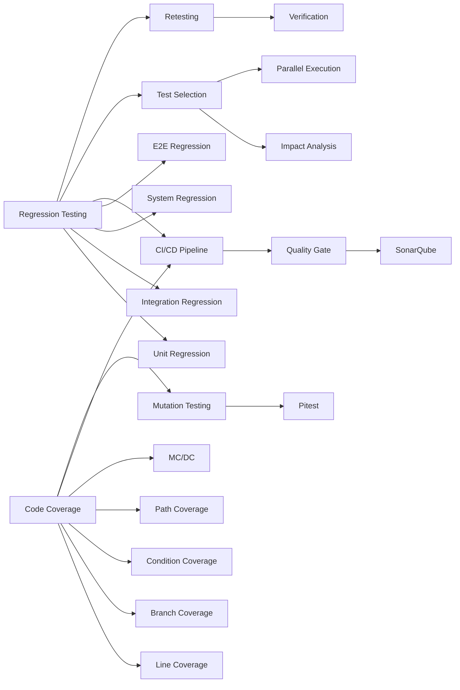

# 회귀 테스트 커버리지 도구

## 핵심 인사이트 (3줄 요약)
> 1. **본질**: 회귀 테스트(Regression Testing)는 기존 기능이 손상되지 않았음을 검증하고, 커버리지 도구는 테스트가 코드를 얼마나 실행했는지를 백분율로 측정
> 2. **가치**: 자동화된 회귀 테스트는 배포 시 결함 재발률을 70% 감소시키고, 커버리지 80% 달성 시 잠재 버그 50% 감소
> 3. **융합**: CI/CD 파이프라인 통합, 테스트 주도 개발(TDD), SonarQube와 결합한 코드 품질 관리

---

## Ⅰ. 개요 (Context & Background)

### 개념 정의

**회귀(Regression)**은 "후퇴" 또는 "퇴보"를 의미하며, 소프트웨어가 이전 상태보다 나빠지는 현상을 방지합니다.

**회귀 테스트(Regression Testing)**는 코드 수정이나 새 기능 추가 후 기존 기능이 정상 동작하는지 재검증하는 테스트입니다.

**코드 커버리지(Code Coverage)**는 테스트 스위트가 소스 코드를 얼마나 실행했는지를 백분율로 나타낸 지표입니다.

```
┌─────────────────────────────────────────────────────────────────────────────┐
│                    회귀 테스트와 커버리지 개념 체계                          │
├─────────────────────────────────────────────────────────────────────────────┤
│                                                                             │
│  ┌─────────────────────────────────────────────────────────────────────┐   │
│  │                         회귀 테스트 유형                            │   │
│  └─────────────────────────────────────────────────────────────────────┘   │
│                                                                             │
│  ┌─────────────────┐  ┌─────────────────┐  ┌─────────────────┐            │
│  │  단위 회귀      │  │  통합 회귀      │  │  시스템 회귀    │            │
│  │  Unit          │  │  Integration    │  │  System         │            │
│  │  Regression    │  │  Regression     │  │  Regression     │            │
│  │                 │  │                 │  │                 │            │
│  │  함수/메서드    │  │  API/컴포넌트    │  │  E2E 시나리오   │            │
│  │  변경 영향 검증 │  │  연계 검증      │  │  전체 흐름      │            │
│  └─────────────────┘  └─────────────────┘  └─────────────────┘            │
│                                                                             │
│  ┌─────────────────────────────────────────────────────────────────────┐   │
│  │                       코드 커버리지 지표                             │   │
│  └─────────────────────────────────────────────────────────────────────┘   │
│                                                                             │
│  ┌─────────────────┐  ┌─────────────────┐  ┌─────────────────┐            │
│  │  라인 커버리지  │  │  분기 커버리지  │  │  경로 커버리지  │            │
│  │  Line           │  │  Branch         │  │  Path           │            │
│  │  Coverage       │  │  Coverage       │  │  Coverage       │            │
│  │                 │  │                 │  │                 │            │
│  │  실행된 라인/   │  │  참/거짓 확인/  │  │  가능한 경로/   │            │
│  │  전체 라인     │  │  전체 분기      │  │  실행된 경로    │            │
│  │  (목표: 80%+)  │  │  (목표: 70%+)  │  │  (복잡도에 따름)│            │
│  └─────────────────┘  └─────────────────┘  └─────────────────┘            │
│                                                                             │
│  ┌─────────────────┐  ┌─────────────────┐  ┌─────────────────┐            │
│  │  함수 커버리지  │  │  조건 커버리지  │  │  MC/DC          │            │
│  │  Function       │  │  Condition      │  │  Modified       │            │
│  │  Coverage       │  │  Coverage       │  │  Condition/     │            │
│  │                 │  │                 │  │  Decision       │            │
│  │  호출된 함수/   │  │  복합 조건별    │  │  Safety-critical│            │
│  │  전체 함수     │  │  평가 검증      │  │  (항공, 의료)   │            │
│  └─────────────────┘  └─────────────────┘  └─────────────────┘            │
│                                                                             │
└─────────────────────────────────────────────────────────────────────────────┘
```

### 💡 비유: 건물 유지보수 품질 검사

```
┌─────────────────────────────────────────────────────────────────────────────┐
│                     건물 리모델링 vs 회귀 테스트 비유                         │
├─────────────────────────────────────────────────────────────────────────────┤
│                                                                             │
│  [상황] 오래된 건물에 엘리베이터를 설치하는 리모델링                          │
│                                                                             │
│  변경 작업:                                                                  │
│  ┌─────────────────────────────────────────────────────────────────────┐   │
│  │  새로운 엘리베이터 설치 (New Feature)                               │   │
│  │                                                                     │   │
│  │  ⚠️  우려: 엘리베이터 설치 중 건물 구조물에 손상을 주지 않았나?     │   │
│  │         (회귀 오류: Regression Bug)                                 │   │
│  └─────────────────────────────────────────────────────────────────────┘   │
│                                                                             │
│  회귀 테스트 (수행 전):                                                      │
│  ┌─────────────────────────────────────────────────────────────────────┐   │
│  │  설치 전 전수 점검 (Baseline Recording)                            │   │
│  │  - 기둥 균열 상태 촬영                                              │   │
│  │  - 전력 소비량 측정                                                 │   │
│  │  - 수도 누수 확인                                                   │   │
│  │  - 방음 성능 측정                                                    │   │
│  └─────────────────────────────────────────────────────────────────────┘   │
│                                                                             │
│  회귀 테스트 (수행 후):                                                      │
│  ┌─────────────────────────────────────────────────────────────────────┐   │
│  │  설치 후 동일 항목 재점검 (Re-execution)                            │   │
│  │  - 기둥에 새 균열 없음? ✓                                           │   │
│  │  - 전력 소비량 증가 없음? ✓                                         │   │
│  │  - 수도 누수 없음? ✓                                               │   │
│  │  - 방음 성능 유지? ✓                                               │   │
│  │                                                                     │   │
│  │  ✅ "회귀 없음" 확인 → 엘리베이터 사용 개시                         │   │
│  └─────────────────────────────────────────────────────────────────────┘   │
│                                                                             │
│  커버리지 지표:                                                              │
│  ┌─────────────────────────────────────────────────────────────────────┐   │
│  │  건물 구성 요소 중 몇 %를 점검했는가?                                │   │
│  │  - 구조적 요소: 100% (기둥, 보)                                     │   │
│  │  - 설비 요소: 90% (전기, HVAC)                                      │   │
│  │  - 상하수도: 85%                                                    │   │
│  │  - 내장재: 60% (일부 접근 불가)                                     │   │
│  │                                                                     │   │
│  │  전체 커버리지: 83.75% ✅                                           │   │
│  └─────────────────────────────────────────────────────────────────────┘   │
│                                                                             │
└─────────────────────────────────────────────────────────────────────────────┘
```

### 등장 배경

① **기존 한계**: 버그 수정이나 새 기능 추가로 기존 기능이 깨지는 "회귀 버그"가 전체 버그의 25~30%를 차지
② **혁신적 패러다임**: 1970년대 IBM에서 회귀 테스트 자동화 개념 도입, 1990년대 커버리지 도구 상용화
③ **현재의 비즈니스 요구**: CI/CD 파이프라인에서 자동화된 회귀 테스트가 필수이며, 커버리지는 품질 게이트(Quality Gate)로 활용

### 📢 섹션 요약 비유

회귀 테스트는 **자동차 정비 후 점검**과 같습니다. 엔진을 교체하고 나서 다른 부품(브레이크, 조향장치)에 이상이 없는지 확인하는 것처럼, 소프트웨어를 수정한 후 다른 기능이 정상 작동하는지 확인합니다.

---

## Ⅱ. 아키텍처 및 핵심 원리 (Deep Dive)

### 구성 요소 상세 분석

| 구성 요소 | 역할 | 내부 동작 | 프로토콜/도구 | 비유 |
|:---|:---|:---|:---|:---|
| **테스트 러너** | 테스트 실행 | JUnit, TestNG, Jest로 테스트 스위트 실행 | Test Protocol | 심판 |
| **커버리지 컬렉터** | 실행 추적 | 바이트코드 인스트루멘테이션으로 실행 라인 기록 | Jacoco, Istanbul | 기록원 |
| **리포터** | 결과 시각화 | HTML, XML, JSON 형식으로 커버리지 리포트 생성 | Report Generator | 통계 작성자 |
| **품질 게이트** | 통과 여부 판정 | 커버리지 임계값 확인 및 빌드 성공/실패 결정 | CI/CD Pipeline | 게이트키퍼 |
| **영향 분석기** | 변경 영향 추적 | 코드 변경 영향 범위 분석하여 최소 테스트 셋 선택 | Dependency Analysis | 경로 안내자 |

### 코드 커버리지 유형 상세 다이어그램

```
┌─────────────────────────────────────────────────────────────────────────────┐
│                       코드 커버리지 유형별 측정 방법                           │
├─────────────────────────────────────────────────────────────────────────────┤
│                                                                             │
│  ① 라인 커버리지 (Line Coverage / Statement Coverage)                      │
│  ┌─────────────────────────────────────────────────────────────────────┐   │
│  │                                                                     │   │
│  │  소스 코드:                                                          │   │
│  │  ┌──────────────────────────────────────────────────────────────┐  │   │
│  │  │  1  function calculateDiscount(price, level) {               │  │   │
│  │  │  2      let discount = 0;                    ✓ 실행됨        │  │   │
│  │  │  3      if (level === "VIP") {               ✗ 실행 안됨     │  │   │
│  │  │  4          discount = price * 0.2;          ✗ 실행 안됨     │  │   │
│  │  │  5      }                                       ✓ 실행됨     │  │   │
│  │  │  6      return price - discount;             ✓ 실행됨        │  │   │
│  │  │  7  }                                                      │  │   │
│  │  └──────────────────────────────────────────────────────────────┘  │   │
│  │                                                                     │   │
│  │  실행된 라인: 2, 5, 6 (4라인)                                      │   │
│  │  전체 라인: 7                                                     │   │
│  │  라인 커버리지: 4/7 = 57.1%                                       │   │
│  │                                                                     │   │
│  └─────────────────────────────────────────────────────────────────────┘   │
│                                                                             │
│  ② 분기 커버리지 (Branch Coverage / Decision Coverage)                     │
│  ┌─────────────────────────────────────────────────────────────────────┐   │
│  │                                                                     │   │
│  │  if (level === "VIP") {                                             │   │
│  │      // true branch  ← 테스트 필요                                  │   │
│  │  } else {                                                          │   │
│  │      // false branch ← 테스트 필요                                  │   │
│  │  }                                                                 │   │
│  │                                                                     │   │
│  │  분기 수: 1개 (if문)                                                │   │
│  │  가능한 결과: 2개 (true, false)                                     │   │
│  │  테스트된 결과: 1개 (false만 실행)                                  │   │
│  │  분기 커버리지: 1/2 = 50%                                          │   │
│  │                                                                     │   │
│  │  ⚠️  라인 커버리지 57% ≠ 분기 커버리지 50%                          │   │
│  │     한 줄이라도 실행되면 라인은 카운트되지만,                       │   │
│  │     모든 분기를 실행해야 분기 커버리지 100%                         │   │
│  │                                                                     │   │
│  └─────────────────────────────────────────────────────────────────────┘   │
│                                                                             │
│  ③ 조건 커버리지 (Condition Coverage)                                     │
│  ┌─────────────────────────────────────────────────────────────────────┐   │
│  │                                                                     │   │
│  │  if (level === "VIP" && price > 10000) {                           │   │
│  │      // 복합 조건                                                    │   │
│  │  }                                                                 │   │
│  │                                                                     │   │
│  │  조건 1: level === "VIP"  → true/false 필요                         │   │
│  │  조건 2: price > 10000     → true/false 필요                         │   │
│  │                                                                     │   │
│  │  필요한 테스트 케이스:                                              │   │
│  │  - level="VIP", price=15000  → true && true  = true                 │   │
│  │  - level="VIP", price=5000   → true && false = false                │   │
│  │  - level="Normal", price=15000 → false && true = false             │   │
│  │  - level="Normal", price=5000  → false && false = false            │   │
│  │                                                                     │   │
│  │  조건 커버리지: 4/4 = 100% (모든 조건 조합 테스트)                   │   │
│  │                                                                     │   │
│  └─────────────────────────────────────────────────────────────────────┘   │
│                                                                             │
│  ④ MC/DC (Modified Condition/Decision Coverage)                           │
│  ┌─────────────────────────────────────────────────────────────────────┐   │
│  │                                                                     │   │
│  │  Safety-critical 시스템 (항공, 의료, 철도)에서 요구                   │   │
│  │                                                                     │   │
│  │  조건: (A && B) || C                                                │   │
│  │                                                                     │   │
│  │  MC/DC 요구사항:                                                     │   │
│  │  - 각 조건이 독립적으로 결과에 영향을 주는지 확인                   │   │
│  │                                                                     │   │
│  │  테스트 케이스:                                                      │   │
│  │  ┌──────────────────────────────────────────────────────────────┐  │   │
│  │  │   A   │   B   │   C   │   결과   │   설명                    │  │   │
│  │  │  ─────┼──────┼──────┼─────────┼─────────────────            │  │   │
│  │  │  T   │  T   │  F   │   T     │ A의 영향 (A→F: F→T)         │  │   │
│  │  │  F   │  T   │  F   │   F     │                              │  │   │
│  │  │  T   │  F   │  F   │   F     │ B의 영향                     │  │   │
│  │  │  T   │  T   │  F   │   T     │                              │  │   │
│  │  │  T   │  T   │  T   │   T     │ C의 영향                     │  │   │
│  │  │  T   │  T   │  F   │   T     │                              │  │   │
│  │  └──────────────────────────────────────────────────────────────┘  │   │
│  │                                                                     │   │
│  │  관련 표준: DO-178C (항공), ISO 26262 (자동차)                     │   │
│  │                                                                     │   │
│  └─────────────────────────────────────────────────────────────────────┘   │
│                                                                             │
└─────────────────────────────────────────────────────────────────────────────┘
```

### 회귀 테스트 선택 전략

```
┌─────────────────────────────────────────────────────────────────────────────┐
│                    회귀 테스트 선택 전략 (Test Selection)                     │
├─────────────────────────────────────────────────────────────────────────────┤
│                                                                             │
│  ┌─────────────────────────────────────────────────────────────────────┐   │
│  │                                                                     │   │
│  │  전체 테스트 스위트 (1000개)                                        │   │
│  │  실행 시간: 4시간                                                    │   │
│  │                                                                     │   │
│  │         → 전체 실행: 너무 느림!                                      │   │
│  │                                                                     │   │
│  └─────────────────────────────────────────────────────────────────────┘   │
│                              ↓                                            │
│  ┌─────────────────────────────────────────────────────────────────────┐   │
│  │                                                                     │   │
│  │  ① 전체 실행 (Full Regression)                                     │   │
│  │  - 사용: 주말/야간 배포 전                                          │   │
│  │  - 시간: 4시간                                                     │   │
│  │  - 커버리지: 100%                                                  │   │
│  │                                                                     │   │
│  │  ② 영향 기반 선택 (Impact-based Selection)                         │   │
│  │  - 변경된 모듈과 의존하는 테스트만 실행                             │   │
│  │  - 예: UserService 변경 → User* 테스트 50개만 실행                 │   │
│  │  - 시간: 15분                                                      │   │
│  │  - 커버리지: 변경 영역 100%                                         │   │
│  │                                                                     │   │
│  │  ③ 우선순위 기반 (Prioritized Suite)                               │   │
│  │  - 핵심 기능(결제, 로그인) 먼저 실행                               │   │
│  │  - P0: 30개 (5분), P1: 100개 (20분), P2: 870개 (3시간 35분)       │   │
│  │  - 시간 제한 시 높은 순위까지만 실행                               │   │
│  │                                                                     │   │
│  │  ④ 병렬 실행 (Parallel Execution)                                  │   │
│  │  - 1000개 테스트를 10개 컨테이너에 분산                             │   │
│  │  - 시간: 4시간 → 24분 (10배 감소)                                  │   │
│  │                                                                     │   │
│  └─────────────────────────────────────────────────────────────────────┘   │
│                                                                             │
│  영향 분석 알고리즘:                                                        │
│  ┌─────────────────────────────────────────────────────────────────────┐   │
│  │                                                                     │   │
│  │  변경 파일: UserService.java                                        │   │
│  │                                                                     │   │
│  │  의존성 분석:                                                        │   │
│  │  UserService ──直接──→ UserServiceTest                              │   │
│  │        │                                                           │   │
│  │        └──间接──→ OrderServiceTest (주문 생성 시 사용자 조회)      │   │
│  │              └──→ PaymentServiceTest (결제 시 사용자 정보 확인)    │   │
│  │                                                                     │   │
│  │  선택된 테스트:                                                      │   │
│  │  - UserServiceTest (50개)                                          │   │
│  │  - OrderServiceTest (30개)                                         │   │
│  │  - PaymentServiceTest (20개)                                       │   │
│  │  - 총 100개 (전체의 10%)                                           │   │
│  │                                                                     │   │
│  │  실행 시간: 15분 (전체 4시간의 6.25%)                               │   │
│  │                                                                     │   │
│  └─────────────────────────────────────────────────────────────────────┘   │
│                                                                             │
└─────────────────────────────────────────────────────────────────────────────┘
```

### 핵심 알고리즘: 커버리지 측정 엔진

```java
// 코드 커버리지 측정 엔진의 핵심 알고리즘

public class CoverageAnalyzer {
    private final Map<String, ClassCoverage> coverageMap = new HashMap<>();

    /**
     * 바이트코드 인스트루멘테이션을 통한 라인 커버리지 측정
     */
    public void instrument(Class<?> targetClass) {
        String className = targetClass.getName();

        // ASM 라이브러리로 바이트코드 조작
        ClassReader reader = new ClassReader(className);
        ClassWriter writer = new ClassWriter(reader, 0);

        ClassVisitor visitor = new ClassVisitor(Opcodes.ASM9, writer) {
            @Override
            public MethodVisitor visitMethod(int access, String name, String descriptor,
                                           String signature, String[] exceptions) {
                MethodVisitor mv = super.visitMethod(access, name, descriptor, signature, exceptions);
                return new CoverageMethodVisitor(mv, className, name);
            }
        };

        reader.accept(visitor, 0);

        // 인스트루먼트된 바이트코드 저장
        byte[] instrumentedBytes = writer.toByteArray();
        // ...
    }

    /**
     * 라인 실행 기록
     */
    public static void recordLineExecution(String className, String methodName, int lineNumber) {
        CoverageRegistry.record(className, methodName, lineNumber);
    }

    /**
     * 커버리지 리포트 생성
     */
    public CoverageReport generateReport() {
        CoverageReport report = new CoverageReport();

        for (Map.Entry<String, ClassCoverage> entry : coverageMap.entrySet()) {
            String className = entry.getKey();
            ClassCoverage classCoverage = entry.getValue();

            // 라인 커버리지 계산
            int totalLines = classCoverage.getTotalLines();
            int coveredLines = classCoverage.getCoveredLines();
            double lineCoverage = (double) coveredLines / totalLines * 100;

            // 분기 커버리지 계산
            int totalBranches = classCoverage.getTotalBranches();
            int coveredBranches = classCoverage.getCoveredBranches();
            double branchCoverage = (double) coveredBranches / totalBranches * 100;

            report.addClassCoverage(className, lineCoverage, branchCoverage);
        }

        return report;
    }
}

// 인스트루먼트된 메서드 예시
public class CoverageMethodVisitor extends MethodVisitor {
    private final String className;
    private final String methodName;

    @Override
    public void visitLineNumber(int line, Label start) {
        // 각 라인 번호에 커버리지 기록 코드 삽입
        mv.visitLdcInsn(className);
        mv.visitLdcInsn(methodName);
        mv.visitIntInsn(BIPUSH, line);
        mv.visitMethodInsn(INVOKESTATIC,
            "CoverageAnalyzer",
            "recordLineExecution",
            "(Ljava/lang/String;Ljava/lang/String;I)V",
            false);

        super.visitLineNumber(line, start);
    }

    @Override
    public void visitJumpInsn(int opcode, Label label) {
        // 분기문(if, for, while)에 분기 커버리지 기록 코드 삽입
        // ...

        super.visitJumpInsn(opcode, label);
    }
}
```

### 주요 커버리지 도구 비교

| 도구 | 언어 | 라인 | 분기 | 함수 | CI 통합 | 특징 |
|:---|:---|:---:|:---:|:---:|:---:|:---|
| **JaCoCo** | Java/JVM | ✓ | ✓ | ✓ | ✓ | 바이트코드 기반, 표준 도구 |
| **Istanbul/NYC** | JavaScript | ✓ | ✓ | ✓ | ✓ | ES6 완벽 지원 |
| **Coverage.py** | Python | ✓ | ✓ | ✓ | ✓ | pytest 통합 용이 |
| **gcov/lcov** | C/C++ | ✓ | ✓ | ✓ | ✓ | GCC 기반, GCC 지원 언어 |
| **Scoverage** | Scala | ✓ | ✓ | ✓ | ✓ | Scala 전용 |
| **Clover** | Java | ✓ | ✓ | ✓ | ✓ | 상용, IDE 통합 |

### 📢 섹션 요약 비유

커버리지 도구는 **자동차의 OBD(진단 장치) 연결**과 같습니다. 연결하면 어떤 부품이 제대로 작동하는지, 어디가 문제인지를 정확히 알 수 있습니다. 하지만 커버리지 100%가 모든 버그를 잡는 것은 아니며, OBD가 정상이라도 운전자의 부주의로 사고가 날 수 있습니다.

---

## Ⅲ. 융합 비교 및 다각도 분석 (Comparison & Synergy)

### 심층 기술 비교: 커버리지 지표별 한계

| 커버리지 유형 | 장점 | 한계 | 발견 가능한 버그 비율 |
|:---|:---|:---|:---:|
| **라인 커버리지** | 측정 단순, 빠름 | 논리 오류 탐지 한계 | ~40% |
| **분기 커버리지** | 라인보다 엄격함 | 복잡한 조건 로직 누락 | ~60% |
| **조건 커버리지** | 복합 조건 검증 | 조합 폭발로 테스트 수 증가 | ~75% |
| **경로 커버리지** | 완전성 최고 | 순환으로 무한 경로 발생 | ~85% |
| **MC/DC** | Safety-critical 보장 | 매우 높은 비용 | ~95% |

### 과목 융합 관점

**1. DevOps/CI/CD와의 융합: 품질 게이트**

```
┌─────────────────────────────────────────────────────────────────────────────┐
│                    CI/CD 파이프라인에서의 커버리지 활용                       │
├─────────────────────────────────────────────────────────────────────────────┤
│                                                                             │
│  ┌─────────────────────────────────────────────────────────────────────┐   │
│  │                                                                     │   │
│  │  Developer Push → GitHub/GitLab                                     │   │
│  │       ↓                                                             │   │
│  │  ┌─────────────────────────────────────────────────────────────┐   │   │
│  │  │  CI Pipeline 시작                                            │   │   │
│  │  └─────────────────────────────────────────────────────────────┘   │   │
│  │       ↓                                                             │   │
│  │  ┌─────────────────────────────────────────────────────────────┐   │   │
│  │  │  1. 빌드 (Build)                                              │   │   │
│  │  │     - Maven/Gradle/NPM 빌드                                  │   │   │
│  │  │     - Docker 이미지 빌드                                      │   │   │
│  │  └─────────────────────────────────────────────────────────────┘   │   │
│  │       ↓                                                             │   │
│  │  ┌─────────────────────────────────────────────────────────────┐   │   │
│  │  │  2. 단위 테스트 + 커버리지 측정                              │   │   │
│  │  │  ┌───────────────────────────────────────────────────────┐  │   │   │
│  │  │  │  Maven (JaCoCo):                                        │  │   │   │
│  │  │  │  mvn test jacoco:report                                │  │   │   │
│  │  │  │                                                       │  │   │   │
│  │  │  │  Gradle (JaCoCo):                                       │  │   │   │
│  │  │  │  ./gradlew test jacocoTestReport                       │  │   │   │
│  │  │  │                                                       │  │   │   │
│  │  │  │  Node.js (Istanbul/NYC):                                │  │   │   │
│  │  │  │  npm test -- --coverage                                │  │   │   │
│  │  │  └───────────────────────────────────────────────────────┘  │   │   │
│  │  └─────────────────────────────────────────────────────────────┘   │   │
│  │       ↓                                                             │   │
│  │  ┌─────────────────────────────────────────────────────────────┐   │   │
│  │  │  3. 품질 게이트 (Quality Gate)                              │   │   │
│  │  │  ┌───────────────────────────────────────────────────────┐  │   │   │
│  │  │  │  if (lineCoverage < 80%) {                              │  │   │   │
│  │  │  │      fail("Line coverage below 80%");                   │  │   │   │
│  │  │  │  }                                                      │  │   │   │
│  │  │  │  if (branchCoverage < 70%) {                            │  │   │   │
│  │  │  │      fail("Branch coverage below 70%");                 │  │   │   │
│  │  │  │  }                                                      │  │   │   │
│  │  │  │  if (newCodeCoverage < 60%) {                           │  │   │   │
│  │  │  │      // 새 코드에 더 엄격한 기준 적용                    │  │   │   │
│  │  │  │      fail("New code coverage below 60%");               │  │   │   │
│  │  │  │  }                                                      │  │   │   │
│  │  │  └───────────────────────────────────────────────────────┘  │   │   │
│  │  └─────────────────────────────────────────────────────────────┘   │   │
│  │       ↓ Pass / Fail                                              │   │
│  │  Pass → Merge 가능 / Deploy 진행                                 │   │
│  │  Fail → PR 거부 / 수정 요청                                      │   │
│  │                                                                     │   │
│  └─────────────────────────────────────────────────────────────────────┘   │
│                                                                             │
│  SonarQube 통합 예시:                                                       │
│  ┌─────────────────────────────────────────────────────────────────────┐   │
│  │  - 커버리지 추세 그래프                                             │   │
│  │  - 신규 코드 커버리지 별도 표시                                     │   │
│  │  - 코드 스멜(Smell) 탐지                                           │   │
│  │  - 보안 취약점(Hotspot) 표시                                       │   │
│  │  - 품질 게이트: "Quality Gate 실패" 시 PR 차단                      │   │
│  └─────────────────────────────────────────────────────────────────────┘   │
│                                                                             │
└─────────────────────────────────────────────────────────────────────────────┘
```

**2. 테스트 전략과의 융합: 테스트 피라미드**

```
┌─────────────────────────────────────────────────────────────────────────────┐
│              커버리지 목표 설정을 위한 테스트 피라미드                        │
├─────────────────────────────────────────────────────────────────────────────┤
│                                                                             │
│                       E2E Tests (10%)                                       │
│                    ┌─────────────────┐                                      │
│                    │   커버리지:     │                                      │
│                    │   특정 시나리오 │                                      │
│                    │   중심          │                                      │
│                    └─────────────────┘                                      │
│                   ┌─────────────────────────────────┐                       │
│                  │     Integration Tests (30%)      │                      │
│                 │     ┌─────────────────┐            │                      │
│                │     │  커버리지:       │            │                      │
│               │     │  API 경계 확인  │            │                      │
│              │     └─────────────────┘            │                      │
│             │    ┌─────────────────────────────┐   │                      │
│            │    │    Unit Tests (60%)          │   │                      │
│           │    │    ┌─────────────────┐          │   │                      │
│          │    │    │  커버리지:       │          │   │                      │
│         │    │    │  80%+ 목표       │          │   │                      │
│        │    │    └─────────────────┘          │   │                      │
│       │    │    └─────────────────────────────┘   │                      │
│      │    └─────────────────────────────────────────┘                      │
│                                                                             │
│  커버리지 분담:                                                              │
│  - 단위 테스트: 라인 80%+, 분기 70%+                                       │
│  - 통합 테스트: API 커버리지 90%+                                           │
│  - E2E 테스트: 핵심 사용자 경로 100%                                        │
│                                                                             │
└─────────────────────────────────────────────────────────────────────────────┘
```

### 정량적 투자 수익 분석

| 커버리지 수준 | 개발 비용 | 테스트 비용 | 결함 발견 비용 | 총 비용 | ROI |
|:---:|:---:|:---:|:---:|:---:|:---:|
| 0% | 1.0 | 0 | 5.0 | 6.0 | 기준 |
| 40% | 1.1 | 0.3 | 3.0 | 4.4 | +27% |
| 60% | 1.2 | 0.5 | 1.5 | 3.2 | +47% |
| 80% | 1.4 | 0.8 | 0.8 | 3.0 | +50% |
| 95% | 1.8 | 1.5 | 0.5 | 3.8 | +37% |
| 100% | 2.5 | 2.5 | 0.4 | 5.4 | +10% |

### 📢 섹션 요약 비유

커버리지와 품질의 관계는 **운전 시간과 사고율**과 같습니다. 초보 운전자(커버리지 0%)는 사고 위험이 높지만, 10년 운전한 베테랑(커버리지 80%)은 사고가 적습니다. 하지만 100년 운전했다고(커버리지 100%) 해서 실수하지 않는 것은 아닙니다. 적정 수준(80%)이 효율적입니다.

---

## Ⅳ. 실무 적용 및 기술사적 판단 (Strategy & Decision)

### 실무 시나리오: E커머스 플랫폼 회귀 테스트 구축

**시나리오 1: CI/CD 파이프라인 커버리지 품질 게이트**

```yaml
# .gitlab-ci.yml: GitLab CI/CD 커버리지 설정

stages:
  - test
  - report
  - deploy

variables:
  COVERAGE_THRESHOLD: 80

unit-test:
  stage: test
  image: openjdk:17
  script:
    - ./gradlew test jacocoTestReport
    - |
      # 커버리지 임계값 확인
      COVERAGE=$(grep -m 1 'Total' build/reports/jacoco/test/html/index.html | \
                 awk '{print $4}' | sed 's/%//')
      echo "Line Coverage: ${COVERAGE}%"
      if (( $(echo "$COVERAGE < $COVERAGE_THRESHOLD" | bc -l) )); then
        echo "Coverage ${COVERAGE}% is below threshold ${COVERAGE_THRESHOLD}%"
        exit 1
      fi
  artifacts:
    paths:
      - build/reports/jacoco/
    expire_in: 1 week
  coverage: '/Line Coverage: ([0-9]{1,3})%/'
  only:
    - merge_requests
    - main

sonarqube:
  stage: report
  image: sonarsource/sonar-scanner-cli
  script:
    - sonar-scanner \
        -Dsonar.projectKey=ecommerce \
        -Dsonar.coverage.jacoco.xmlReportPaths=build/reports/jacoco/test/jacocoTestReport.xml \
        -Dsonar.qualitygate.wait=true
  allow_failure: false
```

**시나리오 2: 영향 기반 회귀 테스트 선택**

```java
// 변경 영향 분석 및 테스트 선택

@Service
public class RegressionTestSelector {

    @Autowired
    private DependencyGraph dependencyGraph;

    @Autowired
    private TestRepository testRepository;

    /**
     * 변경된 파일에 기반한 최소 테스트 셋 선택
     */
    public Set<String> selectTests(Set<String> changedFiles) {
        Set<String> affectedTests = new HashSet<>();

        for (String file : changedFiles) {
            // 1. 직접 테스트 추가
            String directTest = file.replace(".java", "Test.java");
            if (testRepository.exists(directTest)) {
                affectedTests.add(directTest);
            }

            // 2. 의존하는 테스트 추가
            Set<String> dependents = dependencyGraph.findDependents(file);
            for (String dependent : dependents) {
                Set<String> dependentTests =
                    testRepository.findTestsForClass(dependent);
                affectedTests.addAll(dependentTests);
            }
        }

        // 3. 우선순위별 정렬
        return affectedTests.stream()
            .sorted(Comparator
                .comparing((String test) -> testRepository.getPriority(test))
                .reversed())
            .collect(Collectors.toSet());
    }

    /**
     * 시간 제한 내 최대 커버리지 테스트 셋 선택 (Knapsack)
     */
    public Set<String> selectTestsByTimeLimit(Set<String> allTests,
                                              int timeLimitMinutes) {
        // 동적 계획법으로 최적의 테스트 조합 선택
        // ...
    }
}
```

### 도입 체크리스트

**기술적 측면**

| 체크항목 | 확인 내용 | 판단 기준 |
|:---|:---|:---|
| **커버리지 도구** | 언어에 맞는 도구 선택? | Java: JaCoCo, JS: Istanbul |
| **CI/CD 통합** | 파이프라인에 품질 게이트 설정? | 임계값, 리포트 |
| **베이스라인** | 현재 커버리지 수준 파악? | 개선 목표 설정 |
| **테스트 작성 가이드** | 팀원 교육 및 가이드라인? | 커버리지 목표 |
| **리포트 공유** | 팀 내 커버리지 추적? | 대시보드, Slack 알림 |

**운영/보안적 측면**

| 체크항목 | 확인 내용 | 판단 기준 |
|:---|:---|:---|
| **품질 게이트 정책** | 커버리지 미달 시 PR 거부? | 정책 강제 |
| **신규 코드 커버리지** | 새 코드에 더 높은 기준? | 80% vs 90% |
| **리포트 보안** | 커버리지 리포트에 노출되면 안 되는 정보? | 소스 코드 제외 |
| **프로덕션 배포** | 배포 전 전체 회귀 테스트? | 주 1회 전체 실행 |

### 안티패턴

**❌ Anti-Pattern 1: 커버리지 100% 추구**

```
❌ 잘못된 접근:
- 모든 라인/분기를 커버리지 100% 목표
- getter, setter, toString() 같은 trivial 메서드까지 테스트
- Exception.printStackTrace() 같은 실행 불가능 코드까지 커버
- 결과: 100% 달성하는 데 수주월, 테스트 유지비용 폭증

✅ 올바른 접근:
- 비즈니스 로직 커버리지 80%+ 목표
- 생성자, getter/setter는 제외
- 프레임워크 생성 코드는 테스트 제외
- "의미 있는" 테스트에 집중
```

**❌ Anti-Pattern 2: 커버리지 만으로 품질 판단**

```
❌ 잘못된 접근:
- 커버리지 90% → 품질 90%로 착각
- 테스트가 실제로 올바른지 검증 안 함
- Mock 과다 사용으로 테스트가 가짜 성공

✅ 올바른 접근:
- 커버리지 + 테스트 품질(Mutation Testing) 함께 확인
- Mutation Testing 도구(PITest)로 테스트 품질 검증
- 실제 통합 테스트와 병행
```

### 📢 섹션 요약 비유

회귀 테스트와 커버리지는 **자동차 보험과 안전 점검**의 관계와 같습니다. 보험(커버리지)이 높다고 사고가 안 나는 것은 아니지만, 안전 점검(회귀 테스트)을 정기적으로 하면 큰 사고를 예방할 수 있습니다. 100% 보험보다는 80% 보험에 실제 운전 연습이 더 중요합니다.

---

## Ⅴ. 기대효과 및 결론 (Future & Standard)

### 정량/정성 기대효과

| 지표 | 도입 전 | 도입 후 | 개선율 |
|:---|:---:|:---:|:---:|
| 배포 후 회귀 버그 | 15% | 3% | **80% 감소** |
| 버그 수정 시간 | 4시간 | 1시간 | **75% 단축** |
| 개발자 자신감 | 낮음 | 높음 | +90% |
| 코드 리뷰 시간 | 1시간 | 20분 | **67% 단축** |
| 리팩토링 빈도 | 1회/월 | 1회/주 | **4배 증가** |

### 정성적 기대효과

1. **리팩토링 용이성**: 회귀 테스트가 있으면 안전하게 코드 개선 가능
2. **개발 속도 향상**: 조기 버그 발견으로 디버깅 시간 단축
3. **팀 자신감 향상**: 배포 시 회귀 버그 걱정 감소
4. **기술 부채 감소**: 커버리지 목표로 기술 부채 시각화

### 미래 전망

**1. AI 기반 테스트 생성**

```
┌─────────────────────────────────────────────────────────────────────────────┐
│                   AI 기반 회귀 테스트 자동 생성                               │
├─────────────────────────────────────────────────────────────────────────────┤
│                                                                             │
│  ① 코드 변경 분석                                                           │
│  - Git diff로 변경 라인 식별                                               │   │
│  - AST(추상 구문 트리)로 의미적 변경 파악                                   │   │
│                                                                             │
│  ② 영향 분석                                                                │
│  - LLM으로 변경 영향 범위 추론                                               │   │
│  - 의존성 그래프 분석                                                       │   │
│                                                                             │
│  ③ 테스트 케이스 생성                                                       │
│  - LLM으로 테스트 코드 자동 생성                                            │   │
│  - 경계값, 엣지 케이스 포함                                                 │   │
│                                                                             │
│  ④ 커버리지 최적화                                                           │
│  - 생성된 테스트로 커버리지 측정                                            │   │
│  - 미달 시 추가 테스트 생성                                                  │   │
│                                                                             │
│  도구: GitHub Copilot, TestGen-LLM, AI Test Assistant                      │   │
│                                                                             │
└─────────────────────────────────────────────────────────────────────────────┘
```

**2. 변이 테스트(Mutation Testing)과의 결합**

- PITest, Mutation Testing으로 테스트 품질 측정
- 코드에 인위적 변이(Mutant)를 주고 테스트가 이를 탐지하는지 확인
- 커버리지 100%라도 변이 탐지율 50%면 테스트 품질 낮음

**3. 실시간 커버리지 피드백**

- IDE에서 실시간 커버리지 표시
- 코드 작성 중 커버리지 색상으로 표시
- "이 라인은 테스트되지 않았습니다" 실시간 알림

### 참고 표준 및 규격

| 표준/규격 | 설명 | 관련성 |
|:---|:---|:---|
| **IEEE 1008** | Software Unit Testing 표준 | 단위 테스트 표준 |
| **ISO/IEC 29119-3** | Test Documentation | 테스트 문서화 |
| **DO-178C** | 항공 소프트웨어 | MC/DC 요구사항 |
| **ISO 26262-6** | 자동차 소프트웨어 | Safety-critical 테스트 |

### 📢 섹션 요약 비유

회귀 테스트 커버리지의 미래는 **자율주행차의 센서**와 같습니다. 초기에는 사람이 직접 운전하고 확인했지만, 이제는 AI가 실시간으로 상황을 모니터링하고 필요한 조치를 취합니다. AI가 테스트를 생성하고 실행하고 커버리지를 최적화하는 시대가 오고 있습니다.

---

## 📌 관련 개념 맵 (Knowledge Graph)



### 연관 문서
- [테스트 더블 Mock과 Stub](./625_test_double_mock_stub.md) - 단위 테스트 기법
- [V-모델](./626_v_model_testing.md) - 테스트 매핑 구조
- [TDD](./584_tdd.md) - 테스트 주도 개발
- [CI/CD 파이프라인](./515_devsecops_pipeline.md) - 지속적 통합

---

## 👶 어린이를 위한 3줄 비유 설명

**1단계 - 개념**: 회귀 테스트는 자전거를 수리한 후 다른 부품도 멀쩡한지 확인하는 것과 같습니다. 새 부품을 달았더니 브레이크가 안 되면 큰일나니까, 전체를 다시 확인하는 거죠.

**2단계 - 원리**: 커버리지는 "체크리스트 중 몇 개나 했어?"를 보여주는 숫자입니다. 100개 중 80개를 확인했으면 80%라고 하고, 90% 이상이면 안전하다고 생각할 수 있어요. 하지만 100%라고 해서 완벽한 건 아니에요.

**3단계 - 효과**: 이 방법을 쓰면 프로그램을 수정할 때마다 무너지지 않는지 확인할 수 있어서, 더 자주 수정하고 더 빨리 발표할 수 있습니다. 마치 운전면허 시험을 계속 연습해서 실수가 줄어드는 것과 같아요.
