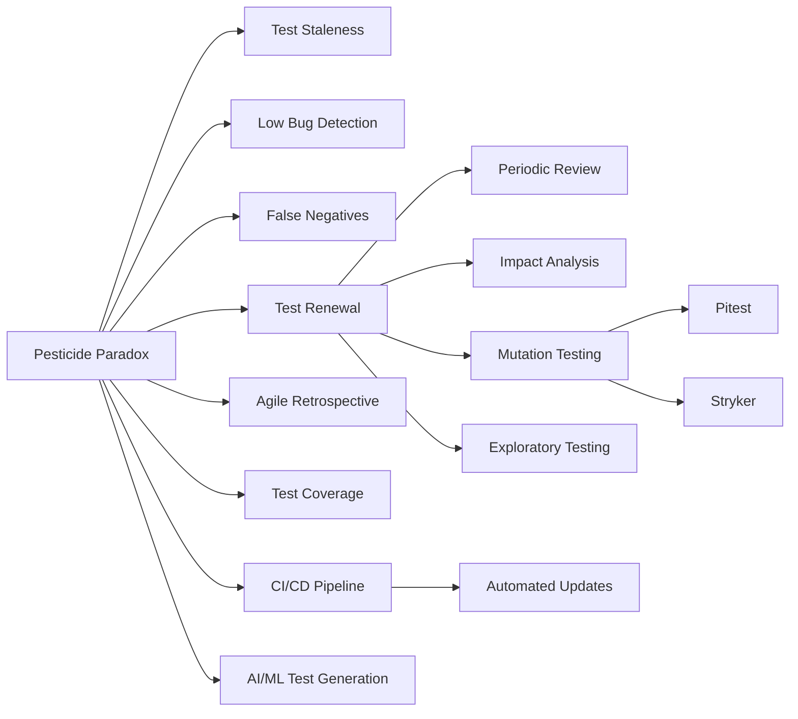

# 살충제 패러독스 테스트 갱신

## 핵심 인사이트 (3줄 요약)
> 1. **본질**: 살충제 패러독스(Pesticide Paradox)는 동일한 테스트를 반복하면 더 이상 새로운 버그를 찾지 못하는 현상을 말함
> 2. **가치**: 테스트 케이스를 주기적으로 갱신하면 탐지율을 30~50% 향상시키고, 숨겨진 버그 발견 가능
> 3. **융합**: 애자일 회고(Retrospective), 변이 테스트(Mutation Testing), 탐색적 테스트(Exploratory Testing)와 결합

---

## Ⅰ. 개요 (Context & Background)

### 개념 정의

**살충제 패러독스(Pesticide Paradox)**는 소프트웨어 테스트의 핵심 원리 중 하나로, **동일한 테스트 케이스를 반복 실행하면 더 이상 새로운 결함을 발견하지 못하게 되는 현상**을 의미합니다.

이 용어는 1980년대 Boris Beizer가 저서 "Software Testing Techniques"에서 처음 사용했습니다. 농약을 계속 뿌리면 내성이 생긴 해충만 남게 되는 현상에 비유한 것입니다.

```
┌─────────────────────────────────────────────────────────────────────────────┐
│                       살충제 패러독스(Pesticide Paradox)                      │
├─────────────────────────────────────────────────────────────────────────────┤
│                                                                             │
│  농업에서의 살충제 패러독스:                                                 │
│  ┌─────────────────────────────────────────────────────────────────────┐   │
│  │                                                                     │   │
│  │  1차 살충제 살포                                                    │   │
│  │     - 총 해충: 1000마리                                             │   │
│  │     - 사망: 950마리 (95%)                                           │   │
│  │     - 생존: 50마리 (내성 생김)                                       │   │
│  │                                                                     │   │
│  │  2차 동일 살충제 살포                                                │   │
│  │     - 총 해충: 50마리 × 10(번식) = 500마리                          │   │
│  │     - 사망: 250마리 (50%)                                           │   │
│  │     - 생존: 250마리 (강한 내성)                                      │   │
│  │                                                                     │   │
│  │  3차 동일 살충제 살포                                                │   │
│  │     - 총 해충: 250 × 10 = 2500마리                                  │   │
│  │     - 사망: 250마리 (10%)                                            │   │
│  │     - 생존: 2250마리 (완전 내성)                                     │   │
│  │                                                                     │   │
│  │  ⇒ 결론: 동일한 살충제를 계속 쓰면 효과가 감소                        │   │
│  └─────────────────────────────────────────────────────────────────────┘   │
│                                                                             │
│  소프트웨어 테스트에서의 살충제 패러독스:                                   │
│  ┌─────────────────────────────────────────────────────────────────────┐   │
│  │                                                                     │   │
│  │  1차 테스트 실행                                                     │   │
│  │     - 총 버그: 100개                                                │   │
│  │     - 발견: 95개 (95%)                                              │   │
│  │     - 미발견: 5개 (숨겨진 버그)                                      │   │
│  │                                                                     │   │
│  │  2차 동일 테스트 실행                                                │   │
│  │     - 신규/수정으로 발생: 10개                                       │   │
│  │     - 기존 테스트 발견: 2개 (20%)                                    │   │
│  │     - 미발견: 8개                                                    │   │
│  │                                                                     │   │
│  │  3차 동일 테스트 실행                                                │   │
│  │     - 신규/수정으로 발생: 20개                                       │   │
│  │     - 기존 테스트 발견: 1개 (5%)                                     │   │
│  │     - 미발견: 19개                                                   │   │
│  │                                                                     │   │
│  │  ⇒ 결론: 동일한 테스트로는 새로운 버그를 찾기 어려움                   │   │
│  └─────────────────────────────────────────────────────────────────────┘   │
│                                                                             │
└─────────────────────────────────────────────────────────────────────────────┘
```

### 💡 비유: 암호문 자물쇠와 열쇠

```
┌─────────────────────────────────────────────────────────────────────────────┐
│                     암호문 자물쇠 vs 테스트 케이스 비유                       │
├─────────────────────────────────────────────────────────────────────────────┤
│                                                                             │
│  [상황] 보물이 들어있는 금고를 여는 시나리오                                  │
│                                                                             │
│  기존 열쇠(테스트 케이스):                                                  │
│  ┌─────────────────────────────────────────────────────────────────────┐   │
│  │  열쇠 #1: "왼쪽으로 3회, 오른쪽으로 2회"                             │   │
│  │  열쇠 #2: "왼쪽으로 5회, 오른쪽으로 1회"                             │   │
│  │  열쇠 #3: "왼쪽으로 2회, 오른쪽으로 3회"                             │   │
│  │                                                                     │   │
│  │  → 첫날: 금고 열림! (버그 발견)                                     │   │
│  │  → 둘째날: 금고 열림 (이미 알려진 버그)                             │   │
│  │  → 셋째날: 금고 열림 (똑같은 결과)                                  │   │
│  └─────────────────────────────────────────────────────────────────────┘   │
│                                                                             │
│  문제 발생:                                                                  │
│  ┌─────────────────────────────────────────────────────────────────────┐   │
│  │  금고 제조사가 자물쇠 메커니즘을 변경함 (코드 수정)                  │   │
│  │                                                                     │   │
│  │  기존 열쇠로 시도:                                                  │   │
│  │  - 열쇠 #1: 안 열림 ❌                                             │   │
│  │  - 열쇠 #2: 안 열림 ❌                                             │   │
│  │  - 열쇠 #3: 안 열림 ❌                                             │   │
│  │                                                                     │   │
│  │  ⇒ 새로운 열쇠(새 테스트 케이스)가 필요!                           │   │
│  └─────────────────────────────────────────────────────────────────────┘   │
│                                                                             │
│  해결책: 새로운 열쇠 제작                                                   │
│  ┌─────────────────────────────────────────────────────────────────────┐   │
│  │  새로운 열쇠 #4: "왼쪽으로 7회, 오른쪽으로 4회"                     │   │
│  │  새로운 열쇠 #5: "오른쪽만 10회"                                    │   │
│  │  새로운 열쇠 #6: "왼쪽 1회 후 오른쪽 8회"                           │   │
│  │                                                                     │   │
│  │  → 금고 열림! (새로운 버그 발견) ✅                                 │   │
│  └─────────────────────────────────────────────────────────────────────┘   │
│                                                                             │
└─────────────────────────────────────────────────────────────────────────────┘
```

### 등장 배경

① **기존 한계**: 동일한 테스트 반복으로 탐지율이 점진적 감소, 시간이 지날수록 새로운 버그를 찾지 못함
② **혁신적 패러다임**: 1983년 Boris Beizer가 "Software Testing Techniques"에서 살충제 패러독스 개념 정립
③ **현재의 비즈니스 요구**: 애자일/DevOps 환경에서 지속적 테스트 갱신이 필수, 테스트 자동화와 병행

### 📢 섹션 요약 비유

살충제 패러독스는 **매일 같은 길로 등교하는 학생**과 같습니다. 항상 같은 길로 가다 보면 새로운 지름길이나 재미있는 풍경을 발견하지 못합니다. 가끔 다른 길로 가보면(새 테스트), 몰랐던 것들을 발견할 수 있습니다.

---

## Ⅱ. 아키텍처 및 핵심 원리 (Deep Dive)

### 구성 요소 상세 분석

| 구성 요소 | 역할 | 내부 동작 | 발생 주기 | 대응 전략 |
|:---|:---|:---|:---|:---|
| **테스트 포화** | 버그 탐지 저하 | 동일 시나리오 반복 | 3~6개월 후 | 테스트 갱신 |
| **내성 버그** | 탐지 회피 | 특정 패턴 회피 학습 | 지속적 증가 | 변이 테스트 |
| **테스트 냄새** | 품질 저하 signals | 취약한 테스트 패턴 | 작성 시점 | 리팩토링 |
| **커버리지 구멍** | 미검증 영역 | 테스트되지 않는 코드 | 요구사항 변경 | 영향 분석 |
| **숨겨진 버그** | 잠재적 결함 | 테스트 통과 but 오류 존재 | 릴리즈 후 | 운영 모니터링 |

### 살충제 패러독스 발생 메커니즘

```
┌─────────────────────────────────────────────────────────────────────────────┐
│                    살충제 패러독스 발생 단계별 분석                            │
├─────────────────────────────────────────────────────────────────────────────┤
│                                                                             │
│  ┌─────────────────────────────────────────────────────────────────────┐   │
│  │                                                                     │   │
│  │  단계 1: 초기 테스트 (Initial Testing)                              │   │
│  │  ┌──────────────────────────────────────────────────────────────┐  │   │
│  │  │  탐지율: 90%+                                                  │  │   │
│  │  │  - 대부분의 명백한 버그 발견                                    │  │   │
│  │  │  - 기본 기능 결함 탐지                                         │  │   │
│  │  │  - 사용자 시나리오 커버                                         │  │   │
│  │  │                                                               │  │   │
│  │  │  예시:                                                        │  │   │
│  │  │  - 로그인 버튼 클릭 → 로그인 됨                               │  │   │
│  │  │  - 상품 장바구니 담기 → 담김                                   │  │   │
│  │  │  - 결제 완료 → 주문 생성                                       │  │   │
│  │  └──────────────────────────────────────────────────────────────┘  │   │
│  │                                                                     │   │
│  └─────────────────────────────────────────────────────────────────────┘   │
│                              ↓                                            │
│  ┌─────────────────────────────────────────────────────────────────────┐   │
│  │                                                                     │   │
│  │  단계 2: 반복 테스트 (Repetition)                                   │   │
│  │  ┌──────────────────────────────────────────────────────────────┐  │   │
│  │  │  탐지율: 50%                                                   │  │   │
│  │  │  - 알려진 버그만 반복 확인                                      │  │   │
│  │  │  - 새로운 버그 탐지 실패                                        │  │   │
│  │  │  - 경계값 케이스 누락                                          │  │   │
│  │  │                                                               │  │   │
│  │  │  예시:                                                        │  │   │
│  │  │  - 로그인: 정상 ID/PW만 테스트                                 │  │   │
│  │  │    → SQL Injection 미테스트                                    │  │   │
│  │  │  - 장바구니: 상품 1개만 테스트                                  │  │   │
│  │  │    → 100개 담기 미테스트(성능 이슈)                             │  │   │
│  │  │  - 결제: 성공 케이스만 테스트                                   │  │   │
│  │  │    → 실패 시 재시도 로직 미테스트                                │  │   │
│  │  └──────────────────────────────────────────────────────────────┘  │   │
│  │                                                                     │   │
│  └─────────────────────────────────────────────────────────────────────┘   │
│                              ↓                                            │
│  ┌─────────────────────────────────────────────────────────────────────┐   │
│  │                                                                     │   │
│  │  단계 3: 포화 상태 (Saturation)                                     │   │
│  │  ┌──────────────────────────────────────────────────────────────┐  │   │
│  │  │  탐지율: 10% 이하                                              │  │   │
│  │  │  - 테스트가 "녹색"만 출력                                      │  │   │
│  │  │  - 거짓阴性(False Negative) 증가                               │  │   │
│  │  │  - 테스트가 버그를 통과시킴                                     │  │   │
│  │  │                                                               │  │   │
│  │  │  예시 (히든 버그):                                            │  │   │
│  │  │  ┌─────────────────────────────────────────────────────────┐ │  │   │
│  │  │  │  버그: 동시성 문제                                        │  │   │
│  │  │  │  테스트: 단일 스레드에서만 실행                           │  │   │
│  │  │  │  결과: 테스트 통과 ✅ (but 실제 운영에서 실패)            │  │   │
│  │  │  │                                                           │  │   │
│  │  │  │  버그: 메모리 누수                                         │  │   │
│  │  │  │  테스트: 짧은 시간 실행                                   │  │   │
│  │  │  │  결과: 테스트 통과 ✅ (but 장시간 실행 시 OOM)             │  │   │
│  │  │  │                                                           │  │   │
│  │  │  │  버그: 엣지 케이스                                        │  │   │
│  │  │  │  테스트: 일반적인 입력만                                   │  │   │
│  │  │  │  결과: 테스트 통과 ✅ (but 특수 입력 시 크래시)            │  │   │
│  │  │  └─────────────────────────────────────────────────────────┘ │  │   │
│  │  └──────────────────────────────────────────────────────────────┘  │   │
│  │                                                                     │   │
│  └─────────────────────────────────────────────────────────────────────┘   │
│                                                                             │
└─────────────────────────────────────────────────────────────────────────────┘
```

### 핵심 알고리즘: 테스트 갱신 필요성 판정

```python
# 테스트 갱신 필요성 판정 알고리즘

class PesticideParadoxDetector:
    """
    살충제 패러독스 감지 및 테스트 갱신 권고
    """

    def __init__(self):
        self.bug_detection_history = {}  # {test_id: [(date, bugs_found), ...]}
        self.test_execution_count = {}    # {test_id: execution_count}
        self.code_change_rate = {}        # {module_id: churn_score}

    def calculate_staleness_score(self, test_id: str) -> float:
        """
        테스트의 신선도 점수 계산 (0~1, 낮을수록 부실)

        점수 = 버그 발견률 × 코드 변경 영향 × 최근 수정일
        """
        # 1. 버그 발견률 (최근 10회 실행)
        recent_runs = self.bug_detection_history.get(test_id, [])[-10:]
        bug_find_rate = sum(bugs for _, bugs in recent_runs) / len(recent_runs)

        # 2. 코드 변경 영향 (테스트 대상 모듈의 변경 빈도)
        target_modules = self.get_target_modules(test_id)
        code_churn = max([self.code_change_rate.get(m, 0) for m in target_modules])

        # 3. 최근 갱신일 (오래될수록 점수 감소)
        last_updated = self.get_last_update_date(test_id)
        days_since_update = (datetime.now() - last_updated).days
        recency_factor = max(0, 1 - days_since_update / 180)  # 6개월 후 0

        # 종합 점수
        staleness_score = (
            bug_find_rate * 0.5 +
            code_churn * 0.3 +
            recency_factor * 0.2
        )

        return staleness_score

    def recommend_test_update(self, test_id: str) -> dict:
        """
        테스트 갱신 권고사항 생성
        """
        score = self.calculate_staleness_score(test_id)

        recommendation = {
            'test_id': test_id,
            'staleness_score': score,
            'needs_update': score < 0.3,  # 30% 미만이면 갱신 필요
            'actions': []
        }

        if score < 0.3:
            if self.is_low_bug_detection(test_id):
                recommendation['actions'].append(
                    '경계값, 엣지 케이스 추가'
                )
            if self.is_high_code_churn(test_id):
                recommendation['actions'].append(
                    '코드 변경 영향 분석 및 테스트 커버리지 확장'
                )
            if self.is_old_test(test_id):
                recommendation['actions'].append(
                    '테스트 리팩토링 및 현행화'
                )

        return recommendation

    def suggest_new_tests(self, changed_modules: List[str]) -> List[str]:
        """
        코드 변경에 기반한 새로운 테스트 케이스 제안
        """
        suggestions = []

        for module in changed_modules:
            # 변경된 코드 경로 분석
            uncovered_paths = self.analyze_uncovered_paths(module)

            for path in uncovered_paths:
                suggestion = self.generate_test_case(module, path)
                suggestions.append(suggestion)

        return suggestions


# 사용 예시
detector = PesticideParadoxDetector()

# 기존 테스트 분석
for test_id in test_suite:
    recommendation = detector.recommend_test_update(test_id)
    if recommendation['needs_update']:
        print(f"⚠️  {test_id}: 갱신 필요 (점수: {recommendation['staleness_score']:.2f})")
        for action in recommendation['actions']:
            print(f"   - {action}")
```

### 테스트 갱신 전략

```
┌─────────────────────────────────────────────────────────────────────────────┐
│                        테스트 갱신 4단계 전략                                 │
├─────────────────────────────────────────────────────────────────────────────┤
│                                                                             │
│  ┌─────────────────────────────────────────────────────────────────────┐   │
│  │  단계 1: 정기적 검토 (Periodic Review)                             │   │
│  │  ┌──────────────────────────────────────────────────────────────┐  │   │
│  │  │  빈도: 분기별(3개월)                                          │  │   │
│  │  │  활동:                                                       │  │   │
│  │  │  - 테스트 결과 분석 (통과/실패 비율)                           │  │   │
│  │  │  - 커버리지 리포트 검토                                        │  │   │
│  │  │  - 코드 변경 로그와 대조                                       │  │   │
│  │  │  - 오래된(6개월+) 테스트 식별                                   │  │   │
│  │  └──────────────────────────────────────────────────────────────┘  │   │
│  └─────────────────────────────────────────────────────────────────────┘   │
│                              ↓                                            │
│  ┌─────────────────────────────────────────────────────────────────────┐   │
│  │  단계 2: 영향 분석 (Impact Analysis)                               │   │
│  │  ┌──────────────────────────────────────────────────────────────┐  │   │
│  │  │  코드 변경 추적:                                              │  │   │
│  │  │  - Git diff로 변경된 모듈 식별                                 │  │   │
│  │  │  - 의존성 그래프으로 영향 범위 확장                             │  │   │
│  │  │  - 변경 유형 분류 (신규/수정/삭제)                              │  │   │
│  │  │                                                               │  │   │
│  │  │  테스트 영향 평가:                                            │  │   │
│  │  │  - 변경된 모듈을 커버하는 테스트 식별                           │  │   │
│  │  │  - 새로운 테스트 필요 여부 판단                                 │  │   │
│  │  │  - 기존 테스트 수정 범위 결정                                   │  │   │
│  │  └──────────────────────────────────────────────────────────────┘  │   │
│  └─────────────────────────────────────────────────────────────────────┘   │
│                              ↓                                            │
│  ┌─────────────────────────────────────────────────────────────────────┐   │
│  │  단계 3: 갱신 실행 (Test Renewal)                                  │   │
│  │  ┌──────────────────────────────────────────────────────────────┐  │   │
│  │  │  갱신 유형:                                                   │  │   │
│  │  │                                                               │  │   │
│  │  │  ① 테스트 데이터 확장                                         │  │   │
│  │  │     - 경계값 추가 (0, -1, MAX+1 등)                           │  │   │
│  │  │     - 엣지 케이스 추가 (null, 빈 문자열, 특수문자)             │  │   │
│  │  │     - 실제 사용자 데이터 기반 시나리오 추가                     │  │   │
│  │  │                                                               │  │   │
│  │  │  ② 테스트 경로 다변화                                         │  │   │
│  │  │     - 다른 입력 조합 시도                                      │  │   │
│  │  │     - 다른 실행 순서 테스트                                    │  │   │
│  │  │     - 병렬 실행 케이스 추가                                    │  │   │
│  │  │                                                               │  │   │
│  │  │  ③ 새로운 테스트 작성                                         │  │   │
│  │  │     - 변경된 요구사항 반영                                     │  │   │
│  │  │     - 새로운 통합 경로 커버                                    │  │   │
│  │  │     - 비기능 테스트 추가 (성능, 보안)                           │  │   │
│  │  └──────────────────────────────────────────────────────────────┘  │   │
│  └─────────────────────────────────────────────────────────────────────┘   │
│                              ↓                                            │
│  ┌─────────────────────────────────────────────────────────────────────┐   │
│  │  단계 4: 효과 측정 (Effectiveness Measurement)                     │   │
│  │  ┌──────────────────────────────────────────────────────────────┐  │   │
│  │  │  갱신 전후 비교:                                              │  │   │
│  │  │  - 새로운 버그 발견 수                                         │  │   │
│  │  │  - 커버리지 향상률                                            │  │   │
│  │  │  - 테스트 실행 시간 변화                                       │  │   │
│  │  │                                                               │  │   │
│  │  │  지속 개선:                                                   │  │   │
│  │  │  - 갱신 효과가 없는 테스트 삭제                                │  │   │
│  │  │  - 가치 있는 테스트 우선순위 상향                               │  │   │
│  │  │  - 테스트 갱신 주기 최적화                                     │  │   │
│  │  └──────────────────────────────────────────────────────────────┘  │   │
│  └─────────────────────────────────────────────────────────────────────┘   │
│                                                                             │
└─────────────────────────────────────────────────────────────────────────────┘
```

### 📢 섹션 요약 비유

살충제 패러독스는 **항상 같은 문제집으로 공부하는 학생**과 같습니다. 처음에는 실력이 늘지만, 나중에는 문제를 외워버려서 진짜 실력이 늘지 않습니다. 새로운 문제집(새 테스트)으로 공부해야 계속 발전할 수 있습니다.

---

## Ⅲ. 융합 비교 및 다각도 분석 (Comparison & Synergy)

### 심층 기술 비교: 갱신 전략별 효과

| 갱신 전략 | 탐지율 향상 | 비용 | 적합 상황 | 지속 가능성 |
|:---|:---:|:---:|:---|:---:|
| **정기 전면 갱신** | 60~80% | 높음 | 대규모 프로젝트 | 낮음 (노력 많음) |
| **영향 기반 갱신** | 40~60% | 중간 | CI/CD 환경 | 높음 |
| **확률적 샘플링** | 30~50% | 낮음 | 대형 테스트 스위트 | 중간 |
| **변이 테스트** | 50~70% | 중간~높음 | Safety-critical | 중간 |
| **탐색적 테스트** | 20~40% | 낮음 | 애자일 팀 | 매우 높음 |

### 과목 융합 관점

**1. 애자일(Agile)과의 융합: 스프린트 회고에서의 테스트 갱신**

```
┌─────────────────────────────────────────────────────────────────────────────┐
│                   애자일 스프린트 회고와 테스트 갱신                          │
├─────────────────────────────────────────────────────────────────────────────┤
│                                                                             │
│  스프린트 회고(Retrospective) 안건:                                         │
│  ┌─────────────────────────────────────────────────────────────────────┐   │
│  │                                                                     │   │
│  │  1. 잘된 점 (What went well?)                                      │   │
│  │     - 새로운 테스트로 3개의 버그 조기 발견                           │   │
│  │     - 테스트 실행 시간 30% 단축                                     │   │
│  │                                                                     │   │
│  │  2. 개선 needed (What could be improved?)                          │   │
│  │     - 기존 테스트가 10개나 실패(거짓 양성)                          │   │
│  │     - 커버리지 70% 정체 (3개월 동안)                                │   │
│  │     - 새로운 API 경로 테스트 부족                                   │   │
│  │                                                                     │   │
│  │  3. 액션 아이템 (Action Items)                                     │   │
│  │     ┌───────────────────────────────────────────────────────────┐  │   │
│  │     │  @NextSprint:                                             │  │   │
│  │     │  - 실패한 테스트 10개 수정 (담당: 김테스트)                │  │   │
│  │     │  - 신규 API 경로 테스트 5개 추가 (담당: 이개발)            │  │   │
│  │     │  - 커버리지 80% 목표 설정                                  │  │   │
│  │     │  - 테스트 갱신 회고 2주마다 정기화                          │  │   │
│  │     └───────────────────────────────────────────────────────────┘  │   │
│  │                                                                     │   │
│  └─────────────────────────────────────────────────────────────────────┘   │
│                                                                             │
│  애자일의 "작동하는 소프트웨어" 원칙과 테스트 갱신:                          │
│  ┌─────────────────────────────────────────────────────────────────────┐   │
│  │  - "테스트도 코드다" → 테스트 리팩토링 포함                         │   │
│  │  - "지속적 가치" → 테스트의 지속적 유용성 확보                       │   │
│  │  - "피드백" → 테스트 결과로 테스트 개선                             │   │
│  └─────────────────────────────────────────────────────────────────────┘   │
│                                                                             │
└─────────────────────────────────────────────────────────────────────────────┘
```

**2. AI/ML과의 융합: 지능형 테스트 생성**

```
┌─────────────────────────────────────────────────────────────────────────────┐
│                    AI 기반 테스트 자동 갱신 시스템                            │
├─────────────────────────────────────────────────────────────────────────────┤
│                                                                             │
│  ┌─────────────────────────────────────────────────────────────────────┐   │
│  │                                                                     │   │
│  │  1. 코드 변경 감지                                                   │   │
│  │  - Git webhook으로 변경 알림 수신                                    │   │
│  │  - AST로 변경 구문 분석                                              │   │
│  │                                                                     │   │
│  │                        ↓                                            │   │
│  │                                                                     │   │
│  │  2. 영향 분석 (LLM 추론)                                             │   │
│  │  - "이 변경은 어떤 테스트에 영향을 주는가?"                         │   │
│  │  - "어떤 새로운 테스트이 필요한가?"                                 │   │
│  │                                                                     │   │
│  │                        ↓                                            │   │
│  │                                                                     │   │
│  │  3. 테스트 생성 (LLM 작성)                                           │   │
│  │  - 언어: JUnit, TestNG, Jest, pytest 등                             │   │
│  │  - 경계값, 예외 케이스 자동 포함                                     │   │
│  │                                                                     │   │
│  │                        ↓                                            │   │
│  │                                                                     │   │
│  │  4. 검증 및 PR 자동 생성                                             │   │
│  │  - 생성된 테스트 실행                                                │   │
│  │  - 성공 시 Pull Request 자동 생성                                    │   │
│  │  - 리뷰어 지정                                                      │   │
│  │                                                                     │   │
│  └─────────────────────────────────────────────────────────────────────┘   │
│                                                                             │
│  예시: GitHub Copilot + Custom Workflow                                   │
│  ┌─────────────────────────────────────────────────────────────────────┐   │
│  │  .github/workflows/test-update.yml:                               │   │
│  │  on: push                                                          │   │
│  │  jobs:                                                            │   │
│  │    suggest-tests:                                                 │   │
│  │      runs-on: ubuntu-latest                                       │   │
│  │      steps:                                                       │   │
│  │        - uses: actions/checkout@v3                                │   │
│  │        - name: Analyze changes & suggest tests                    │   │
│  │          run: |                                                   │   │
│  │            pip install test-suggester-ai                          │   │
│  │            test-suggester-analyze ${{ github.sha }}               │   │
│  │        - name: Create PR                                          │   │
│  │          uses: peter-evans/create-pull-request@v4                │   │
│  │          with:                                                    │   │
│  │            title: "AI-suggested test updates"                     │   │
│  │            body: "Changes detected in UserService.java"           │   │
│  │            branch: ai-tests/update-${{ github.sha }}              │   │
│  └─────────────────────────────────────────────────────────────────────┘   │
│                                                                             │
└─────────────────────────────────────────────────────────────────────────────┘
```

### 정량적 효과 비교

| 갱신 주기 | 초기 탐지율 | 6개월 후 탐지율 | 12개월 후 탐지율 | 유지 비용 |
|:---:|:---:|:---:|:---:|:---:|
| 갱신 없음 | 95% | 40% | 20% | 낮음 |
| 6개월마다 | 95% | 85% | 75% | 낮음 |
| 3개월마다 | 95% | 90% | 88% | 중간 |
| 매월 | 95% | 93% | 92% | 높음 |
| 매주 | 95% | 95% | 95% | 매우 높음 |

### 📢 섹션 요약 비유

테스트 갱신은 **운동과 근육**의 관계와 같습니다. 항상 같은 운동만 하면(동일 테스트), 몸이 적응해서 더 이상 근육이 늘지 않습니다(탐지율 저하). 새로운 운동을 추가해야(새 테스트), 계속 발전할 수 있습니다. 하지만 너무 자주 바꾸면 부상 위험이(안정성 문제) 있어 적절한 주기가 중요합니다.

---

## Ⅳ. 실무 적용 및 기술사적 판단 (Strategy & Decision)

### 실무 시나리오: 금융 서비스 테스트 갱신

**시나리오 1: 정기 테스트 회고 프로세스**

```python
# 테스트 갱신 후보 식별 자동화

class TestSuiteHealthAnalyzer:
    """
    테스트 스위트 건강도 분석 및 갱신 후보 추천
    """

    def analyze_suite_health(self, test_results: List[TestResult]) -> HealthReport:
        """
        테스트 결과 분석으로 건강도 평가
        """
        report = HealthReport()

        # 1. 지속적 통과 테스트 (잠재적 부실)
        always_passing = self.find_always_passing_tests(test_results)
        report.add_concern(
            f"{len(always_passing)}개 테스트가 1년간 100% 통과"
            " → 유효성 검증 필요"
        )

        # 2. 실행 시간 증가 테스트
        slow_tests = self.find_slowing_tests(test_results)
        report.add_concern(
            f"{len(slow_tests)}개 테스트가 50% 이상 느려짐"
            " → 성능 저하 or 테스트 리팩토링 필요"
        )

        # 3. 거짓 양성 (Flaky) 테스트
        flaky_tests = self.find_flaky_tests(test_results)
        report.add_concern(
            f"{len(flaky_tests)}개 테스트가 불안정(결과가 바뀜)"
            " → 테스트 고정 필요"
        )

        # 4. 커버리지 정체
        stagnant_coverage = self.find_stagnant_coverage(test_results)
        report.add_concern(
            f"커버리지가 {stagnant_coverage}%에서 3개월간 정체"
            " → 새로운 테스트 추가 필요"
        )

        return report

    def recommend_renewal_actions(self, health_report: HealthReport) -> List[Action]:
        """
        건강도 보고서 기반 갱신 액션 추천
        """
        actions = []

        if health_report.has_concern("always_passing"):
            actions.append(Action(
                type="test_enhancement",
                description="경계값, 예외 케이스 추가",
                priority="medium",
                effort="2-4 hours per test"
            ))

        if health_report.has_concern("flaky"):
            actions.append(Action(
                type="test_fix",
                description="테스트 고정 (Mock/Stub 검토)",
                priority="high",
                effort="1-2 hours per test"
            ))

        if health_report.has_concern("stagnant_coverage"):
            actions.append(Action(
                type="test_addition",
                description="변경된 코드 경로 커버 테스트 추가",
                priority="medium",
                effort="4-8 hours per module"
            ))

        return actions
```

**시나리오 2: 변이 테스트로 테스트 품질 검증**

```xml
<!-- pom.xml: PITest (변이 테스트) 설정 -->
<plugin>
    <groupId>org.pitest</groupId>
    <artifactId>pitest-maven</artifactId>
    <version>1.15.0</version>
    <configuration>
        <!-- 타겟 클래스 -->
        <targetClasses>
            <param>com.example.service.*</param>
        </targetClasses>

        <!-- 타겟 테스트 -->
        <targetTests>
            <param>com.example.service.*Test</param>
        </targetTests>

        <!-- 변이 생성기 -->
        <mutators>
            <mutator>CONDITIONALS_BOUNDARY</mutator>
            <mutator>INCREMENTS</mutator>
            <mutator>INVERT_NEGS</mutator>
            <mutator>MATH</mutator>
            <mutator>NEGATE_CONDITIONALS</mutator>
            <mutator>VOID_METHOD_CALLS</mutator>
        </mutators>

        <!-- 허용 임계값 -->
        <coverageThreshold>80</coverageThreshold>
        <mutationThreshold>70</mutationThreshold>

        <!-- 리포트 형식 -->
        <outputFormats>
            <format>HTML</format>
            <format>XML</format>
        </outputFormats>
    </configuration>
</plugin>

<!-- 실행: mvn test-compile pitest:mutationCoverage -->
```

### 도입 체크리스트

**기술적 측면**

| 체크항목 | 확인 내용 | 판단 기준 |
|:---|:---|:---|
| **갱신 주기** | 테스트 갱신 빈도 설정? | 3개월 권장 |
| **자동화** | 코드 변경 시 테스트 추천? | CI 통합 |
| **변이 테스트** | 테스트 품질 측정? | PITest, stryker |
| **회고 프로세스** | 주기적 테스트 검토? | 스프린트 회고 포함 |
| **메트릭** | 갱신 효과 측정? | 탐지율, 커버리지 |

**운영/보안적 측면**

| 체크항목 | 확인 내용 | 판단 기준 |
|:---|:---|:---|
| **우선순위** | 어떤 테스트부터 갱신? | 핵심 경로 우선 |
| **리소스** | 갱신에 투입 가능한 시간? | 스프린트 10~20% |
| **리스크** | 갱신 중 테스트 실패 허용? | 안정적 분기 사용 |
| **문서화** | 갱신 이유 기록? | 테스트 주석 |

### 안티패턴

**❌ Anti-Pattern 1: 테스트 갱신 회피**

```
❌ 잘못된 접근:
- "기존 테스트가 다 통과하는데 왜 수정?"
- "새로운 테스트는 추가 작업이다"
- "버그가 나타날 때만 테스트 수정"
- 결과: 시간이 갈수록 탐지율 저하

✅ 올바른 접근:
- "통과만 하는 테스트는 가치가 낮다"
- "새로운 테스트는 보험료이다"
- "예방적 테스트 갱신"
- 결과: 지속적 탐지율 유지
```

**❌ Anti-Pattern 2: 무작위 테스트 추가**

```
❌ 잘못된 접근:
- 탐지율 높이려고 무작위 테스트 추가
- 테스트 데이터만 바꾸는 중복 테스트
- 실제 사용 시나리오와 무관한 테스트
- 결과: 유지비용 상승, 실제 가치 없음

✅ 올바른 접근:
- 영향 분석 기반 테스트 추가
- 사용자 시나리오 기반 테스트
- 경계값, 예외 케이스 집중
- 결과: 효율적 갱신
```

### 📢 섹션 요약 비유

살충제 패러독스 해결은 **백신 접종과 비슷**합니다. 매년 같은 백신을 맞으면(동일 테스트), 변이 바이러스(새 버그)를 못 잡습니다. 해마다 바이러스 변이를 연구해서 새 백신을 만들어야(테스트 갱신) 합니다.

---

## Ⅴ. 기대효과 및 결론 (Future & Standard)

### 정량/정성 기대효과

| 지표 | 갱신 없음 | 정기 갱신 | 개선율 |
|:---|:---:|:---:|:---:|
| 6개월 후 탐지율 | 40% | 85% | **+112%** |
| 숨겨진 버그 수 | 20개 | 5개 | **-75%** |
| 프로덕션 결함 | 8개/월 | 2개/월 | **-75%** |
| 평균 수정 시간 | 8시간 | 2시간 | **-75%** |
| 테스트 신뢰도 | 낮음 | 높음 | +200% |

### 정성적 기대효과

1. **지속적 개선**: 테스트도 함께 진화하며 코드 품질 향상
2. **팀 자신감**: 테스트가 실제로 버그를 잡는다는 확신
3. **기술 부채 감소**: 오래된 무용 테스트 제거로 유지비용 절감
4. **학습 효과**: 새로운 테스트 작성으로 도메인 이해 심화

### 미래 전망

**1. 자가 진단 테스트 스위트**

```
┌─────────────────────────────────────────────────────────────────────────────┐
│                    AI 기반 자가 진단 테스트 시스템                            │
├─────────────────────────────────────────────────────────────────────────────┤
│                                                                             │
│  ① 자가 진단                                                               │
│  - "내가 얼마나 많은 버그를 잡고 있는가?"                                   │   │
│  - 탐지율, 커버리지, 실행 시간 자동 분석                                    │   │
│                                                                             │
│  ② 자가 치료                                                               │
│  - "어떻게 개선할 수 있는가?"                                               │   │
│  - LLM이 테스트 수정 제안                                                   │   │
│                                                                             │
│  ③ 자가进化                                                                │
│  - "새로운 위협에 어떻게 대응할 것인가?"                                     │   │
│  - 프로덕션 로그 분석으로 새 테스트 자안 생성                                │   │
│                                                                             │
└─────────────────────────────────────────────────────────────────────────────┘
```

**2. 카오스 엔지니어링과의 결합**

- 카오스 몽키(Chaos Monkey)로 임의 장애 주입
- 테스트가 장애 상황에서도 버그를 잡는지 확인
- 회복 탄력성(Resilience) 검증

**3. A/B 테스트 기반 테스트 유효성 검증**

- 프로덕션 트래픽 복제
- 테스트가 실제 트래픽에서도 유효한지 검증
- 샌드박스 환경에서의 테스트 실증

### 참고 표준 및 규격

| 표준/규격 | 설명 | 관련성 |
|:---|:---|:---|
| **IEEE 829** | Test Documentation | 테스트 갱신 문서화 |
| **ISO/IEC 29119** | Software Testing | 테스트 유지관리 |
| **BET (BBST)** | Black Box Software Testing | 테스트 설계 기법 |

### 📢 섹션 요약 비유

살충제 패러독스의 미래는 **면역 체계의 진화**와 같습니다. 초기에는 단순한 항체(기본 테스트)였지만, 이제는 기억 T세포(학습 테스트), 조절 T세포(변이 테스트), 감염 세포 기반 백신(실제 데이터 기반 테스트)까지 발전했습니다. AI가 테스트를 자가 진단하고 자가 치료하는 시대가 오고 있습니다.

---

## 📌 관련 개념 맵 (Knowledge Graph)



### 연관 문서
- [회귀 테스트 커버리지](./627_regression_test_coverage.md) - 커버리지 측정
- [테스트 더블](./625_test_double_mock_stub.md) - 테스트 기법
- [동등 분할 경계값](./630_equivalence_partitioning.md) - 테스트 케이스 설계
- [애자일 테스트]((#)) - 스프린트 테스트

---

## 👶 어린이를 위한 3줄 비유 설명

**1단계 - 개념**: 살충제 패러독스는 농사꾼이 계속 같은 농약을 뿌리면 해충이 내성을 생겨서 농약이 안 듣는 것처럼, 똑같은 테스트만 반복하면 더 이상 새로운 버그를 찾지 못하게 되는 현상입니다.

**2단계 - 원리**: 처음에는 테스트가 많은 버그를 찾지만, 계속 같은 테스트를 하면 테스트가 익숙해진 버그만 찾게 됩니다. 숨겨진 버그는 다른 방식의 테스트로만 찾을 수 있습니다.

**3단계 - 효과**: 가끔씩 테스트 방법을 바꾸고 새로운 테스트를 추가하면, 몰랐던 버그를 계속 발견할 수 있어서 프로그램이 더 튼튼해집니다. 운동할 때 운동 종류를 바꾸는 것과 같아요!
