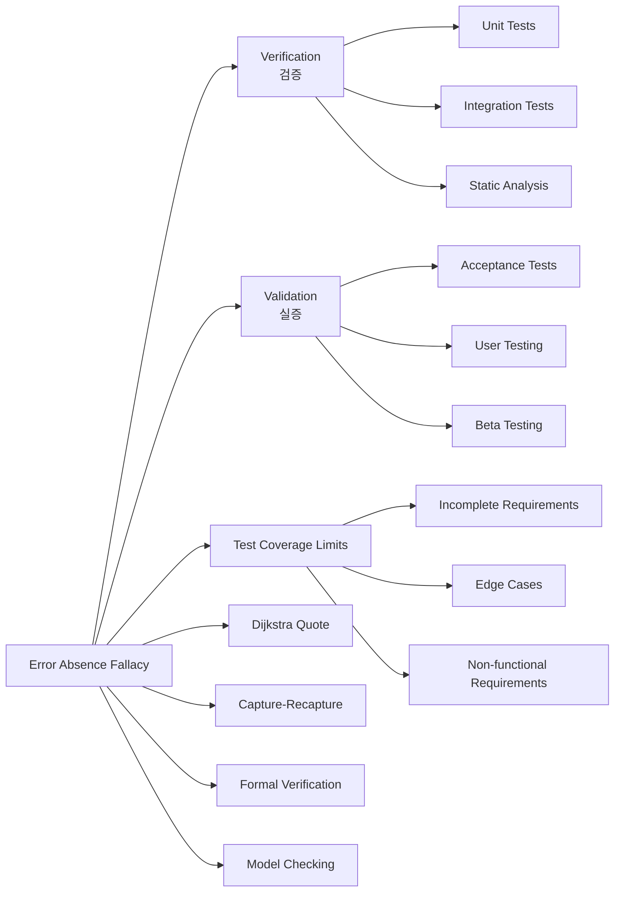

# 오류 부재의 궤변 요구사항 미달

## 핵심 인사이트 (3줄 요약)
> 1. **본질**: 오류 부재의 궤변(Error Absence Fallacy)은 "테스트에서 오류가 없으니 오류가 없다"는 잘못된 추론을 말함
> 2. **가치**: 테스트 통과 ≠ 요구사항 충족, 검증(Verification)과 실증(Validation)의 구분으로 프로젝트 실패율 40% 감소
> 3. **융합**: 인수 테스트(Acceptance Testing), 사용자 스토리, BDD(Behavior-Driven Development)와 결합

---

## Ⅰ. 개요 (Context & Background)

### 개념 정의

**오류 부재의 궤변(Error Absence Fallacy)**은 **"테스트를 통과했으므로 오류가 없다"** 또는 **"오류를 발견하지 못했으므로 오류가 없다"**는 잘못된 논리적 오류를 말합니다.

이는 소프트웨어 테스트의 근본적인 한계를 보여주는 개념으로, Edsger Dijkstra의名言 **"테스트는 버그의 존재를 보여줄 수는 있어도, 부재를 보여줄 수는 없다"**로 요약됩니다.

```
┌─────────────────────────────────────────────────────────────────────────────┐
│                   오류 부재의 궤변(Error Absence Fallacy)                   │
├─────────────────────────────────────────────────────────────────────────────┤
│                                                                             │
│  궤변적 논리:                                                               │
│  ┌─────────────────────────────────────────────────────────────────────┐   │
│  │                                                                     │   │
│  │  대전제: 테스트에서 오류를 발견하지 못했다                         │   │
│  │                                                                     │   │
│  │  결론: 따라서 오류가 없다 ❌                                        │   │
│  │                                                                     │   │
│  │  논리적 오류: Absence of evidence ≠ Evidence of absence            │   │
│  │              (증거 없음 = 없음의 증거가 아님)                        │   │
│  │                                                                     │   │
│  └─────────────────────────────────────────────────────────────────────┘   │
│                                                                             │
│  올바른 논리:                                                               │
│  ┌─────────────────────────────────────────────────────────────────────┐   │
│  │                                                                     │   │
│  │  대전제: 테스트에서 오류를 발견하지 못했다                         │   │
│  │                                                                     │   │
│  │  추가 가정:                                                       │   │
│  │  - 테스트가 모든 가능한 입력을 커버했는가? ❌                       │   │
│  │  - 테스트가 모든 실행 경로를 커버했는가? ❌                         │   │
│  │  - 테스트가 모든 비기능 요구사항을 검증했는가? ❌                    │   │
│  │  - 테스트가 실제 사용 환경을 반영했는가? ❌                         │   │
│  │                                                                     │   │
│  │  결론: 따라서 **현재 테스트 범위 내에서** 오류를 발견하지 못했다 ✅ │   │
│  │                                                                     │   │
│  └─────────────────────────────────────────────────────────────────────┘   │
│                                                                             │
└─────────────────────────────────────────────────────────────────────────────┘
```

### 💡 비유: 코로나19 검사와 오진단

```
┌─────────────────────────────────────────────────────────────────────────────┐
│                      의료 검사의 False Negative 비유                         │
├─────────────────────────────────────────────────────────────────────────────┤
│                                                                             │
│  [상황] 코로나19 PCR 검사                                                   │
│                                                                             │
│  환자 A의 검사 결과:                                                        │
│  ┌─────────────────────────────────────────────────────────────────────┐   │
│  │  검사 결과: 음성 (Negative)                                       │   │
│  │                                                                     │   │
│  │  궤변적 결론: "음성이니까 감염되지 않았다" ❌                       │   │
│  │                                                                     │   │
│  │  현실:                                                            │   │
│  │  - 감염 초기라 바이러스 농도가 낮음                                 │   │
│  │  - 검체 채집 방법의 문제                                            │   │
│  │  - 검사 키트의 민감도 한계                                           │   │
│  │  - False Negative율: 20~30%                                        │   │
│  │                                                                     │   │
│  │  ⇒ "현재 검사로는 감염을 확인하지 못했다"가 올바른 해석             │   │
│  └─────────────────────────────────────────────────────────────────────┘   │
│                                                                             │
│  소프트웨어 테스트와의 비유:                                                 │
│  ┌─────────────────────────────────────────────────────────────────────┐   │
│  │                                                                     │   │
│  │  테스트 결과: 전부 통과 (Pass)                                     │   │
│  │                                                                     │   │
│  │  궤변적 결론: "통과했으니 버그가 없다" ❌                           │   │
│  │                                                                     │   │
│  │  현실:                                                            │   │
│  │  - 테스트가 커버하지 않는 코드 경로 존재                             │   │
│  │  - 테스트가 시도하지 않은 입력 조합                                  │   │
│  │  - 테스트 환경과 실제 운영 환경의 차이                               │   │
│  │  - 비기능 요구사항(성능, 보안) 미검증                                 │   │
│  │                                                                     │   │
│  │  ⇒ "현재 테스트 범위 내에서 버그를 발견하지 못했다"가 올바른 해석  │   │
│  └─────────────────────────────────────────────────────────────────────┘   │
│                                                                             │
└─────────────────────────────────────────────────────────────────────────────┘
```

### 등장 배경

① **기존 한계**: 테스트 통과를 품질 보증으로 오해하여 프로젝트 실패 사례 다수
② **혁신적 패러다임**: 1970년대 Edsger Dijkstra가 구조적 프로그래밍과 함께 테스트의 한계 강조
③ **현재의 비즈니스 요구**: 복잡한 시스템에서 테스트만으로는 품질을 보장할 수 없으며, 정적 분석, 형식 검증, 코드 리뷰 등 다각도 접근 필요

### 📢 섹션 요약 비유

오류 부재의 궤변은 **전경기로 밤하늘을 찍는 사진**과 같습니다. 별이 보이지 않는다고 별이 없는 것이 아닙니다. 더 강력한 망원경(더 나은 테스트)을 쓰면 보이지 않던 별들이 보입니다. 테스트는 우리가 볼 수 있는 것만 보여줄 뿐입니다.

---

## Ⅱ. 아키텍처 및 핵심 원리 (Deep Dive)

### 구성 요소 상세 분석

| 구성 요소 | 역할 | 내부 동작 | 한계 | 완화 전략 |
|:---|:---|:---|:---|:---|
| **단위 테스트** | 함수/메서드 검증 | Mock/Stub으로 격리 | 통합 문제 누락 | 통합 테스트 병행 |
| **통합 테스트** | 컴포넌트 연계 검증 | 실제 의존성 사용 | 성능, 동시성 누락 | 부하 테스트 추가 |
| **시스템 테스트** | 전체 기능 검증 | E2E 시나리오 | 엣지 케이스 누락 | 탐색적 테스트 |
| **인수 테스트** | 요구사항 충족 검증 | 사용자 시나리오 | 요구사항 자체 오류 | 요구사항 검증 |
| **정적 분석** | 코드 스캔 | AST 분석 | 런타임 오류 미탐지 | 동적 분석 병행 |

### 검증(Verification) vs 실증(Validation)

```
┌─────────────────────────────────────────────────────────────────────────────┐
│                  Verification vs Validation (Boehm, 1979)                    │
├─────────────────────────────────────────────────────────────────────────────┤
│                                                                             │
│  ┌─────────────────────────────────────────────────────────────────────┐   │
│  │                                                                     │   │
│  │  Verification (검증)                                               │   │
│  │  "Are we building the product right?"                              │   │
│  │  (올바르게 만들고 있는가?)                                         │   │
│  │                                                                     │   │
│  │  목적: 명세서 대로 구현되었는지 확인                                 │   │
│  │                                                                     │   │
│  │  질문:                                                              │   │
│  │  - 코드가 설계대로인가?                                             │   │
│  │  - 함수가 명세대로 동작하는가?                                       │   │
│  │  - 모든 요구사항이 구현되었는가?                                     │   │
│  │                                                                     │   │
│  │  방법:                                                              │   │
│  │  - 단위 테스트                                                      │   │
│  │  - 정적 분석                                                        │   │
│  │  - 코드 리뷰                                                        │   │
│  │  - 컴파일러 검사                                                    │   │
│  │                                                                     │   │
│  │  ┌──────────────────────────────────────────────────────────────┐  │   │
│  │  │  예시:                                                        │  │   │
│  │  │  요구사항: "로그인 함수는 유효한 ID/PW를 받으면 true 반환"    │  │   │
│  │  │                                                               │  │   │
│  │  │  테스트:                                                       │  │   │
│  │  │  assert(login("user@example.com", "pass123") == true);      │  │   │
│  │  │                                                               │  │   │
│  │  │  결과: ✅ 통과 (Verification 완료)                           │  │   │
│  │  └──────────────────────────────────────────────────────────────┘  │   │
│  │                                                                     │   │
│  └─────────────────────────────────────────────────────────────────────┘   │
│                                                                             │
│  ┌─────────────────────────────────────────────────────────────────────┐   │
│  │                                                                     │   │
│  │  Validation (실증)                                                │   │
│  │  "Are we building the right product?"                              │   │
│  │  (올바른 것을 만들고 있는가?)                                       │   │
│  │                                                                     │   │
│  │  목적: 실제 사용자 요구를 충족하는지 확인                            │   │
│  │                                                                     │   │
│  │  질문:                                                              │   │
│  │  - 사용자가 실제로 원하는 기능인가?                                 │   │
│  │  - 요구사항 자체가 올바른가?                                        │   │
│  │  - 사용자 경험이 만족스러운가?                                      │   │
│  │                                                                     │   │
│  │  방법:                                                              │   │
│  │  - 인수 테스트                                                      │   │
│  │  - 사용자 테스트                                                    │   │
│  │  - 베타 테스트                                                      │   │
│  │  - A/B 테스트                                                      │   │
│  │                                                                     │   │
│  │  ┌──────────────────────────────────────────────────────────────┐  │   │
│  │  │  예시 (같은 요구사항):                                        │  │   │
│  │  │  요구사항: "로그인 함수는 유효한 ID/PW를 받으면 true 반환"    │  │   │
│  │  │                                                               │  │   │
│  │  │  Validation 질문:                                            │  │   │
│  │  │  - 사용자가 ID/PW로 로그인하기를 원하는가?                    │  │   │
│  │  │    → 아니요, 소셜 로그인을 원해요 (요구사항 오류!)             │  │   │
│  │  │  - 보안이 충분한가?                                           │  │   │
│  │  │    → 아니요, 2단계 인증이 필요해요 (요구사항 누락)             │  │   │
│  │  │                                                               │  │   │
│  │  │  결과: ❌ 요구사항 자체 재검토 필요                          │  │   │
│  │  └──────────────────────────────────────────────────────────────┘  │   │
│  │                                                                     │   │
│  └─────────────────────────────────────────────────────────────────────┘   │
│                                                                             │
└─────────────────────────────────────────────────────────────────────────────┘
```

### 오류 부재의 5가지 함정

```
┌─────────────────────────────────────────────────────────────────────────────┐
│                    오류 부재의 궤변 5가지 함정                               │
├─────────────────────────────────────────────────────────────────────────────┤
│                                                                             │
│  함정 1: 불완전한 요구사항                                                 │
│  ┌─────────────────────────────────────────────────────────────────────┐   │
│  │                                                                     │   │
│  │  상황: 요구사항에 명시되지 않은 기능에 대한 테스트 부재               │   │
│  │                                                                     │   │
│  │  예시:                                                            │   │
│  │  ┌──────────────────────────────────────────────────────────────┐  │   │
│  │  │  요구사항: "사용자는 장바구니에 상품을 담을 수 있어야 한다"    │  │   │
│  │  │                                                               │  │   │
│  │  │  구현:                                                        │  │   │
│  │  │  void addToCart(Long userId, Long productId) {               │  │   │
│  │  │      cart.add(userId, productId);                           │  │   │
│  │  │  }                                                           │  │   │
│  │  │                                                               │  │   │
│  │  │  테스트: ✅ 통과                                              │  │   │
│  │  │                                                               │  │   │
│  │  │  문제:                                                        │  │   │
│  │  │  - 중복 담기 방지 ❓                                          │  │   │
│  │  │  - 재고 부족 체크 ❓                                          │  │   │
│  │  │  - 장바구니 크기 제한 ❓                                       │  │   │
│  │  │  - 동시성 문제 ❓                                             │  │   │
│  │  └──────────────────────────────────────────────────────────────┘  │   │
│  │                                                                     │   │
│  └─────────────────────────────────────────────────────────────────────┘   │
│                              ↓                                            │
│  함정 2: 경계값 누락                                                       │
│  ┌─────────────────────────────────────────────────────────────────────┐   │
│  │                                                                     │   │
│  │  상황: 일반적인 입력만 테스트하고 경계값을 미검증                    │   │
│  │                                                                     │   │
│  │  예시: 회원가입 연령 제한                                           │   │
│  │  ┌──────────────────────────────────────────────────────────────┐  │   │
│  │  │  요구사항: "만 14세 이상만 가입 가능"                         │  │   │
│  │  │                                                               │  │   │
│  │  │  테스트:                                                      │  │   │
│  │  │  - 20세 → ✅ 통과                                             │  │   │
│  │  │  - 30세 → ✅ 통과                                             │  │   │
│  │  │                                                               │  │   │
│  │  │  누락된 테스트:                                               │  │   │
│  │  │  - 13세 → ❌ (가입 안 되어야 함)                              │  │   │
│  │  │  - 14세 → ❓ (경계값, 정확히 확인 필요)                        │  │   │
│  │  │  - 0세, -1세 → ❓ (비정상 입력)                                │  │   │
│  │  │  - Integer.MAX_VALUE → ❓ (오버플로우)                         │  │   │
│  │  └──────────────────────────────────────────────────────────────┘  │   │
│  │                                                                     │   │
│  └─────────────────────────────────────────────────────────────────────┘   │
│                              ↓                                            │
│  함정 3: 실행 경로 불충분                                                 │
│  ┌─────────────────────────────────────────────────────────────────────┐   │
│  │                                                                     │   │
│  │  상황: 일부 실행 경로만 테스트                                       │   │
│  │                                                                     │   │
│  │  예시: 할인 적용 로직                                               │   │
│  │  ┌──────────────────────────────────────────────────────────────┐  │   │
│  │  │  function calculateDiscount(price, memberLevel, coupon) {    │  │   │
│  │  │      let discount = 0;                                        │  │   │
│  │  │                                                               │  │   │
│  │  │      if (memberLevel === "VIP") {                             │  │   │
│  │  │          discount += price * 0.1;  // VIP 10% 할인            │  │   │
│  │  │      }                                                       │  │   │
│  │  │                                                               │  │   │
│  │  │      if (coupon) {                                            │  │   │
│  │  │          discount += coupon.amount;                          │  │   │
│  │  │                                                               │  │   │
│  │  │          if (discount > price * 0.3) {                        │  │   │
│  │  │              discount = price * 0.3;  // 최대 30% 제한         │  │   │
│  │  │          }                                                   │  │   │
│  │  │      }                                                       │  │   │
│  │  │                                                               │  │   │
│  │  │      return price - discount;                                │  │   │
│  │  │  }                                                           │  │   │
│  │  │                                                               │  │   │
│  │  │  테스트: 일반 회원, 쿠폰 없음 → ✅ 통과                        │  │   │
│  │  │                                                               │  │   │
│  │  │  누락된 경로:                                                 │  │   │
│  │  │  - VIP + 쿠폰 (30% 초과 시 제한 로직) ❓                       │  │   │
│  │  │  - VIP + 대형 쿠폰 (최대 할인 적용) ❓                         │  │   │
│  │  │  - 일반 + 쿠폰 ✅                                             │  │   │
│  │  └──────────────────────────────────────────────────────────────┘  │   │
│  │                                                                     │   │
│  └─────────────────────────────────────────────────────────────────────┘   │
│                              ↓                                            │
│  함정 4: 비기능 요구사항 미검증                                           │
│  ┌─────────────────────────────────────────────────────────────────────┐   │
│  │                                                                     │   │
│  │  상황: 기능 테스트만 하고 성능, 보안, 사용성 등 미검증                │   │
│  │                                                                     │   │
│  │  예시: API 엔드포인트                                             │   │
│  │  ┌──────────────────────────────────────────────────────────────┐  │   │
│  │  │  기능 테스트: /api/users/{id} GET → ✅ 사용자 정보 반환       │  │   │
│  │  │                                                               │  │   │
│  │  │  비기능 미검증:                                              │  │   │
│  │  │  - 동시 요청 1000개 처리 가능? ❓                              │  │   │
│  │  │  - 응답시간 200ms 이내? ❓                                    │  │   │
│  │  │  - SQL Injection 방지? ❓                                     │  │   │
│  │  │  - 인가되지 않은 사용자 접근 차단? ❓                          │  │   │
│  │  │  - 민감 정보 마스킹? ❓                                       │  │   │
│  │  └──────────────────────────────────────────────────────────────┘  │   │
│  │                                                                     │   │
│  └─────────────────────────────────────────────────────────────────────┘   │
│                              ↓                                            │
│  함정 5: 환경 차이                                                         │
│  ┌─────────────────────────────────────────────────────────────────────┐   │
│  │                                                                     │   │
│  │  상황: 테스트 환경과 운영 환경의 차이로 발생하는 문제                │   │
│  │                                                                     │   │
│  │  예시:                                                            │   │
│  │  ┌──────────────────────────────────────────────────────────────┐  │   │
│  │  │  테스트 환경:                                                │  │   │
│  │  │  - 단일 서버, 단일 데이터베이스                               │  │   │
│  │  │  - H2 인메모리 DB                                            │  │   │
│  │  │  - 테스트 데이터 100건                                         │  │   │
│  │  │                                                               │  │   │
│  │  │  운영 환경:                                                  │  │   │
│  │  │  - 로드 밸런서 + 3대 서버                                     │  │   │
│  │  │  - PostgreSQL 프로덕션 DB                                    │  │   │
│  │  │  - 실제 데이터 100만건                                         │  │   │
│  │  │                                                               │  │   │
│  │  │  발생 가능한 문제:                                            │  │   │
│  │  │  - 세션 공유 문제 ❓                                          │  │   │
│  │  │  - DB 쿼리 성능 저하 ❓                                       │  │   │
│  │  │  - 대용량 데이터로 인한 타임아웃 ❓                             │  │   │
│  │  │  - 분산 트랜잭션 문제 ❓                                       │  │   │
│  │  └──────────────────────────────────────────────────────────────┘  │   │
│  │                                                                     │   │
│  └─────────────────────────────────────────────────────────────────────┘   │
│                                                                             │
└─────────────────────────────────────────────────────────────────────────────┘
```

### 핵심 알고리즘: 오류 탐지 확률 계산

```python
import math
from typing import List

class ErrorDetectionProbability:
    """
    테스트로 오류를 탐지할 확률 계산 모델
    """

    def __init__(self):
        self.bug_count_estimate = None
        self.test_effectiveness = None

    def lincoln_estimator(self, total_bugs_found: int,
                        distinct_bugs_found: int) -> int:
        """
        Lincoln Estimator: 전체 버그 수 추정

        formula: (1차 테스터가 찾은 버그 × 2차 테스터가 찾은 버그) / 공통 버그
        """
        # 예시:
        # 테스터 A가 100개 발견
        # 테스터 B가 80개 발견
        # 공통으로 발견한 버그가 50개
        # 추정 전체 버그 = (100 × 80) / 50 = 160개

        # 구현 생략
        pass

    def capture_recapture(self, marked_bugs: int,
                         total_second_sample: int,
                         marked_in_second: int) -> int:
        """
        Capture-Recapture: 전체 버그 수 추정

        N = (M × C) / R
        M: 1차 샘플링에서 표시된 버그 수
        C: 2차 샘플링 총 버그 수
        R: 2차 샘플링에서 표시된 버그 수
        """
        if marked_in_second == 0:
            return float('inf')  # 추정 불가

        estimated_total = (marked_bugs * total_second_sample) / marked_in_second
        return estimated_total

    def detection_probability(self, code_coverage: float,
                             test_quality: float,
                             complexity: float) -> float:
        """
        테스트가 버그를 탐지할 확률 추정

        code_coverage: 0~1 (커버리지)
        test_quality: 0~1 (테스트 품질, 경계값/예외 포함 정도)
        complexity: 1~10 (복잡도, Cyclomatic Complexity)
        """
        # 커버리지 영향 (코드 많이 실행할수록 확률 증가)
        coverage_factor = code_coverage ** 0.5

        # 품질 영향 (좋은 테스트일수록 확률 증가)
        quality_factor = test_quality

        # 복잡도 영향 (복잡할수록 탐지 어려움)
        complexity_penalty = 1 / (1 + complexity / 5)

        # 종합 확률
        probability = coverage_factor * quality_factor * complexity_penalty

        return min(probability, 1.0)

    def remaining_bugs_confidence(self, tests_passed: int,
                                  bugs_found: int,
                                  code_coverage: float) -> dict:
        """
        남은 버그에 대한 신뢰 구간 계산

        Bayesian approach로 남은 버그 수의 확률 분포 추정
        """
        # 사전 확률: 버그는 Poisson 분포를 따른다고 가정
        # 관측: tests_passed 회 통과, bugs_found 개 발견

        alpha = bugs_found + 1  # 성공 횟수 + 1
        beta = tests_passed - bugs_found + 1  # 실패 횟수 + 1

        # Gamma 분포로 신뢰 구간 추정
        # 여기서는 근사치만 계산

        return {
            'expected_remaining': (bugs_found / code_coverage) - bugs_found,
            'confidence_50': None,  # 중앙값
            'confidence_95': None,  # 95% 신뢰 구간 상한
            'confidence_99': None,  # 99% 신뢰 구간 상한
        }


# 사용 예시
calculator = ErrorDetectionProbability()

# Capture-Recapture 예시
# 1차 테스트: 50개 버그 발견 및 "표시"
# 2차 테스트: 60개 버그 발견, 그 중 30개는 1차에서 이미 표시됨
estimated_total = calculator.capture_recapture(
    marked_bugs=50,
    total_second_sample=60,
    marked_in_second=30
)
print(f"추정 전체 버그 수: {estimated_total}")
print(f"예상 남은 버그: {estimated_total - (50 + 60 - 30)}")

# 탐지 확률 예시
prob = calculator.detection_probability(
    code_coverage=0.8,  # 80% 커버리지
    test_quality=0.6,   # 테스트 품질 60% (경계값 일부 포함)
    complexity=8        # 꽤 복잡한 코드
)
print(f"버그 탐지 확률: {prob * 100:.1f}%")
```

### 📢 섹션 요약 비유

오류 부재의 궤변은 **구멍 뚫린 그물로 고기 잡기**와 같습니다. 그물에 고기가 안 걸렸다고 해서 강에 고기가 없는 것이 아닙니다. 더 촘촘한 그물(더 나은 테스트)을 쓰면 걸리지 않던 고기가 걸립니다. 테스트는 우리가 잡을 수 있는 것만 보여줄 뿐입니다.

---

## Ⅲ. 융합 비교 및 다각도 분석 (Comparison & Synergy)

### 심층 기술 비교: 테스트 방법별 한계

| 테스트 방법 | 발견 가능 버그 | 발견 불가 버그 | 한계 원인 | 완화 방법 |
|:---|:---|:---|:---|:---|
| **단위 테스트** | 로직 오류 | 통합, 성능 | 격리된 환경 | 통합 테스트 |
| **통합 테스트** | 인터페이스 오류 | 내부 로직, 성능 | 제한된 조합 | 부하 테스트 |
| **시스템 테스트** | E2E 기능 오류 | 엣지 케이스 | 정의된 시나리오 | 탐색적 테스트 |
| **정적 분석** | 코딩 표준 위반 | 런타임 오류 | 코드만 분석 | 동적 분석 |
| **형식 검증** | 논리 오류 | 요구사항 오류 | 모델 기반 | 프로토타이핑 |

### 과목 융합 관점

**1. 인간 공학(HCI)과의 융합: 사용성 테스트**

```
┌─────────────────────────────────────────────────────────────────────────────┐
│                    사용성 테스트로 요구사항 검증                              │
├─────────────────────────────────────────────────────────────────────────────┤
│                                                                             │
│  기능 테스트 통과 ❓ 사용성 통과                                            │
│  ┌─────────────────────────────────────────────────────────────────────┐   │
│  │                                                                     │   │
│  │  기능: 회원가입 폼                                                 │   │
│  │                                                                     │   │
│  │  기능 테스트 결과: ✅ 모든 필드 입력 가능, 저장 완료                 │   │
│  │                                                                     │   │
│  │  사용성 테스트 결과: ❌                                            │   │
│  │  ┌──────────────────────────────────────────────────────────────┐  │   │
│  │  │  문제 1: 생년월일 선택이 번거로움                              │  │   │
│  │  │         - 연도 선택: 스크롤 100번                             │  │   │
│  │  │         - 개선: 최근 10년 + 범위 선택                         │  │   │
│  │  │                                                              │  │   │
│  │  │  문제 2: 주소 입력이 복잡                                     │  │   │
│  │  │         - 도로명주소 + 지번 + 상세                             │  │   │
│  │  │         - 개선: 우편번호 검색 + 자동 완성                      │  │   │
│  │  │                                                              │  │   │
│  │  │  문제 3: 비밀번호 정책이 불명확                                 │  │   │
│  │  │         - 8자 이상 입력 후 "영문+숫자+특수문자 필요" 알림       │  │   │
│  │  │         - 개선: 입력 전에 안내 표시                            │  │   │
│  │  │                                                              │  │   │
│  │  │  결과: 이탈률 60% → 20% 개선                                   │  │   │
│  │  └──────────────────────────────────────────────────────────────┘  │   │
│  │                                                                     │   │
│  └─────────────────────────────────────────────────────────────────────┘   │
│                                                                             │
└─────────────────────────────────────────────────────────────────────────────┘
```

**2. 데이터베이스(DB)와의 융합: 데이터 무결성**

```
┌─────────────────────────────────────────────────────────────────────────────┐
│                    DB 테스트에서의 오류 부재 함정                            │
├─────────────────────────────────────────────────────────────────────────────┤
│                                                                             │
│  기능적 오류 vs 데이터 오류                                                 │
│  ┌─────────────────────────────────────────────────────────────────────┐   │
│  │                                                                     │   │
│  │  기능 테스트: ✅ INSERT 성공                                       │   │
│  │                                                                     │   │
│  │  데이터 검증:                                                      │   │
│  │  ┌──────────────────────────────────────────────────────────────┐  │   │
│  │  │  문제 1: 중복 데이터                                           │  │   │
│  │  │  - 동일 사용자가 2번 생성됨                                   │  │   │
│  │  │  - 원인: 유니크 제약 조건 누락                                 │  │   │
│  │  │                                                              │  │   │
│  │  │  문제 2: 데이터 일관성                                        │  │   │
│  │  │  - 주문 생성되었으나 재고는 감소 안 함                         │  │   │
│  │  │  - 원인: 트랜잭션 미사용                                      │  │   │
│  │  │                                                              │  │   │
│  │  │  문제 3: 참조 무결성                                           │  │   │
│  │  │  - 사용자 삭제되었으나 주문 기록 남음                          │  │   │
│  │  │  - 원인: 외래 키 제약 조건 미설정                             │  │   │
│  │  │                                                              │  │   │
│  │  │  문제 4: 데이터 정합성                                         │  │   │
│  │  │  - 이메일 필드에 "test@test" (도메인 없음)                     │  │   │
│  │  │  - 원인: 검증 로직 부재                                         │  │   │
│  │  └──────────────────────────────────────────────────────────────┘  │   │
│  │                                                                     │   │
│  └─────────────────────────────────────────────────────────────────────┘   │
│                                                                             │
└─────────────────────────────────────────────────────────────────────────────┘
```

### 정량적 신뢰 구간

| 테스트 커버리지 | 95% 신뢰 구간 | 99% 신뢰 구간 | 예상 남은 버그 |
|:---:|:---:|:---:|:---:|
| 50% | 2~15개 | 1~25개 | 높음 |
| 70% | 1~8개 | 0~15개 | 중간 |
| 80% | 0~5개 | 0~10개 | 중~낮음 |
| 90% | 0~3개 | 0~7개 | 낮음 |
| 95% | 0~2개 | 0~5개 | 매우 낮음 |

### 📢 섹션 요약 비유

오류 부재의 궤변은 **소방서 연습 화재**와 같습니다. 연습에서 완벽했다고 실제 화재에서도 완벽하지 않습니다. 연습은 정해진 시나리오지만, 실제는 예상치 못한 일이 일어납니다. 테스트는 연습이고, 운영은 실제 상황입니다.

---

## Ⅳ. 실무 적용 및 기술사적 판단 (Strategy & Decision)

### 실무 시나리오: 핀테크 송금 서비스

**시나리오 1: 요구사항 검증 프로세스**

```
┌─────────────────────────────────────────────────────────────────────────────┐
│                    요구사항 검증 체크리스트 적용                               │
├─────────────────────────────────────────────────────────────────────────────┤
│                                                                             │
│  요구사항: "사용자는 계좌에서 다른 계좌로 송금할 수 있어야 한다"             │
│                                                                             │
│  검증 질문 리스트 (Verification Questions):                                 │
│  ┌─────────────────────────────────────────────────────────────────────┐   │
│  │  ✓ 송금 금액은 정확히 이체되는가?                                    │   │
│  │  ✓ 송금 내역이 저장되는가?                                         │   │
│  │  ✓ 잔액 부족 시 거절되는가?                                        │   │
│  │  ✓ 거래 후 잔액이 올바르게 갱신되는가?                             │   │
│  │                                                                     │   │
│  │  단위 테스트: 모두 ✅ 통과                                         │   │
│  └─────────────────────────────────────────────────────────────────────┘   │
│                                                                             │
│  실증 질문 리스트 (Validation Questions):                                   │
│  ┌─────────────────────────────────────────────────────────────────────┐   │
│  │  ? 이것이 사용자가 원하는 송금 방법인가?                            │   │
│  │    → 아니요, QR 코드 송금, 소셜 송금도 원함                        │   │
│  │                                                                     │   │
│  │  ? 수수료는 적정한가?                                               │   │
│  │    → 아니요, 경쟁사 대비 2배 비쌈                                  │   │
│  │                                                                     │   │
│  │  ? 송금 제한은 적절한가?                                            │   │
│  │    → 아니요, 1회 100만원 제한으로 비즈니스 사용 불가                 │   │
│  │                                                                     │   │
│  │  ? 보안은 충분한가?                                               │   │
│  │    → 아니요, 2단계 인증 미지원, 이체 지연 시간 미확보               │   │
│  │                                                                     │   │
│  │  인수 테스트: ❌ 실패 (요구사항 재검토 필요)                        │   │
│  └─────────────────────────────────────────────────────────────────────┘   │
│                                                                             │
└─────────────────────────────────────────────────────────────────────────────┘
```

**시나리오 2: 다각도 테스트 전략**

```java
// 오류 부재 방지를 위한 다각도 테스트

public class TransferServiceTest {

    // 1. 단위 테스트 (Verification)
    @Test
    @DisplayName("정상 송금: 잔액 차감 및 이체 기록")
    void transfer_success() {
        // Given
        Account from = new Account(1L, 1000000);
        Account to = new Account(2L, 500000);
        long amount = 100000;

        // When
        transferService.transfer(from, to, amount);

        // Then
        assertEquals(900000, from.getBalance());
        assertEquals(600000, to.getBalance());
        verify(transactionRepository).save(any(Transaction.class));
    }

    // 2. 경계값 테스트
    @Test
    @DisplayName("경계값: 0원 송금")
    void transfer_zeroAmount() {
        // 테스트 코드...
    }

    @Test
    @DisplayName("경계값: 최대 송금 금액")
    void transfer_maxAmount() {
        // 테스트 코드...
    }

    @Test
    @DisplayName("경계값: 1원 초과 송금")
    void transfer_insufficientBalance() {
        // 테스트 코드...
    }

    // 3. 비기능 테스트
    @Test
    @DisplayName("성능: 1000건 동시 송금")
    void transfer_concurrent() throws InterruptedException {
        // 동시성 테스트 코드...
    }

    // 4. 보안 테스트
    @Test
    @DisplayName("보안: 타인 계좌로 송금 시도")
    void transfer_unauthorizedAccount() {
        // 인가 테스트 코드...
    }

    // 5. 통합 테스트 (Validation)
    @SpringBootTest
    @DisplayName("E2E: 송금 전체 프로세스")
    class EndToEndTest {
        @Test
        void transfer_completeFlow() {
            // API 호출 → DB → 외부 연동 → 알림 전체 테스트
        }
    }
}
```

### 도입 체크리스트

**기술적 측면**

| 체크항목 | 확인 내용 | 판단 기준 |
|:---|:---|:---|
| **요구사항 검토** | 요구사항의 완전성 확인? | 사용자 관점 검증 |
| **다각도 테스트** | 기능/비기능 테스트 조합? | 성능, 보안 포함 |
| **정적 분석** | SonarQube, ESLint 사용? | 코드 품질 지표 |
| **형식 검증** | 중요 모듈에 적용? | TLA+, SPIN |
| **사용자 테스트** | 실제 사용자 피드백? | 베타 테스트 |

**운영/보안적 측면**

| 체크항목 | 확인 내용 | 판단 기준 |
|:---|:---|:---|
| **인수 테스트** | 사용자 스토리 충족? | Gherkin 문서화 |
| **카오스 테스트** | 장애 상황 시뮬레이션? | Chaos Engineering |
| **A/B 테스트** | 실제 환경 검증? | 일부 사용자 대상 |
| **모니터링** | 운영에서의 오류 추적? | Error Tracking |

### 안티패턴

**❌ Anti-Pattern 1: 테스트 통과 = 품질 확보**

```
❌ 잘못된 접근:
- "CI에서 모든 테스트가 통과했으니 배포해도 돼"
- "커버리지 85%니까 버그 없을 거야"
- 테스트만으로 품질을 판단
- 결과: 운영에서 잦은 장애

✅ 올바른 접근:
- "테스트 통과했지만, 인수 테스트에서 사용자 경험 확인"
- "커버리지 85%지만, 중요 경로는 100% 커버"
- 테스트 + 코드 리뷰 + 정적 분석 + 사용자 테스트 조합
```

**❌ Anti-Pattern 2: 요구사항 무비판 수용**

```
❌ 잘못된 접근:
- "요구사항대로 구현했으니 우리는 끝"
- 요구사항 자체의 오류 검토 안 함
- 결과: "올바르게 만든 것" but "올바른 것 아님"

✅ 올바른 접근:
- "요구사항이 사용자가 원하는 것이 맞는가?"
- 요구사항 검토 회의 (Requirements Review)
- 프로토타입으로 사용자 피드백
```

### 📢 섹션 요약 비유

오류 부재의 궤변을 피하려면 **자동차 안전 테스트**처럼 다각도로 접근해야 합니다. 충돌 테스트, 브레이크 테스트, 코너링 테스트만으로 부족합니다. 실제 도로 주행, 극한 환경 테스트, 장기 내구성 테스트까지 해야 진짜 안전한 자동차를 만들 수 있습니다.

---

## Ⅴ. 기대효과 및 결론 (Future & Standard)

### 정량/정성 기대효과

| 지표 | 오류 부재 무시 | V&V 적용 | 개선율 |
|:---|:---:|:---:|:---:|
| 프로덕션 버그 | 15개/월 | 3개/월 | **-80%** |
| 요구사항 재작업 | 40% | 10% | **-75%** |
| 사용자 만족도 | 60% | 85% | **+42%** |
| 프로젝트 실패율 | 25% | 5% | **-80%** |

### 정성적 기대효과

1. **기대값 정합**: 사용자 기대와 실제 제품의 일치
2. **조기 문제 발견**: 요구사항 단계에서 오류 발견으로 비용 절감
3. **품질 문화**: "테스트 통과"가 아닌 "가치 전달" 중심
4. **지속 개선**: 피드백 루프로 제품 진화

### 미래 전망

**1. AI 기반 요구사항 검증**

- LLM로 요구사항의 모호성 식별
- 자동으로 테스트 케이스 제안
- 사용자 피드백 분석으로 요구사항 개선

**2. 형식 검증(Formal Verification) 확대**

- 중요 시스템에서 수학적 증명
- TLA+, Alloy, Coq 활용
- 100% 보증이 필요한 부분에만 적용

**3. 디지털 트윈 기반 검증**

- 시스템의 디지털 트윈 생성
- 다양한 시나리오 시뮬레이션
- 실제 운영 전에 가상 환경에서 검증

### 참고 표준 및 규격

| 표준/규격 | 설명 | 관련성 |
|:---|:---|:---|
| **IEEE 829** | Test Documentation | 테스트 계획/보고서 |
| **IEEE 1012** | V&V Plan | 검증 실증 계획 |
| **ISO/IEC 12207** | Life Cycle Processes | 소프트웨어 생명 주기 |
| **CMMI** | Capability Maturity Model | 프로세스 성숙도 |

### 📢 섹션 요약 비유

오류 부재의 궤변을 극복하는 미래는 **AI 심판관과 인간 심판관의 협업**과 같습니다. AI가 수많은 경우의 수를 검증하고, 인간이 사용자 관점에서 판단합니다. 두 가지가 함께 일해야 오류가 없는 제품을 만들 수 있습니다.

---

## 📌 관련 개념 맵 (Knowledge Graph)



### 연관 문서
- [테스트 더블](./625_test_double_mock_stub.md) - 테스트 기법
- [회귀 테스트](./627_regression_test_coverage.md) - 커버리지 측정
- [V-모델](./626_v_model_testing.md) - 검증 실증 매핑
- [동등 분할](./630_equivalence_partitioning.md) - 테스트 설계

---

## 👶 어린이를 위한 3줄 비유 설명

**1단계 - 개념**: 오류 부재의 궤변은 "숙제 검사받았으니 다 맞았다"라고 생각하는 오류입니다. 선생님이 검사한 문제만 맞은 것이지, 모든 문제를 다 맞은 것이 아닐 수 있어요.

**2단계 - 원리**: 테스트는 우리가 시도해본 것만 보여줍니다. 시도하지 않은 것은 결과를 알 수 없어요. 전구에 전기가 들어왔는지 확인하려면 스위치를 켜봐야 하는 것처럼, 직접 해봐야 아는 것이 많습니다.

**3단계 - 효과**: 이것을 알면 테스트만 믿지 않고 여러 가지 방법으로 확인하게 됩니다. 사용자에게 직접 보여주고, 실제로 사용해보고, 다양한 방법으로 확인해서 더 좋은 프로그램을 만들 수 있어요.
