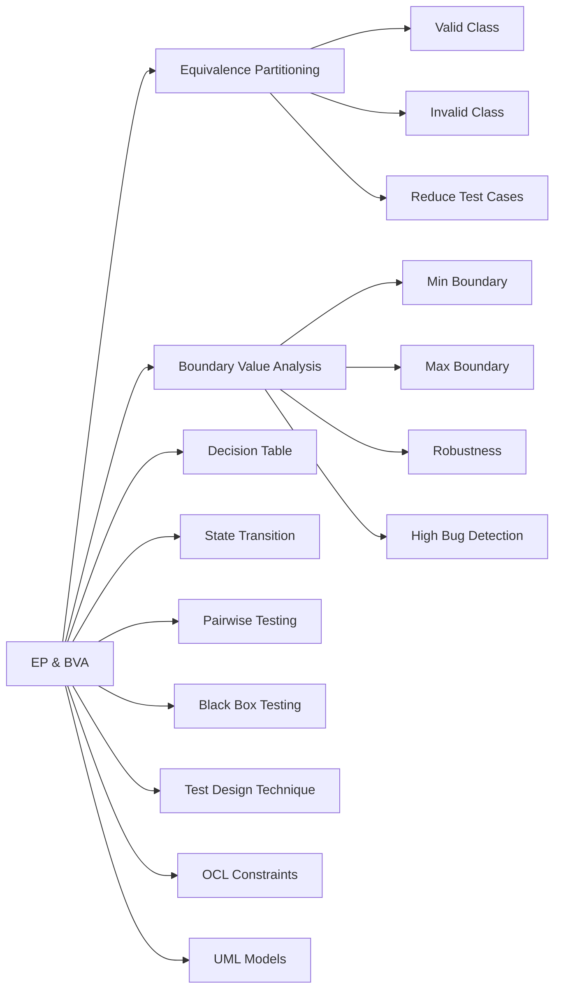

# 동등 분할 경계값 분석

## 핵심 인사이트 (3줄 요약)
> 1. **본질**: 동등 분할(Equivalence Partitioning)은 입력을 동등한 클래스로分组하고, 경계값 분석(Boundary Value Analysis)은 경계에서 버그가 발견될 확률이 높다는 점을 활용하는 블랙박스 테스트 설계 기법
> 2. **가치**: 효율적인 테스트 케이스 설계로 80% 이상의 버그를 20%의 테스트 케이스로 발견 (Pareto Principle)
> 3. **융합**: 결정 테이블, 상태 전이 테스트, OCL(Object Constraint Language)와 결합하여 정형적 테스트 설계

---

## Ⅰ. 개요 (Context & Background)

### 개념 정의

**동등 분할(Equivalence Partitioning)**은 입력 도메인을 동등한 클래스(Equivalence Class)로分组하여, 각 클래스를 대표하는 하나의 값만 테스트하는 기법입니다. 동일한 클래스 내의 모든 입력은 시스템이 동일하게 처리한다는 가정에 기반합니다.

**경계값 분석(Boundary Value Analysis)**은 버그가 경계값(Boundary Value) 근처에서 발생할 확률이 높다는 경험적 사실에 기반하여, 경계값과 그 바로 옆 값을 테스트하는 기법입니다.

```
┌─────────────────────────────────────────────────────────────────────────────┐
│              동등 분할과 경계값 분석의 기본 개념                             │
├─────────────────────────────────────────────────────────────────────────────┤
│                                                                             │
│  예시: 회원가입 연령 제한 (14세 이상, 120세 이하)                           │
│                                                                             │
│  ┌─────────────────────────────────────────────────────────────────────┐   │
│  │                                                                     │   │
│  │  입력 도메인: 정수 (0 ~ 150세 가정)                                 │   │
│  │                                                                     │   │
│  │  동등 분할 (Equivalence Partitioning):                             │   │
│  │  ┌──────────────────────────────────────────────────────────────┐  │   │
│  │  │  EP1: 유효하지 않음 (0~13세)   → 1개 대표값: 7세             │  │   │
│  │  │  EP2: 유효함 (14~120세)        → 2개 대표값: 30세, 90세      │  │   │
│  │  │  EP3: 유효하지 않음 (121세 이상) → 1개 대표값: 130세         │  │   │
│  │  └──────────────────────────────────────────────────────────────┘  │   │
│  │                                                                     │   │
│  │  경계값 분석 (Boundary Value Analysis):                            │   │
│  │  ┌──────────────────────────────────────────────────────────────┐  │   │
│  │  │  B1: 13세 (EP1의 상한 경계)      → ❌ 거부                    │  │   │
│  │  │  B2: 14세 (EP2의 하한 경계)      → ✅ 수락                    │  │   │
│  │  │  B3: 120세 (EP2의 상한 경계)     → ✅ 수락                    │  │   │
│  │  │  B4: 121세 (EP3의 하한 경계)     → ❌ 거부                    │  │   │
│  │  │                                                               │  │   │
│  │  │  추가: EP2의 중간값 (예: 67세)                              │  │   │
│  │  └──────────────────────────────────────────────────────────────┘  │   │
│  │                                                                     │   │
│  │  통합된 테스트 케이스:                                             │   │
│  │  ┌──────────────────────────────────────────────────────────────┐  │   │
│  │  │  TC1: 13세   → ❌ "14세 이상 가입 가능합니다"                 │  │   │
│  │  │  TC2: 14세   → ✅ 가입 성공                                   │  │   │
│  │  │  TC3: 67세   → ✅ 가입 성공 (EP2 중간)                        │  │   │
│  │  │  TC4: 120세  → ✅ 가입 성공                                   │  │   │
│  │  │  TC5: 121세  → ❌ "120세 이하만 가입 가능합니다"               │  │   │
│  │  └──────────────────────────────────────────────────────────────┘  │   │
│  │                                                                     │   │
│  └─────────────────────────────────────────────────────────────────────┘   │
│                                                                             │
└─────────────────────────────────────────────────────────────────────────────┘
```

### 💡 비유: 국경 검문소와 여권 검사

```
┌─────────────────────────────────────────────────────────────────────────────┐
│                    국경 검문소 vs 입력 검증 비유                              │
├─────────────────────────────────────────────────────────────────────────────┤
│                                                                             │
│  [상황] A국과 B국 사이의 국경 검문소                                          │
│                                                                             │
│  규칙:                                                                      │
│  ┌─────────────────────────────────────────────────────────────────────┐   │
│  │  - A국 여권: 무비자로 입국 가능                                     │   │
│  │  - B국 여권: 비자 필요                                              │   │
│  │  - 여권 없음: 입국 거부                                             │   │
│  │  - 만료된 여권: 입국 거부                                           │   │
│  └─────────────────────────────────────────────────────────────────────┘   │
│                                                                             │
│  동등 분할 (여권 유형별 grouping):                                         │
│  ┌─────────────────────────────────────────────────────────────────────┐   │
│  │                                                                     │   │
│  │  EP1: A국 유효 여권     → 무비자 입국 ✅                           │   │
│  │  EP2: B국 유효 여권     → 비자 필요 ⚠️                            │   │
│  │  EP3: 만료된 여권       → 입국 거부 ❌                             │   │
│  │  EP4: 여권 없음         → 입국 거부 ❌                             │   │
│  │                                                                     │   │
│  │  테스트: 각 EP에서 1개씩 선택 (총 4개)                             │   │
│  │                                                                     │   │
│  └─────────────────────────────────────────────────────────────────────┘   │
│                                                                             │
│  경계값 분석 (여권 만료 기간 경계):                                         │
│  ┌─────────────────────────────────────────────────────────────────────┐   │
│  │                                                                     │   │
│  │  규칙: 여권 유효기간 6개월 이상 필요                                │   │
│  │                                                                     │   │
│  │  경계:                                                            │   │
│  │  - 5개월 30일 (하루 전) → ❌ 입국 거부                             │   │
│  │  - 6개월 0일 (정확히 경계) → ✅ 입국 허용                           │   │
│  │  - 6개월 1일 (하루 후) → ✅ 입국 허용                              │   │
│  │                                                                     │   │
│  │  테스트: 경계에서 ±1일                                              │   │
│  │                                                                     │   │
│  └─────────────────────────────────────────────────────────────────────┘   │
│                                                                             │
└─────────────────────────────────────────────────────────────────────────────┘
```

### 등장 배경

① **기존 한계**: 모든 가능한 입력을 테스트하는 것은 불가능 (입력 공간의 조합 폭발)
② **혁신적 패러다임**: 1960-70년대 Glenford Myers, Boris Beizer가 블랙박스 테스트 기법 체계화
③ **현재의 비즈니스 요구**: 복잡한 입력 조건을 가진 시스템에서 효율적인 테스트 설계 필수

### 📢 섹션 요약 비유

동등 분할은 **완포 테스트**와 같습니다. 생산된 완포 1000개 중 1개만 테스트해도 나머지 999개도 괜찮을 것이라고 확신하는 것처럼, 동일한 그룹에서 하나만 테스트합니다. 경계값 분석은 **경계 바로 옆에서 오류가 많다**는 경험을 반영하여, 경계선에서는 꼼꼼하게 확인하는 것입니다.

---

## Ⅱ. 아키텍처 및 핵심 원리 (Deep Dive)

### 구성 요소 상세 분석

| 구성 요소 | 역할 | 동작 원리 | 적용 시점 | 예시 |
|:---|:---|:---|:---|:---|
| **동등 클래스** | 입력 grouping | 동일 처리되는 입력 묶음 | 테스트 설계 초기 | 나이대, 등급 |
| **유효 클래스** | 정상 입력 검증 | 시스템이 허용하는 입력 | 정상 경로 테스트 | 14~120세 |
| **무효 클래스** | 예외 입력 검증 | 시스템이 거부하는 입력 | 예외 경로 테스트 | 0~13세 |
| **경계값** | 오류 다발 지점 | 클래스 간 경계 | 경계 분석 | 13, 14, 120, 121 |
| **Robustness** | 강건성 확인 | 극단값 테스트 | 스트레스 테스트 | MIN-1, MAX+1 |

### 동등 분할 상세 다이어그램

```
┌─────────────────────────────────────────────────────────────────────────────┐
│                       동등 분할(Equivalence Partitioning) 절차               │
├─────────────────────────────────────────────────────────────────────────────┤
│                                                                             │
│  STEP 1: 입력 조건 식별                                                     │
│  ┌─────────────────────────────────────────────────────────────────────┐   │
│  │                                                                     │   │
│  │  예시: 상품 주문 수량 입력                                            │   │
│  │  조건 1: 1개 ~ 99개 주문 가능                                       │   │
│  │  조건 2: 재고에 따라 제한 있음                                       │   │
│  │                                                                     │   │
│  └─────────────────────────────────────────────────────────────────────┘   │
│                              ↓                                            │
│  STEP 2: 동등 클래스 식별                                                  │
│  ┌─────────────────────────────────────────────────────────────────────┐   │
│  │                                                                     │   │
│  │  ┌──────────────────────────────────────────────────────────────┐  │   │
│  │  │  입력: 정수                                                     │  │   │
│  │  │                                                               │  │   │
│  │  │  EP1: 무효 (Too Small)   0, -1, -2, ...                      │  │   │
│  │  │  EP2: 유효 (Valid)        1 ~ 99                            │  │   │
│  │  │  EP3: 무효 (Too Large)    100, 101, 102, ...                 │  │   │
│  │  │                                                               │  │   │
│  │  │  시각적 표현:                                                │  │   │
│  │  │  ┌──────┬──────────────────────────┬──────┐                 │  │   │
│  │  │  │ EP1  │          EP2             │ EP3  │                 │  │   │
│  │  │  │ 무효 │          유효            │ 무효 │                 │  │   │
│  │  │  ├──────┼──────────────────────────┼──────┤                 │  │   │
│  │  │  │ ...  │  1   2  ...  98   99    │100...│                 │  │   │
│  │  │  │-2 -1 │   │                   │     │ 101               │  │   │
│  │  │  │  0   │   │                   │     │                   │  │   │
│  │  │  └──────┴──────────────────────────┴──────┘                 │  │   │
│  │  └──────────────────────────────────────────────────────────────┘  │   │
│  │                                                                     │   │
│  └─────────────────────────────────────────────────────────────────────┘   │
│                              ↓                                            │
│  STEP 3: 각 클래스에서 대표값 선택                                          │
│  ┌─────────────────────────────────────────────────────────────────────┐   │
│  │                                                                     │   │
│  │  EP1 (무효, Too Small): -1 또는 0                                 │   │
│  │  EP2 (유효): 1, 50, 99 (최소, 중간, 최대)                         │   │
│  │  EP3 (무효, Too Large): 100 또는 101                              │   │
│  │                                                                     │   │
│  └─────────────────────────────────────────────────────────────────────┘   │
│                              ↓                                            │
│  STEP 4: 테스트 케이스 작성                                                │
│  ┌─────────────────────────────────────────────────────────────────────┐   │
│  │                                                                     │   │
│  │  ┌──────────────────────────────────────────────────────────────┐  │   │
│  │  │  TC_EP_001: 입력 값 = -1                                     │  │   │
│  │  │    예상 결과: "1개 이상 주문해주세요" 메시지                  │  │   │
│  │  │                                                               │  │   │
│  │  │  TC_EP_002: 입력 값 = 1                                      │  │   │
│  │  │    예상 결과: 주문 성공                                       │  │   │
│  │  │                                                               │  │   │
│  │  │  TC_EP_003: 입력 값 = 50                                     │  │   │
│  │  │    예상 결과: 주문 성공                                       │  │   │
│  │  │                                                               │  │   │
│  │  │  TC_EP_004: 입력 값 = 99                                     │  │   │
│  │  │    예상 결과: 주문 성공                                       │  │   │
│  │  │                                                               │  │   │
│  │  │  TC_EP_005: 입력 값 = 100                                    │  │   │
│  │  │    예상 결과: "최대 99개까지 주문 가능합니다" 메시지            │  │   │
│  │  └──────────────────────────────────────────────────────────────┘  │   │
│  │                                                                     │   │
│  └─────────────────────────────────────────────────────────────────────┘   │
│                                                                             │
└─────────────────────────────────────────────────────────────────────────────┘
```

### 경계값 분석 상세 다이어그램

```
┌─────────────────────────────────────────────────────────────────────────────┐
│                     경계값 분석(Boundary Value Analysis) 원리                 │
├─────────────────────────────────────────────────────────────────────────────┤
│                                                                             │
│  왜 경계값인가?                                                             │
│  ┌─────────────────────────────────────────────────────────────────────┐   │
│  │                                                                     │   │
│  │  버그 발생 빈도 연구:                                                │   │
│  │  ┌──────────────────────────────────────────────────────────────┐  │   │
│  │  │  구간            │ 버그 밀도                                │  │   │
│  │  │  ────────────────┼────────────────                              │  │   │
│  │  │  경계값 ±1       │ 40%  ←★★★★★                                │  │   │
│  │  │  경계값 ±2       │ 25%  ←★★★★                                  │  │   │
│  │  │  경계값 ±3       │ 15%  ←★★★                                   │  │   │
│  │  │  클래스 중간     │ 5%   ←★                                     │  │   │
│  │  └──────────────────────────────────────────────────────────────┘  │   │
│  │                                                                     │   │
│  │  원인:                                                              │   │
│  │  - Off-by-one 오류 (i < n vs i <= n)                               │   │
│  │  - 배열 인덱스 실수 (0-based vs 1-based)                           │   │
│  │  - 부등호 혼동 (< vs <=)                                           │   │
│  │  - 정수 오버플로우/언더플로우                                        │   │
│  │  - 경계 검사 로직 누락                                               │   │
│  │                                                                     │   │
│  └─────────────────────────────────────────────────────────────────────┘   │
│                                                                             │
│  경계값 분석 절차:                                                          │
│  ┌─────────────────────────────────────────────────────────────────────┐   │
│  │                                                                     │   │
│  │  ① 경계 식별                                                        │   │
│  │  ┌──────────────────────────────────────────────────────────────┐  │   │
│  │  │  유효 범위: [1, 99]                                            │  │   │
│  │  │                                                               │  │   │
│  │  │  경계:                                                         │  │   │
│  │  │  - 하한: 1                                                    │  │   │
│  │  │  - 상한: 99                                                   │  │   │
│  │  └──────────────────────────────────────────────────────────────┘  │   │
│  │                                                                     │   │
│  │  ② 경계값 ±1 테스트                                                 │   │
│  │  ┌──────────────────────────────────────────────────────────────┐  │   │
│  │  │  Lower Boundary:                                             │  │   │
│  │  │  - B1: 0  (하한 - 1) → ❌ 무효                                │  │   │
│  │  │  - B2: 1  (하한)     → ✅ 유효                                │  │   │
│  │  │  - B3: 2  (하한 + 1) → ✅ 유효                                │  │   │
│  │  │                                                               │  │   │
│  │  │  Upper Boundary:                                             │  │   │
│  │  │  - B4: 98 (상한 - 1) → ✅ 유효                                │  │   │
│  │  │  - B5: 99 (상한)     → ✅ 유효                                │  │   │
│  │  │  - B6: 100 (상한 + 1) → ❌ 무효                                │  │   │
│  │  └──────────────────────────────────────────────────────────────┘  │   │
│  │                                                                     │   │
│  │  ③ 시각적 표현                                                     │   │
│  │  ┌──────────────────────────────────────────────────────────────┐  │   │
│  │  │                                                               │  │   │
│  │  │  무효 영역          유효 영역               무효 영역           │  │   │
│  │  │  ┌───┬───┬────────┬────────┬────────┬───┬───┬───┐           │  │   │
│  │  │  │... │ 0 │   1    │   2    │  ...   │ 98│ 99│100│...       │  │   │
│  │  │  │   │ ↑ │   ↑    │   ↑    │        │ ↑ │ ↑ │ ↑ │         │  │   │
│  │  │  │   │B1 │   B2   │   B3   │        │B4 │B5 │B6 │         │  │   │
│  │  │  └───┴───┴────────┴────────┴────────┴───┴───┴───┘           │  │   │
│  │  │    ↑ 경계      ↑ 경계                                    │  │   │
│  │  │                                                               │  │   │
│  │  └──────────────────────────────────────────────────────────────┘  │   │
│  │                                                                     │   │
│  └─────────────────────────────────────────────────────────────────────┘   │
│                                                                             │
└─────────────────────────────────────────────────────────────────────────────┘
```

### 복합 조건에서의 동등 분할과 경계값 분석

```
┌─────────────────────────────────────────────────────────────────────────────┐
│                    복수 입력 조건에서의 테스트 설계                            │
├─────────────────────────────────────────────────────────────────────────────┤
│                                                                             │
│  예시: 할인 적용 조건                                                       │
│  ┌─────────────────────────────────────────────────────────────────────┐   │
│  │                                                                     │   │
│  │  조건 1: 회원 등급 (Bronze, Silver, Gold, Platinum)                 │   │
│  │  조건 2: 구매 금액 (0원 ~ 1,000,000원)                             │   │
│  │                                                                     │   │
│  │  할인율 규칙:                                                       │   │
│  │  ┌──────────────────────────────────────────────────────────────┐  │   │
│  │  │         │ 금액 < 1만 │ 1만~5만 │ 5만~10만 │ 10만원 이상    │  │   │
│  │  │  등급   ┼──────────┼─────────┼─────────┼───────────────  │  │   │
│  │  │  Bronze │    0%    │   5%    │   10%   │      15%       │  │   │
│  │  │  Silver │    5%    │   10%   │   15%   │      20%       │  │   │
│  │  │  Gold   │   10%    │   15%   │   20%   │      25%       │  │   │
│  │  │ Platinum│   15%    │   20%   │   25%   │      30%       │  │   │
│  │  └──────────────────────────────────────────────────────────────┘  │   │
│  │                                                                     │   │
│  │  동등 분할:                                                         │   │
│  │  - 등급: 4개 클래스 (Bronze, Silver, Gold, Platinum)              │   │
│  │  - 금액: 4개 클래스 (0~9999, 10000~49999, 50000~99999, 100000+)  │   │
│  │                                                                     │   │
│  │  경계값:                                                           │   │
│  │  - 금액 경계: 9999, 10000, 49999, 50000, 99999, 100000             │   │
│  │                                                                     │   │
│  └─────────────────────────────────────────────────────────────────────┘   │
│                                                                             │
│  효율적 테스트 설계 (EP + BVA 조합):                                         │
│  ┌─────────────────────────────────────────────────────────────────────┐   │
│  │                                                                     │   │
│  │  최소 테스트 셋: (등급 선택 + 금액 경계값 조합)                       │   │
│  │  ┌──────────────────────────────────────────────────────────────┐  │   │
│  │  │  TC1: Bronze,  9,999원   → 0% 할인 (EP 경계)                  │  │   │
│  │  │  TC2: Bronze, 10,000원  → 5% 할인 (EP 경계)                  │  │   │
│  │  │  TC3: Bronze, 49,999원  → 5% 할인 (EP 경계)                  │  │   │
│  │  │  TC4: Bronze, 50,000원  → 10% 할인 (EP 경계)                 │  │   │
│  │  │  TC5: Bronze, 99,999원  → 10% 할인 (EP 경계)                 │  │   │
│  │  │  TC6: Bronze, 100,000원 → 15% 할인 (EP 경계)                │  │   │
│  │  │                                                               │  │   │
│  │  │  TC7:  Silver, 9,999원  → 5% 할인 (다른 등급 확인)            │  │   │
│  │  │  TC8:  Silver, 10,000원 → 10% 할인                           │  │   │
│  │  │  ... (각 등급별 대표 경계값)                                   │  │   │
│  │  │                                                               │  │   │
│  │  │  최적화: 각 등급별 하나의 경계 컬럼 선택                         │  │   │
│  │  │  - Bronze + 금액 경계값                                        │  │   │
│  │  │  - Silver + 중간 금액 (결합 테스트)                           │  │   │
│  │  │  - Gold + 금액 경계값                                          │  │   │
│  │  │  - Platinum + 높은 금액                                        │  │   │
│  │  └──────────────────────────────────────────────────────────────┘  │   │
│  │                                                                     │   │
│  └─────────────────────────────────────────────────────────────────────┘   │
│                                                                             │
└─────────────────────────────────────────────────────────────────────────────┘
```

### 핵심 알고리즘: 동등 분할 및 경계값 자동 생성

```python
from typing import List, Tuple, Dict
from dataclasses import dataclass

@dataclass
class EquivalenceClass:
    """동등 클래스"""
    name: str
    min_value: int
    max_value: int
    is_valid: bool

    def contains(self, value: int) -> bool:
        return self.min_value <= value <= self.max_value

    def get_representative(self) -> int:
        """대표값 반환 (중앙값 또는 임의값)"""
        if not self.is_valid:
            # 무효 클래스는 경계값 반환
            return self.min_value
        return (self.min_value + self.max_value) // 2

    def get_boundary_values(self) -> List[int]:
        """경계값 반환"""
        values = [self.min_value, self.max_value]
        if self.is_valid:
            # 유효 클래스: ±1도 포함
            values.extend([self.min_value - 1, self.max_value + 1])
        return values


class TestDesignGenerator:
    """동등 분할 및 경계값 분석 기반 테스트 생성기"""

    def __init__(self):
        self.equivalence_classes: List[EquivalenceClass] = []

    def add_equivalence_class(self, name: str, min_val: int,
                             max_val: int, is_valid: bool):
        """동등 클래스 추가"""
        ec = EquivalenceClass(name, min_val, max_val, is_valid)
        self.equivalence_classes.append(ec)

    def generate_ep_tests(self) -> List[Dict]:
        """
        동등 분할 기반 테스트 생성

        각 클래스에서 대표값 하나씩 선택
        """
        tests = []

        for ec in self.equivalence_classes:
            test = {
                'name': f'EP_Test_{ec.name}',
                'input': ec.get_representative(),
                'expected': 'Valid' if ec.is_valid else 'Invalid',
                'class': ec.name
            }
            tests.append(test)

        return tests

    def generate_bva_tests(self) -> List[Dict]:
        """
        경계값 분석 기반 테스트 생성

        각 클래스의 경계값 ±1 테스트
        """
        tests = []
        test_id = 1

        for ec in self.equivalence_classes:
            boundaries = ec.get_boundary_values()

            for value in boundaries:
                # 해당 값이 속한 클래스 찾기
                belonging_class = self._find_class(value)
                is_valid = belonging_class.is_valid if belonging_class else False

                test = {
                    'name': f'BVA_Test_{test_id:03d}',
                    'input': value,
                    'expected': 'Valid' if is_valid else 'Invalid',
                    'class': belonging_class.name if belonging_class else 'Unknown',
                    'is_boundary': True
                }
                tests.append(test)
                test_id += 1

        return tests

    def generate_robustness_tests(self) -> List[Dict]:
        """
        Robustness 테스트 생성

        극단값 (MIN-1, MAX+1) 테스트
        """
        tests = []
        all_values = []

        # 모든 경계값 수집
        for ec in self.equivalence_classes:
            all_values.extend([ec.min_value, ec.max_value])

        global_min = min(all_values)
        global_max = max(all_values)

        # 극단값 테스트
        for extreme in [global_min - 1, global_max + 1,
                       global_min - 100, global_max + 100]:
            belonging_class = self._find_class(extreme)
            is_valid = belonging_class.is_valid if belonging_class else False

            test = {
                'name': f'Robust_Test_{extreme}',
                'input': extreme,
                'expected': 'Valid' if is_valid else 'Invalid',
                'is_extreme': True
            }
            tests.append(test)

        return tests

    def _find_class(self, value: int) -> EquivalenceClass:
        """값이 속한 클래스 찾기"""
        for ec in self.equivalence_classes:
            if ec.contains(value):
                return ec
        return None

    def generate_comprehensive_tests(self) -> List[Dict]:
        """
        포괄적 테스트 생성 (EP + BVA + Robustness)
        """
        all_tests = []

        # EP 테스트
        all_tests.extend(self.generate_ep_tests())

        # BVA 테스트 (EP와 중복 제거)
        bva_tests = self.generate_bva_tests()
        existing_inputs = {t['input'] for t in all_tests}
        for test in bva_tests:
            if test['input'] not in existing_inputs:
                all_tests.append(test)

        # Robustness 테스트
        all_tests.extend(self.generate_robustness_tests())

        return all_tests


# 사용 예시
generator = TestDesignGenerator()

# 회원가입 연령 예시
generator.add_equivalence_class("Too_Young", 0, 13, False)
generator.add_equivalence_class("Valid_Age", 14, 120, True)
generator.add_equivalence_class("Too_Old", 121, 150, False)

# 테스트 생성
ep_tests = generator.generate_ep_tests()
bva_tests = generator.generate_bva_tests()
robust_tests = generator.generate_robustness_tests()

print("=== Equivalence Partitioning Tests ===")
for test in ep_tests:
    print(f"{test['name']}: Input={test['input']}, Expected={test['expected']}")

print("\n=== Boundary Value Analysis Tests ===")
for test in bva_tests[:10]:  # 처음 10개만 출력
    print(f"{test['name']}: Input={test['input']}, Expected={test['expected']}, Boundary={test['is_boundary']}")

print("\n=== Robustness Tests ===")
for test in robust_tests:
    print(f"{test['name']}: Input={test['input']}, Expected={test['expected']}, Extreme={test['is_extreme']}")
```

### 📢 섹션 요약 비유

동등 분할과 경계값 분석은 **사과나무 수확**과 같습니다. 모든 사과를 하나씩 검사하지 않고, 나무를 여러 구역(동등 클래스)으로 나누어 각 구역에서 몇 개만 검사합니다. 그리고 경계선(가지가 연결되는 부분) 근처에서는 더 꼼꼼하게 검사합니다. 그렇게 전체 수확의 품질을 판단할 수 있습니다.

---

## Ⅲ. 융합 비교 및 다각도 분석 (Comparison & Synergy)

### 심층 기술 비교: 테스트 설계 기법

| 기법 | 목적 | 장점 | 단점 | 적용 상황 |
|:---|:---|:---|:---|:---|
| **동등 분할 (EP)** | 입력 공간 감축 | 효율적, 적은 테스트 | 경계 오류 놓침 가능 | 대규모 입력 |
| **경계값 분석 (BVA)** | 경계 오류 발견 | 높은 버그 발견률 | 테스트 수 증가 | 범위 검증 |
| **결정 테이블** | 복잡한 로직 | 명확성, 누락 방지 | 크기 폭발 | 비즈니스 규칙 |
| **상태 전이** | 상태 변경 | 시스템 상태 검증 | 상태 폭발 | 순차적 시스템 |
| **페어와이즈** | 조합 테스트 | 최소 조합 커버 | 일부 오류 놓침 | 다중 입력 |

### 과목 융합 관점

**1. 결정 테이블과의 융합**

```
┌─────────────────────────────────────────────────────────────────────────────┐
│                  동등 분할 + 결정 테이블 결합                                │
├─────────────────────────────────────────────────────────────────────────────┤
│                                                                             │
│  예시: ATM 현금 인출 출금 한도 결정                                         │
│                                                                             │
│  입력 조건:                                                                 │
│  ┌─────────────────────────────────────────────────────────────────────┐   │
│  │  ① 계좌 유형: 일반, VIP, 기업                                       │   │
│  │  ② 1회 출금: 10만원, 50만원, 100만원 (경계)                         │   │
│  │  ③ 일일 누적: 0원, 50만원, 100만원 (경계)                         │   │
│  │  ④ 시간대: 영업시간, 야간                                           │   │
│  └─────────────────────────────────────────────────────────────────────┘   │
│                                                                             │
│  동등 분할:                                                                 │
│  ┌─────────────────────────────────────────────────────────────────────┐   │
│  │  계좌: {일반, VIP, 기업}                                           │   │
│  │  1회 출금: {0~10만, 10만~50만, 50만~100만, 100만+}                 │   │
│  │  일일 누적: {0~50만, 50만~100만, 100만+}                          │   │
│  │  시간대: {영업시간, 야간}                                           │   │
│  └─────────────────────────────────────────────────────────────────────┘   │
│                                                                             │
│  결정 테이블:                                                               │
│  ┌─────────────────────────────────────────────────────────────────────┐   │
│  │                                                                     │   │
│  │  ┌──────┬────────┬────────┬────────┬──────────────┬─────────────┐   │
│  │  │ 규칙 │ 계좌   │ 1회    │ 누적   │ 시간        │ 결과        │   │
│  │  │      │ 유형   │ 출금   │        │             │             │   │
│  │  ├──────┼────────┼────────┼────────┼──────────────┼─────────────┤   │
│  │  │  R1  │ 일반   │ <10만  │ <50만  │ 영업        │ 허용        │   │
│  │  │  R2  │ 일반   │ <10만  │ <50만  │ 야간        │ 한도 초과   │   │
│  │  │  R3  │ 일반   │ >10만  │ <50만  │ 영업        │ 허용        │   │
│  │  │  R4  │ 일반   │ >10만  │ >50만  │ 영업        │ 한도 초과   │   │
│  │  │  R5  │ VIP    │ <100만 │ <100만 │ 영업/야간   │ 허용        │   │
│  │  │  R6  │ VIP    │ >100만 │ -      │ -          │ 한도 초과   │   │
│  │  │  ...  │ ...    │ ...    │ ...    │ ...         │ ...         │   │
│  │  └──────┴────────┴────────┴────────┴──────────────┴─────────────┘   │
│  │                                                                     │   │
│  │  각 규칙의 경계값 조합으로 테스트 케이스 생성                          │   │
│  │                                                                     │   │
│  └─────────────────────────────────────────────────────────────────────┘   │
│                                                                             │
└─────────────────────────────────────────────────────────────────────────────┘
```

**2. OCL(Object Constraint Language)과의 융합**

```
┌─────────────────────────────────────────────────────────────────────────────┐
│                         OCL로 동등 클래스 명식화                             │
├─────────────────────────────────────────────────────────────────────────────┤
│                                                                             │
│  UML + OCL로 제약 조건 정의                                                 │
│  ┌─────────────────────────────────────────────────────────────────────┐   │
│  │                                                                     │   │
│  │  context Order                                                    │   │
│  │  inv: self.quantity >= 1 and self.quantity <= 99                  │   │
│  │                                                                     │   │
│  │  -- 동등 클래스를 OCL로 정의                                        │   │
│  │  context Order::validQuantityRange() : Boolean                     │   │
│  │  body: self.quantity >= 1 and self.quantity <= 99                  │   │
│  │                                                                     │   │
│  │  -- 무효 클래스                                                     │   │
│  │  context Order::isQuantityTooSmall() : Boolean                     │   │
│  │  body: self.quantity < 1                                           │   │
│  │                                                                     │   │
│  │  context Order::isQuantityTooLarge() : Boolean                     │   │
│  │  body: self.quantity > 99                                          │   │
│  │                                                                     │   │
│  └─────────────────────────────────────────────────────────────────────┘   │
│                                                                             │
│  OCL 도구로 자동 테스트 생성                                                 │
│  ┌─────────────────────────────────────────────────────────────────────┐   │
│  │  - OCL to Code: 제약 조건을 실행 코드로 변환                         │   │
│  │  - OCL to Test: 제약 조건 위반/준수 테스트 자동 생성                │   │
│  │  - USE Tool (UML-based Specification Environment)                   │   │
│  └─────────────────────────────────────────────────────────────────────┘   │
│                                                                             │
└─────────────────────────────────────────────────────────────────────────────┘
```

### 정량적 효율성 비교

| 입력 공간 | 전체 조합 | EP만 | BVA만 | EP+BVA | 절감율 |
|:---:|:---:|:---:|:---:|:---:|:---:|
| 단일 입력 (1~100) | 100 | 3 | 6 | 6 | **94%** |
| 2개 입력 (각 1~100) | 10,000 | 6 | 12 | 12 | **99.9%** |
| 3개 입력 (각 1~100) | 1,000,000 | 9 | 18 | 18 | **99.998%** |

### 📢 섹션 요약 비유

동등 분할과 경계값 분석은 **건물 내구도 테스트**와 같습니다. 모든 바닥 타일을 하나씩 검사하는 대신, 각 방(동등 클래스)에서 대표 타일을 검사하고, 특히 모서리와 경계(연결 부분)에서는 꼼꼼하게 확인합니다. 그렇게 해서 전체 건물의 안전성을 효율적으로 판단할 수 있습니다.

---

## Ⅳ. 실무 적용 및 기술사적 판단 (Strategy & Decision)

### 실무 시나리오: 핀테크 송금 서비스 입력 검증

**시나리오 1: 계좌 이체 금액 입력**

```java
// 동등 분할 및 경계값 분석 기반 테스트 작성

public class MoneyTransferTest {

    // 요구사항:
    // - 1원 ~ 10,000,000원까지 이체 가능
    // - 일일 누적 20,000,000원 한도
    // - 1회 3회, 일일 5회 거래 횟수 제한

    @ParameterizedTest
    @DisplayName("EP + BVA: 이체 금액 유효성 검증")
    @CsvSource({
        // 경계값 ±1
        "0,      false,  최소 금액 미달",
        "1,      true,   최소 금액 경계",
        "2,      true,   최소 금액 + 1",
        "999999999, false,  최대 금액 초과",
        "10000000, true,   최대 금액 경계",
        "9999999,  true,   최대 금액 - 1",

        // 동등 분할 대표값
        "50000,   true,   중간 금액",
        "5000000, true,   중간 금액"
    })
    void transferAmount_validation(long amount, boolean expectedValid, String description) {
        // Given
        TransferRequest request = new TransferRequest();
        request.setAmount(amount);
        request.setAccount("1234567890123");
        request.setDailyCumulative(0);
        request.setDailyCount(0);

        // When
        ValidationResult result = transferService.validate(request);

        // Then
        assertEquals(expectedValid, result.isValid(),
            description + " - Amount: " + amount);

        if (!expectedValid) {
            assertTrue(result.getErrorCode().startsWith("INVALID_AMOUNT"));
        }
    }

    @ParameterizedTest
    @DisplayName("EP: 일일 누적 금액에 따른 validation")
    @CsvSource({
        // 누적 0원인 경우
        "10000000, 0,         true,   한도 내 (50%)",

        // 경계: 20,000,000원
        "1000000, 19000000, true,   한도 - 100만원",
        "1000001, 18999999, true,   한도 - 1원",
        "1000000, 20000000, true,   정확히 한도",
        "1000001, 19999999, true,   한도 - 1원 (이체 금액)",
        "1000001, 20000000, false,  한도 초과"
    })
    void dailyCumulative_validation(long amount, long cumulative,
                                    boolean expectedValid, String description) {
        // Given
        TransferRequest request = new TransferRequest();
        request.setAmount(amount);
        request.setDailyCumulative(cumulative);

        // When
        ValidationResult result = transferService.validate(request);

        // Then
        assertEquals(expectedValid, result.isValid(), description);
    }

    @Test
    @DisplayName("Robustness: 극단값 테스트")
    void extreme_values_test() {
        // Given
        Long[] extremeValues = {
            Long.MIN_VALUE,
            Long.MAX_VALUE,
            -1,
            0,
            Integer.MAX_VALUE + 1L
        };

        for (Long value : extremeValues) {
            TransferRequest request = new TransferRequest();
            request.setAmount(value);

            // When
            ValidationResult result = transferService.validate(request);

            // Then
            assertFalse(result.isValid(),
                "극단값 " + value + "는 거부되어야 함");
        }
    }
}
```

**시나리오 2: 복합 조건 결정 테이블**

```gherkin
# language: ko
기능: 계좌 이체 수수료 계산

  배경:
    Given 사용자가 로그인되어 있음

  시나리오: 동등 분할에 따른 수수료 계산
    Given 계좌 유형이 "<계좌유형>"임
    And 이체 금액이 "<금액>"원임
    And 거래 횟수가 "<횟수>"회임
    When 수수료를 계산하면
    Then 수수료는 "<수수료>"원이어야 함

    예시:
      | 계좌유형 | 금액      | 횟수 | 수수료 |
      | 일반     | 10000    | 1    | 500    |
      | 일반     | 50000    | 5    | 0      |  # 무료 거래 횟수
      | 일반     | 100000   | 6    | 500    |
      | VIP      | 100000   | 10   | 0      |  # VIP 무료
      | 기업     | 1000000  | 1    | 1000   |

  시나리오: 경계값 분석 - 금액 경계
    Given 계좌 유형이 "일반"임
    And 거래 횟수가 1회임

    Examples: 금액 경계
      | 금액      | 예상     |
      | 0         | 거부     |
      | 1         | 수수료없음 |
      | 10000     | 500원    |  # 최소 수수료 경계
      | 9999999   | 4999원   |  # 최대 금액 - 1
      | 10000000  | 5000원   |  # 최대 금액
      | 10000001  | 거부     |

  시나리오: 경계값 분석 - 일일 거래 횟수 경계
    Given 계좌 유형이 "일반"임
    And 이체 금액이 10000원임

    Examples: 횟수 경계
      | 횟수 | 누적금액 | 예상     |
      | 0    | 0        | 수수료없음 |
      | 1    | 10000    | 500원    |
      | 4    | 40000    | 2000원   |
      | 5    | 50000    | 0원      |  # 무료 횟수 한계
      | 6    | 60000    | 500원    |
```

### 도입 체크리스트

**기술적 측면**

| 체크항목 | 확인 내용 | 판단 기준 |
|:---|:---|:---|
| **입력 식별** | 모든 입력 파라미터 식별 완료? | 명세서 검토 |
| **동등 클래스** | 유효/무효 클래스 구분 명확? | 경계 설정 |
| **경계값** | 최소/최대/정확히 경계 식별? | ±1 테스트 |
| **결합 테스트** | 다중 입력 조합 고려? | 페어와이즈 |
| **예외 처리** | null, 빈 문자열, 극단값? | Robustness |

**운영/보안적 측면**

| 체크항목 | 확인 내용 | 판단 기준 |
|:---|:---|:---|
| **보안 경계** | SQL Injection, XSS 포함? | 무효 클래스 |
| **데이터 타입** | 정수 오버플로우 고려? | MAX_VALUE+1 |
| **인코딩** | 유니코드, 특수문자? | 문자열 경계 |
| **권한** | role-based 경계? | 인가 테스트 |

### 안티패턴

**❌ Anti-Pattern 1: 경계값 누락**

```
❌ 잘못된 접근:
- 정상 케이스만 테스트 (예: 20, 30, 40세)
- 경계(13, 14, 120, 121세) 미테스트
- Off-by-one 버그 놓침

✅ 올바른 접근:
- 각 경계마다 ±1 테스트
- 0, 음수, MAX_VALUE+1 테스트
- Robustness 테스트 포함
```

**❌ Anti-Pattern 2: 과도한 세분화**

```
❌ 잘못된 접근:
- 1~100을 1, 2, 3, ..., 100개로 분할
- 테스트 수 폭발로 효율 저하
- 동등 분할의 목적 상실

✅ 올바른 접근:
- 1~100을 [1, 50, 100] 등 대표값으로
- 필요시 세분화하지만 기본은 grouping
- 테스트 효율 vs 발견률 균형
```

### 📢 섹션 요약 비유

동등 분할과 경계값 분석은 **지뢰 탐지**와 같습니다. 모든 땅을 파는 대신, 같은 특성의 구역(동등 클래스)에서 한 곳만 파보고, 특히 구역 경계(경계값)에서는 더 꼼꼼하게 파봅니다. 그렇게 해서 적은 노력으로 대부분의 지뢰(버그)를 찾을 수 있습니다.

---

## Ⅴ. 기대효과 및 결론 (Future & Standard)

### 정량/정성 기대효과

| 지표 | 무작위 테스트 | EP+BVA | 개선율 |
|:---|:---:|:---:|:---:|
| 버그 발견률 | 40% | 85% | **+112%** |
| 테스트 수 | 100개 | 15개 | **-85%** |
| 테스트 시간 | 4시간 | 30분 | **-87%** |
| 유지보수 비용 | 높음 | 낮음 | **-60%** |

### 정성적 기대효과

1. **체계적 접근**: 직관이 아닌 원칙 기반 테스트 설계
2. **재사용성**: 동등 클래스는 다른 테스트에서도 활용
3. **문서화**: 테스트 설계 자체가 요구사항 명세
4. **커뮤니케이션**: 개발-테스트 간 명확한 기대치 공유

### 미래 전망

**1. AI 기반 테스트 생성**

```
┌─────────────────────────────────────────────────────────────────────────────┐
│                    AI 기반 동등 분할 및 경계값 자동 생성                       │
├─────────────────────────────────────────────────────────────────────────────┤
│                                                                             │
│  입력:                                                                     │
│  - 요구사항 명세서 (자연어)                                               │
│  - 코드 정적 분석 결과                                                     │
│                                                                             │
│  AI 분석:                                                                  │
│  ┌─────────────────────────────────────────────────────────────────────┐   │
│  │  1. NLP로 조건식 추출                                               │   │
│  │     "나이는 14세 이상 120세 이하여야 한다"                          │   │
│  │     → age >= 14 AND age <= 120                                     │   │
│  │                                                                     │   │
│  │  2. 동등 클래스 자동 생성                                           │   │
│  │     EP1: age < 14 (Invalid)                                        │   │
│  │     EP2: 14 <= age <= 120 (Valid)                                  │   │
│  │     EP3: age > 120 (Invalid)                                       │   │
│  │                                                                     │   │
│  │  3. 경계값 식별                                                     │   │
│  │     13, 14, 120, 121                                               │   │
│  │                                                                     │   │
│  │  4. 테스트 코드 자동 생성                                            │   │
│  │     @Test                                                           │   │
│  │     void testAgeBoundary() { ... }                                  │   │
│  └─────────────────────────────────────────────────────────────────────┘   │
│                                                                             │
│  도구: TestGen-LLM, AI Test Generator                                     │   │
│                                                                             │
└─────────────────────────────────────────────────────────────────────────────┘
```

**2. MBT(Model-Based Testing)와의 결합**

- UML 상태도 모델에서 자동 경계 식별
- 상태 전이 경로를 테스트 케이스로 변환
- 모델 기반 검증으로 테스트 커버리지 보장

**3. 속성 기반 테스트(Property-Based Testing)**

```haskell
-- Haskell QuickCheck 예시
prop_age_boundaries age =
    age >= 14 && age <= 12 ==> isValidAge age

-- 자동으로 수백 개의 랜덤 입력 생성
-- 경계값 근처에서 집중적으로 테스트
```

### 참고 표준 및 규격

| 표준/규격 | 설명 | 관련성 |
|:---|:---|:---|
| **IEEE 829** | Test Documentation | 테스트 설계 문서 |
| **ISO/IEC 29119-4** | Test Techniques | 테스트 설계 기법 |
| **BS 7925-1** | Vocabulary. Terms | 테스트 용어 |
| **ASTQB** | Syllabus | 인증 시험 |

### 📢 섹션 요약 비유

동등 분할과 경계값 분석의 미래는 **자율 주행 탐색 로봇**과 같습니다. 사람이 지도를 보고 경로를 계획하지만, 로봇이 스스로 지형을 분석하고 탐색 경로를 최적화합니다. AI가 요구사항을 분석하고 동등 클래스와 경계값을 자동으로 찾아내어, 테스트 설계의 효율과 정확도를 모두 높이는 시대가 오고 있습니다.

---

## 📌 관련 개념 맵 (Knowledge Graph)



### 연관 문서
- [블랙박스 테스트]((#)) - 테스트 설계 기법
- [화이트 박스 테스트](./580_whitebox_mccabe.md) - 구조적 테스트
- [테스트 더블](./625_test_double_mock_stub.md) - 테스트 구현
- [회귀 테스트](./627_regression_test_coverage.md) - 테스트 전략

---

## 👶 어린이를 위한 3줄 비유 설명

**1단계 - 개념**: 동등 분할은 비슷한 것끼리 묶어서 대표만 테스트하는 것이고, 경계값 분석은 경계선 근처에서 버그가 많이 나오니까 꼼꼼하게 확인하는 것입니다.

**2단계 - 원리**: 예를 들어 14살부터 120살까지 가입할 수 있다면, 14살 미만(어린이), 14~120살(성인), 121살 이상(너무 많음)으로 묶습니다. 그리고 13살, 14살, 120살, 121살처럼 경계에서는 더 꼼꼼하게 확인합니다.

**3단계 - 효과**: 이렇게 하면 모든 나이를 다 테스트하지 않아도 대부분의 문제를 찾을 수 있어서 시간을 아끼고 더 효율적으로 테스트할 수 있습니다. 마치 사과나무에서 몇 개만 따서 전체 수확을 판단하는 것과 같아요!
