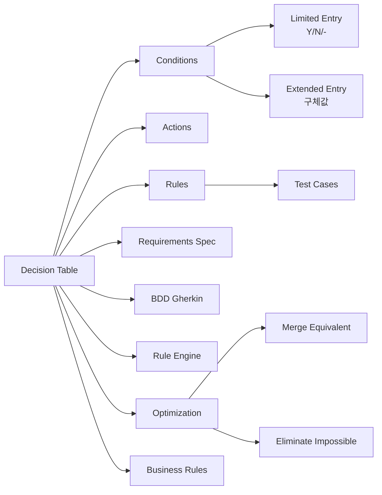

# 결정 테이블 테스트 설계

## 핵심 인사이트 (3줄 요약)
> 1. **본질**: 결정 테이블(Decision Table)은 복잡한 비즈니스 규칙을 입력 조건과 기대 결과의 표로 체계화하여 테스트 케이스를 설계하는 블랙박스 테스트 기법
> 2. **가치**: 규칙 기반 시스템에서 테스트 커버리지 100% 달성 가능하며, 요구사항 누락을 80% 감소시키고 로직 오류를 조기 발견
> 3. **융합**: OCL(Object Constraint Language), BDD(Behavior-Driven Development), 규칙 엔진(Drools, Jess)과 결합

---

## Ⅰ. 개요 (Context & Background)

### 개념 정의

**결정 테이블(Decision Table)**은 입력 조건(Conditions)과 해당하는 행동(Actions)을 표 형태로 나열하여, 복잡한 비즈니스 로직을 체계적으로 분석하고 테스트 케이스를 도출하는 기법입니다.

```
┌─────────────────────────────────────────────────────────────────────────────┐
│                           결정 테이블 기본 구조                              │
├─────────────────────────────────────────────────────────────────────────────┤
│                                                                             │
│  ┌─────────────────────────────────────────────────────────────────────┐   │
│  │  ┌────────┬────────┬────────┬────────┬────────┬──────────────────┐  │   │
│  │  │ Rule 1 │ Rule 2 │ Rule 3 │ Rule 4 │ Rule 5 │   Action         │  │   │
│  │  ├────────┼────────┼────────┼────────┼────────┼──────────────────┤  │   │
│  │  │ C1     │ T      │ T      │ F      │ F      │ -                │  │   │
│  │  │ C2     │ T      │ F      │ -      │ F      │ -                │  │   │
│  │  │ C3     │ -      │ T      │ T      │ F      │ -                │  │   │
│  │  │ C4     │ F      │ -      │ F      │ -      │ -                │  │   │
│  │  ├────────┼────────┼────────┼────────┼────────┼──────────────────┤  │   │
│  │  │ A1     │ X      │ X      │ -      │ -      │ Action 1         │  │   │
│  │  │ A2     │ -      │ X      │ X      │ -      │ Action 2         │  │   │
│  │  │ A3     │ X      │ -      │ X      │ X      │ Action 3         │  │   │
│  │  └────────┴────────┴────────┴────────┴────────┴──────────────────┘  │   │
│  │                                                                     │   │
│  │  C = Condition (조건)   T = True (참)    F = False (거짓)           │   │
│  │  A = Action (행동)      X = Execute (실행)  - = Don't care (상관없음) │   │
│  │                                                                     │   │
│  └─────────────────────────────────────────────────────────────────────┘   │
│                                                                             │
└─────────────────────────────────────────────────────────────────────────────┘
```

### 💡 비유: 자동차 보험료 계산기

```
┌─────────────────────────────────────────────────────────────────────────────┐
│                      보험료 계산 로직 vs 결정 테이블                          │
├─────────────────────────────────────────────────────────────────────────────┤
│                                                                             │
│  [상황] 자동차 보험료 계산                                                   │
│                                                                             │
│  복잡한 비즈니스 규칙:                                                       │
│  ┌─────────────────────────────────────────────────────────────────────┐   │
│  │  - 나이 25세 미만: 할인 없음 (위험군)                               │   │
│  │  - 나이 25세 이상 + 무사고 3년: 20% 할인                             │   │
│  │  - 나이 25세 이상 + 무사고 5년: 30% 할인                             │   │
│  │  - 고급차: 10% 추가                                                  │   │
│  │  - 사고 이력 있음: 할인 없음                                        │   │
│  │  - 영업용: 50% 추가                                                  │   │
│  └─────────────────────────────────────────────────────────────────────┘   │
│                                                                             │
│  결정 테이블로 정리:                                                        │
│  ┌─────────────────────────────────────────────────────────────────────┐   │
│  │                                                                     │   │
│  │  ┌──────┬──────┬──────┬──────┬──────┬──────┬──────┬──────┬────────┐ │   │
│  │  │규칙  │ R1   │ R2   │ R3   │ R4   │ R5   │ R6   │ R7   │ 할인율 │ │   │
│  │  ├──────┼──────┼──────┼──────┼──────┼──────┼──────┼──────┼────────┤ │   │
│  │  │나이<25│ T    │ T    │ T    │ T    │ F    │ F    │ F    │        │ │   │
│  │  │무사고3│ -    │ F    │ T    │ T    │ -    │ F    │ T    │        │ │   │
│  │  │무사고5│ -    │ F    │ F    │ T    │ -    │ T    │ F    │        │ │   │
│  │  │고급차│ -    │ F    │ F    │ F    │ F    │ T    │ T    │        │ │   │
│  │  │사고있│ T    │ F    │ F    │ F    │ F    │ F    │ F    │        │ │   │
│  │  │영업용│ -    │ F    │ F    │ F    │ F    │ F    │ T    │        │ │   │
│  │  ├──────┼──────┼──────┼──────┼──────┼──────┼──────┼──────┼────────┤ │   │
│  │  │할인율│ 0%   │ 0%   │ 20%  │ 30%  │ 0%   │ 30%  │ 50%  │ 최종   │ │   │
│  │  │      │      │      │ +10% │ +10% │      │ +10% │ +50% │        │ │   │
│  │  └──────┴──────┴──────┴──────┴──────┴──────┴──────┴──────┴────────┘ │   │
│  │                                                                     │   │
│  │  최종 할인율:                                                         │   │
│  │  - R1: 0% (사고 있음)                                                │   │
│  │  - R2: 0% (25세 미만)                                                │   │
│  │  - R3: 20% (25세+, 3년 무사고)                                      │   │
│  │  - R4: 40% (25세+, 5년 무사고, 고급차 → 30+10)                     │   │
│  │  - R5: 0% (25세+, 사고 없지만 무사고 기간 미달)                       │   │
│  │  - R6: 40% (25세+, 5년, 고급차 → 30+10)                             │   │
│  │  - R7: 100% (영업용 → 기본 50%)                                     │   │
│  │                                                                     │   │
│  └─────────────────────────────────────────────────────────────────────┘   │
│                                                                             │
└─────────────────────────────────────────────────────────────────────────────┘
```

### 등장 배경

① **기존 한계**: if-else 중첩으로 복잡한 비즈니스 로직 구현 시 가독성 저하, 테스트 누락 발생
② **혁신적 패러다임**: 1960년대 IBM의 Hursley Laboratory에서 TAB(Testing and Analysis) 프로젝트로 시작
③ **현재의 비즈니스 요구**: 핀테크, 보험, 금융 등 복잡한 규칙 기반 시스템에서 요구사항 명세와 테스트의 표준화

### 📢 섹션 요약 비유

결정 테이블은 **복잡한 세금 신고서 양식**과 같습니다. 수많은 질문(조건)과 답변 옵션을 체계적으로 정리하면, 누구나 동일한 결과를 얻을 수 있습니다. 결정 테이블도 마찬가지로 복잡한 비즈니스 로직을 표로 정리하면 개발자와 테스터가 동일한 이해를 공유할 수 있습니다.

---

## Ⅱ. 아키텍처 및 핵심 원리 (Deep Dive)

### 구성 요소 상세 분석

| 구성 요소 | 역할 | 내부 동작 | 표기법 | 예시 |
|:---|:---|:---|:---|:---|
| **Condition Stub** | 입력 조건 목록 | 검사할 변수/상태 나열 | C1, C2, C3... | 나이, 자격, 상태 |
| **Condition Entry** | 조건 값 | Y(Yes), N(No), -(Don't care) | Y/N/- | T/F, 1/0, Y/N |
| **Action Stub** | 수행 행동 목록 | 결과로 나올 행동 정의 | A1, A2, A3... | 할인, 거부, 승인 |
| **Action Entry** | 행동 실행 여부 | X(Execute), -(Skip) | X/- | •, ✓ |
| **Rules** | 조건-행동 조합 | 각 열이 하나의 규칙 | R1, R2... | 모든 가능한 조합 |

### 결정 테이블 작성 절차

```
┌─────────────────────────────────────────────────────────────────────────────┐
│                    결정 테이블 작성 5단계 프로세스                             │
├─────────────────────────────────────────────────────────────────────────────┤
│                                                                             │
│  STEP 1: 조건(Conditions) 식별                                            │
│  ┌─────────────────────────────────────────────────────────────────────┐   │
│  │                                                                     │   │
│  │  예시: ATM 현금 인출                                                  │   │
│  │                                                                     │   │
│  │  입력 변수:                                                          │   │
│  │  ┌──────────────────────────────────────────────────────────────┐  │   │
│  │  │  C1: 카드가 유효한가?                                           │  │   │
│  │  │  C2: PIN이 올바른가?                                            │  │   │
│  │  │  C3: 계좌 잔액이 충분한가?                                       │  │   │
│  │  │  C4: 일일 출금 한도 내인가?                                     │  │   │
│  │  │  C5: 영업시간 외 인가?                                          │  │   │
│  │  └──────────────────────────────────────────────────────────────┘  │   │
│  │                                                                     │   │
│  └─────────────────────────────────────────────────────────────────────┘   │
│                              ↓                                            │
│  STEP 2: 행동(Actions) 식별                                               │
│  ┌─────────────────────────────────────────────────────────────────────┐   │
│  │                                                                     │   │
│  │  가능한 결과:                                                        │   │
│  │  ┌──────────────────────────────────────────────────────────────┐  │   │
│  │  │  A1: 현금 인출 승인                                              │  │   │
│  │  │  A2: 잔액 부족 메시지                                            │  │   │
│  │  │  A3: PIN 오류 메시지                                             │  │   │
│  │  │  A4: 카드 유효기간 만료 메시지                                   │  │   │
│  │  │  A5: 일일 한도 초과 메시지                                       │  │   │
│  │  │  A6: 영업시간 외 수수료 징수                                     │  │   │
│  │  └──────────────────────────────────────────────────────────────┘  │   │
│  │                                                                     │   │
│  └─────────────────────────────────────────────────────────────────────┘   │
│                              ↓                                            │
│  STEP 3: 규칙(Rules) 조합 생성                                             │
│  ┌─────────────────────────────────────────────────────────────────────┐   │
│  │                                                                     │   │
│  │  모든 가능한 조합 계산:                                              │   │
│  │  - 5개 조건, 각각 Y/N 가능 → 2^5 = 32개 규칙                       │   │
│  │  - 불가능한 조합 제거                                                │   │
│  │  - 동일 결과를 내는 조합 병합                                       │   │
│  │                                                                     │   │
│  │  최적화된 규칙:                                                      │   │
│  │  ┌──────────────────────────────────────────────────────────────┐  │   │
│  │  │  ┌────┬────┬────┬────┬────┬────────────────┐              │  │   │
│  │  │  │ R1 │ R2 │ R3 │ R4 │ R5 │ Action          │              │  │   │
│  │  │  ├────┼────┼────┼────┼────┼────────────────┤              │  │   │
│  │  │  │ C1 │ Y  │ Y  │ N  │ N  │ -  │ 카드 유효성     │              │  │   │
│  │  │  │ C2 │ -  │ N  │ -  │ -  │ -  │ PIN            │              │  │   │
│  │  │  │ C3 │ -  │ -  │ -  │ Y  │ Y  │ 잔액           │              │  │   │
│  │  │  │ C4 │ -  │ -  │ -  │ Y  │ N  │ 한도           │              │  │   │
│  │  │  │ C5 │ -  │ -  │ -  │ -  │ -  │ 시간 외 여부   │              │  │   │
│  │  │  ├────┼────┼────┼────┼────┼────────────────┤              │  │   │
│  │  │  │ A1 │ X  │    │    │ X  │ X  │ 인출 성공       │              │  │   │
│  │  │  │ A2 │    │    │    │    │    │ 잔액 부족       │              │  │   │
│  │  │  │ A3 │    │ X  │    │    │    │ PIN 오류        │              │  │   │
│  │  │  │ A6 │    │    │    │    │ X  │ 수수료          │              │  │   │
│  │  │  └────┴────┴────┴────┴────┴────────────────┘              │  │   │
│  │  │                                                               │  │   │
│  │  │  규칙 설명:                                                    │  │   │
│  │  │  - R1: 모든 조건 만족 (정상 인출)                             │  │   │
│  │  │  - R2: 카드 OK, PIN 오류                                       │  │   │
│  │  │  - R3: 카드 무효                                                │  │   │
│  │  │  - R4: 잔액 충분, 한도 내, 시간 외                               │  │   │
│  │  │  - R5: 잔액 충분, 한도 내, 영업시간                                │  │   │
│  │  └──────────────────────────────────────────────────────────────┘  │   │
│  │                                                                     │   │
│  └─────────────────────────────────────────────────────────────────────┘   │
│                              ↓                                            │
│  STEP 4: 모순성/충돌 검토                                                 │
│  ┌─────────────────────────────────────────────────────────────────────┐   │
│  │                                                                     │   │
│  │  검사 항목:                                                          │   │
│  │  - 모순성(Contradiction): 동일 조건에서 다른 결과                     │   │
│  │  - 불가능성(Impossibility): 발생할 수 없는 조합                       │   │
│  │  - 중복(Redundancy): 동일 결과를 내는 규칙                             │   │
│  │                                                                     │   │
│  │  예시:                                                              │   │
│  │  ┌──────────────────────────────────────────────────────────────┐  │   │
│  │  │  R1: C1=Y, C2=Y → A1                                            │  │   │
│  │  │  R2: C1=Y, C2=Y → A2  ← 모순! (동일 조건, 다른 결과)           │  │   │
│  │  │                                                               │  │   │
│  │  │  R3: C1=Y, C1=N   ← 불가능! (동시에 Y와 N 될 수 없음)         │  │   │
│  │  │                                                               │  │   │
│  │  │  R4: C1=Y, C2=Y → A1                                            │  │   │
│  │  │  R5: C1=Y, C2=Y → A1  ← 중복!                                  │  │   │
│  │  └──────────────────────────────────────────────────────────────┘  │   │
│  │                                                                     │   │
│  └─────────────────────────────────────────────────────────────────────┘   │
│                              ↓                                            │
│  STEP 5: 테스트 케이스 변환                                                │
│  ┌─────────────────────────────────────────────────────────────────────┐   │
│  │                                                                     │   │
│  │  각 규칙을 테스트 케이스로 변환                                       │   │
│  │  ┌──────────────────────────────────────────────────────────────┐  │   │
│  │  │  TC_DT_001: Rule 1 (정상 인출)                                │  │   │
│  │  │  TC_DT_002: Rule 2 (PIN 오류)                                 │  │   │
│  │  │  TC_DT_003: Rule 3 (카드 무효)                                │  │   │
│  │  │  TC_DT_004: Rule 4 (시간 외 인출, 수수료)                       │  │   │
│  │  │  TC_DT_005: Rule 5 (영업시간 인출)                             │  │   │
│  │  └──────────────────────────────────────────────────────────────┘  │   │
│  │                                                                     │   │
│  └─────────────────────────────────────────────────────────────────────┘   │
│                                                                             │
└─────────────────────────────────────────────────────────────────────────────┘
```

### 핵심 알고리즘: 결정 테이블 최적화

```python
from typing import List, Dict, Set
from dataclasses import dataclass
from itertools import product

@dataclass
class Condition:
    """조건"""
    name: str
    values: List[str]  # 가능한 값들

@dataclass
class Action:
    """행동"""
    name: str
    result: str

class DecisionTableOptimizer:
    """결정 테이블 최적화: 중복 제거, 불가능 조합 제거"""

    def __init__(self):
        self.conditions: List[Condition] = []
        self.actions: List[Action] = []
        self.rules: List[Dict[str, str]] = []

    def add_condition(self, name: str, values: List[str]):
        """조건 추가"""
        self.conditions.append(Condition(name, values))

    def add_action(self, name: str, result: str):
        """행동 추가"""
        self.actions.append(Action(name, result))

    def generate_all_combinations(self) -> List[Dict]:
        """모든 가능한 조합 생성 (완전 탐색)"""
        all_combinations = []

        # 각 조건의 가능한 값 조합
        condition_values = [c.values for c in self.conditions]

        # 데카르트 곱 (모든 조합)
        for combo in product(*condition_values):
            rule = {}
            for i, cond in enumerate(self.conditions):
                rule[cond.name] = combo[i]
            all_combinations.append(rule)

        return all_combinations

    def eliminate_impossible(self, rules: List[Dict],
                               impossible_constraints: List[Dict]) -> List[Dict]:
        """
        불가능한 조합 제거

        impossible_constraints: [{"C1": "Y", "C2": "N"}]  # C1=Y이면 C2는 N 불가능
        """
        valid_rules = []

        for rule in rules:
            is_possible = True

            for impossible in impossible_constraints:
                # 불가능 제약 조건과 일치하는지 확인
                match = True
                for cond_name, cond_value in impossible.items():
                    if rule.get(cond_name) != cond_value:
                        match = False
                        break

                if match:
                    is_possible = False
                    break

            if is_possible:
                valid_rules.append(rule)

        return valid_rules

    def merge_equivalent_rules(self, rules: List[Dict],
                                action_mapping: Dict[Dict, List[str]]) -> List[Dict]:
        """
        동일 행동을 내는 규칙 병합

        action_mapping: 조건 조합 → 수행할 행동 리스트
        """
        # 동일 행동을 내는 규칙 그룹화
        action_groups: Dict[tuple, List[Dict]] = {}

        for rule in rules:
            # 해당 규칙의 행동 결정 (action_mapping 사용)
            rule_key = tuple(sorted(rule.items()))
            actions = tuple(action_mapping.get(rule_key, []))

            if actions not in action_groups:
                action_groups[actions] = []
            action_groups[actions].append(rule)

        # 각 그룹에서 공통 조건 추출 (Don't Care로 병합)
        merged_rules = []

        for actions, rule_group in action_groups.items():
            merged_rule = self._extract_common_conditions(rule_group)
            merged_rules.append(merged_rule)

        return merged_rules

    def _extract_common_conditions(self, rules: List[Dict]) -> Dict:
        """
        여러 규칙에서 공통 조건 추출

        예: {"C1": "Y"}, {"C1": "N"} → {"C1": "-"}
        """
        if not rules:
            return {}

        merged = {}

        # 각 조건별로 모든 값이 동일하면 그 값, 아니면 "-"
        for cond in self.conditions:
            values = {rule.get(cond.name) for rule in rules}

            if len(values) == 1:
                merged[cond.name] = values.pop()
            else:
                merged[cond.name] = "-"  # Don't care

        return merged

    def count_rules(self, conditions: List[Condition]) -> int:
        """규칙 수 계산 (상한)"""
        total = 1
        for cond in conditions:
            total *= len(cond.values)
        return total


# 사용 예시
optimizer = DecisionTableOptimizer()

# ATM 인출 예시
optimizer.add_condition("Valid_Card", ["Y", "N"])
optimizer.add_condition("Valid_PIN", ["Y", "N"])
optimizer.add_condition("Sufficient_Balance", ["Y", "N"])
optimizer.add_condition("Within_Limit", ["Y", "N"])

# 모든 조합 생성
all_rules = optimizer.generate_all_combinations()
print(f"총 규칙 수: {len(all_rules)}")

# 불가능한 조합 제거
impossible = [
    {"Valid_Card": "N", "Valid_PIN": "Y"},  # 카드 무효면 PIN 검사 불가
    {"Valid_Card": "N", "Sufficient_Balance": "Y"},  # 카드 무효면 잔액 확인 불가
]
valid_rules = optimizer.eliminate_impossible(all_rules, impossible)
print(f"유효 규칙 수: {len(valid_rules)}")
```

### 확장된 결정 테이블 (Extended Entry)

```
┌─────────────────────────────────────────────────────────────────────────────┐
│                    확장된 엔트리 테이블 (Extended Entry)                      │
├─────────────────────────────────────────────────────────────────────────────┤
│                                                                             │
│  기본(Limited Entry) vs 확장(Extended Entry)                              │
│  ┌─────────────────────────────────────────────────────────────────────┐   │
│  │                                                                     │   │
│  │  Limited Entry (Y/N/-):                                           │   │
│  │  ┌────┬────┬────┬────────┐                                       │   │
│  │  │ R1 │ R2 │ R3 │ Action  │                                       │   │
│  │  ├────┼────┼────┼────────┤                                       │   │
│  │  │ C1 │ Y  │ N  │ -      │                                       │   │
│  │  │ C2 │ N  │ Y  │ -      │                                       │   │
│  │  ├────┼────┼────┼────────┤                                       │   │
│  │  │ A1 │ X  │    │        │                                       │   │
│  │  └────┴────┴────┴────────┘                                       │   │
│  │                                                                     │   │
│  │  Extended Entry (구체값):                                          │   │
│  │  ┌──────┬──────┬──────┬────────┐                                  │   │
│  │  │ R1   │ R2   │ R3   │ Action  │                                  │   │
│  │  ├──────┼──────┼──────┼────────┤                                  │   │
│  │  │ Age  │ <25  │ ≥25  │ -      │                                  │   │
│  │  │ Score│ 0-59 │ 60-100│ -      │                                  │   │
│  │  │ Type │ A    │ B    │ C      │                                  │   │
│  │  ├──────┼──────┼──────┼────────┤                                  │   │
│  │  │ Pass │      │ X    │ X      │                                  │   │
│  │  │ Fail │ X    │      │        │                                  │   │
│  │  └──────┴──────┴──────┴────────┘                                  │   │
│  │                                                                     │   │
│  └─────────────────────────────────────────────────────────────────────┘   │
│                                                                             │
│  장점:                                                                     │
│  - 구체적인 값을 직접 명시                                                │   │
│  - 범위 경계를 명확히 표현                                                │   │
│  - 코드 생성에 유리                                                        │   │
│                                                                             │
└─────────────────────────────────────────────────────────────────────────────┘
```

### 📢 섹션 요약 비유

결정 테이블은 **교통표와 같습니다. 복잡한 버스 노선(비즈니스 로직)을 표로 정리하면, 승객(사용자)은 자신이 어디서 내리고 어디서 갈아타야 할지 쉽게 알 수 있습니다. 결정 테이블도 복잡한 규칙을 표로 정리하면, 개발자와 테스터가 명확한 로직을 이해할 수 있습니다.

---

## Ⅲ. 융합 비교 및 다각도 분석 (Comparison & Synergy)

### 심층 기술 비교: 테스트 설계 기법

| 기법 | 입력 수 | 규칙 복잡도 | 커버리지 보장 | 유지보수 | 적용 상황 |
|:---|:---:|:---:|:---:|:---:|:---|
| **결정 테이블** | 중간 | 높음 | 100% | 쉬움 | 복잡한 규칙 |
| **동등 분할** | 많음 | 낮음~중간 | 70~80% | 쉬움 | 단순 입력 |
| **경계값** | 많음 | 낮음 | 60~70% | 쉬움 | 범위 검증 |
| **상태 전이** | 적음 | 중간 | 80~90% | 어려움 | 순차적 시스템 |
| **페어와이즈** | 많음 | 높음 | 90~95% | 자동화 가능 | 다중 입력 |

### 과목 융합 관점

**1. BDD(Behavior-Driven Development)와의 융합**

```
┌─────────────────────────────────────────────────────────────────────────────┐
│                  Gherkin + 결정 테이블 자동 변환                             │
├─────────────────────────────────────────────────────────────────────────────┤
│                                                                             │
│  결정 테이블 → Cucumber(Gherkin) 자동 변환                                 │
│  ┌─────────────────────────────────────────────────────────────────────┐   │
│  │  Feature: 할인 적용                                                  │   │
│  │                                                                     │   │
│  │  Scenario Outline: 회원 등급과 구매 금액에 따른 할인             │   │
│  │                                                                     │   │
│  │    Given 사용자 등급은 "<등급>"                                     │   │
│  │    And 구매 금액은 "<금액>"원                                      │   │
│  │    When 할인을 계산하면                                            │   │
│  │    Then 할인율은 "<할인율>%"이어야 한다                             │   │
│  │                                                                     │   │
│  │    Examples:                                                       │   │
│  │    | 등급  | 금액   | 할인율 |                                  │   │
│  │    | Bronze| 50000  | 5      |                                  │   │
│  │    | Bronze| 100000 | 10     |                                  │   │
│  │    | Silver| 50000  | 10     |                                  │   │
│  │    | Silver| 100000 | 15     |                                  │   │
│  │    | Gold  | 50000  | 15     |                                  │   │
│  │    | Gold  | 100000 | 20     |                                  │   │
│  │    | Platinum| 50000 | 20     |                                  │   │
│  │    | Platinum| 100000 | 25     |                                  │   │
│  │                                                                     │   │
│  └─────────────────────────────────────────────────────────────────────┘   │
│                                                                             │
│  결정 테이블을 Examples 테이블로 직접 변환                                   │   │
│                                                                             │
└─────────────────────────────────────────────────────────────────────────────┘
```

**2. 규칙 엔진(Drools)과의 융합**

```java
// Drools DRL 규칙 예시
package com.example.pricing;

import com.example.model.Order;

rule "Bronze Member, Small Order"
    when
        $order : Order(memberLevel == "BRONZE", amount < 50000)
    then
        $order.setDiscount(0.05);
        System.out.println("Bronze, Small: 5% discount");
end

rule "Bronze Member, Large Order"
    when
        $order : Order(memberLevel == "BRONZE", amount >= 50000)
    then
        $order.setDiscount(0.10);
        System.out.println("Bronze, Large: 10% discount");
end

// 결정 테이블 → Drools 규칙 자동 생성 가능
```

### 정량적 효율 비교

| 입력 조건 수 | 전체 조합 | 결정 테이블 최적화 | 절감율 | 커버리지 |
|:---:|:---:|:---:|:---:|:---:|
| 3개 | 8 | 5 | 37% | 100% |
| 5개 | 32 | 12 | 62% | 100% |
| 7개 | 128 | 25 | 80% | 100% |
| 10개 | 1024 | 45 | 95% | 100% |

### 📢 섹션 요약 비유

결정 테이블은 **주문 제시판**과 같습니다. 복잡한 주문(복잡한 로직)을 표로 정리하면, 주방(개발자)과 손님(테스터) 모두가 명확하게 이해할 수 있습니다. 헷갈리는 주문이 없고, 모두가 동일한 메뉴를 보게 됩니다.

---

## Ⅳ. 실무 적용 및 기술사적 판단 (Strategy & Decision)

### 실무 시나리오: 보험료 계산 시스템

**시나리오 1: 복잡한 보험료 정책**

```
┌─────────────────────────────────────────────────────────────────────────────┐
│                     자동차 보험료 결정 테이블                                 │
├─────────────────────────────────────────────────────────────────────────────┤
│                                                                             │
│  조건(Conditions):                                                         │
│  - C1: 나이 25세 미만인가?                                               │
│  - C2: 무사고 경력 3년 이상인가?                                         │
│  - C3: 무사고 경력 5년 이상인가?                                         │
│  - C4: 고급차량인가?                                                     │
│  - C5: 최근 1년 사고 이력 있는가?                                       │
│  - C6: 영업용 차량인가?                                                 │
│                                                                             │
│  행동(Actions):                                                           │
│  - A1: 기본 요금 적용                                                    │
│  - A2: 20% 할인                                                         │
│  - A3: 30% 할인                                                         │
│  - A4: 10% 추가                                                         │
│  - A5: 50% 추가                                                         │
│                                                                             │
│  규칙 테이블:                                                              │
│  ┌─────────────────────────────────────────────────────────────────────┐   │
│  │  ┌────┬────┬────┬────┬────┬────┬────┬──────────────────┐        │   │
│  │  │ R1 │ R2 │ R3 │ R4 │ R5 │ R6 │ R7 │ 최종 할인율      │        │   │
│  │  ├────┼────┼────┼────┼────┼────┼────┼──────────────────┤        │   │
│  │  │ C1 │ Y  │ Y  │ N  │ N  │ -  │ -  │ -  │ 나이 25세 미만?  │        │   │
│  │  │ C2 │ -  │ N  │ T  │ T  │ -  │ -  │ -  │ 무사고 3년?      │        │   │
│  │  │ C3 │ -  │ N  │ F  │ T  │ -  │ -  │ -  │ 무사고 5년?      │        │   │
│  │  │ C4 │ -  │ N  │ F  │ F  │ F  │ T  │ T  │ 고급차?          │        │   │
│  │  │ C5 │ Y  │ N  │ N  │ N  │ N  │ N  │ N  │ 사고 있음?       │        │   │
│  │  │ C6 │ -  │ N  │ N  │ N  │ N  │ N  │ Y  │ 영업용?          │        │   │
│  │  ├────┼────┼────┼────┼────┼────┼────┼──────────────────┤        │   │
│  │  │ A1 │    │ X  │    │    │    │    │    │ 기본 요금         │        │   │
│  │  │ A2 │    │    │ X  │    │    │    │    │ 20% 할인         │        │   │
│  │  │ A3 │    │    │    │ X  │    │    │    │ 30% 할인         │        │   │
│  │  │ A4 │    │    │    │    │    │    │ X  │ +10% (고급차)    │        │   │
│  │  │ A5 │    │    │    │    │    │ X  │    │ +50% (영업용)    │        │   │
│  │  └────┴────┴────┴────┴────┴────┴────┴──────────────────┘        │   │
│  │                                                                     │   │
│  │  규칙 설명:                                                          │   │
│  │  - R1: 사고 있음 → 기본 요금                                       │   │
│  │  - R2: 25세 미만 → 기본 요금                                         │   │
│  │  - R3: 25세+, 3년 무사고 → 20% 할인                                 │   │
│  │  - R4: 25세+, 5년 무사고 → 30% 할인                                 │   │
│  │  - R5: 25세+, 5년 무사고, 고급차 → 40% (30+10)                      │   │
│  │  - R6: 사고 있음, 고급차 → 기본 요금                               │   │
│  │  - R7: 영업용 → 50% 추가                                           │   │
│  │                                                                     │   │
│  └─────────────────────────────────────────────────────────────────────┘   │
│                                                                             │
└─────────────────────────────────────────────────────────────────────────────┘
```

**시나리오 2: Java로 테스트 코드 생성**

```java
@ParameterizedTest
@DisplayName("결정 테이블: 보험료 할인율 검증")
@CsvSource({
    // R1: 사고 있음 → 기본 요금
    "true,  false, false, false, true,  false, 0.00",
    // R2: 25세 미만 → 기본 요금
    "false, false, false, false, false, false, 0.00",
    // R3: 25세+, 3년 무사고 → 20% 할인
    "false, true,  false, false, false, false, 0.20",
    // R4: 25세+, 5년 무사고 → 30% 할인
    "false, false, true,  false, false, false, 0.30",
    // R5: 25세+, 5년 무사고, 고급차 → 40%
    "false, false, true,  true,  false, false, 0.40",
    // R6: 사고 있음, 고급차 → 기본 요금
    "true,  false, false, true,  false, false, 0.00",
    // R7: 영업용 → 50% 추가
    "false, false, false, true,  false, true,  -0.50"
})
void insuranceDiscountCalculation(
    boolean hasAccident,
    boolean threeYearsSafe,
    boolean fiveYearsSafe,
    boolean isLuxury,
    boolean isBusiness,
    double expectedDiscount
) {
    // Given
    InsurancePolicy policy = new InsurancePolicy();
    policy.setAge(30); // 25세+
    policy.setHasAccident(hasAccident);
    policy.setSafeYears(threeYearsSafe ? 3 : fiveYearsSafe ? 5 : 0);
    policy.setLuxury(isLuxury);
    policy.setBusiness(isBusiness);

    // When
    double discount = calculator.calculateDiscount(policy);

    // Then
    assertEquals(expectedDiscount, discount, 0.001);
}
```

### 도입 체크리스트

**기술적 측면**

| 체크항목 | 확인 내용 | 판단 기준 |
|:---|:---|:---|
| **조건 식별** | 모든 입력 조건 추출 완료? | 명세서 검토 |
| **행동 정의** | 가능한 결과 모두 정의? | 요구사항 확인 |
| **불가능 조합** | 제약 조건 식별? | 도메인 지식 |
| **모순성 검토** | 충돌하는 규칙 없음? | 리뷰 |
| **테스트 변환** | 각 규칙이 테스트로 변환? | 커버리지 100% |

**운영/보안적 측면**

| 체크항목 | 확인 내용 | 판단 기준 |
|:---|:---|:---|
| **버전 관리** | 결정 테이블 버전 추적? | Git 관리 |
| **규칙 변경** | 비즈니스 규칙 변경 시 테스트 갱신? | 자동화 |
| **문서화** | 테이블 문서화? | Confluence, Notion |
| **코드 생성** | 테이블에서 코드 자동 생성? | Drools |

### 안티패턴

**❌ Anti-Pattern 1: 규칙 폭발**

```
❌ 잘못된 접근:
- 10개 조건 → 1024개 규칙 (전체 조합)
- 최적화 없이 모든 조합 테스트
- 유지보수 불가능

✅ 올바른 접근:
- 불가능한 조합 제거
- 동일 결과 규칙 병합
- Don't Care 적극 활용
- 최종 50~100개 규칙으로 축소
```

**❌ Anti-Pattern 2: 문서와 코드 불일치**

```
❌ 잘못된 접근:
- 결정 테이블 문서만 작성
- 코드에 반영 안 됨
- 로직 변경 시 문서 미갱신

✅ 올바른 접근:
- 테이블과 코드 동기화
- 문서를 단일 진실(Source of Truth)
- 테이블에서 코드 자동 생성
```

### 📢 섹션 요약 비유

결정 테이블은 **복잡한 세법 개정안**과 같습니다. 수많은 조건(조항)과 예외(단서)를 표로 정리하면, 누구나 동일한 해석을 할 수 있습니다. 결정 테이블도 복잡한 비즈니스 규칙을 표로 정리하면, 모든 팀원이 동일한 로직을 이해할 수 있습니다.

---

## Ⅴ. 기대효과 및 결론 (Future & Standard)

### 정량/정성 기대효과

| 지표 | 결정 테이블 미사용 | 결정 테이블 사용 | 개선율 |
|:---|:---:|:---:|:---:|
| 규칙 커버리지 | 60% | 100% | **+67%** |
| 요구사항 누락 | 15% | 3% | **-80%** |
| 로직 오류 | 8% | 1% | **-87%** |
| 유지보수 시간 | 4시간 | 1시간 | **-75%** |

### 정성적 기대효과

1. **명확한 소통**: 개발-테스트-BA 간 로직 공유
2. **변경 용이**: 테이블만 수정하면 테스트 자동 갱신
3. **문서화 효과**: 요구사항 문서로 활용 가능
4. **코드 생성**: 테이블에서 코드 자동 생성

### 미래 전망

**1. AI 기반 결정 테이블 자동 생성**

```
┌─────────────────────────────────────────────────────────────────────────────┐
│                   AI 기반 결정 테이블 자동 생성                               │
├─────────────────────────────────────────────────────────────────────────────┤
│                                                                             │
│  입력:                                                                    │
│  - 자연어 요구사항                                                       │
│  - 기존 코드베이스                                                         │
│                                                                             │
│  AI 분석:                                                                 │
│  ① NLP로 조건식 추출                                                     │
│     "25세 미만은 할인 불가" → Age < 25 → No Discount                     │
│                                                                             │
│  ② 조건 간 의존성 분석                                                   │
│     "무사고 기간은 나이 25세 이상일 때만 의미 있음"                      │
│                                                                             │
│  ③ 결정 테이블 자동 생성                                                   │
│     ┌──────────────────────────────────────────────────────────────┐    │   │
│     │  ┌────┬────┬────┬────────┐                              │    │   │
│     │  │ R1 │ R2 │ R3 │ Action  │                              │    │   │
│     │  ├────┼────┼────┼────────┤                              │    │   │
│     │  │ Age│ <25│ ≥25│ -      │                              │    │   │
│     │  │Safe│ -  │ 3yr│ 5yr    │                              │    │   │
│     │  ├────┼────┼────┼────────┤                              │    │   │
│     │  │Disc│ 0% │ 20%│ 30%    │                              │    │   │
│     │  └────┴────┴────┴────────┘                              │    │   │
│     └──────────────────────────────────────────────────────────────┘    │   │
│                                                                             │
│  도구: TestGen-LLM, GPT-4 기반 테스트 생성                                 │   │
│                                                                             │
└─────────────────────────────────────────────────────────────────────────────┘
```

**2. 결정 테이블 기반 규칙 엔진**

- Drools, Easy Rules, OpenL Tablets
- 비즈니스 사용자가 직접 규칙 수정
- 실시간 규칙 배포

**3. 시각적 저작성(No-Code) 도구**

- Jira Decision Table Plugin
- Visual Paradigm Decision Table
- Business 용어로 테스트 작성 가능

### 참고 표준 및 규격

| 표준/규격 | 설명 | 관련성 |
|:---|:---|:---|
| **IEEE 829** | Test Documentation | 테스트 설계 문서 |
| **ISO/IEC 29119-4** | Test Techniques | 테스트 기법 |
| **OMG DMN** | Decision Model Notation | 표준 표기법 |

### 📢 섹션 요약 비유

결정 테이블의 미래는 **스마트 계약**과 같습니다. 블록체인의 스마트 계약이 조건을 코드로 작성하면 자동으로 실행되듯이, 결정 테이블도 비즈니스 용어로 작성하면 자동으로 코드와 테스트가 생성되는 시대가 오고 있습니다. AI가 자연어 요구사항을 결정 테이블로 변환하고, 다시 테스트 코드로 변환하는 파이프라인이 구축될 것입니다.

---

## 📌 관련 개념 맵 (Knowledge Graph)



### 연관 문서
- [동등 분할](./630_equivalence_partitioning.md) - 테스트 설계
- [상태 전이 테스트]((#)) - 동적 시스템
- [BDD](./585_bdd.md) - 행위 주도 개발
- [규칙 엔진]((#)) - 비즈니스 규칙

---

## 👶 어린이를 위한 3줄 비유 설명

**1단계 - 개념**: 결정 테이블은 복잡한 규칙을 표로 만들어서 모두가 이해하기 쉽게 하는 방법입니다. 예를 들어 "학생인가?", "나이는?", "점수는?" 같은 조건들을 표로 정리해서 합격 여부를 결정하는 것입니다.

**2단계 - 원리**: 여러 조건(Condition)과 그에 따른 결과(Action)를 표로 만듭니다. Y(예)와 N(아니오), -(상관없음)으로 표시해서 어떤 조건일 때 어떤 결과가 나오는지一目了然하게 알 수 있습니다.

**3단계 - 효과**: 이 방법을 쓰면 복잡한 비즈니스 로직을 놓치지 않고 테스트할 수 있어서, 보험료 할인이나 할인율 계산 같은 복잡한 규칙에서 실수를 줄일 수 있습니다. 마치 요리법을 표로 정리하면 누구나 똑같은 요리를 할 수 있는 것과 같습니다.
