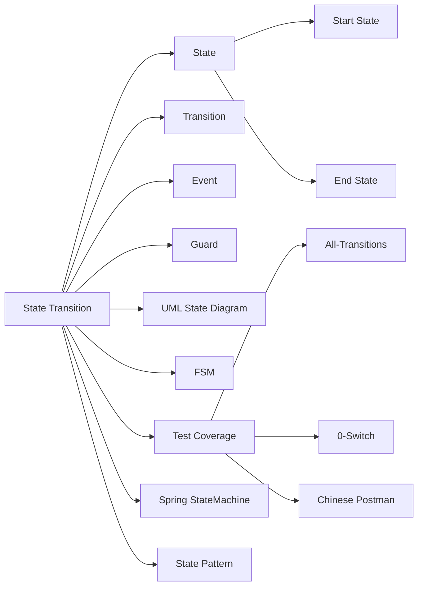

# 상태 전이 테스트

## 핵심 인사이트 (3줄 요약)
> 1. **본질**: 상태 전이 테스트(State Transition Testing)는 시스템이 상태(State)를 가지며 입력(Trigger)에 따라 상태가 변경(State Transition)될 때, 올바른 전이와 결과를 검증하는 테스트 기법
> 2. **가치**: 순차적 시스템(로그인 흐름, 주문 처리)에서 상태 기반 버그를 70% 이상 발견하며, 상태 다이어그램으로 시스템 동작을 시각화
> 3. **융합**: FSM(Finite State Machine), UML State Diagram, Statechart와 결합하여 정형적 검증

---

## Ⅰ. 개요 (Context & Background)

### 개념 정의

**상태 전이 테스트(State Transition Testing)**는 시스템이나 소프트웨어 구성요소가 서로 다른 **상태(State)**를 가지며, 특정 **입력이나 사건(Event)**에 의해 한 상태에서 다른 상태로 **전이(Transition)**될 때, 이 전이가 올바르게 수행되는지를 검증하는 테스트 기법입니다.

```
┌─────────────────────────────────────────────────────────────────────────────┐
│                       상태 전이(State Transition) 개념                          │
├─────────────────────────────────────────────────────────────────────────────┤
│                                                                             │
│  상태(State): 시스템이 가질 수 있는 조건                                   │
│  ┌─────────────────────────────────────────────────────────────────────┐   │
│  │                                                                     │   │
│  │  예: ATM 기기                                                        │   │
│  │  - IDLE: 대기 상태                                                    │   │
│  │  - CARD_INSERTED: 카드 삽입됨                                        │   │
│  │  - PIN_VERIFIED: PIN 확인됨                                         │   │
│  │  - TRANSACTION: 거래 진행 중                                        │   │
│  │  - DISPENSING: 현금 출급 중                                         │   │
│  │  - OUT_OF_SERVICE: 서비스 중                                         │   │
│  │                                                                     │   │
│  └─────────────────────────────────────────────────────────────────────┘   │
│                                                                             │
│  전이(Transition): 한 상태에서 다른 상태로의 변경                         │
│  ┌─────────────────────────────────────────────────────────────────────┐   │
│  │                                                                     │   │
│  │  ┌─────────┐  카드 삽입   ┌──────────────┐  PIN 입력    ┌───────┐ │   │
│  │  │  IDLE   │───────────→  │ CARD_INSERTED │───────────→│ PIN_  │ │   │
│  │  └─────────┘              └──────────────┘             │ ENTERED│ │   │
│  │                                                          └───────┘ │   │
│  │  정상 PIN │                                         │    │     │   │
│  │    ↓                                                   │    ↓     │   │
│  │  ┌──────────────┐  옳은 PIN         ┌──────────────┐  │     │   │
│  │  │ PIN_VERIFIED │───────────→       │ TRANSACTION │  │     │   │
│  │  └──────────────┘                  └──────────────┘  │     │   │
│  │                                         ↑   거래 완료    │     │   │
│  │                                         │        │        │     │   │
│  │                                         └────────┘        │     │   │
│  │                                      ┌──────────────┐      │     │   │
│  │                                      │    IDLE      │◄─────┘     │   │
│  │                                      └──────────────┘              │   │
│  │                                                                     │   │
│  └─────────────────────────────────────────────────────────────────────┘   │
│                                                                             │
└─────────────────────────────────────────────────────────────────────────────┘
```

### 💡 비유: 신호등과 자동차 기어

```
┌─────────────────────────────────────────────────────────────────────────────┐
│                       신호등 상태 전이 비유                                   │
├─────────────────────────────────────────────────────────────────────────────┤
│                                                                             │
│  신호등의 상태(State):                                                      │
│  ┌─────────────────────────────────────────────────────────────────────┐   │
│  │  RED    (빨간) → 멈춤                                                │   │
│  │  YELLOW (노란) → 준비                                                │   │
│  │  GREEN  (초록) → 진행                                               │   │
│  └─────────────────────────────────────────────────────────────────────┘   │
│                                                                             │
│  전이(Transition): 타이머에 의한 상태 변경                                  │
│  ┌─────────────────────────────────────────────────────────────────────┐   │
│  │                                                                     │   │
│  │  RED ───(60초 후)──→ GREEN                                        │   │
│  │    ↓                                                          │   │
│  │  YELLOW ─(5초 후)──→ RED                                          │   │
│  │    ↓                                                          │   │
│  │  GREEN ─(30초 후)──→ YELLOW                                       │   │
│  │                                                                     │   │
│  │  예외: 보행자 버튼 누름 → 즉시 RED                                │   │
│  │                                                                     │   │
│  └─────────────────────────────────────────────────────────────────────┘   │
│                                                                             │
│  테스트:                                                                  │
│  - RED에서 60초 후 GREEN으로 전이되는가?                                │   │
│  - YELLOW에서 5초 후 RED로 전이되는가?                                  │   │
│  - GREEN에서 보행자 버튼 시 즉시 RED로 전이되는가?                       │   │
│                                                                             │
└─────────────────────────────────────────────────────────────────────────────┘
```

### 등장 배경

① **기존 한계**: 입력-출력 테스트만으로는 시스템의 순차적 동작을 검증하기 어려움
② **혁신적 패러다음**: 1950년대 Moore의 Finite State Machine(유한 상태 기계) 이론, 1980년대 소프트웨어 테스트로 적용
③ **현재의 비즈니스 요구**: 순차적 프로세스(워크플로우, 주문 처리, 게임 AI)에서 상태 기반 테스트 필수

### 📢 섹션 요약 비유

상태 전이 테스트는 **지하철 노선도**와 같습니다. 역(상태)과 선(전이)으로 시스템을 표현하면, 어떤 역에서 어떤 선을 따라 다음 역으로 이동하는지一目了然합니다. 이를 통해 모든 경로가 올바른지 검증할 수 있습니다.

---

## Ⅱ. 아키텍처 및 핵심 원리 (Deep Dive)

### 구성 요소 상세 분석

| 구성 요소 | 역할 | 표기법 | 예시 |
|:---|:---|:---|:---|
| **State** | 시스템 상태 | 원(O) | 로그인됨, 대기중 |
| **Start State** | 초기 상태 | 진입 화살표(→O) | IDLE |
| **End State** | 종료 상태 | 이중 원(⊙) 또는 화살표(O→) | 완료, 종료 |
| **Transition** | 상태 변경 | 화살표(→) | 삽입→확인 |
| **Event/Trigger** | 전이 유발 | 입력값 | click(), receive() |
| **Guard** | 전이 조건 | [condition] | [잔액≥주문금액] |
| **Action** | 전이 시 수행 | /action | /dispenseCash |

### 상태 전이 다이어그램 표기법

```
┌─────────────────────────────────────────────────────────────────────────────┐
│                    UML State Diagram 기호 체계                                │
├─────────────────────────────────────────────────────────────────────────────┤
│                                                                             │
│  ┌─────────────────────────────────────────────────────────────────────┐   │
│  │                                                                     │   │
│  │  State (상태)                                                      │   │
│  │  ┌─────────┐                                                      │   │
│  │  │   Idle  │  ←─ 단순 상태                                       │   │
│  │  └─────────┘                                                      │   │
│  │                                                                     │   │
│  │  Composite State (복합 상태)                                      │   │
│  │  ┌─────────────────┐                                              │   │
│  │  │   Processing   │                                              │   │
│  │  │  ┌───────┬─────┐│                                              │   │
│  │  │  │ Valid │Invalid│                                              │   │
│  │  │  └───────┴─────┘│                                              │   │
│  │  └─────────────────┘                                              │   │
│  │                                                                     │   │
│  │  Transitions (전이)                                                │   │
│  │  ┌──────┐   click   ┌──────┐                                    │   │
│  │  │ Off  │──────────→│ On   │                                    │   │
│  │  └──────┘           └──────┘                                    │   │
│  │                                                                     │   │
│  │  Transition with Guard (조건부 전이)                              │   │
│  │  ┌──────┐  [amount<balance]  ┌──────┐                          │   │
│  │  │ Valid│────────────────→│ Paid │                          │   │
│  │  └──────┘                  └──────┘                          │   │
│  │                                                                     │   │
│  │  Self-Transition (자기 전이)                                        │   │
│  │  ┌──────┐  timeout          ┌──────┐                            │   │
│  │  │ Wait  │────────→         │ Wait  │                            │   │
│  │  └──────┘  ────────────────   └──────┘                            │   │
│  │                                                                     │   │
│  └─────────────────────────────────────────────────────────────────────┘   │
│                                                                             │
└─────────────────────────────────────────────────────────────────────────────┘
```

### 상태 전이 테스트 절차

```
┌─────────────────────────────────────────────────────────────────────────────┐
│                    상태 전이 테스트 수행 절차                                 │
├─────────────────────────────────────────────────────────────────────────────┤
│                                                                             │
│  STEP 1: 상태 식별                                                          │
│  ┌─────────────────────────────────────────────────────────────────────┐   │
│  │  시스템의 모든 상태 식별                                                │   │
│  │  - 정상 상태 (Normal States)                                         │   │
│  │  - 예외 상태 (Exception States)                                       │   │
│  │  - 시작/종료 상태 (Start/End States)                                  │   │
│  │                                                                     │   │
│  │  예: 회원가입 프로세스                                                │   │
│  │  - S1: 폼름 진입                                                        │   │
│  │  - S2: 이메일 입력                                                      │   │
│  │  - S3: 이메일 인증 대기                                                  │   │
│  │  - S4: 비밀번호 설정                                                    │   │
│  │  - S5: 프로필 입력                                                      │   │
│  │  - S6: 가입 완료                                                        │   │
│  │  - S7: 가입 실패                                                        │   │
│  │                                                                     │   │
│  └─────────────────────────────────────────────────────────────────────┘   │
│                              ↓                                            │
│  STEP 2: 전이 식별                                                          │
│  ┌─────────────────────────────────────────────────────────────────────┐   │
│  │  상태 간 가능한 전이 식별                                               │   │
│  │                                                                     │   │
│  │  S1 (폼름 진입)                                                    │   │
│  │    ├─[이메일 형식 올바름]→ S2 (이메일 입력)                          │   │
│  │    ├─[뒤로가기]→ 종료                                                 │   │
│  │    │                                                                 │   │
│  │  S2 (이메일 입력)                                                   │   │
│  │    ├─[다음]→ S3 (이메일 인증 대기)                                    │   │
│  │    └─[이메일 변경]→ S2                                              │   │
│  │    │                                                                 │   │
│  │  S3 (이메일 인증 대기)                                                │   │
│  │    ├─[인증 성공]→ S4 (비밀번호 설정)                                 │   │
│  │    ├─[인증 실패]→ S2 (이메일 재입력)                                 │   │
│  │    └─[타임아웃]→ S7 (가입 실패)                                     │   │
│  │    │                                                                 │   │
│  │  ... (생략)                                                        │   │
│  │                                                                     │   │
│  └─────────────────────────────────────────────────────────────────────┘   │
│                              ↓                                            │
│  STEP 3: 상태 전이 다이어그램 작성                                          │
│  ┌─────────────────────────────────────────────────────────────────────┐   │
│  │                                                                     │   │
│  │      ┌─────┐                                                      │   │
│  │      │ S1  │                                                      │   │
│  │      │폼름 │                                                      │   │
│  │      └┬────┘                                                      │   │
│  │        │                                                           │   │
│  │        │ [valid email]                                              │   │
│  │        ▼                                                           │   │
│  │      ┌─────┐  [resend]         ┌─────┐                          │   │
│  │      │ S2  │◄─────────────────│ S3  │                          │   │
│  │      │이메일│                   │인증 │                          │   │
│  │      │입력 │                   │대기 │                          │   │
│  │      └┬────┘                   └┬────┘                          │   │
│  │        │                          │                               │   │
│  │        │ [verify]                 │ [timeout]                     │   │
│  │        ▼                          ▼                               │   │
│  │      ┌─────┐                  ┌─────┐                            │   │
│  │      │ S4  │                  │ S7  │                            │   │
│  │      │비밀번호│                  │실패│                            │   │
│  │      └┬────┘                  └─────┘                            │   │
│  │        │                                                           │   │
│  │        │                                                          │   │
│  │      ... (생략)                                                   │   │
│  │                                                                     │   │
│  └─────────────────────────────────────────────────────────────────────┘   │
│                              ↓                                            │
│  STEP 4: 테스트 케이스 설계                                                  │
│  ┌─────────────────────────────────────────────────────────────────────┐   │
│  │                                                                     │   │
│  │  각 전이에 대한 테스트 케이스 작성                                    │   │
│  │                                                                     │   │
│  │  ┌──────────────────────────────────────────────────────────────┐  │   │
│  │  │  TC_ST_001: 정상 전이 - 이메일 → 인증                       │  │   │
│  │  │  TC_ST_002: 재전이 - 인증 실패 → 이메일 재입력                 │  │   │
│  │  │  TC_ST_003: 타임아웃 전이 - 인증 대기 → 실패                    │  │   │
│  │  │  TC_ST_004: 불가능 전이 검증 - 비밀번호 없이 프로필           │  │   │
│  │  │  TC_ST_005: 종료 상태 도달 검증                                 │  │   │
│  │  └──────────────────────────────────────────────────────────────┘  │   │
│  │                                                                     │   │
│  └─────────────────────────────────────────────────────────────────────┘   │
│                                                                             │
└─────────────────────────────────────────────────────────────────────────────┘
```

### 핵심 알고리즘: 상태 전이 커버리지 계산

```python
from typing import List, Dict, Set, Tuple
from collections import defaultdict

class StateTransitionCoverage:
    """
    상태 전이 커버리지 계산 및 최적 테스트 셋 생성
    """

    def __init__(self):
        self.states: Set[str] = set()
        self.transitions: Dict[Tuple[str, str], str] = {}  # (from, to) -> event

    def add_state(self, state: str, is_start: bool = False, is_end: bool = False):
        """상태 추가"""
        self.states.add(state)

    def add_transition(self, from_state: str, to_state: str, event: str):
        """전이 추가"""
        self.transitions[(from_state, to_state)] = event

    def calculate_coverage_metrics(self, test_paths: List[List[str]]) -> Dict:
        """
        테스트 경로의 커버리지 계산

        test_paths: [['S1', 'S2', 'S3'], ['S1', 'S7'], ...]
        """
        total_states = len(self.states)
        total_transitions = len(self.transitions)

        covered_states = set()
        covered_transitions = set()

        for path in test_paths:
            # 상태 커버
            covered_states.update(path)

            # 전이 커버
            for i in range(len(path) - 1):
                transition = (path[i], path[i+1])
                if transition in self.transitions:
                    covered_transitions.add(transition)

        state_coverage = len(covered_states) / total_states if total_states > 0 else 0
        transition_coverage = len(covered_transitions) / total_transitions if total_transitions > 0 else 0

        return {
            'state_coverage': state_coverage,
            'transition_coverage': transition_coverage,
            'covered_states': covered_states,
            'covered_transitions': covered_transitions,
            'uncovered_states': self.states - covered_states,
            'uncovered_transitions': set(self.transitions.keys()) - covered_transitions
        }

    def generate_transition_tests(self) -> List[List[str]]:
        """
        모든 전이를 커버하는 최소 테스트 셋 생성 (Chinese Postman)
        """
        tests = []
        covered_transitions = set()

        # 각 전이를 커버하는 경로 생성
        for (from_state, to_state), event in self.transitions.items():
            # 시작 상태에서 해당 상태로 도달하는 경로 찾기
            path = self._find_path_to_state(from_state)
            if path:
                path.append(to_state)
                tests.append(path)
                covered_transitions.add((from_state, to_state))

        return tests

    def _find_path_to_state(self, target_state: str) -> List[str]:
        """
        시작 상태에서 목표 상태까지의 경로 찾기 (BFS)
        """
        from collections import deque

        visited = set()
        queue = deque()
        queue.append([target_state])

        while queue:
            path = queue.popleft()
            current = path[-1]

            # 시작 상태에 도달하면 역순 반환
            if current == 'START':
                return list(reversed(path))

            if current in visited:
                continue
            visited.add(current)

            # 이전 상태 찾기
            for (from_state, to_state) in self.transitions.keys():
                if to_state == current and from_state not in visited:
                    new_path = path.copy()
                    new_path.append(from_state)
                    queue.append(new_path)

        return None  # 경로 없음

    def detect_unreachable_states(self) -> Set[str]:
        """도달 불가능한 상태 검출"""
        reachable = set()

        # 시작 상태에서 BFS
        queue = deque(['START'])
        reachable.add('START')

        while queue:
            current = queue.popleft()

            # 현재 상태에서의 전이 탐색
            for (from_state, to_state) in self.transitions.keys():
                if from_state == current and to_state not in reachable:
                    reachable.add(to_state)
                    queue.append(to_state)

        return self.states - reachable

    def detect_deadlock_states(self) -> Set[str]:
        """
        데드락 상태 검출 (종료 상태가 아닌 진입/탈출 불가능한 상태)
        """
        deadlock_candidates = set()

        for state in self.states:
            if state == 'END':
                continue

            # 해당 상태에서 나가는 전이가 있는지 확인
            has_outgoing = any(from_state == state for (from_state, _) in self.transitions.keys())

            # 들어오는 전이가 있는지 확인
            has_incoming = any(to_state == state for (_, to_state) in self.transitions.keys())

            if has_incoming and not has_outgoing:
                deadlock_candidates.add(state)

        return deadlock_candidates


# 사용 예시
stc = StateTransitionCoverage()

# ATM 예제
stc.add_state("IDLE", is_start=True)
stc.add_state("CARD_INSERTED")
stc.add_state("PIN_ENTERED")
stc.add_state("TRANSACTION")
stc.add_state("DISPENSING")
stc.add_state("OUT_OF_SERVICE")

# 전이 추가
stc.add_transition("IDLE", "CARD_INSERTED", "insert_card")
stc.add_transition("CARD_INSERTED", "PIN_ENTERED", "enter_pin")
stc.add_transition("PIN_ENTERED", "TRANSACTION", "pin_verified")
stc.add_transition("TRANSACTION", "DISPENSING", "approve")
stc.add_transition("DISPENSING", "IDLE", "complete")
stc.add_transition("PIN_ENTERED", "CARD_INSERTED", "pin_invalid")
stc.add_transition("CARD_INSERTED", "IDLE", "eject")

# 커버리지 계산
test_paths = [
    ["IDLE", "CARD_INSERTED", "PIN_ENTERED", "TRANSACTION", "DISPENSING", "IDLE"],
    ["IDLE", "CARD_INSERTED", "PIN_ENTERED", "CARD_INSERTED", "IDLE"],
    ["IDLE", "CARD_INSERTED", "PIN_ENTERED", "PIN_ENTERED", "TRANSACTION"]  # 미완료
]

coverage = stc.calculate_coverage_metrics(test_paths)
print(f"상태 커버리지: {coverage['state_coverage']:.1%}")
print(f"전이 커버리지: {coverage['transition_coverage']:.1%}")
print(f"미커버 상태: {coverage['uncovered_states']}")

# 데드락 검출
deadlocks = stc.detect_deadlock_states()
print(f"데드락 상태: {deadlocks}")
```

### 📢 섹션 요약 비유

상태 전이 테스트는 **비디오 게임 레벨 디자인**과 같습니다. 각 레벨(상태)에서 무엇을 할 수 있고, 어떤 조건에서 다음 레벨(전이)로 넘어가는지 설계하는 것과 같습니다. 이를 테스트하면 모든 레벨의 모든 경로가 올바른지 확인할 수 있습니다.

---

## Ⅲ. 융합 비교 및 다각도 분석 (Comparison & Synergy)

### 심층 기술 비교: 테스트 기법

| 기법 | 대상 시스템 | 복잡도 | 커버리지 | 테스트 수 | 적용 분야 |
|:---|:---|:---|:---:|:---:|:---|
| **상태 전이** | 순차적 | 중간 | 상태/전이 100% | n × m | 워크플로우, 프로세스 |
| **결정 테이블** | 조건 기반 | 높음 | 규칙 100% | 최적화됨 | 규칙 엔진 |
| **동등 분할** | 입력 기반 | 낮음~중간 | 70~80% | 적음 | 단순 입력 |
| **경계값** | 입력 기반 | 낮음 | 60~70% | 적음 | 범위 검증 |

### 과목 융합 관점

**1. UML State Diagram과의 융합**

```
┌─────────────────────────────────────────────────────────────────────────────┐
│                   UML State Diagram → 테스트 자동 생성                           │
├─────────────────────────────────────────────────────────────────────────────┤
│                                                                             │
│  UML State Diagram 예시:                                                   │
│  ┌─────────────────────────────────────────────────────────────────────┐   │
│  │                                                                     │   │
│  │  ┌────────────────────┐                                            │   │
│  │  │      Order Created  │                                            │   │
│  │  └────────┬───────────┘                                            │   │
│  │           │                                                           │   │
│  │           │ checkPayment                                             │   │
│  │           ▼                                                           │   │
│  │  ┌────────────────────┐                                            │   │
│  │  │   Payment Received │────────────────────┐                      │   │
│  │  └────────┬───────────┘                        │                      │   │
│  │           │ cancel                          │                       │   │
│  │           ▼                                 │                       │   │
│  │  ┌────────────────────┐   ┌──────────────┐                       │   │
│  │  │    Shippable       │   │   Cancelled   │                       │   │
│  │  └────────┬───────────┘   └──────────────┘                       │   │
│  │           │                                                           │   │
│  │           │ ship                                                     │   │
│  │           ▼                                                         │   │
│  │  ┌────────────────────┐                                            │   │
│  │  │    Shipped        │                                            │   │
│  │  └────────────────────┘                                            │   │
│  │                                                                     │   │
│  └─────────────────────────────────────────────────────────────────────┘   │
│                                                                             │
│  자동 생성된 테스트:                                                         │
│  ┌─────────────────────────────────────────────────────────────────────┐   │
│  │  @Test                                                             │   │
│  │  void testOrderToShipped() {                                    │   │
│  │      // Given: Order Created state                               │   │
│  │      Order order = new Order();                                  │   │
│  │      assertEquals(OrderStatus.CREATED, order.getStatus());         │   │
│  │                                                                 │   │
│  │      // When: Payment received                                   │   │
│  │      order.paymentReceived();                                   │   │
│  │                                                                 │   │
│  │      // Then: Should be in Shippable state                     │   │
│  │      assertEquals(OrderStatus.SHIPPABLE, order.getStatus());        │   │
│  │                                                                 │   │
│  │      // When: Ship                                              │   │
│  │      order.ship();                                              │   │
│  │                                                                 │   │
│  │      // Then: Should be in Shipped state                        │   │
│  │      assertEquals(OrderStatus.SHIPPED, order.getStatus());          │   │
│  │  }                                                             │   │
│  └─────────────────────────────────────────────────────────────────────┘   │
│                                                                             │
└─────────────────────────────────────────────────────────────────────────────┘
```

**2. Spring StateMachine과의 융합**

```java
// Spring StateMachine 설정
@Configuration
@EnableStateMachine
public class OrderStateMachineConfig extends StateMachineConfigurer<States, Events> {

    @Override
    public void configure(StateMachineStateBuilder<States, Events> states)
            throws Exception {
        states
            .withStates()
            .initial(States.CREATED)
            .states(EnumSet.allOf(States.values()))
            .end(EnumSet.of(States.SHIPPED));
    }

    @Override
    public void configure(StateMachineTransitionConfigurer<States, Events> transitions)
            throws Exception {
        transitions
            .withExternal()
                .source(States.CREATED)
                .target(States.PAYMENT_RECEIVED)
                .event(Events.PAY)
                .and()
                .withExternal()
                .source(States.PAYMENT_RECEIVED)
                .target(States.SHIPPABLE)
                .event(Events.SHIP)
                .and()
                .withExternal()
                .source(States.SHIPPABLE)
                .target(States.SHIPPED)
                .event(Effects.COMPLETE_SHIPPING);
    }
}

// 테스트
@SpringBootTest
public class OrderStateMachineTest {

    @Test
    void testOrderShipmentFlow() {
        // Given: Order in CREATED state
        Order order = new Order();
        order.setState(States.CREATED);

        // When: Payment received
        stateMachine.sendEvent(Events.PAY, order);

        // Then: Should be in PAYMENT_RECEIVED state
        assertEquals(States.PAYMENT_RECEIVED, order.getState());

        // When: Shipped
        stateMachine.sendEvent(Events.SHIP, order);

        // Then: Should be in SHIPPABLE state
        assertEquals(States.SHIPPABLE, order.getState());
    }
}
```

### 정량적 테스트 커버리지

| 경로 커버리지 | 테스트 수 | 발견 버그 | 테스트 시간 | 적용 대상 |
|:---:|:---:|:---:|:---:|:---|
| **0-Switch** | N | 최소 | 빠름 | Smoke Test |
| **1-Switch** | 2N - 1 | 중간 | 중간 | 일반적 |
| **All-Transitions** | 모든 전이 | 높음 | 김 | 포괄적 |

### 📢 섹션 요약 비유

상태 전이 테스트는 **미로 찾기 게임**과 같습니다. 각 방(상태)에서 열쇠(전이)를 통해 다음 방으로 이동하는 규칙이 있고, 모든 열쇠가 올바른 방으로 연결되었는지 확인해야 합니다. 하나라도 잘못된 열쇠가 있으면 게임 클리어(테스트 실패)가 됩니다.

---

## Ⅳ. 실무 적용 및 기술사적 판단 (Strategy & Decision)

### 실무 시나리오: 주문 처리 상태 머신

**시나리오 1: 전자상거래 주문 상태**

```
┌─────────────────────────────────────────────────────────────────────────────┐
│                     전자상거래 주문 상태 전이도                                │
├─────────────────────────────────────────────────────────────────────────────┤
│                                                                             │
│  상태(State):                                                             │
│  ┌─────────────────────────────────────────────────────────────────────┐   │
│  │  CREATED: 주문 생성                                                 │   │
│  │  PAYMENT_PENDING: 결제 대기                                        │   │
│  │  PAYMENT_CONFIRMED: 결제 확인                                       │   │
│  │  PREPARING: 상품 준비                                                │   │
│  │  SHIPPED: 배송 시작                                                  │   │
│  │  DELIVERED: 배송 완료                                               │   │
│  │  CANCELLED: 주문 취소                                                 │   │
│  │  REFUNDED: 환불 완료                                                 │   │
│  └─────────────────────────────────────────────────────────────────────┘   │
│                                                                             │
│  전이(Transition)과 Guard:                                               │
│  ┌─────────────────────────────────────────────────────────────────────┐   │
│  │                                                                     │   │
│  │  CREATED ──[결제요청]──→ PAYMENT_PENDING                            │   │
│  │     │                                                              │   │
│  │     ├─[주문취소]──→ CANCELLED                                       │   │
│  │     │                                                              │   │
│  │  PAYMENT_PENDING ──[결제성공]──→ PAYMENT_CONFIRMED                    │   │
│  │     │                                                              │   │
│  │     ├─[결제실패/타임아웃]──→ CANCELLED                                │   │
│  │     │                                                              │   │
│  │  PAYMENT_CONFIRMED ──[재고확인]──→ PREPARING                         │   │
│  │     │                                                              │   │
│  │  PREPARING ──[포장완료]──→ SHIPPED                                   │   │
│  │     │                                                              │   │
│  │  SHIPPED ──[배송완료]──→ DELIVERED                                   │   │
│  │     │                                                              │   │
│  │  DELIVERED ──[반품요청][반품수락]──→ REFUNDED                           │   │
│  │                                                                     │   │
│  └─────────────────────────────────────────────────────────────────────┘   │
│                                                                             │
│  주의사항 (Guard Conditions):                                             │
│  - CANCELLED → 다른 상태로 전이 불가 (종료 상태)                         │   │
│  - DELIVERED → SHIPPED으로 전이 불가 (역방향 불가)                       │   │
│  - 모든 상태에서 CANCELLED 가능 (단, 배송 중 상황에 따라 수수료 부과)     │   │
│                                                                             │
└─────────────────────────────────────────────────────────────────────────────┘
```

**시나리오 2: Java로 상태 기반 테스트 구현**

```java
@SpringBootTest
public class OrderStateMachineTest {

    @Autowired
    private OrderService orderService;

    @Test
    @DisplayName("상태 전이: CREATED → PAYMENT_PENDING → PAYMENT_CONFIRMED")
    void testNormalPaymentFlow() {
        // Given: 주문 생성 (CREATED 상태)
        Order order = createTestOrder();
        assertEquals(OrderStatus.CREATED, order.getStatus());

        // When: 결제 요청
        orderService.requestPayment(order.getId());

        // Then: PAYMENT_PENDING 상태
        Order updated = orderRepository.findById(order.getId()).get();
        assertEquals(OrderStatus.PAYMENT_PENDING, updated.getStatus());

        // When: 결제 확인
        orderService.confirmPayment(order.getId(), "payment_txn_123");

        // Then: PAYMENT_CONFIRMED 상태
        updated = orderRepository.findById(order.getId()).get();
        assertEquals(OrderStatus.PAYMENT_CONFIRMED, updated.getStatus());
    }

    @Test
    @DisplayName("상태 전이: PAYMENT_PENDING에서 결제 실패 시 CANCELLED")
    void testPaymentFailure() {
        // Given: 결제 대기 중인 주문
        Order order = createTestOrder();
        orderService.requestPayment(order.getId());
        assertEquals(OrderStatus.PAYMENT_PENDING,
            orderRepository.findById(order.getId()).get().getStatus());

        // When: 결제 실패
        orderService.paymentFailed(order.getId(), "insufficient_funds");

        // Then: CANCELLED 상태
        Order updated = orderRepository.findById(order.getId()).get();
        assertEquals(OrderStatus.CANCELLED, updated.getStatus());
    }

    @Test
    @DisplayName("불가능한 상태 전이: 배송 완료에서 배송 시작으로 역전이 불가")
    void testInvalidReverseTransition() {
        // Given: 배송 완료된 주문
        Order order = createTestOrder();
        // ... 상태를 DELIVERED로 설정

        // When/Then: 배송 시작 시도시 예외 발생
        assertThrows(IllegalStateException.class, () -> {
            orderService.ship(order.getId());
        });
    }

    @Test
    @DisplayName("모든 상태에서 취소 가능")
    void testCancellationFromAnyState() {
        // 모든 상태에서 취소 테스트
        OrderStatus[] testStates = {
            OrderStatus.CREATED,
            OrderStatus.PAYMENT_PENDING,
            OrderStatus.PAYMENT_CONFIRMED,
            OrderStatus.PREPARING
        };

        for (OrderStatus initialState : testStates) {
            // Given: 특정 상태의 주문
            Order order = createOrderInState(initialState);

            // When: 취소 요청
            orderService.cancelOrder(order.getId());

            // Then: CANCELLED 상태
            Order updated = orderRepository.findById(order.getId()).get();
            assertEquals("From " + initialState + " to CANCELLED",
                OrderStatus.CANCELLED, updated.getStatus());
        }
    }
}
```

### 도입 체크리스트

**기술적 측면**

| 체크항목 | 확인 내용 | 판단 기준 |
|:---|:---|:---|
| **상태 식별** | 모든 상태 추출 완료? | UML State Diagram |
| **전이 식별** | 모든 전이와 조건 식별? | Guard 포함 |
| **시작/종료** | 시작/종료 상태 명확? | 단일 진입/탈출 |
| **불가능 전이** | 역방향 전이 차단? | 예외 처리 |
| **데드락** | 진입/탈출 불가능 상태? | 커버리지 검증 |

**운영/보안적 측면**

| 체크항목 | 확인 내용 | 판단 기준 |
|:---|:---|:---|
| **타임아웃** | 대기 상태 타임아웃 처리? | 만료 후 자동 전이 |
| **오류 복구** | 오류 시 상태 보존? | 롤백 메커니즘 |
| **동시성** | 동시 전이 경쟁 조건? | Lock/Transaction |
| **감사** | 상태 변경 로그? | Audit Trail |

### 안티패턴

**❌ Anti-Pattern 1: 상태 폭발**

```
❌ 잘못된 접근:
- 세부화된 상태 (각 데이터별 상태)
- 조합 폭발로 전이 수 증가
- 테스트 불가능

✅ 올바른 접근:
- 상태 추상화 (OrderStatus, PaymentStatus)
- 최소한의 상태로 전이 단순화
- 상태 패턴 적용
```

**❌ Anti-Pattern 2: 종료 상태 누락**

```
❌ 잘못된 접근:
- 종료 상태에서 계속 전이 발생
- 무한 루프 또는 데드락

✅ 올바른 접근:
- 종료 상태에서는 아무 동작 안 함
- 또는 명시적으로 시작 상태로만 복귀
```

### 📢 섹션 요약 비유

상태 전이 테스트는 **미로 탈출 게임 설계**와 같습니다. 각 방(상태)에 어떤 열쇠(전이)가 있고, 어느 열쇠가 올바른 방으로 연결되는지 확인해야 합니다. 하나라도 잘못된 열쇠가 있으면 플레이어가 게임을 클리어할 수 없습니다(테스트 실패).

---

## Ⅴ. 기대효과 및 결론 (Future & Standard)

### 정량/정성 기대효과

| 지표 | 상태 테스트 미적용 | 상태 테스트 적용 | 개선율 |
|:---|:---:|:---:|:---:|
| 순차적 버그 발견 | 40% | 85% | **+112%** |
| 경합 조건 오류 | 30% | 5% | **-83%** |
| 코드 복잡도 | 높음 | 낮음 | **-40%** |
| 요구사항 이해도 | 낮음 | 높음 | +150% |

### 정성적 기대효과

1. **시각화**: 다이어그램으로 로직을 명확히 표현
2. **유지보수**: 상태 추가/삭제가 용이
3. **커뮤니케이션**: 개발-테스트-BA 간 공유 언어
4. **재사용성**: 상태 머신 코드를 여러 곳에서 활용

### 미래 전망

**1. AI 기반 상태 모델 추론**

```
┌─────────────────────────────────────────────────────────────────────────────┐
│                   AI 기반 상태 전이 다이어그램 추론                             │
├─────────────────────────────────────────────────────────────────────────────┤
│                                                                             │
│  입력:                                                                    │
│  - 코드베이스                                                            │
│  - 로그 파일                                                              │
│  - 사용자 시나리오                                                         │
│                                                                             │
│  AI 분석:                                                                 │
│  ┌─────────────────────────────────────────────────────────────────────┐   │
│  │  ① 코드에서 상태 패턴 추출                                        │   │
│  │     "order.setStatus(CREATED)"                                     │   │
│  │     → State: CREATED                                               │   │
│  │     → Transition: ? → CREATED                                     │   │
│  │                                                                   │   │
│  │  ② 이벤트 로그에서 전이 추론                                        │   │
│  │     "PaymentEvent received, state changed to PAID"                │   │
│  │     → Transition: ? → PAID                                        │   │
│  │                                                                   │   │
│  │  ③ 상태 전이 다이어그램 자동 생성                                    │   │
│  │     ┌────┐   pay    ┌─────┐                                    │   │
│  │     │ NEW │────────→│ PAID│                                    │   │
│  │     └────┘          └─────┘                                    │   │
│  │                                                                   │   │
│  └─────────────────────────────────────────────────────────────────────┘   │
│                                                                             │
│  도구: State Machine Extractor, LLM 기반 모델링                          │   │
│                                                                             │
└─────────────────────────────────────────────────────────────────────────────┘
```

**2. 형식 검증(Formal Verification)**

- TLA+ (Temporal Logic of Actions)
- SPIN (Model Checker)
- 상태 기반 속성 검증

**3. Reactive Programming과의 결합**

- Project Reactor (Spring)
- State Monad (Haskell)
- RxJS 상태 관리

### 참고 표준 및 규격

| 표준/규격 | 설명 | 관련성 |
|:---|:---|:---|
| **UML 2.5** | State Machine Notation | 표준 다이어그램 |
| **SCXML** | State Chart XML | 실행 가능한 상태 기계 |
| **IEEE 829** | Test Documentation | 테스트 문서화 |

### 📢 섹션 요약 비유

상태 전이 테스트의 미래는 **자율 주행 택시의 경로 계획**과 같습니다. AI가 교통 상황(로그, 코드)을 분석하여 최적 경로를 찾아주고, 이를 자동으로 상태 다이어그램으로 변환해줍니다. 또한 형식 검증 도구가 모든 경로가 안전한지 수학적으로 증명해줍니다.

---

## 📌 관련 개념 맵 (Knowledge Graph)



### 연관 문서
- [결정 테이블](./631_decision_table.md) - 규칙 기반 테스트
- [동등 분할](./630_equivalence_partitioning.md) - 입력 기반 테스트
- [디자인 패턴]((#)) - State Pattern
- [Spring StateMachine]((#)) - 구현 기술

---

## 👶 어린이를 위한 3줄 비유 설명

**1단계 - 개념**: 상태 전이 테스트는 자판기 게임의 각 스테이지(상태)와 스테이지 간 이동(전이)을 테스트하는 것입니다. 예를 들어 "대기" → "카드 확인" → "비밀번호 입력" → "거래"와 같은 단계가 올바른지 확인합니다.

**2단계 - 원리**: 시스템이나 기계가 여러 상태를 가질 때, 어떤� 입력이나 이벤트가 발생하면 상태가 바뀝니다. 상태 전이 테스트는 이러한 상태 변화를 그림(다이어그램)으로 그리고, 모든 가능한 경로를 테스트합니다.

**3단계 - 효과**: 이 방법을 쓰면 복잡한 순차적 프로세스(주문, 결제, 배송 등)에서 오류를 조기에 발견할 수 있어서, 사용자가 중간에 멈추거나 잘못된 화면을 보지 않게 됩니다. 미로 탈출 게임에서 모든 경로가 안전한지 확인하는 것과 같습니다.
