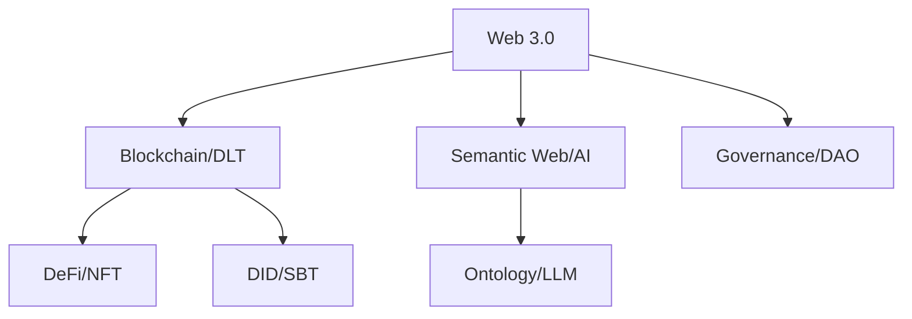

# Web 1.0, Web 2.0, and Web 3.0 (The Evolution of the Web)

## 핵심 인사이트
1. **패러다임의 변화**: 정보의 단방향 제공(1.0)에서 양방향 참여(2.0)를 거쳐, 데이터 주권과 탈중앙화(3.0)로 진화하는 웹의 발전 단계이다.
2. **Web 3.0의 본질**: 블록체인, 스마트 컨트랙트, 탈중앙화 신원증명(DID)을 통해 플랫폼 독점에서 개인 소유권(Read-Write-Own) 중심의 가치 인터넷을 지향한다.
3. **기술적 동력**: 정적 HTML(1.0), AJAX/API(2.0)에서 분산 원장 기술(DLT)과 시맨틱 웹(3.0)으로 인프라 기술이 고도화되었다.

---

## Ⅰ. Web 1.0, 2.0, 3.0의 개념 및 발전 과정

### 1. Web 1.0 (The Static Web, 1990~2004)
- **정의**: 콘텐츠 제작자가 정보를 일방적으로 제공하고 사용자는 읽기만 하는 단방향 웹이다.
- **특징**: 정적 페이지(Static HTML), 디렉토리 중심 검색, 개인 홈페이지 및 포털 중심.

### 2. Web 2.0 (The Social Web, 2004~현재)
- **정의**: 사용자가 콘텐츠를 직접 생산하고 공유하며 상호작용하는 참여·공유·개방 기반의 양방향 웹이다.
- **특징**: 동적 페이지(AJAX), SNS, 플랫폼 비즈니스(Big Tech), 데이터 중앙 집중화.

### 3. Web 3.0 (The Intelligent/Decentralized Web, 미래 지향)
- **정의**: 데이터가 탈중앙화된 환경에서 개인에게 귀속되고, AI가 문맥을 이해하여 연결되는 가치 인터넷이다.
- **특징**: 블록체인, 데이터 주권(Own), 탈중앙화 자율 조직(DAO), 개인 맞춤형 지능화.

📢 **섹션 요약 비유**: 
- **Web 1.0**: 방송국에서 틀어주는 TV 프로그램을 시청만 하는 시대.
- **Web 2.0**: 누구나 유튜브에 영상을 올리고 댓글을 달지만, 수익과 규칙은 구글이 정하는 시대.
- **Web 3.0**: 내가 만든 영상의 소유권과 수익을 내가 직접 가지고, 운영 규칙도 참여자들이 함께 정하는 시대.

---

## Ⅱ. Web 1.0 vs 2.0 vs 3.0 비교 상세

### 1. 세대별 특징 비교 다이어그램 (ASCII)
```ascii
[ Web 1.0 ]           [ Web 2.0 ]           [ Web 3.0 ]
  Read-only             Read-Write            Read-Write-Own
      |                     |                     |
[Server] ----> [User] [Platform] <---> [User] [D-Infra] <===> [User]
 (단방향 제공)         (양방향 상호작용)      (탈중앙 가치교환)
      |                     |                     |
  정적 HTML             중앙 집중 서버          분산 원장/AI
```

### 2. 주요 지표별 비교 테이블
| 구분 | Web 1.0 | Web 2.0 | Web 3.0 |
|:---:|:---|:---|:---|
| **핵심 키워드** | 정보(Information) | 플랫폼(Platform) | 가치/소유(Value/Own) |
| **데이터 형태** | 정적 콘텐츠 (Static) | 동적/사용자 생성 (UGC) | 시맨틱/메타데이터 |
| **인프라 구조** | 클라이언트-서버 | 중앙 클라우드/API | P2P/블록체인/Edge |
| **주요 기술** | HTML, HTTP, URL | AJAX, RSS, JSON | DLT, Smart Contract, DID |
| **수익 주체** | 정보 제공자 (기업) | 플랫폼 기업 (Big Tech) | 개인 및 생태계 기여자 |
| **데이터 주권** | 기업 소유 | 기업이 관리/활용 | 개인 소유 (Self-Sovereign) |

---

## Ⅲ. Web 3.0의 핵심 구성 기술 및 생태계

### 1. 기술적 구성 요소
- **블록체인(Blockchain)**: 투명하고 변조 불가능한 데이터 저장소 역할.
- **스마트 컨트랙트(Smart Contract)**: 중개자 없는 신뢰 거래 자동화.
- **분산 스토리지(IPFS)**: 중앙 서버 없는 콘텐츠 데이터 저장 분산화.
- **탈중앙화 신원증명(DID)**: 제3자 인증 없는 개인 주도 신원 증명.

### 2. 서비스 생태계
- **DeFi (탈중앙 금융)**: 은행 없는 금융 서비스 (Uniswap, Aave).
- **NFT (대체 불가능 토큰)**: 디지털 자산의 유일성과 소유권 증명.
- **DAO (탈중앙 자율 조직)**: 코드와 투표로 운영되는 조직.

---

## Ⅳ. Web 3.0 도입 시 고려사항 및 한계점

### 1. 기술적/사회적 고려사항
- **확장성 문제**: 블록체인 합의 과정으로 인한 느린 처리 속도(TPS) 및 가스비(Gas Fee).
- **사용자 경험(UX)**: 복잡한 지갑 관리, 키 분실 시 복구 불가 등 진입 장벽.
- **법적/규제적 모호성**: 탈중앙화 조직에 대한 책임 소재, 자금 세탁 방지(AML) 등 제도 미비.

### 2. 에너지 효율성
- **PoW vs PoS**: 에너지 소모가 큰 작업 증명 방식에서 친환경적인 지분 증명 방식으로의 전환 필요.

---

## Ⅴ. 기술사 시험 대비 전략 (핵심 키워드 및 결론)

### 1. 암기 키워드 (PE-Key)
- **발전 단계**: Read → Read-Write → Read-Write-Own.
- **Web 3.0 3대 요소**: 탈중앙화(Decentralization), 데이터 소유권(Data Ownership), 지능화(Intelligence).
- **인프라**: 블록체인, DID, IPFS, 스마트 컨트랙트.

### 2. 답안 기술 팁
- Web 2.0의 **중앙 집중화로 인한 데이터 독점 및 프라이버시 문제**를 Web 3.0의 등장 배경으로 서술할 것.
- 시맨틱 웹(AI에 의한 의미 이해)과 블록체인(소유권 보장)을 Web 3.0의 양대 축으로 설명하면 높은 점수 기대 가능.
- 단순히 기술 나열에 그치지 않고, **'가치 인터넷(Internet of Value)'**으로의 패러다임 시프트를 강조할 것.

---

### 📌 관련 개념 맵


### 👶 어린이를 위한 3줄 비유 설명
1. **Web 1.0**: "도서관 책읽기" - 누군가 써놓은 책을 읽기만 할 수 있어요.
2. **Web 2.0**: "페이스북 글쓰기" - 내가 글을 올릴 순 있지만, 페이스북 아저씨가 내 글을 지울 수도 있고 내 글로 돈을 벌어요.
3. **Web 3.0**: "나만의 장난감 일기장" - 내가 쓴 일기는 온전히 내 것이고, 아무도 마음대로 지울 수 없으며 내 허락 없이는 볼 수도 없어요.
