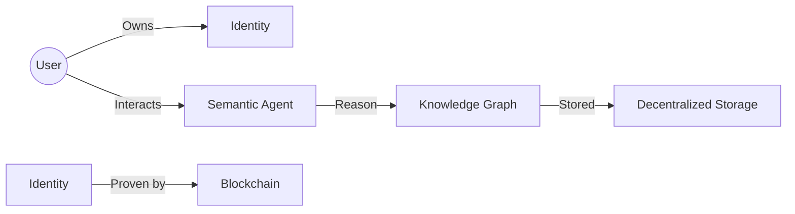

# Web 3.0: Decentralized Sovereignty and Intelligence

## 핵심 인사이트
1. **데이터 주권의 회복**: 중앙화된 플랫폼 권력을 개인에게 분산하고, 사용자 스스로 자신의 데이터를 소유하고 통제(Read-Write-Own)하는 철학적 전환이다.
2. **지능형 연결망**: 시맨틱 웹 기술을 통해 기계가 웹 콘텐츠의 의미(Semantics)를 이해하고, 파편화된 정보를 유기적으로 연결하여 지능적인 서비스를 제공한다.
3. **가치 중심 생태계**: 단순 정보 공유를 넘어 토큰 이코노미와 블록체인을 결합하여 디지털 자산의 가치를 즉시 교환할 수 있는 인프라를 구축한다.

---

## Ⅰ. Web 3.0과 시맨틱 웹(Semantic Web)의 개념

### 1. Web 3.0의 정의
- 블록체인 기반의 **탈중앙화(Decentralization)**와 AI 기반의 **지능화(Intelligence)**가 결합된 차세대 웹 환경이다.
- 핵심 가치: 탈중앙성, 무신뢰(Trustless), 무허가(Permissionless), 개인 소유권.

### 2. 시맨틱 웹의 정의 (Web 3.0의 지능적 측면)
- 컴퓨터가 정보의 의미를 파악하고 논리적 추론이 가능하도록 온톨로지(Ontology)와 메타데이터를 활용하는 기술이다.
- 핵심 목표: 데이터의 기계 가독성(Machine-Readable) 확보 및 정보 간 관계 정의.

📢 **섹션 요약 비유**: 
- **Web 3.0**: 거대 기업이 관리하는 중앙 서버 대신, 전 세계 컴퓨터가 조각조각 정보를 나누어 저장하고 주인이 누구인지 명확히 기록하는 '디지털 민주주의' 마을입니다.
- **시맨틱 웹**: 컴퓨터가 "사과"라는 단어를 보고 빨간 과일인지, 먹는 행위인지, 컴퓨터 회사인지 문맥에 따라 스스로 이해하고 정답을 찾아주는 '똑똑한 비서'입니다.

---

## Ⅱ. Web 3.0의 3대 핵심 속성 및 기술 구조

### 1. Web 3.0의 3대 속성 (ASCII)
```ascii
    [ Intelligence ] <--- Semantic Web, AI, LLM
           |
    [ Web 3.0 Core ]
           |
    [ Decentralization ] <--- Blockchain, P2P, IPFS
           |
    [ Ownership ] <--- NFT, DID, Token Economy
```

### 2. 시맨틱 웹 기술 스택 (Semantic Web Stack)
| 계층 | 기술 요소 | 설명 |
|:---:|:---|:---|
| **상위** | **Trust/Proof** | 데이터의 신뢰성과 논리적 증명 |
| **중간** | **Ontology (OWL)** | 개념 간의 관계 및 제약 조건 정의 (지식 모델링) |
| **기본** | **RDF / RDFS** | 자원 간 관계 기술 (Subject-Predicate-Object 트리 구조) |
| **하위** | **XML / URI** | 데이터의 구조화 및 전역 고유 식별자 부여 |

---

## Ⅲ. Web 3.0 vs 시맨틱 웹의 상호 보완 관계

### 1. 기술적 결합
- **블록체인**: 데이터의 '진위 여부'와 '소유권'을 보장하는 신뢰 계층(Trust Layer).
- **시맨틱 웹**: 데이터의 '의미'와 '연결성'을 보장하는 지식 계층(Knowledge Layer).

### 2. 주요 시너지 효과
- **지능형 검색**: 사용자 의도를 파악하여 관련 정보를 블록체인 상에서 직접 찾아 결제까지 수행.
- **상호운용성(Interoperability)**: 서로 다른 플랫폼 간에도 데이터의 의미가 표준화되어 자유롭게 데이터 이동 가능.

---

## Ⅳ. Web 3.0 실현을 위한 도전 과제 및 해결 방안

### 1. 기술적 한계
- **데이터 가용성(DA)**: 방대한 시맨틱 데이터를 블록체인에 모두 저장하기 어렵고 연산 비용이 높음.
- **해결책**: 오프체인 저장(IPFS)과 온체인 증명(Hash/ZKP)의 결합, 레이어 2(L2) 확장성 솔루션 활용.

### 2. 거버넌스 및 윤리
- **알고리즘 편향**: AI가 학습하는 온톨로지의 중립성 확보 필요.
- **해결책**: 탈중앙화 자율 조직(DAO)을 통한 데이터 관리 규칙의 민주적 결정.

---

## Ⅴ. 기술사 시험 대비 전략 (핵심 키워드 및 결론)

### 1. 암기 키워드 (PE-Key)
- **Web 3.0**: 탈중앙화 신원증명(DID), 분산 스토리지(IPFS), 스마트 컨트랙트, 토큰 이코노미.
- **시맨틱 웹**: 온톨로지(Ontology), RDF(Resource Description Framework), 기계 가독성, 메타데이터.

### 2. 답안 기술 팁
- Web 3.0을 단순한 블록체인 기술로 국한하지 말고, **팀 버너스 리가 주창한 시맨틱 웹의 이상향**이 블록체인이라는 신뢰 기술을 만나 실현되는 과정임을 강조할 것.
- **'플랫폼 독점에서 개인 주권으로'**라는 거대 담론을 서두에 배치하여 통찰력을 보여줄 것.
- 최근 이슈인 **LLM(거대언어모델)과 지식 그래프(Knowledge Graph)**의 결합을 Web 3.0의 지능화 사례로 언급하면 차별화 가능.

---

### 📌 관련 개념 맵


### 👶 어린이를 위한 3줄 비유 설명
1. **내꺼야!**: 내가 인터넷에 올린 사진이나 글의 진짜 주인이 나라는 증거를 블록체인이라는 금고에 넣어둬요.
2. **말이 통해요**: 로봇이 내가 하는 말의 뜻을 정확히 알아듣고, 내가 원하는 장난감을 전 세계 인터넷에서 척척 찾아줘요.
3. **가운데가 없어요**: 큰 회사 도움 없이도 우리끼리 직접 정보를 주고받고 소유할 수 있는 똑똑한 미래 인터넷 세상이에요.
