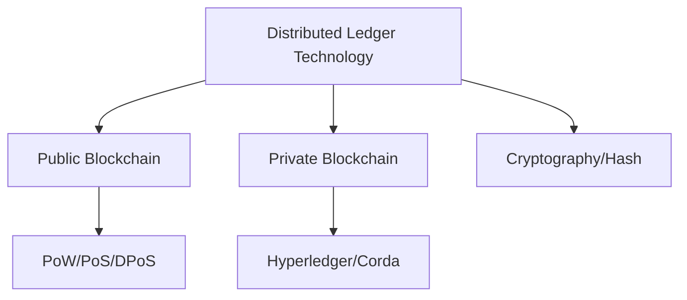

# Blockchain: The Foundation of Digital Trust

## 핵심 인사이트
1. **무신뢰성(Trustless)**: 제3의 신뢰 기관 없이도 네트워크 참여자 간의 합의만으로 데이터의 진위와 무결성을 보장하는 분산 원장 기술이다.
2. **비가역성(Immutability)**: 한 번 기록된 데이터는 해시 체인(Hash Chain)과 다수결 합의를 통해 수정이나 삭제가 사실상 불가능한 구조를 가진다.
3. **가치 인터넷의 기반**: 정보의 복제가 아닌 '가치의 전이(Transfer of Value)'를 가능하게 하여 금융, 물류, 행정 등 사회 전반의 인프라를 혁신한다.

---

## Ⅰ. 블록체인(Distributed Ledger Technology)의 개념

### 1. 정의
- 거래 정보를 담은 블록(Block)을 체인(Chain) 형태로 연결하여 네트워크 내의 모든 참여자가 동일한 장부를 공유하고 검증하는 **분산 원장 기술**이다.
- 핵심 원리: 분산 저장, 해시 연결, 합의 알고리즘.

### 2. 블록체인의 4대 특징
- **탈중앙성(Decentralization)**: 중앙 서버 없이 P2P 방식으로 운영.
- **무결성(Integrity)**: 암호화 기술로 데이터 위변조 방지.
- **투명성(Transparency)**: 모든 거래 내역이 공개(퍼블릭 기준)되어 누구나 검증 가능.
- **가용성(Availability)**: 일부 노드에 장애가 발생해도 전체 시스템은 중단 없이 운영.

📢 **섹션 요약 비유**: 
- 예전에는 은행(중앙 서버)이 혼자서 장부를 관리했다면, 블록체인은 마을 사람들(네트워크 노드) 모두가 똑같은 장부를 한 권씩 나누어 가지고, 새로운 거래가 생길 때마다 다 같이 확인하고 동시에 적어넣는 방식입니다.

---

## Ⅱ. 블록체인의 동작 원리 및 기술 요소

### 1. 블록체인 거래 프로세스 (ASCII)
```ascii
[Transaction] ---> [Broadcast] ---> [Consensus] ---> [Block Link]
(거래 발생)        (전체 노드 전파)    (검증 및 합의)      (체인에 연결)
```

### 2. 핵심 기술 스택
| 구분 | 기술 요소 | 설명 |
|:---:|:---|:---|
| **자료구조** | **Merkle Tree / Hash** | 대량의 트랜잭션을 해시 트리로 묶어 무결성 고속 검증 |
| **P2P 통신** | **Gossip Protocol** | 중앙 서버 없이 노드 간 정보를 빠르게 전파 |
| **보안** | **Public Key Crypto** | 전자 서명을 통한 거래 주체 인증 및 부인 방지 |
| **신뢰** | **Consensus Algorithm** | PoW, PoS 등 분산 노드 간의 상태 일치 매커니즘 |

---

## Ⅲ. 블록체인의 유형 분류 (Public vs Private)

### 1. 유형별 비교 테이블
| 구분 | 퍼블릭(Public) | 프라이빗(Private) | 컨소시엄(Consortium) |
|:---:|:---|:---|:---|
| **참여 자격** | 누구나 (Permissionless) | 허가된 단일 기관 | 허가된 여러 기관 |
| **운영 주체** | 탈중앙화 (익명) | 특정 기관 (중앙) | 허가된 노드 연합 |
| **합의 속도** | 느림 (PoW/PoS) | 매우 빠름 | 빠름 (PBFT 등) |
| **익명성** | 높음 | 낮음 | 중간 |
| **대표 사례** | 비트코인, 이더리움 | 하이퍼레저, R3 Corda | 금융권 공동망 |

---

## Ⅳ. 블록체인 트릴레마 (The Blockchain Trilemma)

### 1. 세 가지 핵심 가치의 충돌
- **확장성(Scalability)**: 많은 거래를 빠르게 처리할 수 있는가?
- **탈중앙화(Decentralization)**: 소수에게 권력이 집중되지 않는가?
- **보안성(Security)**: 외부 공격으로부터 안전한가?

### 2. 해결 방안 (Scaling Solutions)
- **On-chain**: 샤딩(Sharding) - 메인 체인을 분할 처리.
- **Off-chain**: 롤업(Rollup), 사이드체인 - 외부에서 연산 후 결과만 기록.

---

## Ⅴ. 기술사 시험 대비 전략 (핵심 키워드 및 결론)

### 1. 암기 키워드 (PE-Key)
- **기술**: 해시 함수(SHA-256), 머클 트리(Merkle Tree), 전자 서명(ECDSA), P2P.
- **철학**: DLT (Distributed Ledger Technology), SPOF 제거, 투명성, 불변성.
- **유형**: Permissionless vs Permissioned.

### 2. 답안 기술 팁
- 블록체인은 단순한 DB의 대체가 아니라 **'신뢰의 레이어(Trust Layer)'**임을 강조할 것.
- **가용성** 측면에서 기존 중앙 집중 시스템의 **SPOF(Single Point of Failure)** 문제를 어떻게 해결하는지 논리적으로 기술할 것.
- 최근 추세인 **'엔터프라이즈 블록체인'**과 **'Web 3.0'**의 연결고리를 언급하여 실무적 감각을 어필할 것.

---

### 📌 관련 개념 맵


### 👶 어린이를 위한 3줄 비유 설명
1. **나눠 갖는 비밀 일기장**: 마을 사람들 모두가 똑같은 거래 장부를 가지고 있어서, 한 사람이 몰래 고치려고 해도 다른 사람들이 가진 장부와 달라서 금방 들통나요.
2. **해시 열차**: 블록이라는 기차 칸들이 해시라는 튼튼한 고리로 꽉 묶여 있어서, 중간에 하나만 바꿔도 기차 전체가 망가져 버려요. 고치는 게 불가능하죠!
3. **가짜는 안 돼**: 은행원 아저씨가 없어도 우리끼리 "이 돈은 진짜야"라고 다 같이 확인하고 약속하는 똑똑한 약속 시스템이에요.
