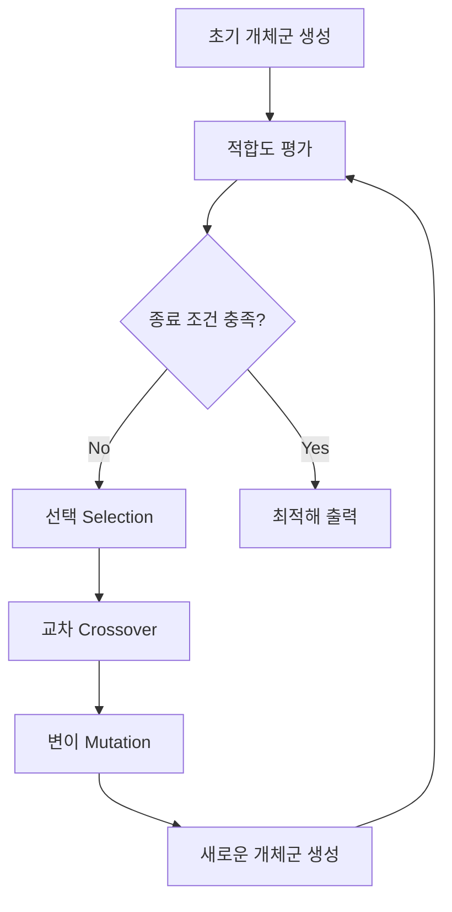

# 유전자 알고리즘 (Genetic Algorithm, GA)

## 1. 개요 (Overview)

### 1.1 정의
**유전자 알고리즘 (Genetic Algorithm, GA)**이란 찰스 다윈의 적자생존 지배 원리에 기반한 자연 선택(Natural Selection)과 유전학(Genetics)의 메커니즘을 모방한 확률적 탐색 및 최적화 알고리즘입니다. 이는 1970년대 존 홀랜드(John Holland)에 의해 처음 제안되었습니다.

### 1.2 등장 배경
1.  **복잡한 최적화 문제**: 전통적인 미분 기반 최적화 방식이 해결하기 어려운 비선형, 불연속적, 다차원의 거대한 탐색 공간 문제 대두.
2.  **전역 최적해 (Global Optimum) 탐색**: 지역 최적해(Local Optimum)에 빠지는 '지역 해 고착 현상'을 극복하기 위한 새로운 패러다임 필요.
3.  **자연의 진화 원리 모방**: 수백만 년간 검증된 생물학적 진화 과정이 최적의 환경 적응 해법을 찾는 탁월한 모델임을 인식.

---

## 2. 유전자 알고리즘의 구성 요소 및 연산

### 2.1 주요 구성 요소 (Core Components)

| 구성 요소 | 설명 | 비고 |
| :--- | :--- | :--- |
| **개체군 (Population)** | 현재 세대에 존재하는 후보 해(Solution)들의 집합 | 다수의 해를 동시에 탐색 |
| **염색체 (Chromosome)** | 하나의 후보 해를 나타내는 데이터 구조 | 주로 이진 문자열(Binary String)로 표현 |
| **유전자 (Gene)** | 염색체를 구성하는 최소 단위 정보 | 문자열의 비트 하나나 수치 하나에 해당 |
| **적합도 함수 (Fitness Function)** | 각 후보 해가 문제의 목적에 얼마나 부합하는지 수치화 | 진화의 방향을 결정하는 척도 |

### 2.2 주요 유전 연산자 (Genetic Operators)

1.  **선택 (Selection)**: 적합도가 높은 개체들을 선택하여 다음 세대 생성을 위한 부모로 지정 (예: 룰렛 휠 선택, 토너먼트 선택).
2.  **교차 (Crossover)**: 두 부모의 염색체 일부를 결합하여 새로운 자식 개체를 생성 (정보의 재조합).
3.  **변이 (Mutation)**: 낮은 확률로 유전자의 정보를 무작위로 변경하여 모집단의 다양성 유지 및 전역 탐색 강화.

---

## 3. 유전자 알고리즘의 동작 과정 (Process)

---

## 4. 특징 및 장단점

### 4.1 장점 (PROS)
-   **강력한 전역 탐색 능력**: 다수의 해를 동시에 관리하므로 지역 최적해 고착 위험이 적음.
-   **범용성**: 미분 가능성이나 연속성 조건 없이도 함수의 형태에 상관없이 적용 가능.
-   **병렬화 용이**: 개체별 적합도 평가를 독립적으로 수행할 수 있어 대규모 연산에 유리.

### 4.2 단점 (CONS)
-   **느린 수렴 속도**: 최적해 근처에서 정밀한 탐색 속도가 다소 느릴 수 있음.
-   **파라미터 설정의 어려움**: 개체군 크기, 변이율, 교차 방식 등에 따라 성능 편차가 큼.
-   **최적해 보장 불가**: 수치적 근사치를 찾는 것이 목표이므로 절대적 최적해를 찾지 못할 수도 있음.

---

## 5. 기술사적 판단 및 미래 전망

### 5.1 기술사적 판단
유전자 알고리즘은 **'탐험(Exploration)'과 '이용(Exploitation)'**의 균형을 맞추는 최적화 도구입니다. 최근에는 단독 사용보다는 딥러닝의 하이퍼파라미터 최적화나 신경망 구조 탐색(NAS) 등과 결합한 **신경 진화 (Neuroevolution)** 형태로 발전하고 있어, AI 시스템의 자동화 설계에 중추적인 역할을 할 것으로 판단됩니다.

### 5.2 미래 전망
1.  **양자 가속 유전자 알고리즘**: 양자 컴퓨팅의 병렬성을 활용해 탐색 속도를 기하급수적으로 높인 모델 등장.
2.  **하이브리드 메타 휴리스틱**: 시뮬레이티드 어닐링(Simulated Annealing)이나 타부 서치(Tabu Search) 등과 결합하여 수렴 성능 보완.
3.  **지속 가능한 설계**: 저탄소 소재 개발이나 신재생 에너지 전력망 최적화 등 복잡한 환경 문제 해결의 도구로 부각.

---

## [부록] 어린이 버전 - "최고의 로봇 찾기 모험"

### 🌟 유전자 알고리즘이 뭐예요?
여러분, 세상에서 가장 빨리 달리는 로봇을 만들고 싶다고 해봐요. 그런데 부품이 너무 많아서 어떤 조합이 최고인지 알 수가 없네요! 이럴 때 **유전자 알고리즘**이라는 마법의 방법을 사용해요.

### 🏠 비유로 알아봐요
1.  **로봇 학교 만들기 (개체군)**: 
    *   먼저 무작위로 만든 로봇 100마리를 운동장에 모아요. 어떤 녀석은 다리가 길고, 어떤 녀석은 바퀴가 달려있겠죠?
2.  **달리기 시합 (적합도 평가)**: 
    *   로봇들에게 달리기를 시켜봐요. 그리고 가장 빨리 들어온 1등부터 10등까지의 로봇을 뽑아요. (**선택**)
3.  **새끼 로봇 만들기 (교차)**: 
    *   1등 로봇의 '튼튼한 엔진'과 2등 로봇의 '가벼운 몸체'를 합쳐서 새로운 아기 로봇들을 만들어요.
4.  **깜짝 선물 (변이)**: 
    *   가끔 아기 로봇들 중 한 마리에게 아주 특별한 '로켓 신발'을 신겨줘요. 우연히 더 좋은 능력이 생길 수도 있으니까요!

### 💡 정리하자면!
- 이 과정을 수백 번 반복하면, 세대가 지날수록 로봇 학교에는 점점 더 빠르고 멋진 로봇들만 남게 돼요. 
- 자연이 우리를 진화시킨 것처럼, **최고의 정답을 찾아 스스로 공부하고 변하는 똑똑한 기계 학습 방법**이랍니다!
